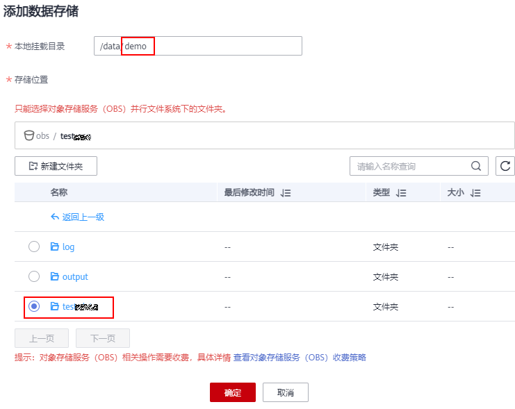

# 在开发环境中动态挂载OBS<a name="modelarts_30_0036"></a>

## 什么是动态挂载OBS<a name="section24336101338"></a>

在运行态的Notebook容器中，采用动态挂载特性，将OBS对象存储模拟成本地文件系统。其本质是通过挂载工具，将对象协议转为为POSIX文件协议。挂载后应用层可以在容器中正常操作OBS对象。​

## 动态挂载适用于哪些使用场景<a name="section854919446105"></a>

场景1：数据集预览和操作，将承载数据集的OBS挂载至Notebook中，可以像本地文件系统一样操作数据集。

场景2：在Notebook中训练时，可直接使用挂载至Notebook容器中的数据集。

## 动态挂载OBS有什么限制<a name="section186012476312"></a>

OBS提供两种桶，对象存储（对象桶）和并行文件系统。

ModelArts的Notebook（新版）仅支持挂载OBS的**并行文件系统**，挂载至Notebook容器/data/的子目录下。

## 动态挂载OBS操作<a name="section205004437420"></a>

**方式1：通过ModelArts控制台操作**

1.  登录ModelArts管理控制台，在左侧导航栏中选择“开发环境 \> Notebook“，进入“Notebook“新版管理页面。
2.  选择运行中的Notebook实例，单击实例名称，进入Notebook实例详情页面，单击“添加数据存储“，设置挂载参数。
    1.  设置本地挂载目录，在/data/目录下输入一个文件夹名称，例如：demo。挂载时，后台自动会在Notebook容器的/data/目录下创建该文件夹，用来挂载obs文件系统。
    2.  选择存放OBS并行文件系统下的文件夹，单击“确定“。

        **图 1**  动态挂载OBS<a name="fig9749153483010"></a>  
        

3.  挂载成功后，可以在Notebook实例详情页查看到挂载结果。

    **图 2**  挂载成功<a name="fig171651745173210"></a>  
    


**方式2：API模式**

动态挂载API接口已发布至华北-北京四和华东-上海一站点。必须在新版Notebook中执行挂载脚本。

挂载脚本代码示例如下：

```
import os
from json import JSONEncoder
from modelarts.config.auth import auth_by_apig
from modelarts.session import Session

session = Session()
request_url = "/v1/{}/notebooks/{}/storage".format(os.environ['PROJECT_ID'], os.environ["INSTANCE_ID"])


# 查询动态挂载列表
auth_by_apig(session, 'GET', request_url)


# 动态挂载
body = {
    "category": "OBS",
    "uri": "obs://obs-bucket-train/dir/",
    "mount_path": "/data/demo/"
}
auth_by_apig(session, 'POST', request_url, body=JSONEncoder().encode(body))

# 动态卸载
auth_by_apig(session, 'DELETE', request_url + "/ea217c4f-3282-4af2-98ea-d3c668d2fba9")
```

