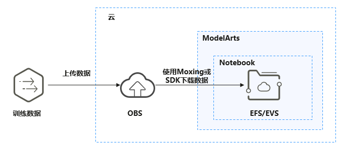
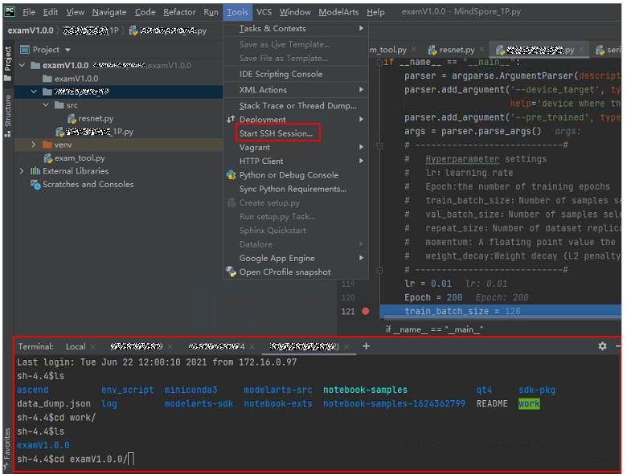

# 在本地IDE中上传数据至Notebook<a name="modelarts_30_0017"></a>

小于500MB数据量，直接拷贝至本地IDE中即可。

大于500MB数据量，请先上传到OBS中，再从OBS上传到云上开发环境的默认存储EFS或云硬盘EVS。

1.  上传数据至OBS，具体操作请参见[上传文件至OBS桶](https://support.huaweicloud.com/qs-obs/obs_qs_0008.html)。
2.  将OBS中的数据传至Notebook的EFS/EVS中，通过在本地IDE的Terminal中使用ModelArts提供的Moxing库的文件操作API（ mox.file.copy\_parallel）完成。

**图 1**  数据通过OBS中转上传到Notebook<a name="fig15668759124612"></a>  


下图以PyCharm环境中开启Terminal为例，VSCode中操作类似。

**图 2**  PyCharm环境开启Terminal<a name="fig376423914478"></a>  


在本地IDE的Terminal中使用Moxing下载OBS文件到开发环境的操作示例如下：

```
#手动source进入开发环境
cat /home/ma-user/README
#然后选择要source的环境
source /home/ma-user/miniconda3/bin/activate MindSpore-python3.7-aarch64
#使用moxing
import moxing as mox  
#下载一个OBS文件夹，从OBS下载至EFS/EVS（OBS -> EFS/EVS） 
mox.file.copy_parallel('obs://bucket_name/sub_dir_0', '/tmp/sub_dir_0')  
```

