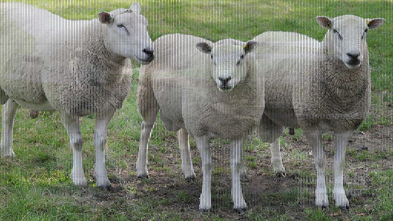

# 基于样本预处理环节的模型攻击

## 场景描述

模型鲁棒性一直以来是一个研究的重点，针对模型的对抗攻击方法已经有了很多优秀的实践。但是大多数针对模型的攻击，都需要拿到模型本身，而在大多数情况下，这是不可能发生的。这里介绍的基于预处理环节的攻击，另辟蹊径，在所有模型都不可或缺的预处理下手，而下手的环节就是resize。该方法来自2019年的论文：[Seeing is Not Believing: Camouflage Attacks on Image Scaling Algorithms](https://www.usenix.org/conference/usenixsecurity19/presentation/xiao)。

## 原理说明

大多数模型，都对输入的样本大小有要求。比如常见的224x224，或者自定义的大小。而且，这些尺寸是可枚举的可穷尽的，这就为黑盒尝试提供了可能。一般在样本进入模型前，都会对样本进行预处理，最基本的就是将样本resize到模型需要的大小。

样本缩小，必然会丢失信息。如果，样本缩小的时候，丢失了大部分可靠的正常信息，而保留了攻击信息，这就为攻击提供了一种可能。

resize算法，在缩小样本时，有几种常见的算法。包括最近邻插值\(INTER\_NEAREST\)、双线性插值\(INTER\_LINEAR\)、双三次插值\(INTER\_CUBIC\)、Lanczos插值\(INTER\_LANCZOS4\)、基于局部像素的重采样\(INTER\_AREA）。以最近邻插值为例，最近邻插值是一种采样算法，在对样本进行resize时如果使用的是最近邻插值算法，我们基于原始样本大小和攻击图像的大小，可以计算出resize采样时保留的是哪些像素点。只需要将攻击图像安置在这些像素点上，就可以将攻击信息隐藏在看上去稍显正常的图像上。双线性插值的逻辑类似。

**图 1**  攻击效果  

**图 2**  resize后效果  

原始样本越大，攻击效果越好。而且可以进行局部修改，比如针对证件样本，只需要修改关键文字部分即可进行攻击，修改量很小。

## 防御

这个攻击方法优缺点十分明显。

-   优点：简单可穷举，可以用来做黑盒攻击。模型输入的样本尺寸越小，越容易攻击。攻击样本与模型输入的尺寸比例差异越大，攻击效果越好。
-   缺点：易于防御。
-   防御方法：在resize时明确指定使用更复杂的Lanczos插值（INTER\_LANCZOS4）算法，牺牲一部分性能，基本上可以直接杜绝这种攻击的可能；或者对样本进行随机裁剪后再resize，此时经过特殊安排的攻击像素就基本不会被选中了。

