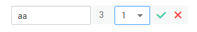
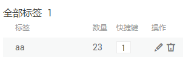

# 声音分类

由于模型训练过程需要大量有标签的音频数据，因此在模型训练之前需对没有标签的音频添加标签。通过ModelArts您可对音频进行一键式批量添加标签，快速完成对音频的标注操作，也可以对已标注音频修改或删除标签进行重新标注。

## 进入数据集详情页

1.  登录ModelArts管理控制台，在左侧菜单栏中选择“数据管理（Beta） \> 数据集“，进入“数据集“管理页面。
2.  在数据集列表中，基于“标注类型“选择需要进行标注的数据集，单击数据集名称进入数据集概览页。

    此操作默认进入数据集当前版本的概览页，如果需要对其他版本进行数据标注，请先在“版本管理“操作中，将需要进行数据标注的版本设置为“当前版本。“详细操作指导请参见[管理数据集版本](管理数据集版本.md)。

3.  在数据集概览页中，单击右上角“开始标注“，进入数据集详情页。数据集详情页默认展示此数据集下全部数据。

## 同步数据源

ModelArts会自动从数据集输入位置同步数据至数据集详情页，包含数据及标注信息。

为了快速获取OBS桶中最新数据，可在数据集详情页的“全部“或“未标注“页签中，单击“同步数据源“，快速将通过OBS上传的数据添加到数据集中。

## 标注音频

数据集详情页中，展示了此数据集中“未标注“和“已标注“的音频，默认显示“未标注“的音频列表。单击音频左侧，即可进行音频的试听。

1.  在“未标注“页签，勾选需进行标注的音频。
    -   手工点选：在音频列表中，单击音频，当右上角出现蓝色勾选框时，表示已勾选。可勾选同类别的多个音频，一起添加标签。
    -   批量选中：如果音频列表的当前页，所有音频属于一种类型，可以在列表的右上角单击“选择当前页“，则当前页面所有的音频将选中。

2.  添加标签。

    1.  在右侧的“标签“区域中，单击“标签“下侧的文本框中设置标签。

        方式一（已存在标签）：单击“标签“下方的文本框，在快捷键下拉列表中选择快捷键，然后在标签文本输入框中选择已有的标签名称，然后单击“确定“。

        方式二（新增标签）：在“标签“下方的文本框中，在快捷键下拉列表中选择快捷键，然后在标签文本输入框中输入新的标签名称，然后单击“确定“。

    2.  选中的音频将被自动移动至“已标注“页签，且在“未标注“页签中，标签的信息也将随着标注步骤进行更新，如增加的标签名称、各标签对应的音频数量。

    **图 1**  添加标签  
    

## 查看已标注音频

在数据集详情页，单击“已标注“页签，您可以查看已完成标注的音频列表。单击音频，可在右侧的“选中文件标签“中了解当前音频的标签信息。

## 修改标注

当数据完成标注后，您还可以进入“已标注“页签，对已标注的数据进行修改。

-   **基于音频修改**

    在数据标注页面，单击“已标注“页签，然后在音频列表中选中待修改的音频（选择一个或多个）。在右侧标签信息区域中对标签进行修改。

    -   修改标签：在“选中文件标签“区域中，单击操作列的，然后在文本框中输入正确的标签名，然后单击完成修改。

        **图 2**  编辑标签  
        

    -   删除标签：在“选中文件标签“区域中，单击操作列的删除该标签。

-   **基于标签修改**

    在数据标注页面，单击“已标注“页签，在音频列表右侧，显示全部标签的信息。

    **图 3**  全部标签的信息  
    

    -   修改标签：单击操作列的，然后在弹出的对话框中输入修改后的标签名，然后单击“确定“完成修改。修改后，之前添加了此标签的音频，都将被标注为新的标签名称。
    -   删除标签：单击操作列的，在弹出的对话框中，选择“仅删除标签“、“删除标签及仅包含此标签的图片（不删除源文件）“或“删除标签及仅包含此标签的图片（同时删除源文件）“，然后单击“确定“。

## 添加音频

除了数据集输入位置自动同步的数据外，您还可以在ModelArts界面中，直接添加音频，用于数据标注。

1.  在数据集详情页面，单击“未标注“页签，然后单击左上角“添加音频“。
2.  在弹出的“添加音频“对话框中，单击“添加音频“。

    选择本地环境中需要上传的音频，仅支持WAV格式音频文件，单个音频文件不能超过4MB，且单次上传的音频文件总大小不能超过8MB。

3.  在添加音频对话框中，单击“确定“，完成添加音频的操作。

    您添加的音频将自动呈现在“未标注“的音频列表中。且音频将自动存储至此“数据集输入位置“对应的OBS目录中。

## 删除音频

通过数据删除操作，可将需要丢弃的音频数据快速删除。

在“未标注“或“已标注“页面中，选中需要删除的音频，或者选择“勾选当前页“选中该页面所有音频，然后单击左上角“删除音频“，在弹出的对话框中，根据实际情况选择是否勾选“同时删除源文件“，确认信息无误后，单击“确定“完成音频删除操作。

其中，被选中的音频，其右上角将显示为勾选状态。如果当前页面无选中音频时，“删除音频“按钮为灰色，无法执行删除操作。

> **须知：**   
>如果勾选了“同时删除源文件“，删除音频操作是将删除对应OBS目录下存储的音频。此操作可能会影响已使用此源文件的其他数据集或数据集版本，有可能导致展示异常或训练/推理异常。删除后，数据将无法恢复，请谨慎操作。  

