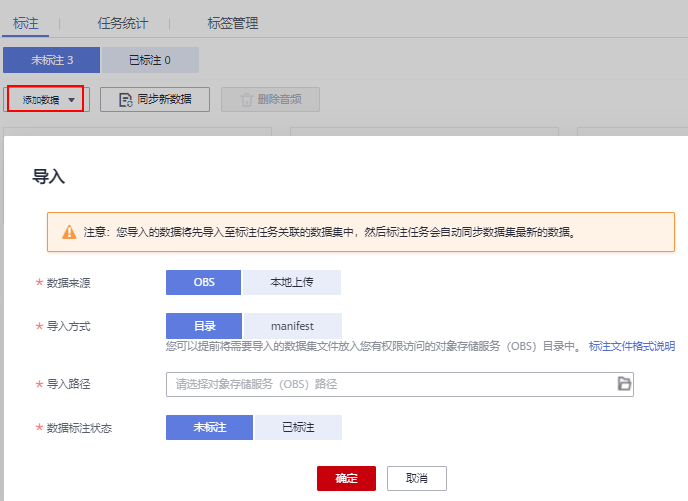

# 声音分类

由于模型训练过程需要大量有标签的音频数据，因此在模型训练之前需对没有标签的音频添加标签。通过ModelArts您可对音频进行一键式批量添加标签，快速完成对音频的标注操作，也可以对已标注音频修改或删除标签进行重新标注。

## 开始标注

1.  登录ModelArts管理控制台，在左侧菜单栏中选择“数据管理\> 数据标注“，进入“数据标注“管理页面。
2.  在数据集列表中，基于“标注类型“选择需要进行标注的数据集，单击标注作业名称进入标注作业标注详情页。
3.  在标注作业标注详情中，展示此标注作业下全部数据。

## 同步新数据

ModelArts会自动将数据集中新增的数据同步至标注作业，包含数据及当前标注作业支持的标注信息。

为了快速获取数据集中最新数据，可在标注作业详情页的“未标注“和“已标注“页签中，单击“同步新数据“，快速将数据集中的数据添加到标注作业中。

## 标注音频

标注作业详情页中，展示了此标注作业中“未标注“和“已标注“的音频，默认显示“未标注“的音频列表。单击音频左侧，即可进行音频的试听。

1.  在“未标注“页签，勾选需进行标注的音频。
    -   手工点选：在音频列表中，单击音频，当右上角出现蓝色勾选框时，表示已勾选。可勾选同类别的多个音频，一起添加标签。
    -   批量选中：如果音频列表的当前页，所有音频属于一种类型，可以在列表的右上角单击“选择当前页“，则当前页面所有的音频将选中。

2.  添加标签。

    1.  在右侧的“标签“区域中，单击“标签“下侧的文本框中设置标签。

        方式一（已存在标签）：单击“标签“下方的文本框，在快捷键下拉列表中选择快捷键，然后在标签文本输入框中选择已有的标签名称，然后单击“确定“。

        方式二（新增标签）：在“标签“下方的文本框中，在快捷键下拉列表中选择快捷键，然后在标签文本输入框中输入新的标签名称，然后单击“确定“。

    2.  选中的音频将被自动移动至“已标注“页签，且在“未标注“页签中，标签的信息也将随着标注步骤进行更新，如增加的标签名称、各标签对应的音频数量。

    > **说明：** 
    >**快捷键的使用说明：**为标签指定快捷键后，当您选择一段音频后，在键盘中按一下快捷键，即可为此音频增加为此快捷键对应的标签。例如“aa“标签对应的快捷键是“1“，在数据标注过程中，选中1个或多个文件，按“1“，界面将提示是否需要将此文件标注为“aa“标签，单击确认即可完成标注。
    >快捷键对应的是标签，1个标签对应1个快捷键。不同的标签，不能指定为同一个快捷键。快捷键的使用，可以大大提升标注效率。

    **图 1**  添加音频标签  
    

## 查看已标注音频

在标注作业详情页，单击“已标注“页签，您可以查看已完成标注的音频列表。单击音频，可在右侧的“选中文件标签“中了解当前音频的标签信息。

## 修改标注

当数据完成标注后，您还可以进入“已标注“页签，对已标注的数据进行修改。

-   **基于音频修改**

    在标注作业详情页面，单击“已标注“页签，然后在音频列表中选中待修改的音频（选择一个或多个）。在右侧标签信息区域中对标签进行修改。

    -   修改标签：在“选中文件标签“区域中，单击操作列的编辑图标，然后在文本框中输入正确的标签名，然后单击确定图标完成修改。
    -   删除标签：在“选中文件标签“区域中，单击操作列的删除图标删除该标签。

-   **基于标签修改**

    在标注作业详情页面，单击“已标注“页签，在音频列表右侧，显示全部标签的信息。

    **图 2**  全部标签信息  
    

    -   修改标签：单击操作列的编辑图标，然后在弹出的对话框中输入修改后的标签名，然后单击“确定“完成修改。修改后，之前添加了此标签的音频，都将被标注为新的标签名称。
    -   删除标签：单击操作列的删除图标，在弹出的对话框中，根据提示框选择需要删除的对象，然后单击“确定“完成删除。

## 添加音频

除了同步新数据外，您还可以在标注详情页面中，直接添加数据，用于数据标注。

1.  在标注作业详情页面，单击“未标注“页签，然后单击左上角“添加数据“。
2.  在弹出的导入对话框中，选择数据来源、导入方式、导入路径等参数，导入数据。单击确定。

    导入数据的详细操作介绍请参见[导入操作简介](导入操作简介.md)。

    **图 3**  导入数据  
    

## 删除音频

通过数据删除操作，可将需要丢弃的音频数据快速删除。

在“未标注“或“已标注“页面中，选中需要删除的音频，或者选择“选择当前页“选中该页面所有音频，然后单击左上角“删除音频“，在弹出的对话框中，根据实际情况选择是否勾选“同时删除源文件“，确认信息无误后，单击“确定“完成音频删除操作。

其中，被选中的音频，其右上角将显示为勾选状态。如果当前页面无选中音频时，“删除音频“按钮为灰色，无法执行删除操作。

> **说明：** 
>如果勾选了“同时删除源文件“，删除音频操作是将删除对应OBS目录下存储的音频。此操作可能会影响已使用此源文件的其他数据集或数据集版本，有可能导致展示异常或训练/推理异常。删除后，数据将无法恢复，请谨慎操作。

