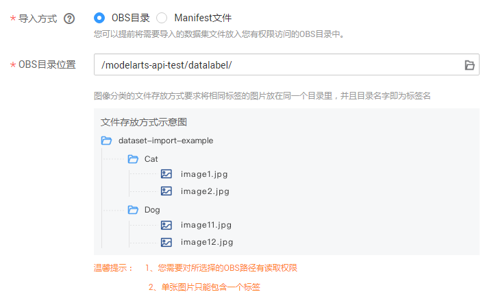
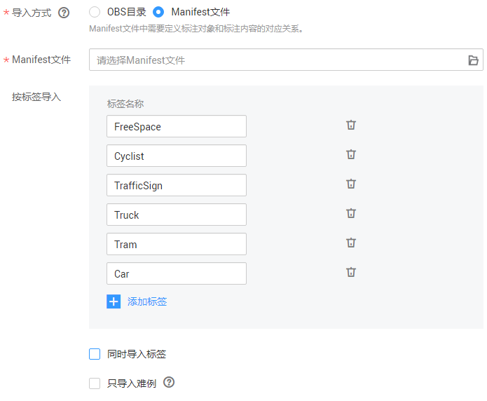

# 导入操作

数据集创建完成后，一方面，可以直接从设置的数据集输入位置直接同步数据，另一方面，您还可以通过导入数据集的操作，导入更多数据。当前支持从OBS目录导入或从Manifest文件导入两种方式。

## 前提条件

-   已存在创建完成的数据集。
-   需导入的数据，已存储至OBS中。Manifest文件也需要存储至OBS。
-   确保数据存储的OBS桶与ModelArts在同一区域。

## 导入方式

导入方式分为“OBS目录“和“Manifest文件“两种。

-   OBS目录：指需要导入的数据集已提前存储至OBS目录中。此时需选择用户具备权限的OBS路径，且OBS路径内的目录结构需满足规范，详细规范请参见[从OBS目录导入的规范说明](从OBS目录导入的规范说明.md)。当前只有“图像分类“、“物体检测“、“文本分类“和“声音分类“4种类型的数据集，支持从OBS目录导入数据。其他类型只支持Manifest文件导入数据集的方式。
-   Manifest文件：指数据集为Manifest文件格式，Manifest文件定义标注对象和标注内容的对应关系，且Manifest文件已上传至OBS中。Manifest文件压缩包的大小限制为最大8MB。Manifest文件的规范请参见[导入Manifest文件的规范说明](导入Manifest文件的规范说明.md)。

## 从OBS目录导入

不同类型的数据集，导入操作界面的示意图存在区别，请参考界面信息了解当前类型数据集的示意图。当前操作指导以图像分类的数据集为例。

1.  登录ModelArts管理控制台，在左侧菜单栏中选择“数据管理（Beta） \> 数据集“，进入“数据集“管理页面。
2.  在数据集所在行，单击操作列的“更多 \> 导入“。

    或者，您可以单击数据集名称，进入数据集“概览“页，在页面右上角单击“导入“。

3.  在“导入“对话框中，设置“导入方式“为“OBS目录“，然后在“OBS目录位置“中，设置数据存储的路径。然后单击“确定“。

    **图 1**  导入数据集  
    

    导入成功后，数据将自动同步到数据集中。您可以在“数据集“页面，单击数据集的名称，查看详细数据并进行数据标注。

## 从Manifest文件导入

不同类型的数据集，导入操作界面的示意图存在区别，请参考界面信息了解当前类型数据集的示意图。当前操作指导以物体检测类型的数据集为例。

1.  登录ModelArts管理控制台，在左侧菜单栏中选择“数据管理（Beta） \> 数据集“，进入“数据集“管理页面。
2.  在数据集所在行，单击操作列的“更多 \> 导入“。

    或者，您可以单击数据集名称，进入数据集“概览“页，在页面右上角单击“导入“。

3.  在“导入“对话框中，参考如下说明填写参数，然后单击“确定“。

    -   “导入方式“：设置为“Manifest文件“。
    -   “Manifest文件“：设置Manifest文件存储的OBS路径。
    -   “按标签导入“：系统将自动获取此数据集的标签，您可以单击添加，也可以单击标签右侧的删除标签。此字段为可选字段，您也可以在导入数据集后，在标注数据操作时，添加或删除标签。
    -   “同时导入标签“：勾选表示将Manifest文件中定义的标签一并导入ModelArts数据集中。
    -   “只导入难例“：难列指Manifest文件中的“hard“属性，勾选此参数，表示此导入操作，只导入Manifest文件“hard“属性中数据信息。

        **图 2**  导入数据集  
        

    导入成功后，数据将自动同步到数据集中。您可以在“数据集“页面，单击数据集的名称进入数据集概览页，然后在概览页右上角单击“开始标注“进去数据集详情页，查看详细数据并进行数据标注。

