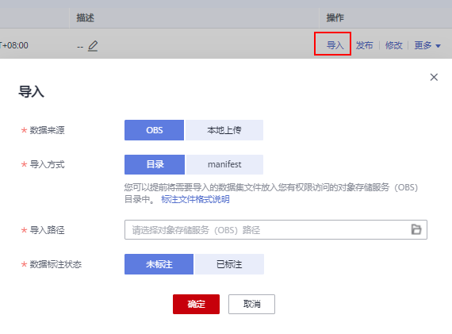
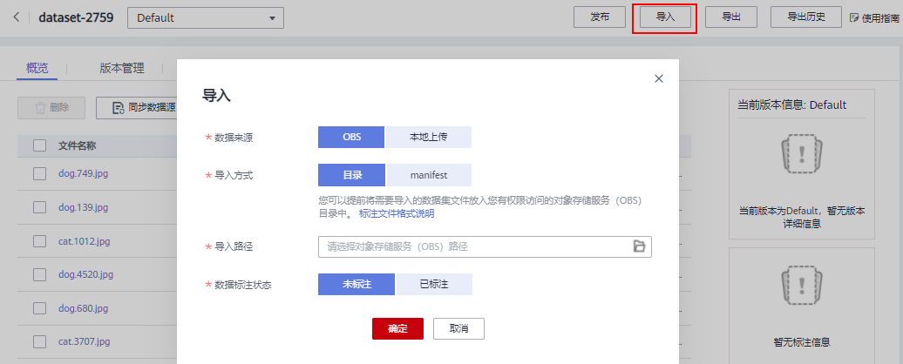
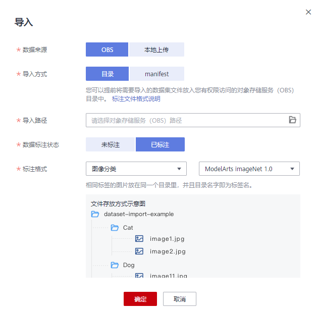
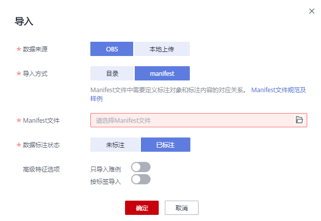
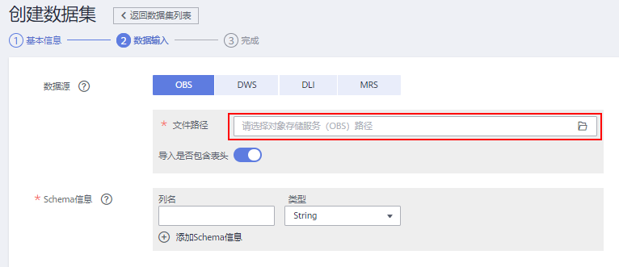
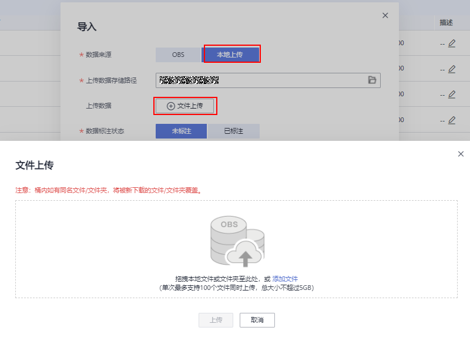

# 导入操作简介<a name="modelarts_23_0006"></a>

## 前提条件<a name="section113381459132217"></a>

-   已存在创建完成的数据集。
-   至少已创建了一个OBS桶，用于数据存储，确保OBS桶与ModelArts在同一区域，并确保用户具有OBS桶的操作权限。

## 数据集中的数据导入入口<a name="section19246123614611"></a>

数据集中的数据导入有5个入口。

1.  创建数据集时直接从设置的数据导入路径中自动同步数据。

    **图 1**  创建数据集时导入数据<a name="fig480813367463"></a>  
    

2.  创建完数据集后，在数据集列表页面的操作栏单击“导入“，导入数据。

    **图 2**  在数据集列表页导入数据<a name="fig299124417466"></a>  
    

3.  在数据集列表页面，单击某个数据集的名称，进入数据集详情页中，单击“导入“，导入数据。

    **图 3**  在数据集详情页中导入数据<a name="fig710213164915"></a>  
    

4.  在数据集列表页面，单击某个数据集的名称，进入数据集详情页中，单击“同步数据源“，同步OBS中的数据。

    **图 4**  在数据集详情页中同步数据源<a name="fig726210504720"></a>  
    

5.  在数据标注的标注作业详情中添加数据。

    **图 5**  标注作业详情中添加数据<a name="fig271230193111"></a>  
    


## 文件型数据来源<a name="section1711754019369"></a>

文件型数据集的导入支持两种数据来源：“OBS“和“本地上传“。导入后，导入目录下的数据会拷贝至数据集的数据源路径下。

-   OBS：需要将导入的数据或Manifest文件提前存储至OBS目录中。
-   本地上传：将本地数据直接通过Internet上传至OBS指定目录后，再导入数据集。

## 文件型数据导入方式<a name="section196999597168"></a>

导入方式分为“目录“和“manifest“两种。

-   目录：导入路径选择OBS目录，读取OBS目录下的数据并导入数据集。
-   Manifest：按Manifest文件读取OBS上的数据并导入，需要满足Manifest的文件规范，同时每个Manifest文件仅包含一种标注类型。Manifest文件定义了标注对象和标注内容的对应关系。文件规范请参见[导入Manifest文件的规范说明](Manifest文件导入规范说明.md)。当前“自由格式”的数据集不支持Manifest导入。

## 文件型数据标注状态<a name="section6618144201717"></a>

数据标注状态分为“未标注“和“已标注“。

-   未标注：仅导入标注对象（指待标注的图片，文本等），不导入标注内容（指标注结果信息）。
-   已标注：同时导入标注对象和标注内容，当前“自由格式”的数据集不支持导入标注内容。

    为了确保能够正确读取标注内容，要求用户严格按照规范存放数据：

    导入方式选择目录时，需要用户选择“标注格式”，并按照标注格式的要求存放数据，详细规范请参见[标注格式](#section42814915296)章节。

    导入方式选择manifest时，需要满足manifest文件的规范。

    > **说明：** 
    >数据标注状态选择“已标注”，您需要保证目录或manifest文件满足相应的格式规范，否则可能存在导入失败的情况。


## 文件型数据标注格式<a name="section42814915296"></a>

标注格式指标注对象和标注内容按照特定的格式存放，用于已标注数据的目录导入。不同类型的数据集支持不同的标注格式，用户需要根据数据集类型和标注类型，选择对应的标注格式。当前只有“图像分类“、“物体检测“、“图像分割“、“文本分类“和“声音分类“标注类型支持按标注格式导入。

**表 1**  不同类型数据集支持标注格式

<a name="table11677122420123"></a>
<table><thead align="left"><tr id="row156781824161219"><th class="cellrowborder" valign="top" width="11.76%" id="mcps1.2.4.1.1"><p id="p17890334194518"><a name="p17890334194518"></a><a name="p17890334194518"></a>数据集类型</p>
</th>
<th class="cellrowborder" valign="top" width="31.830000000000002%" id="mcps1.2.4.1.2"><p id="p86783240129"><a name="p86783240129"></a><a name="p86783240129"></a>标注类型</p>
</th>
<th class="cellrowborder" valign="top" width="56.410000000000004%" id="mcps1.2.4.1.3"><p id="p14678112421219"><a name="p14678112421219"></a><a name="p14678112421219"></a>标注格式</p>
</th>
</tr>
</thead>
<tbody><tr id="row18678524201214"><td class="cellrowborder" rowspan="3" valign="top" width="11.76%" headers="mcps1.2.4.1.1 "><p id="p78900341454"><a name="p78900341454"></a><a name="p78900341454"></a>图片</p>
</td>
<td class="cellrowborder" valign="top" width="31.830000000000002%" headers="mcps1.2.4.1.2 "><p id="p567817249129"><a name="p567817249129"></a><a name="p567817249129"></a>图像分类</p>
</td>
<td class="cellrowborder" valign="top" width="56.410000000000004%" headers="mcps1.2.4.1.3 "><p id="p48169815481"><a name="p48169815481"></a><a name="p48169815481"></a>1）ModelArts image classification 1.0</p>
<p id="p93982612584"><a name="p93982612584"></a><a name="p93982612584"></a>2）ModelArts imageNet 1.0</p>
<p id="p179319363187"><a name="p179319363187"></a><a name="p179319363187"></a>格式规范：<a href="OBS目录导入数据规范说明.md#section570816190577">图像分类</a></p>
</td>
</tr>
<tr id="row86781224101212"><td class="cellrowborder" valign="top" headers="mcps1.2.4.1.1 "><p id="p567852411128"><a name="p567852411128"></a><a name="p567852411128"></a>物体检测</p>
</td>
<td class="cellrowborder" valign="top" headers="mcps1.2.4.1.2 "><p id="p55851121115710"><a name="p55851121115710"></a><a name="p55851121115710"></a><span>1</span><span>) ModelArts PASCAL VOC 1.0</span></p>
<p id="p1639510252575"><a name="p1639510252575"></a><a name="p1639510252575"></a>2) YOLO</p>
<p id="p3483155151913"><a name="p3483155151913"></a><a name="p3483155151913"></a>格式规范：<a href="OBS目录导入数据规范说明.md#section1371122614572">物体检测</a></p>
</td>
</tr>
<tr id="row20678182413124"><td class="cellrowborder" valign="top" headers="mcps1.2.4.1.1 "><p id="p1097420211547"><a name="p1097420211547"></a><a name="p1097420211547"></a>图像分割</p>
</td>
<td class="cellrowborder" valign="top" headers="mcps1.2.4.1.2 "><p id="p1960512085113"><a name="p1960512085113"></a><a name="p1960512085113"></a>ModelArts image segmentation 1.0</p>
<p id="p1753595341919"><a name="p1753595341919"></a><a name="p1753595341919"></a>格式规范：<a href="OBS目录导入数据规范说明.md#section1363851815518">图像分割</a></p>
</td>
</tr>
<tr id="row13678102471218"><td class="cellrowborder" valign="top" width="11.76%" headers="mcps1.2.4.1.1 "><p id="p19891113464516"><a name="p19891113464516"></a><a name="p19891113464516"></a>音频</p>
</td>
<td class="cellrowborder" valign="top" width="31.830000000000002%" headers="mcps1.2.4.1.2 "><p id="p883814481946"><a name="p883814481946"></a><a name="p883814481946"></a>声音分类</p>
</td>
<td class="cellrowborder" valign="top" width="56.410000000000004%" headers="mcps1.2.4.1.3 "><p id="p1567892471213"><a name="p1567892471213"></a><a name="p1567892471213"></a>支持的标注格式：</p>
<p id="p1375114414575"><a name="p1375114414575"></a><a name="p1375114414575"></a>ModelArts audio classfication dir 1.0</p>
<p id="p17177151111197"><a name="p17177151111197"></a><a name="p17177151111197"></a>格式规范：<a href="OBS目录导入数据规范说明.md#section1683314458578">声音分类</a></p>
</td>
</tr>
<tr id="row26781124181216"><td class="cellrowborder" valign="top" width="11.76%" headers="mcps1.2.4.1.1 "><p id="p168917342459"><a name="p168917342459"></a><a name="p168917342459"></a>文本</p>
</td>
<td class="cellrowborder" valign="top" width="31.830000000000002%" headers="mcps1.2.4.1.2 "><p id="p484016481842"><a name="p484016481842"></a><a name="p484016481842"></a>文本分类</p>
</td>
<td class="cellrowborder" valign="top" width="56.410000000000004%" headers="mcps1.2.4.1.3 "><p id="p3755172605914"><a name="p3755172605914"></a><a name="p3755172605914"></a>1）<span>ModelArts text classfication 1.0</span></p>
<p id="p1532011516014"><a name="p1532011516014"></a><a name="p1532011516014"></a>2）<span>ModelArts text classfication combine 1.0</span></p>
<p id="p1121815131191"><a name="p1121815131191"></a><a name="p1121815131191"></a>格式规范：<a href="OBS目录导入数据规范说明.md#section163641141195713">文本分类</a></p>
</td>
</tr>
</tbody>
</table>

## 文件型数据从OBS目录导入操作<a name="section15579536132914"></a>

不同类型的数据集，导入操作界面的示意图存在区别，请参考界面信息了解当前类型数据集的示意图。当前操作指导以图像分类的数据集为例。

1.  登录ModelArts管理控制台，在左侧菜单栏中选择“数据管理 \>数据集“，进入“数据集“管理页面。
2.  在数据集所在行，单击操作列的“导入“。

    或者，您可以单击数据集名称，进入数据集“概览“页，在页面右上角单击“导入“。

3.  在“导入“对话框中，参考如下说明填写参数，然后单击“确定“。

    -   “数据来源“：“OBS“
    -   “导入方式“：“目录“。
    -   “导入路径“：数据存储的OBS路径。
    -   “数据标注状态“：已标注。
    -   “高级特征选项 “：默认关闭，可通过勾选高级选项提供增强功能。

        如“按标签导入”：系统将自动获取此数据集的标签，您可以单击“添加标签“添加，也可以单击标签右侧的删除图标删除标签。此字段为可选字段，您也可以在导入数据集后，在标注数据操作时，添加或删除标签。

    **图 6**  导入数据集-OBS<a name="fig149005419361"></a>  
    

    导入成功后，数据将自动同步到数据集中。您可以在“数据集“页面，单击数据集的名称，查看详细数据，并可以通过创建标注任务进行数据标注。


## 文件型数据从Manifest导入操作<a name="section3749204218167"></a>

不同类型的数据集，导入操作界面的示意图存在区别，请参考界面信息了解当前类型数据集的示意图。当前操作指导以图片数据集为例。

1.  登录ModelArts管理控制台，在左侧菜单栏中选择“数据管理\>数据集“，进入“数据集“管理页面。
2.  在数据集所在行，单击操作列的“导入“。

    或者，您可以单击数据集名称，进入数据集“概览“页，在页面右上角单击“导入“。

3.  在“导入“对话框中，参考如下说明填写参数，然后单击“确定“。

    -   “数据来源“：“OBS“
    -   “导入方式“：“manifest“。
    -   “Manifest文件“：存储Manifest文件的OBS路径。
    -   “数据标注状态“：已标注。
    -   “高级特征选项 “：默认关闭，可通过勾选高级选项提供增强功能。

        “按标签导入”：系统将自动获取此数据集的标签，您可以单击“添加标签“添加，也可以单击标签右侧的删除图标删除标签。此字段为可选字段，您也可以在导入数据集后，在标注数据操作时，添加或删除标签。

        “只导入难例”：难例指manifest文件中的“hard“属性，勾选此参数，表示此导入操作，只导入manifest文件“hard“属性中数据信息。

    **图 7**  导入mainfest文件<a name="fig23183190112"></a>  
    

    导入成功后，数据将自动同步到数据集中。您可以在“数据集“页面，单击数据集的名称，查看详细数据，并可以通过创建标注任务进行数据标注。


## 表格数据集的导入<a name="section1171862514918"></a>

表格支持从5种数据源导入数据，分别为对象存储服务（OBS）、数据仓库服务（DWS）、数据湖探索服务（DLI）、MapReduce服务（MRS）和本地上传。

导入说明：

1.  导入成功的前提是，数据源的schema需要与创建数据集指定的schema保持一致。其中schema指表格的列名和类型，创建数据集时一旦指定，不支持修改。
2.  数据格式不合法，会将数据置为null，详见[表3](创建数据集.md#table1292316598616)。
3.  从OBS或者MRS导入csv文件，不会校验数据类型，但是列数需要跟数据集的schema保持一致。

下面分别介绍如下几种数据源导入：

-   从OBS导入数据

    支持从OBS导入csv文件，需要选择文件所在目录，其中csv文件的列数需要跟数据集schema一致。支持自动获取csv文件的schema。

    ```
    ├─dataset-import-example 
    │      table_import_1.csv 
    │      table_import_2.csv
    │      table_import_3.csv
    │      table_import_4.csv
    ```

    

    > **说明：** 
    >针对“表格”类型的数据集，导入时，支持从OBS、DWS、DLI、MRS和本地上传类型的数据源。其导入时的设置和数据要求，与创建数据集相同，详细参数可参见创建数据集时[表格型（表格）](创建数据集.md#section10239451172820)类型的参数说明。


-   从DWS导入数据

    从DWS导入数据，用户需要选择对应的DWS集群，并输入需要对应的数据库名、表名以及用户名和密码。所导入表的schema\(列名和类型\)需要跟数据集相同。

-   从DLI导入数据

    从DLI导入数据，用户需要选择DLI队列、数据库和表名称。所选择的表的schema\(列名和类型\)需与数据集一致，支持自动获取所选择表的schema。DLI的default队列只用作体验，不同帐号间可能会出现抢占的情况，需进行资源排队，不能保证每次都可以得到资源执行相关操作。DLI支持schema映射的功能，即导入的表的schema的字段名称可以不和数据集相同，但类型要保持一致。

-   从MRS导入数据

    只支持从分析集群导入数据，流式集群不支持导入。从MRS服务中导入存储在HDFS上的csv格式的数据，首先需要选择已有的MRS集群，并从HDFS文件列表选择文件名称或所在目录，导入文件的列数需与数据集schema一致。


## 本地上传<a name="section17703124113214"></a>

文件型和表格型数据均支持从本地上传。从本地上传的数据存储在OBS目录中，请先提前创建OBS桶。

从本地上传的数据单次最多支持100个文件同时上传，总大小不超过5GB。

**图 8**  从本地上传数据<a name="fig151609591768"></a>  


