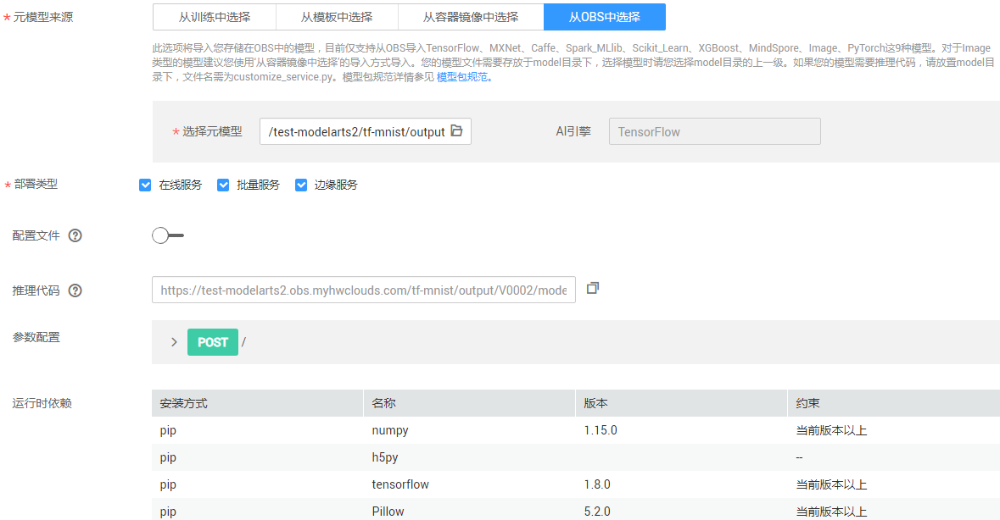

# 导入模型

在模型训练完成后，其生成的模型存储在您指定的OBS目录下，您需要执行导入模型操作，将模型导入到ModelArts中进行管理。

为方便溯源和模型反复调优，在ModelArts中提供了模型版本管理的功能，您可以基于版本对模型进行管理。

## 使用前必读

-   如果使用ModelArts训练作业生成的模型，请确保训练作业已运行成功，且模型已存储至对应OBS目录下。
-   如果使用您本地编写好的模型，请确保您的模型符合ModelArts的规范要求，详细请参见[模型包规范介绍](模型包规范介绍.md)。如果使用模板导入，各模板对应的模型包规范请参见[模板说明](模板说明.md)。
-   对于模型首次上传至ModelArts时，请使用导入模型的功能，不能使用创建新版本功能。由于模型未导入，无法创建新版本。
-   自动学习项目中，在完成模型部署后，其生成的模型也将自动上传至模型管理列表中。但是自动学习生成的模型无法下载，只能用于部署上线。
-   确保您使用的OBS目录与ModelArts在同一区域。
-   导入和管理模型是免费的，不会产生费用。

## 导入方式介绍

ModelArts支持多种方式导入模型，详细说明如下所示。

-   从训练中选择：在ModelArts中创建训练作业，并完成模型训练，在得到满意的模型后，可以将训练后得到的模型导入至模型管理，直接用于部署上线。
-   从模板中选择：相同功能的模型配置信息重复率高，将相同功能的配置整合成一个通用的模板，通过使用该模板，可以方便快捷的导入模型，而不用编写config.json配置文件。目前支持的模板以及相应的输入输出模式说明，请参见[模型模板简介](模型模板简介.md)。
-   从容器镜像中选择：针对ModelArts目前不支持的AI引擎，您可以通过自定义镜像的方式将编写的模型导入ModelArts。关于自定义镜像规范和说明，请参见[使用自定义镜像导入模型](使用自定义镜像导入模型.md)。
-   从OBS中选择：如果您使用常用框架在本地完成模型开发和训练，您可以将您的模型导入至ModelArts中，直接用于部署上线。针对导入的模型，其需符合ModelArts的模型包规范，推理代码和配置文件也需遵循ModelArts的要求，详细说明请参见[模型包规范介绍](模型包规范介绍.md)、[模型配置文件编写说明](模型配置文件编写说明.md)、[模型推理代码编写说明](模型推理代码编写说明.md)。

## 导入模型操作步骤

1.  登录ModelArts管理控制台，在左侧导航栏中选择“模型管理 \> 模型列表“，进入模型列表页面。
2.  单击左上角的“导入“，进入“导入模型“页面。
3.  在“导入模型“页面，填写相关参数。
    1.  填写模型基本信息，详细参数说明请参见[表1](#table19428112584211)。

        **表 1**  模型基本信息参数说明

        
        <table><thead align="left"><tr id="row2042972515427"><th class="cellrowborder" valign="top" width="18.91%" id="mcps1.2.3.1.1">
参数名称

        </th>
        <th class="cellrowborder" valign="top" width="81.08999999999999%" id="mcps1.2.3.1.2">
说明

        </th>
        </tr>
        </thead>
        <tbody><tr id="row164292250428"><td class="cellrowborder" valign="top" width="18.91%" headers="mcps1.2.3.1.1 ">
名称

        </td>
        <td class="cellrowborder" valign="top" width="81.08999999999999%" headers="mcps1.2.3.1.2 ">
模型名称。只支持1-48位可见字符（含中文），只能以大小写英文字母或中文字符开头，可包含字母、中文、数字、中划线、下划线。

        </td>
        </tr>
        <tr id="row5429112564217"><td class="cellrowborder" valign="top" width="18.91%" headers="mcps1.2.3.1.1 ">
版本

        </td>
        <td class="cellrowborder" valign="top" width="81.08999999999999%" headers="mcps1.2.3.1.2 ">
设置所创建模型的版本。第一次导入时，默认为0.0.1。

        </td>
        </tr>
        <tr id="row18429132512429"><td class="cellrowborder" valign="top" width="18.91%" headers="mcps1.2.3.1.1 ">
描述

        </td>
        <td class="cellrowborder" valign="top" width="81.08999999999999%" headers="mcps1.2.3.1.2 ">
模型的简要描述。

        </td>
        </tr>
        </tbody>
        </table>

    2.  填写元模型来源及其相关参数。“元模型来源“有4种不同方式，请参见[表2](#table104931647171713)选择。根据您选择的“元模型来源“不同，其相关的参数不同。

        **图 1**  设置元模型来源及其相关参数  
        

        **表 2**  元模型来源参数说明

        
        <table><thead align="left"><tr id="row14487647101714"><th class="cellrowborder" valign="top" width="10.290000000000001%" id="mcps1.2.4.1.1">
元数据来源

        </th>
        <th class="cellrowborder" valign="top" width="45.129999999999995%" id="mcps1.2.4.1.2">
说明

        </th>
        <th class="cellrowborder" valign="top" width="44.58%" id="mcps1.2.4.1.3">
相关的参数

        </th>
        </tr>
        </thead>
        <tbody><tr id="row549114751712"><td class="cellrowborder" valign="top" width="10.290000000000001%" headers="mcps1.2.4.1.1 ">
从训练中选择

        </td>
        <td class="cellrowborder" valign="top" width="45.129999999999995%" headers="mcps1.2.4.1.2 ">
从ModelArts已完成的训练作业中选择。

        <ul id="ul2490447191718"><li>当选择训练作业使用“预置模型”时，ModelArts默认提供推理代码和配置文件，无需提前上传。在此处，直接选择其对应的训练作业及版本即可。</li><li>当选择的训练作业采用“常用框架”时，在导入模型之前，您需要按照<a href="模型包规范介绍.md">模型包规范</a>编写推理代码和配置文件，并将推理代码和配置文件放置元模型存储的“model”文件夹下。</li></ul>
        </td>
        <td class="cellrowborder" valign="top" width="44.58%" headers="mcps1.2.4.1.3 "><ul id="ul54911247201714"><li>“推理代码”：显示模型推理代码URL，您可以直接复制此URL使用。</li><li>“参数配置”：单击右侧的，查看当前模型的入参和出参。</li><li>“运行时依赖”：罗列选中模型对环境的依赖。例如依赖“tensorflow”，安装方式为“pip”，其版本必须为1.8.0及以上版本</li></ul>
        </td>
        </tr>
        <tr id="row8376238155612"><td class="cellrowborder" valign="top" width="10.290000000000001%" headers="mcps1.2.4.1.1 ">
从模板中选择

        </td>
        <td class="cellrowborder" valign="top" width="45.129999999999995%" headers="mcps1.2.4.1.2 ">
由于相同功能的模型配置信息重复率高，ModelArts将相同功能的配置整合成一个通用的模板，用户通过使用该模板，可以方便快捷的导入模型。模板的详细说明请参见<a href="模型模板简介.md">模型模板简介</a>。

        </td>
        <td class="cellrowborder" valign="top" width="44.58%" headers="mcps1.2.4.1.3 "><ul id="ul106288785912"><li>“选择模板”：从已有的ModelArts模板列表中选择。例如，“TensorFlow图像分类模板”。</li><li>“模型目录”：指定模型存储的OBS路径。</li><li>“输入输出模式”：针对上方选择的模板，选择输入输出模式。所有输入输出模式的详细说明，请参见<a href="预置图像处理模式.md">预置图像处理模式</a>。</li></ul>
        </td>
        </tr>
        <tr id="row74921347161716"><td class="cellrowborder" valign="top" width="10.290000000000001%" headers="mcps1.2.4.1.1 ">
从OBS中选择

        </td>
        <td class="cellrowborder" valign="top" width="45.129999999999995%" headers="mcps1.2.4.1.2 ">
从OBS导入元模型。在“选择元模型”选择模型存储路径，此路径为训练作业中指定的“训练输出位置”。根据您选择的元模型存储路径，将自动关联出对应的“AI引擎”。

        
针对从OBS导入的元模型，ModelArts要求根据<a href="模型包规范介绍.md">模型包规范</a>，编写推理代码和配置文件，并将推理代码和配置文件放置元模型存储的“model”文件夹下。如果您选择的目录下无对应的推理代码及配置文件，将无法导入模型。

        </td>
        <td class="cellrowborder" valign="top" width="44.58%" headers="mcps1.2.4.1.3 "><ul id="ul849294781719"><li>“配置文件”：系统默认关联您存储在OBS中的配置文件。打开开关，您可以直接在当前界面查看、编辑或从OBS导入您的模型配置文件。</li><li>“参数配置”：单击右侧的，查看当前模型的入参和出参。</li><li>“运行时依赖”：罗列选中模型对环境的依赖。例如依赖“tensorflow”，安装方式为“pip”，其版本必须为1.8.0及以上版本</li></ul>
        </td>
        </tr>
        <tr id="row4493114712179"><td class="cellrowborder" valign="top" width="10.290000000000001%" headers="mcps1.2.4.1.1 ">
从容器镜像中选择

        </td>
        <td class="cellrowborder" valign="top" width="45.129999999999995%" headers="mcps1.2.4.1.2 ">
在“容器镜像所在的路径”右侧，单击从容器镜像中导入模型的镜像，其中，模型均为Image类型，且不再需要用配置文件中的“swr_location”来指定您的镜像位置。

        
制作自定义镜像的操作指导及规范要求，请参见<a href="自定义镜像简介.md">自定义镜像简介</a>。

        
 说明： 

您选择的模型镜像将共享给管理员，请确保具备共享该镜像的权限（不支持导入其他账户共享给您的镜像），部署上线时，ModelArts将使用该镜像部署成推理服务，请确保您的镜像能正常启动并提供推理接口。

        

        </td>
        <td class="cellrowborder" valign="top" width="44.58%" headers="mcps1.2.4.1.3 "><ul id="ul14931247201714"><li>“配置文件”：支持“从OBS导入”或“在线编辑”的方式，配置文件需满足ModelArts编写规范，详情请参见<a href="模型包规范介绍.md">模型包规范介绍</a>。当选择“从OBS导入”时，您需要指定配置文件存储的OBS路径，且您可以打开“查看模型配置文件”右侧的开关，在线查看或编辑此配置文件。</li><li>“参数配置”：单击右侧的，查看当前模型的入参和出参。</li></ul>
        </td>
        </tr>
        </tbody>
        </table>

    3.  设置推理规格和模型说明。
        -   “推理规格“：如果您的模型需要一定的规格资源才能完成推理，您可以在此配置自定义推理规格，即您的模型部署上线进行正常推理所需要的规格，部署上线时系统将会参考您填写的推理规格来分配资源，部署时可视情况修改该规格。需要注意的是此处自定义的规格，仅在部署在线服务且使用专属资源池、部署边缘这两种场景有效。
        -   “模型说明“：为了帮助其他模型开发者更好的理解及使用您的模型，特别是需要会共享到模型市场的模型，建议您提供模型的说明文档。单击“增加模型说明“，设置“文档名称“及其“URL“。模型说明支持增加多条。

            **图 2**  推理规格和模型说明  
            

    4.  确认信息填写无误，单击“立即创建“，完成模型导入。

        在模型列表中，您可以查看刚导入的模型及其对应的版本。当模型状态变更为“正常“时，表示模型导入成功。在此页面，您还可以创建新版本、快速部署模型、将模型发布至市场、导出模型等操作。

## 后续操作

-   **[部署模型](模型部署简介.md)**：在“模型列表“中，单击模型名称左侧的小三角，打开此模型下的所有版本。在对应版本所在行，单击“操作“列的“部署“，在下拉框中选择部署类型，可以将模型部署上线为“在线服务“、“批量服务“或“边缘服务“。在部署服务的页面，详细参数填写请参见[模型部署简介](模型部署简介.md)的相关指导。

-   **[从训练中选择元模型](从训练中选择元模型.md)**  

-   **[从模板中选择元模型](从模板中选择元模型.md)**  

-   **[从容器镜像中选择元模型](从容器镜像中选择元模型.md)**  

-   **[从OBS中选择元模型](从OBS中选择元模型.md)**  

