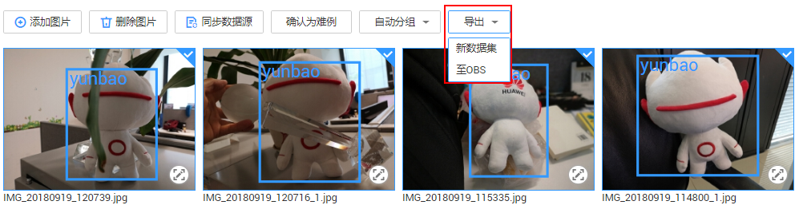
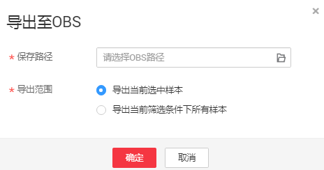

# 导出数据

针对数据集中的数据，包含“已标注”和“未标注”的数据。您可以选中需要部分图片或者通过筛选条件筛选出需要的数据，导出成新的数据集，或者将数据导出至指定的OBS目录下。

> **说明：**   
>目前只有“图像分类”和“物体检测”类型的数据集支持自动分组功能。  

## 导出新数据集

1.  登录ModelArts管理控制台，在左侧菜单栏中选择“数据管理（Beta） \> 数据集“，进入“数据集“管理页面。
2.  在数据集列表中，选择“物体检测”或“图像分类”类型的数据集，单击数据集名称进入“数据集概览页“。
3.  在“数据集概览页“，单击右上角“开始标注“，进入数据集详情页。
4.  在数据集详情页面中，选中导出数据或者筛选出数据，然后单击“导出 \> 新数据集“。

    **图 1**  选择图片或筛选图片  
    

5.  在弹出的“导出新数据集“对话框中，填写相关信息，然后单击“确定“，开始执行导出操作。

    “名称“：新数据集名称。

    “保存路径“：表示新数据集的输入路径，即当前数据导出后存储的OBS路径。

    “输出路径“：表示新数据集的输出路径，即新数据集在完成标注后输出的路径。“输出路径“不能与“保存路径“为同一路径，且“输出路径“不能是“保存路径“的子目录。

    “导出范围“：“导出当前选中样本“，或者“导出当前筛选条件下的所有样本“。

    **图 2**  导出新数据集  
    

6.  数据集导出成功后，您可以前往“数据集“列表中，查看到新的数据集。

## 导出数据至OBS

1.  登录ModelArts管理控制台，在左侧菜单栏中选择“数据管理（Beta） \> 数据集“，进入“数据集“管理页面。
2.  在数据集列表中，选择“物体检测”或“图像分类”类型的数据集，单击数据集名称进入“数据集概览页“。
3.  在“数据集概览页“，单击右上角“开始标注“，进入数据集详情页。
4.  在数据集详情页面中，选中导出数据或者筛选出数据，然后单击“导出 \> 至OBS“。

    **图 3**  选择图片或筛选图片导出  
    

5.  在弹出的“导出至OBS“对话框中，填写相关信息，然后单击“确定“，开始执行导出操作。

    “保存路径“：即导出数据存储的路径。建议不要将数据存储至当前数据集所在的输入路径或输出路径。

    “导出范围“：“导出当前选中样本“，或者“导出当前筛选条件下的所有样本“。

    **图 4**  导出至OBS  
    

6.  数据导出成功后，您可以前往您设置的保存路径，查看到存储的数据。

