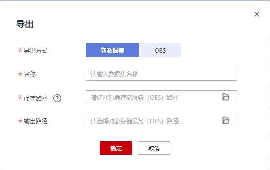
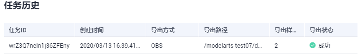

# 导出数据

针对数据集中的数据，包含“已标注”和“未标注”的数据。您可以选中需要部分图片或者通过筛选条件筛选出需要的数据，导出成新的数据集，或者将数据导出至指定的OBS目录下。您可以通过任务历史查看数据导出的历史记录。

目前只有“图片”、“自由格式”类型的数据集支持导出功能。

-   “图片”支持导出“图像分类”、“物体检测”、“图像分割”三种标注结果
    -   “图像分类”只支持导出txt格式的标注文件。
    -   “物体检测”只支持导出Pascal VOC格式的XML标注文件。
    -   “图像分割”只支持导出Pascal VOC格式的XML标注文件以及Mask图像。

-   “自由格式”直接导出数据集的所有样本文件。

## 导出新数据集

1.  登录ModelArts管理控制台，在左侧菜单栏中选择“数据管理\>数据集“，进入“数据集“管理页面。
2.  在数据集列表中，选择“图片”或“自由格式”类型的数据集，单击数据集名称进入“数据集概览页“。
3.  在“数据集概览页“，单击右上角“导出 “。在弹出的“导出“对话框中，填写相关信息，然后单击“确定“，开始执行导出操作。

    “导出方式“：选择新数据集或OBS。

    -   **导出新数据集：**

        “名称“：当新数据集名称。

        “保存路径“：表示新数据集的输入路径，即当前数据导出后存储的OBS路径。

        “输出路径“：表示新数据集的输出路径，即新数据集在完成标注后输出的路径。“输出路径“不能与“保存路径“为同一路径，且“输出路径“不能是“保存路径“的子目录。

        “导出范围“：“导出当前选中样本“，或者“导出当前筛选条件下的所有样本“。

    -   **导出OBS**

        “保存路径“：即导出数据存储的路径。建议不要将数据存储至当前数据集所在的输入路径或输出路径。

    **图 1**  导出新数据集  
    

4.  数据导出成功后，您可以前往您设置的保存路径，查看到存储的数据。当导出方式选择为新数据集时，在导出成功后，您可以前往“数据集“列表中，查看到新的数据集。

## 查看导出任务历史

当您导出新数据集或导出数据至OBS，您可以通过任务历史查看导出任务明细。

1.  登录ModelArts管理控制台，在左侧菜单栏中选择“数据管理\>数据集“，进入“数据集“管理页面。
2.  在数据集列表中，选择“图片”或“自由格式”类型的数据集，单击数据集名称进入“数据集概览页“。
3.  在“数据集概览页“，单击右上角“导出历史“。
4.  在弹出的“任务历史“对话框中，可以查看该数据集之前的导出任务历史。包括“任务ID“、“创建时间“、“导出方式“、“导出路径“、“导出样本总数“和“导出状态“。

    **图 2**  任务历史  
    

