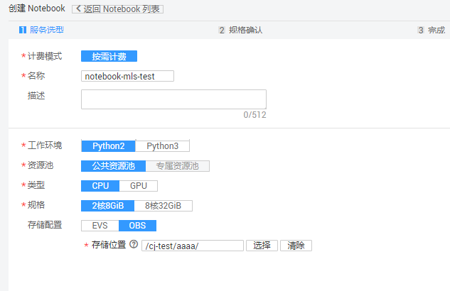
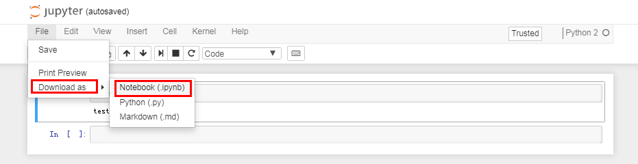
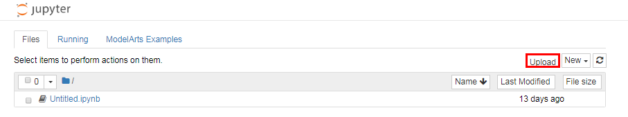
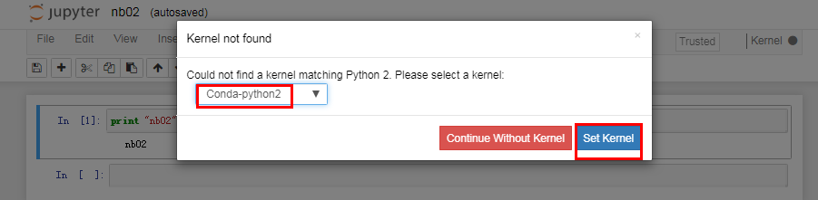

# 将MLS业务迁移至ModelArts

由于MLS服务即将下线，建议您在ModelArts服务中使用ML Studio相关的功能。为保证用户的业务数据正常运行，建议您参考如下操作指导完成迁移。

## 数据迁移

MLS专属版支持将数据保存在HDFS，MLS标准版支持将数据保存在数据集和OBS。ML Studio将数据读入写出统一为OBS，因此MLS数据保存的操作需要您手动迁移，需要将原数据上传到OBS。

创建OBS桶和文件夹的操作指导请参见[创建桶](https://support.huaweicloud.com/usermanual-obs/zh-cn_topic_0045829088.html)和[新建文件夹](https://support.huaweicloud.com/usermanual-obs/zh-cn_topic_0045829103.html)。

OBS上传文件的操作指导，请参见[上传文件](https://support.huaweicloud.com/usermanual-obs/zh-cn_topic_0045829661.html)。

> **说明：**   
>为方便业务迁移至ModelArts服务时直接使用，建议您创建OBS桶和文件夹路径与原来MLS服务存放的数据路径一致。  

在OBS服务中创建桶和文件夹，将MLS业务的数据和模型上传至新建的OBS桶中。

## 工作流迁移

ML Studio与MLS的工作流能力完全一致。由于支持的数据源有变更，导致数据读入、写出相关的算子有变化，需要用户根据自己工作流所涉及的算子，对涉及到的算子工作流进行重新编排。具体算子变更请参见[表1](#table12524324122013)和[表2](#table1366217523417)。其中“从OBS读取模型”和“保存模型到OBS”只支持“inner“格式的模型。

**表 1**  MLS专属版与ML Studio算子变化

<table><thead align="left"><tr id="row55261424172011"><th class="cellrowborder" valign="top" width="21.27%" id="mcps1.2.4.1.1">
算子所属类别

</th>
<th class="cellrowborder" valign="top" width="40.71%" id="mcps1.2.4.1.2">
MLS专属版算子

</th>
<th class="cellrowborder" valign="top" width="38.019999999999996%" id="mcps1.2.4.1.3">
ML Studio算子

</th>
</tr>
</thead>
<tbody><tr id="row15271247205"><td class="cellrowborder" rowspan="5" valign="top" width="21.27%" headers="mcps1.2.4.1.1 ">
输入

</td>
<td class="cellrowborder" valign="top" width="40.71%" headers="mcps1.2.4.1.2 ">
读取模型

</td>
<td class="cellrowborder" valign="top" width="38.019999999999996%" headers="mcps1.2.4.1.3 ">
从OBS读取模型

</td>
</tr>
<tr id="row135272024102013"><td class="cellrowborder" valign="top" headers="mcps1.2.4.1.1 ">
读取PMML模型文件

</td>
<td class="cellrowborder" valign="top" headers="mcps1.2.4.1.2 ">
不支持

</td>
</tr>
<tr id="row115271524112011"><td class="cellrowborder" valign="top" headers="mcps1.2.4.1.1 ">
读取Hive表

</td>
<td class="cellrowborder" valign="top" headers="mcps1.2.4.1.2 ">
不支持

</td>
</tr>
<tr id="row18527824172020"><td class="cellrowborder" valign="top" headers="mcps1.2.4.1.1 ">
读取HDFS文件

</td>
<td class="cellrowborder" valign="top" headers="mcps1.2.4.1.2 ">
从OBS读取数据

</td>
</tr>
<tr id="row8527524112018"><td class="cellrowborder" valign="top" headers="mcps1.2.4.1.1 ">
读取文本文件

</td>
<td class="cellrowborder" valign="top" headers="mcps1.2.4.1.2 ">
从OBS读取文本

</td>
</tr>
<tr id="row05191644143420"><td class="cellrowborder" rowspan="4" valign="top" width="21.27%" headers="mcps1.2.4.1.1 ">
输出

</td>
<td class="cellrowborder" valign="top" width="40.71%" headers="mcps1.2.4.1.2 ">
保存HDFS文件

</td>
<td class="cellrowborder" valign="top" width="38.019999999999996%" headers="mcps1.2.4.1.3 ">
保存数据到OBS

</td>
</tr>
<tr id="row780245413415"><td class="cellrowborder" valign="top" headers="mcps1.2.4.1.1 ">
保存PMML模型文件

</td>
<td class="cellrowborder" valign="top" headers="mcps1.2.4.1.2 ">
不支持

</td>
</tr>
<tr id="row205139504373"><td class="cellrowborder" valign="top" headers="mcps1.2.4.1.1 ">
保存模型

</td>
<td class="cellrowborder" valign="top" headers="mcps1.2.4.1.2 ">
保存模型至OBS

</td>
</tr>
<tr id="row53889552379"><td class="cellrowborder" valign="top" headers="mcps1.2.4.1.1 ">
保存Hive表

</td>
<td class="cellrowborder" valign="top" headers="mcps1.2.4.1.2 ">
不支持

</td>
</tr>
</tbody>
</table>

**表 2**  MLS标准版与ML Studio算子变化

<table><thead align="left"><tr id="row8662175254117"><th class="cellrowborder" valign="top" width="23.022302230223023%" id="mcps1.2.4.1.1">
算子所属类别

</th>
<th class="cellrowborder" valign="top" width="39.49394939493949%" id="mcps1.2.4.1.2">
MLS标准版算子

</th>
<th class="cellrowborder" valign="top" width="37.48374837483748%" id="mcps1.2.4.1.3">
ML Studio算子

</th>
</tr>
</thead>
<tbody><tr id="row1318311281873"><td class="cellrowborder" rowspan="4" valign="top" width="23.022302230223023%" headers="mcps1.2.4.1.1 ">
输入

</td>
<td class="cellrowborder" valign="top" width="39.49394939493949%" headers="mcps1.2.4.1.2 ">
   从表格存储服务读取数据

</td>
<td class="cellrowborder" valign="top" width="37.48374837483748%" headers="mcps1.2.4.1.3 ">
不支持

</td>
</tr>
<tr id="row1266355214114"><td class="cellrowborder" valign="top" headers="mcps1.2.4.1.1 ">
从数据集读取数据

</td>
<td class="cellrowborder" valign="top" headers="mcps1.2.4.1.2 ">
从OBS读取数据

</td>
</tr>
<tr id="row166325213414"><td class="cellrowborder" valign="top" headers="mcps1.2.4.1.1 ">
读取模型

</td>
<td class="cellrowborder" valign="top" headers="mcps1.2.4.1.2 ">
从OBS读取模型

</td>
</tr>
<tr id="row66631452184118"><td class="cellrowborder" valign="top" headers="mcps1.2.4.1.1 ">
从数据集读取文本

</td>
<td class="cellrowborder" valign="top" headers="mcps1.2.4.1.2 ">
从OBS读取文本

</td>
</tr>
<tr id="row17137717141019"><td class="cellrowborder" rowspan="2" valign="top" width="23.022302230223023%" headers="mcps1.2.4.1.1 ">
输出

</td>
<td class="cellrowborder" valign="top" width="39.49394939493949%" headers="mcps1.2.4.1.2 ">
保存数据到数据集

</td>
<td class="cellrowborder" valign="top" width="37.48374837483748%" headers="mcps1.2.4.1.3 ">
保存数据到OBS

</td>
</tr>
<tr id="row3294122111010"><td class="cellrowborder" valign="top" headers="mcps1.2.4.1.1 ">
保存模型

</td>
<td class="cellrowborder" valign="top" headers="mcps1.2.4.1.2 ">
保存模型到OBS

</td>
</tr>
</tbody>
</table>

## Notebook迁移

ModelArts Notebook为您提供更好用的代码编辑功能，可将MLS的Notebook脚本下载到本地，然后上传到ModelArts上继续使用。该部分迁移包括Notebook数据迁移和Notebook代码迁移。

**Notebook数据迁移**

MLS专属版Notebook模块将数据保存在HDFS，MLS标准版notebook模块将数据保存在OBS。Notebook需要将原数据上传到OBS。请参见[数据迁移](#section872861153)。

**Notebook代码迁移**

具体步骤如下：

1.  登录ModelArts管理控制台，在左侧菜单栏中选择“开发环境\>Notebook“，进入“Notebook“管理页面。
2.  单击“创建“进入“创建Notebook“页面，如[图1](#fig88718193235)所示，工作环境选择“Python2“，存储配置选择“OBS“。其他参数配置请参见[创建并打开Notebook](创建并打开Notebook.md)。

    **图 1**  创建Notebook示例  
    

3.  下载MLS服务中的Notebook脚本，格式为“.ipynb“。

    **图 2**  下载Notebook脚本  
    

4.  上传“.ipynb“文件至Notebook开发环境。

    **图 3**  上传脚本至Notebook  
    

5.  单击打开“.ipynb“文件，设置Kernel环境，选择“Conda-python2“。单击“Set Kernel“完成设置，即可使用“.ipynb“文件。

    **图 4**  设置Kernel环境  
    

> **说明：**   
>在Notebook开发环境中如何操作OBS中的文件，详请参见[MoXing-公共组件](https://github.com/huaweicloud/ModelArts-Lab/blob/master/docs/moxing_api_doc/MoXing_API_File.md)。  

