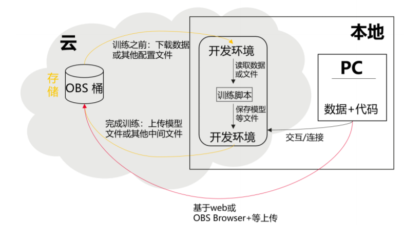

# 开发环境简介

> **说明：** 
>本手册基于新版开发环境Notebook功能展开介绍，旧版Notebook相关内容请参见[旧版开发环境](https://support.huaweicloud.com/engineers-modelarts/modelarts_23_0033.html)。

软件开发的历史，就是一部降低开发者成本，提升开发体验的历史。在AI开发阶段，ModelArts也致力于提升AI开发体验，降低开发门槛。ModelArts开发环境，以云原生的资源使用和开发工具链的集成，目标为不同类型AI开发、探索、教学用户，提供更好云化AI开发体验。

ModelArts Notebook 云上云下，无缝协同

-   代码开发与调测。云化JupyterLab使用，本地IDE+ModelArts插件远程开发能力，贴近开发人员使用习惯
-   云上开发环境，包含AI计算资源，云上存储，预置AI引擎
-   运行环境自定义，将开发环境直接保存成为镜像，供训练、推理使用

ModelArts CodeLab（JupyterLab），让AI探索&教学更简单

-   云原生Notebook，案例内容秒级接入与分享
-   Serverless化实例管理，资源自动回收
-   免费算力，规格按需切换

## 亮点特性1：远程开发 - 支持本地IDE远程访问Notebook

新版Notebook提供了远程开发功能，通过开启SSH连接，用户本地IDE可以远程连接到ModelArts的Notebook开发环境中，调试和运行代码。

对于使用本地IDE的开发者，由于本地资源限制，运行和调试环境大多使用团队公共搭建的CPU或GPU服务器，并且是多人共用，这带来一定的环境搭建和维护成本。

而ModelArts的Notebook的优势是即开即用，它预先装好了不同的框架，并且提供了非常多的可选规格，用户可以独占一个容器环境，不受其他人的干扰。只需简单配置，用户即可通过本地IDE连接到该环境进行运行和调试。

**图 1**  本地IDE远程访问Notebook开发环境  

ModelArts的Notebook可以视作是本地PC的延伸，均视作本地开发环境，其读取数据、训练、保存文件等操作与常规的本地训练一致。

对于习惯使用本地IDE的开发者，使用远程开发方式，不影响用户的编码习惯，并且可以方便快捷的使用云上的Notebook开发环境。

本地IDE当前支持VSCode、PyCharm。

PyCharm还有专门的插件PyCharm ToolKit更方便将云上资源作为本地的一个扩展。

## 亮点特性2：预置镜像 - 即开即用，优化配置，支持主流AI引擎

每个镜像预置的AI引擎和版本是固定的，在创建Notebook实例时明确AI引擎和版本，包括适配的芯片。

> **说明：** 
>-   为了简化操作，ModelArts的新版Notebook，同一个Notebook实例中不支持不同引擎之间的切换。
>-   不同Region支持的AI引擎不一样，请以控制台实际界面为准。

**表 1**  新版开发环境支持的AI引擎

<table><thead align="left"><tr id="row1073994515422"><th class="cellrowborder" valign="top" width="37.9%" id="mcps1.2.6.1.1">
镜像名称

</th>
<th class="cellrowborder" valign="top" width="26.22%" id="mcps1.2.6.1.2">
镜像描述

</th>
<th class="cellrowborder" valign="top" width="11.81%" id="mcps1.2.6.1.3">
适配芯片

</th>
<th class="cellrowborder" valign="top" width="11.72%" id="mcps1.2.6.1.4">
支持SSH远程开发访问

</th>
<th class="cellrowborder" valign="top" width="12.35%" id="mcps1.2.6.1.5">
支持在线JupyterLab访问

</th>
</tr>
</thead>
<tbody><tr id="row8739124511421"><td class="cellrowborder" valign="top" width="37.9%" headers="mcps1.2.6.1.1 ">
pytorch1.4-cuda10.1-cudnn7-ubuntu18.04

</td>
<td class="cellrowborder" valign="top" width="26.22%" headers="mcps1.2.6.1.2 ">
CPU、GPU通用算法开发和训练基础镜像，预置AI引擎PyTorch1.4

</td>
<td class="cellrowborder" valign="top" width="11.81%" headers="mcps1.2.6.1.3 ">
CPU/GPU

</td>
<td class="cellrowborder" valign="top" width="11.72%" headers="mcps1.2.6.1.4 ">
是

</td>
<td class="cellrowborder" valign="top" width="12.35%" headers="mcps1.2.6.1.5 ">
是

</td>
</tr>
<tr id="row13809241817"><td class="cellrowborder" valign="top" width="37.9%" headers="mcps1.2.6.1.1 ">
tensorflow2.1-cuda10.1-cudnn7-ubuntu18.04

</td>
<td class="cellrowborder" valign="top" width="26.22%" headers="mcps1.2.6.1.2 ">
CPU、GPU通用算法开发和训练基础镜像，预置AI引擎TensorFlow2.1

</td>
<td class="cellrowborder" valign="top" width="11.81%" headers="mcps1.2.6.1.3 ">
CPU/GPU

</td>
<td class="cellrowborder" valign="top" width="11.72%" headers="mcps1.2.6.1.4 ">
是

</td>
<td class="cellrowborder" valign="top" width="12.35%" headers="mcps1.2.6.1.5 ">
是

</td>
</tr>
<tr id="row14536830155913"><td class="cellrowborder" valign="top" width="37.9%" headers="mcps1.2.6.1.1 ">
mindspore1.2.0-openmpi2.1.1-ubuntu18.04

</td>
<td class="cellrowborder" valign="top" width="26.22%" headers="mcps1.2.6.1.2 ">
CPU算法开发和训练基础镜像，预置AI引擎MindSpore-CPU

</td>
<td class="cellrowborder" valign="top" width="11.81%" headers="mcps1.2.6.1.3 ">
CPU

</td>
<td class="cellrowborder" valign="top" width="11.72%" headers="mcps1.2.6.1.4 ">
是

</td>
<td class="cellrowborder" valign="top" width="12.35%" headers="mcps1.2.6.1.5 ">
是

</td>
</tr>
<tr id="row374024516426"><td class="cellrowborder" valign="top" width="37.9%" headers="mcps1.2.6.1.1 ">
mindspore1.2.0-cuda10.1-cudnn7-ubuntu18.04

</td>
<td class="cellrowborder" valign="top" width="26.22%" headers="mcps1.2.6.1.2 ">
GPU算法开发和训练基础镜像，预置AI引擎MindSpore-GPU

</td>
<td class="cellrowborder" valign="top" width="11.81%" headers="mcps1.2.6.1.3 ">
GPU

</td>
<td class="cellrowborder" valign="top" width="11.72%" headers="mcps1.2.6.1.4 ">
是

</td>
<td class="cellrowborder" valign="top" width="12.35%" headers="mcps1.2.6.1.5 ">
是

</td>
</tr>
<tr id="row17990104634617"><td class="cellrowborder" valign="top" width="37.9%" headers="mcps1.2.6.1.1 ">
mlstudio-pyspark2.3.2-ubuntu16.04

</td>
<td class="cellrowborder" valign="top" width="26.22%" headers="mcps1.2.6.1.2 ">
CPU算法开发和训练基础镜像，包含可以图形化机器学习算法开发和调测MLStudio工具，并预置PySpark2.3.2

</td>
<td class="cellrowborder" valign="top" width="11.81%" headers="mcps1.2.6.1.3 ">
CPU

</td>
<td class="cellrowborder" valign="top" width="11.72%" headers="mcps1.2.6.1.4 ">
否

</td>
<td class="cellrowborder" valign="top" width="12.35%" headers="mcps1.2.6.1.5 ">
是

</td>
</tr>
<tr id="row1520012221524"><td class="cellrowborder" valign="top" width="37.9%" headers="mcps1.2.6.1.1 ">
mindstudio3.0.1-ascend910-cann3.3.0-ubuntu18.04-aarch64

</td>
<td class="cellrowborder" valign="top" width="26.22%" headers="mcps1.2.6.1.2 ">
Ascend算子开发基础镜像，预置专业级算子开发工具MindStudio，仅支持SSH链接

</td>
<td class="cellrowborder" valign="top" width="11.81%" headers="mcps1.2.6.1.3 ">
Ascend 910

</td>
<td class="cellrowborder" valign="top" width="11.72%" headers="mcps1.2.6.1.4 ">
是

</td>
<td class="cellrowborder" valign="top" width="12.35%" headers="mcps1.2.6.1.5 ">
否

</td>
</tr>
<tr id="row15991114610463"><td class="cellrowborder" valign="top" width="37.9%" headers="mcps1.2.6.1.1 ">
tensorflow1.15-mindspore1.2.0-cann20.2-euler2.8-aarch64

</td>
<td class="cellrowborder" valign="top" width="26.22%" headers="mcps1.2.6.1.2 ">
Ascend+ARM算法开发和训练基础镜像，预置AI引擎TensorFlow1.15和MindSpore1.2.0

</td>
<td class="cellrowborder" valign="top" width="11.81%" headers="mcps1.2.6.1.3 ">
Ascend 910

</td>
<td class="cellrowborder" valign="top" width="11.72%" headers="mcps1.2.6.1.4 ">
是

</td>
<td class="cellrowborder" valign="top" width="12.35%" headers="mcps1.2.6.1.5 ">
是

</td>
</tr>
<tr id="row1962116151133"><td class="cellrowborder" valign="top" width="37.9%" headers="mcps1.2.6.1.1 ">
modelbox1.0.9.2-tensorrt7.1.3-pytorch1.8.1-cuda10.2-cudnn8-euler2.8-aarch64

</td>
<td class="cellrowborder" valign="top" width="26.22%" headers="mcps1.2.6.1.2 ">
AI应用开发基础镜像，预置AI应用编排引擎ModelBox、AI引擎PyTorch、TensorRT和TensorFlow，仅支持SSH连接

</td>
<td class="cellrowborder" valign="top" width="11.81%" headers="mcps1.2.6.1.3 ">
GPU

</td>
<td class="cellrowborder" valign="top" width="11.72%" headers="mcps1.2.6.1.4 ">
是

</td>
<td class="cellrowborder" valign="top" width="12.35%" headers="mcps1.2.6.1.5 ">
否

</td>
</tr>
<tr id="row8545422171313"><td class="cellrowborder" valign="top" width="37.9%" headers="mcps1.2.6.1.1 ">
rlstudio1.0.0-ray1.3.0-cuda10.1-ubuntu18.04

</td>
<td class="cellrowborder" valign="top" width="26.22%" headers="mcps1.2.6.1.2 ">
CPU、GPU强化学习算法开发和训练基础镜像，预置AI引擎.

</td>
<td class="cellrowborder" valign="top" width="11.81%" headers="mcps1.2.6.1.3 ">
GPU

</td>
<td class="cellrowborder" valign="top" width="11.72%" headers="mcps1.2.6.1.4 ">
是

</td>
<td class="cellrowborder" valign="top" width="12.35%" headers="mcps1.2.6.1.5 ">
是

</td>
</tr>
<tr id="row128810202136"><td class="cellrowborder" valign="top" width="37.9%" headers="mcps1.2.6.1.1 ">
cylp0.91.4-cbcpy2.10-cplex20.1.0-ubuntu18.04

</td>
<td class="cellrowborder" valign="top" width="26.22%" headers="mcps1.2.6.1.2 ">
CPU运筹优化求解器开发基础镜像，预置cylp，cbcpy，ortools及cplex.

</td>
<td class="cellrowborder" valign="top" width="11.81%" headers="mcps1.2.6.1.3 ">
CPU

</td>
<td class="cellrowborder" valign="top" width="11.72%" headers="mcps1.2.6.1.4 ">
是

</td>
<td class="cellrowborder" valign="top" width="12.35%" headers="mcps1.2.6.1.5 ">
是

</td>
</tr>
</tbody>
</table>

## 亮点特性3：提供在线的交互式开发调试工具JupyterLab

ModelArts集成了基于开源的JupyterLab，可为您提供在线的交互式开发调试工具。您无需关注安装配置，在ModelArts管理控制台直接使用Notebook，编写和调测模型训练代码，然后基于该代码进行模型的训练。

JupyterLab是一个交互式的开发环境，是Jupyter Notebook的下一代产品，可以使用它编写Notebook、操作终端、编辑MarkDown文本、打开交互模式、查看csv文件及图片等功能。

