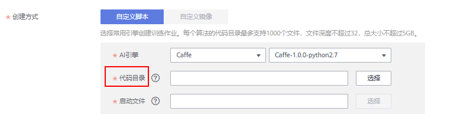
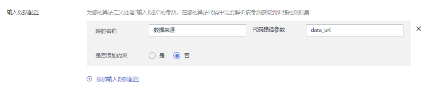
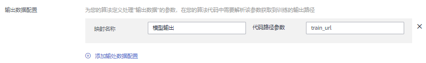
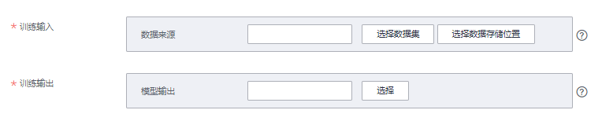

# 开发自定义脚本<a name="modelarts_23_0240"></a>

当您使用自定义脚本创建算法时，您需要提前完成算法的代码开发。本章详细介绍如何改造本地代码适配ModelArts云上训练。

创建算法时，您需要在创建页面提供代码目录路径、代码目录路径中的启动文件、输入路径参数和训练输出路径参数。这四种输入搭建了用户代码和ModelArts后台交互的桥梁。

-   代码目录路径

    您需要在OBS桶中指定代码目录，并将训练代码、依赖安装包或者预生成模型等训练所需文件上传至该代码目录下。训练作业创建完成后，ModelArts会将代码目录及其子目录下载至后台容器中。

    请注意不要将训练数据放在代码目录路径下。训练数据比较大，训练代码目录在训练作业启动后会下载至后台，可能会有下载失败的风险。

-   代码目录路径中的启动文件

    代码目录路径中的启动文件作为训练启动的入口，当前只支持python格式。

-   <a name="modelarts_23_0511_li1463111565413"></a>输入路径参数

    训练数据需上传至OBS桶或者存储至[数据集](zh-cn_topic_0170886809.md)中。在训练代码中，用户需解析[输入路径参数](#modelarts_23_0511_li1463111565413)。系统后台会自动下载输入参数路径中的训练数据至训练容器的本地目录。请保证您设置的桶路径有读取权限。在训练作业启动后，ModelArts会挂载硬盘至“/cache“目录，用户可以使用此目录来存储临时文件。“/cache“目录大小请参考[训练环境中不同规格资源“/cache”目录的大小](https://support.huaweicloud.com/modelarts_faq/modelarts_05_0090.html)。

-   训练输出路径参数

    建议设置一个空目录为训练输出路径。在训练代码中，您需要解析[输出路径参数](#modelarts_23_0511_section16262114175610)。系统后台会自动上传训练输出至指定的训练输出路径，请保证您设置的桶路径有写入权限和读取权限。


在ModelArts中，训练代码需包含以下步骤：

## （可选）引入依赖<a name="modelarts_23_0511_section48325735511"></a>

1.  当您使用自定义脚本创建算法的时候，如果您的模型引用了其他依赖，您需要在创建算法的“代码目录“下放置相应的文件或安装包。

    -   安装python依赖包请参考[模型中引用依赖包时，如何创建训练作业？](https://support.huaweicloud.com/modelarts_faq/modelarts_05_0063.html)
    -   安装C++的依赖库请参考[如何安装C++的依赖库？](https://support.huaweicloud.com/modelarts_faq/modelarts_05_0088.html)
    -   在预训练模型中加载参数请参考[如何在训练中加载部分训练好的参数？](https://support.huaweicloud.com/modelarts_faq/modelarts_05_0091.html)

    **图 1**  选择代码目录并指定模型启动文件<a name="modelarts_23_0511_fig1422117255615"></a>  
    


## 解析输入路径参数、输出路径参数<a name="modelarts_23_0511_section16262114175610"></a>

运行在ModelArts的模型读取存储在OBS服务的数据，或者输出至OBS服务指定路径，输入和输出数据需要配置3个地方：

1.  训练代码中需解析输入路径参数和输出路径参数。ModelArts推荐以下方式实现参数解析。

    ```
    import argparse
    # 创建解析
    parser = argparse.ArgumentParser(description="train mnist",
                                     formatter_class=argparse.ArgumentDefaultsHelpFormatter)
    # 添加参数
    parser.add_argument('--train_url', type=str, 
                        help='the path model saved')
    parser.add_argument('--data_url', type=str, help='the training data')
    # 解析参数
    args, unkown = parser.parse_known_args()
    ```

    完成参数解析后，用户使用“data\_url“、“train\_url“代替算法中数据来源和数据输出所需的路径。

2.  在使用自定义脚本创建自定义算法时，根据步骤1中的代码参数设置，您需要在创建算法页面配置已定义的输入输出参数。
    -   训练数据是算法开发中必不可少的输入。输入数据默认配置为“数据来源“，代码参数为“data\_url“，也支持用户根据步骤1的算法代码自定义代码参数。

        **图 2**  解析输入路径参数“data\_url“<a name="modelarts_23_0511_fig36481544132311"></a>  
        

    -   模型训练结束后，训练模型以及相关输出信息需保存在OBS路径。输出数据默认配置为“模型输出“，代码参数为“train\_url“，也支持用户根据步骤1的算法代码自定义输出路径参数。

        **图 3**  解析输出路径参数“train\_url“<a name="modelarts_23_0511_fig1179383818563"></a>  
        

3.  在创建训练作业时，填写输出路径和输出路径。

    训练输入选择对应的OBS路径或者数据集路径；训练输出选择对应的OBS路径。

    **图 4**  训练输入和输出设置<a name="fig15384174818573"></a>  
    


## 训练代码正文和保存模型<a name="modelarts_23_0511_section3221192820575"></a>

训练代码正文和保存模型涉及的代码与您使用的AI引擎密切相关。以下案例以Tensorflow框架为例，训练代码中解析参数方式采用tensorflow接口tf.flags.FLAGS接受命令行参数：

```
from __future__ import absolute_import
from __future__ import division
from __future__ import print_function

import os

import tensorflow as tf
from tensorflow.examples.tutorials.mnist import input_data

import moxing as mox

tf.flags.DEFINE_integer('max_steps', 1000, 'number of training iterations.')
tf.flags.DEFINE_string('data_url', '/home/jnn/nfs/mnist', 'dataset directory.')
tf.flags.DEFINE_string('train_url', '/home/jnn/temp/delete', 'saved model directory.')

FLAGS = tf.flags.FLAGS


def main(*args):
    # Train model
    print('Training model...')
    mnist = input_data.read_data_sets(FLAGS.data_url, one_hot=True)
    sess = tf.InteractiveSession()
    serialized_tf_example = tf.placeholder(tf.string, name='tf_example')
    feature_configs = {'x': tf.FixedLenFeature(shape=[784], dtype=tf.float32),}
    tf_example = tf.parse_example(serialized_tf_example, feature_configs)
    x = tf.identity(tf_example['x'], name='x')
    y_ = tf.placeholder('float', shape=[None, 10])
    w = tf.Variable(tf.zeros([784, 10]))
    b = tf.Variable(tf.zeros([10]))
    sess.run(tf.global_variables_initializer())
    y = tf.nn.softmax(tf.matmul(x, w) + b, name='y')
    cross_entropy = -tf.reduce_sum(y_ * tf.log(y))

    tf.summary.scalar('cross_entropy', cross_entropy)

    train_step = tf.train.GradientDescentOptimizer(0.01).minimize(cross_entropy)

    correct_prediction = tf.equal(tf.argmax(y, 1), tf.argmax(y_, 1))
    accuracy = tf.reduce_mean(tf.cast(correct_prediction, 'float'))
    tf.summary.scalar('accuracy', accuracy)
    merged = tf.summary.merge_all()
    test_writer = tf.summary.FileWriter(FLAGS.train_url, flush_secs=1)

    for step in range(FLAGS.max_steps):
        batch = mnist.train.next_batch(50)
        train_step.run(feed_dict={x: batch[0], y_: batch[1]})
        if step % 10 == 0:
            summary, acc = sess.run([merged, accuracy], feed_dict={x: mnist.test.images, y_: mnist.test.labels})
            test_writer.add_summary(summary, step)
            print('training accuracy is:', acc)
    print('Done training!')

    builder = tf.saved_model.builder.SavedModelBuilder(os.path.join(FLAGS.train_url, 'model'))

    tensor_info_x = tf.saved_model.utils.build_tensor_info(x)
    tensor_info_y = tf.saved_model.utils.build_tensor_info(y)

    prediction_signature = (
        tf.saved_model.signature_def_utils.build_signature_def(
            inputs={'images': tensor_info_x},
            outputs={'scores': tensor_info_y},
            method_name=tf.saved_model.signature_constants.PREDICT_METHOD_NAME))

    builder.add_meta_graph_and_variables(
        sess, [tf.saved_model.tag_constants.SERVING],
        signature_def_map={
            'predict_images':
                prediction_signature,
        },
        main_op=tf.tables_initializer(),
        strip_default_attrs=True)

    builder.save()

    print('Done exporting!')


if __name__ == '__main__':
    tf.app.run(main=main)
```

