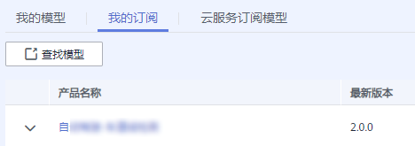
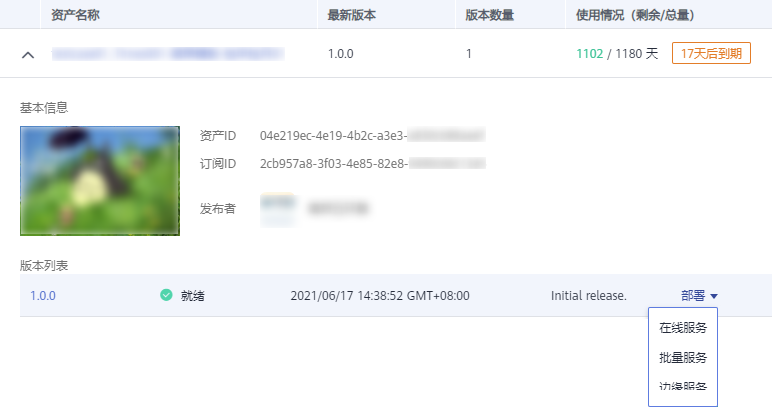
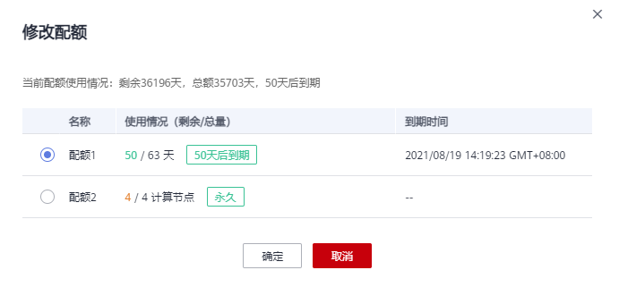

# 我的订阅模型

在AI Gallery中，支持订阅官方发布或者他人分享的模型，订阅后的模型，可推送至ModelArts模型管理中，进行统一管理。

> **说明：** 
>我的订阅模型与云服务订阅模型的区别：
>-   在管理控制台中，模型管理所在位置不同。我的订阅统一管理在“模型管理\>模型\>我的订阅“页面中，而云服务订阅模型管理在“模型管理\>云服务订阅模型“页面中。
>-   模型来源不同。我的订阅，模型来源于AI Gallery；云服务订阅模型，模型来源于其他AI服务开发的模型。

## 我的订阅模型列表

在ModelArts的“模型管理\>模型\>我的订阅“页面中，罗列了从AI Gallery订阅的所有模型。如果需要更多模型，可单击“查找模型“，跳转至“AI Gallery“选择更多。

**图 1**  我的订阅模型列表  

我的订阅模型，可通过如下几个操作获得：

1.  订阅

    在“AI Gallery“中，作为买家，完成模型订阅。订阅模型的操作指导请参见[买家指导（订阅模型）](https://support.huaweicloud.com/aimarket-modelarts/modelarts_18_0004.html#section1)。

2.  [将我的订阅模型部署为服务](#section56591426124816)。

## 将我的订阅模型部署为服务

针对我的订阅模型，支持将模型一键部署为服务。

1.  在“我的订阅“列表中，单击模型名称左侧的小三角，展开模型的详情和模型版本。
2.  在“版本列表“中，单击“部署“，选择对应的服务类型。

    **图 2**  部署  
    

    -   若您选择部署的是商用模型，则选择服务类型后会弹出“修改配额“窗口，根据需要选择配额后单击“确定“即可跳转至“部署“页面。

        > **说明：** 
        >由于商用模型支持同时购买多种配额模式的资产，所以仅部署商用模型时需要进行配额选择。免费模型仅一种配额模式无需选择。

        **图 3**  修改配额  
        

    -   若您选择部署的非商业模型，系统自动跳转至“部署“页面。

3.  在部署页面中，无需再选择模型及其版本，参考[部署模型](模型部署简介.md)的操作指导完成其他参数填写，即可部署为您需要的服务。

