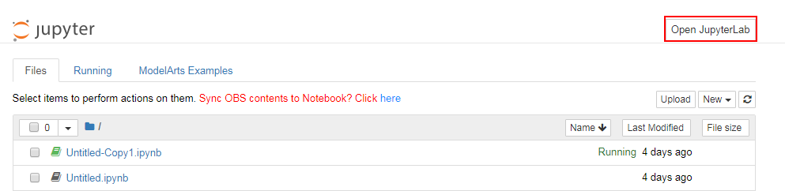

# 打开并使用JupyterLab

JupyterLab是一个交互式的开发环境，是Jupyter Notebook的下一代产品，可以使用它编写Notebook、操作终端、编辑MarkDown文本、打开交互模式、查看csv文件及图片等功能。

您的ModelArts创建的Notebook，支持打开并使用JupyterLab。

## 打开JupyterLab

1.  登录ModelArts管理控制台，在左侧菜单栏中选择“开发环境 \> Notebook“，进入Notebook管理列表。
2.  选择状态为“运行中“的Notebook实例，单击操作列的“打开“访问Notebook。
3.  在Jupyter页面中，单击右上角的Open JupyterLab，可直接打开此Notebook实例对应的JupyterLab页面。

    **图 1**  进入JupyterLab  
    

4.  进入JupyterLab页面后，您可以使用开源支持的所有功能，详细操作指导可参见[JupyterLab官网文档](https://jupyterlab.readthedocs.io/en/stable/)。

    **图 2**  JupyterLab主页  
    

