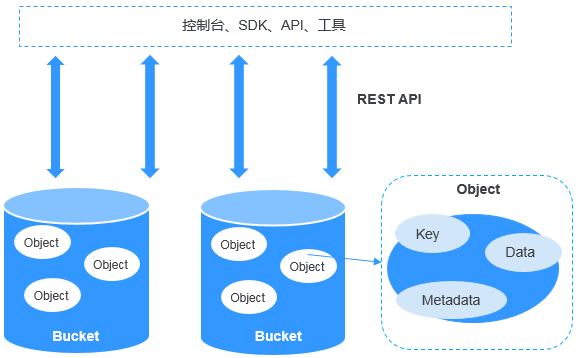
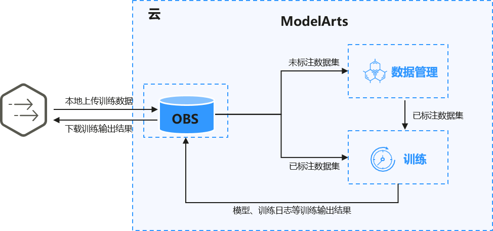

# 数据准备

ModelArts使用对象存储服务（Object Storage Service，简称OBS）进行数据存储以及模型的备份和快照，实现安全、高可靠和低成本的存储需求。

-   [OBS简介](#section81631146162713)
-   [使用训练数据的两种方式](#section471310416365)

## OBS简介

对象存储服务OBS是一个基于对象的海量存储服务，为客户提供海量、安全、高可靠、低成本的数据存储能力。对象存储服务OBS的基本组成是桶和对象。桶是OBS中存储对象的容器，每个桶都有自己的存储类别、访问权限、所属区域等属性，用户在互联网上通过桶的访问域名来定位桶。对象是OBS中数据存储的基本单位。关于OBS更详细的介绍请参考[《OBS用户指南》](https://support.huaweicloud.com/productdesc-obs/zh-cn_topic_0045829060.html)。

对ModelArts来说，obs服务是一个数据存储中心。AI 开发过程中的输入数据、输出数据、中间缓存数据都可以在obs桶中进行存储、读取。

因此，在使用ModelArts之前您需要[创建一个OBS桶](https://support.huaweicloud.com/prepare-modelarts/modelarts_08_0003.html)，然后在OBS桶中创建文件夹用于存放数据。

**图 1**  对象存储服务OBS  

## 使用训练数据的两种方式

ModelArts模型训练支持2种读取训练数据的方式：

-   使用OBS桶中存储的数据集

    如果您的数据集已完成数据标注和数据预处理，可以将数据上传至OBS桶。当创建训练作业时，在训练输入参数位置填写训练数据所在的OBS桶路径即可完成训练配置。

-   使用数据管理中的数据集

    如果您的数据集未标注或者需要进一步的数据预处理，可以将数据导入ModelArts数据管理模块进行数据预处理。创建数据集详细指导参考[创建数据集（旧版）](zh-cn_topic_0170886809.md)。

**图 2**  准备数据  

