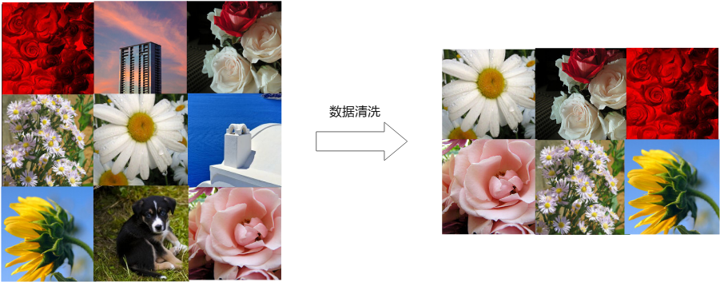

# 数据清洗<a name="modelarts_23_0340"></a>

## PCC算子概述<a name="zh-cn_topic_0262111316_section549195085217"></a>

ModelArts的数据清洗通过PCC算子实现。图像分类或者物体检测的数据集中可能存在非所需类别的图像，需要将这些图像去除掉，以免对标注、模型训练造成干扰。

**图 1**  PCC算子效果<a name="zh-cn_topic_0262111316_fig0784114719208"></a>  


## 参数说明<a name="zh-cn_topic_0262111316_section12961782538"></a>

**表 1**  数据清洗-PCC算子参数说明

<a name="zh-cn_topic_0262111316_table14105640181020"></a>
<table><thead align="left"><tr id="zh-cn_topic_0262111316_row2105940191016"><th class="cellrowborder" valign="top" width="23.427657234276573%" id="mcps1.2.5.1.1"><p id="zh-cn_topic_0262111316_p41059407106"><a name="zh-cn_topic_0262111316_p41059407106"></a><a name="zh-cn_topic_0262111316_p41059407106"></a>参数名</p>
</th>
<th class="cellrowborder" valign="top" width="6.909309069093091%" id="mcps1.2.5.1.2"><p id="zh-cn_topic_0262111316_p19105840171018"><a name="zh-cn_topic_0262111316_p19105840171018"></a><a name="zh-cn_topic_0262111316_p19105840171018"></a>是否必选</p>
</th>
<th class="cellrowborder" valign="top" width="8.13918608139186%" id="mcps1.2.5.1.3"><p id="zh-cn_topic_0262111316_p151057402108"><a name="zh-cn_topic_0262111316_p151057402108"></a><a name="zh-cn_topic_0262111316_p151057402108"></a>默认值</p>
</th>
<th class="cellrowborder" valign="top" width="61.523847615238466%" id="mcps1.2.5.1.4"><p id="zh-cn_topic_0262111316_p1810513402108"><a name="zh-cn_topic_0262111316_p1810513402108"></a><a name="zh-cn_topic_0262111316_p1810513402108"></a>参数说明</p>
</th>
</tr>
</thead>
<tbody><tr id="zh-cn_topic_0262111316_row8105184031010"><td class="cellrowborder" valign="top" width="23.427657234276573%" headers="mcps1.2.5.1.1 "><p id="zh-cn_topic_0262111316_p1510511407101"><a name="zh-cn_topic_0262111316_p1510511407101"></a><a name="zh-cn_topic_0262111316_p1510511407101"></a>prototype_sample_path</p>
</td>
<td class="cellrowborder" valign="top" width="6.909309069093091%" headers="mcps1.2.5.1.2 "><p id="zh-cn_topic_0262111316_p17158195461614"><a name="zh-cn_topic_0262111316_p17158195461614"></a><a name="zh-cn_topic_0262111316_p17158195461614"></a>是</p>
</td>
<td class="cellrowborder" valign="top" width="8.13918608139186%" headers="mcps1.2.5.1.3 "><p id="zh-cn_topic_0262111316_p141055409102"><a name="zh-cn_topic_0262111316_p141055409102"></a><a name="zh-cn_topic_0262111316_p141055409102"></a>None</p>
</td>
<td class="cellrowborder" valign="top" width="61.523847615238466%" headers="mcps1.2.5.1.4 "><p id="zh-cn_topic_0262111316_p111051840191013"><a name="zh-cn_topic_0262111316_p111051840191013"></a><a name="zh-cn_topic_0262111316_p111051840191013"></a>数据清洗正样例目录。目录应存放正样例图片文件，算法将这些图片为正样例，对输入中的数据进行过滤，即保留与<span class="parmname" id="zh-cn_topic_0262111316_parmname26739561384"><a name="zh-cn_topic_0262111316_parmname26739561384"></a><a name="zh-cn_topic_0262111316_parmname26739561384"></a>“prototype_sample_path”</span>目录下图片相似度高的数据。</p>
<p id="zh-cn_topic_0262111316_p445245516011"><a name="zh-cn_topic_0262111316_p445245516011"></a><a name="zh-cn_topic_0262111316_p445245516011"></a>请输入一个真实存在的OBS目录，且目录下已包含提供的正样例图片，且以obs://开头。如：<em id="zh-cn_topic_0262111316_i89915121193"><a name="zh-cn_topic_0262111316_i89915121193"></a><a name="zh-cn_topic_0262111316_i89915121193"></a>obs://obs_bucket_name/folder_name</em></p>
</td>
</tr>
<tr id="zh-cn_topic_0262111316_row11054409109"><td class="cellrowborder" valign="top" width="23.427657234276573%" headers="mcps1.2.5.1.1 "><p id="zh-cn_topic_0262111316_p3105124031020"><a name="zh-cn_topic_0262111316_p3105124031020"></a><a name="zh-cn_topic_0262111316_p3105124031020"></a>criticism_sample_path</p>
</td>
<td class="cellrowborder" valign="top" width="6.909309069093091%" headers="mcps1.2.5.1.2 "><p id="zh-cn_topic_0262111316_p111051840171012"><a name="zh-cn_topic_0262111316_p111051840171012"></a><a name="zh-cn_topic_0262111316_p111051840171012"></a>否</p>
</td>
<td class="cellrowborder" valign="top" width="8.13918608139186%" headers="mcps1.2.5.1.3 "><p id="zh-cn_topic_0262111316_p151051940101011"><a name="zh-cn_topic_0262111316_p151051940101011"></a><a name="zh-cn_topic_0262111316_p151051940101011"></a>None</p>
</td>
<td class="cellrowborder" valign="top" width="61.523847615238466%" headers="mcps1.2.5.1.4 "><p id="zh-cn_topic_0262111316_p1610504010107"><a name="zh-cn_topic_0262111316_p1610504010107"></a><a name="zh-cn_topic_0262111316_p1610504010107"></a>数据清洗负样例目录。目录应存放负样例图片文件，算法将这些图片为负样例，对算法输入中的数据进行过滤， 即保留与<span class="parmname" id="zh-cn_topic_0262111316_parmname19343415182917"><a name="zh-cn_topic_0262111316_parmname19343415182917"></a><a name="zh-cn_topic_0262111316_parmname19343415182917"></a>“criticism_sample_path”</span>目录下图片相似度差距较大的数据。</p>
<p id="zh-cn_topic_0262111316_p17915202215298"><a name="zh-cn_topic_0262111316_p17915202215298"></a><a name="zh-cn_topic_0262111316_p17915202215298"></a>建议该参数和<span class="parmname" id="zh-cn_topic_0262111316_parmname19151222182912"><a name="zh-cn_topic_0262111316_parmname19151222182912"></a><a name="zh-cn_topic_0262111316_parmname19151222182912"></a>“prototype_sample_path”</span>配合使用，可以提高数据清洗的准确性。</p>
<p id="zh-cn_topic_0262111316_p1210515401108"><a name="zh-cn_topic_0262111316_p1210515401108"></a><a name="zh-cn_topic_0262111316_p1210515401108"></a>请输入一个真实存在的OBS目录，且以obs://开头。如：<em id="zh-cn_topic_0262111316_i315362112910"><a name="zh-cn_topic_0262111316_i315362112910"></a><a name="zh-cn_topic_0262111316_i315362112910"></a>obs://obs_bucket_name/folder_name</em></p>
</td>
</tr>
<tr id="zh-cn_topic_0262111316_row13222235181711"><td class="cellrowborder" valign="top" width="23.427657234276573%" headers="mcps1.2.5.1.1 "><p id="zh-cn_topic_0262111316_p1222103517173"><a name="zh-cn_topic_0262111316_p1222103517173"></a><a name="zh-cn_topic_0262111316_p1222103517173"></a>n_clusters</p>
</td>
<td class="cellrowborder" valign="top" width="6.909309069093091%" headers="mcps1.2.5.1.2 "><p id="zh-cn_topic_0262111316_p16128134181710"><a name="zh-cn_topic_0262111316_p16128134181710"></a><a name="zh-cn_topic_0262111316_p16128134181710"></a>否</p>
</td>
<td class="cellrowborder" valign="top" width="8.13918608139186%" headers="mcps1.2.5.1.3 "><p id="zh-cn_topic_0262111316_p2022212352172"><a name="zh-cn_topic_0262111316_p2022212352172"></a><a name="zh-cn_topic_0262111316_p2022212352172"></a>auto</p>
</td>
<td class="cellrowborder" valign="top" width="61.523847615238466%" headers="mcps1.2.5.1.4 "><p id="zh-cn_topic_0262111316_p20222123512179"><a name="zh-cn_topic_0262111316_p20222123512179"></a><a name="zh-cn_topic_0262111316_p20222123512179"></a>数据样本的种类数，默认值auto。您可以输入小于样本总数的整数或auto。auto表示使用正样本目录的图片个数作为数据样本的种类数。</p>
</td>
</tr>
<tr id="zh-cn_topic_0262111316_row1184913991711"><td class="cellrowborder" valign="top" width="23.427657234276573%" headers="mcps1.2.5.1.1 "><p id="zh-cn_topic_0262111316_p48492393175"><a name="zh-cn_topic_0262111316_p48492393175"></a><a name="zh-cn_topic_0262111316_p48492393175"></a>simlarity_threshold</p>
</td>
<td class="cellrowborder" valign="top" width="6.909309069093091%" headers="mcps1.2.5.1.2 "><p id="zh-cn_topic_0262111316_p16138946171"><a name="zh-cn_topic_0262111316_p16138946171"></a><a name="zh-cn_topic_0262111316_p16138946171"></a>否</p>
</td>
<td class="cellrowborder" valign="top" width="8.13918608139186%" headers="mcps1.2.5.1.3 "><p id="zh-cn_topic_0262111316_p48494391170"><a name="zh-cn_topic_0262111316_p48494391170"></a><a name="zh-cn_topic_0262111316_p48494391170"></a>0.9</p>
</td>
<td class="cellrowborder" valign="top" width="61.523847615238466%" headers="mcps1.2.5.1.4 "><p id="zh-cn_topic_0262111316_p18849739151714"><a name="zh-cn_topic_0262111316_p18849739151714"></a><a name="zh-cn_topic_0262111316_p18849739151714"></a>相似度阈值。两张图片相似程度超过阈值时，判定为相似图片，反之按非相似图片处理。输入取值范围为0~1。</p>
</td>
</tr>
<tr id="zh-cn_topic_0262111316_row20349544181711"><td class="cellrowborder" valign="top" width="23.427657234276573%" headers="mcps1.2.5.1.1 "><p id="zh-cn_topic_0262111316_p10349184419178"><a name="zh-cn_topic_0262111316_p10349184419178"></a><a name="zh-cn_topic_0262111316_p10349184419178"></a>embedding_distance</p>
</td>
<td class="cellrowborder" valign="top" width="6.909309069093091%" headers="mcps1.2.5.1.2 "><p id="zh-cn_topic_0262111316_p171516421714"><a name="zh-cn_topic_0262111316_p171516421714"></a><a name="zh-cn_topic_0262111316_p171516421714"></a>否</p>
</td>
<td class="cellrowborder" valign="top" width="8.13918608139186%" headers="mcps1.2.5.1.3 "><p id="zh-cn_topic_0262111316_p17349144471715"><a name="zh-cn_topic_0262111316_p17349144471715"></a><a name="zh-cn_topic_0262111316_p17349144471715"></a>0.2</p>
</td>
<td class="cellrowborder" valign="top" width="61.523847615238466%" headers="mcps1.2.5.1.4 "><p id="zh-cn_topic_0262111316_p1073612416438"><a name="zh-cn_topic_0262111316_p1073612416438"></a><a name="zh-cn_topic_0262111316_p1073612416438"></a>样本特征间距。两张图片样本特征间距小于设定值，判定为相似图片，反之按非相似图片处理。输入取值范围为0~1。</p>
</td>
</tr>
<tr id="zh-cn_topic_0262111316_row133304618158"><td class="cellrowborder" valign="top" width="23.427657234276573%" headers="mcps1.2.5.1.1 "><p id="zh-cn_topic_0262111316_p7333114631515"><a name="zh-cn_topic_0262111316_p7333114631515"></a><a name="zh-cn_topic_0262111316_p7333114631515"></a>do_validation</p>
</td>
<td class="cellrowborder" valign="top" width="6.909309069093091%" headers="mcps1.2.5.1.2 "><p id="zh-cn_topic_0262111316_p143331469158"><a name="zh-cn_topic_0262111316_p143331469158"></a><a name="zh-cn_topic_0262111316_p143331469158"></a>否</p>
</td>
<td class="cellrowborder" valign="top" width="8.13918608139186%" headers="mcps1.2.5.1.3 "><p id="zh-cn_topic_0262111316_p3333164618155"><a name="zh-cn_topic_0262111316_p3333164618155"></a><a name="zh-cn_topic_0262111316_p3333164618155"></a>True</p>
</td>
<td class="cellrowborder" valign="top" width="61.523847615238466%" headers="mcps1.2.5.1.4 "><p id="zh-cn_topic_0262111316_p13333246121518"><a name="zh-cn_topic_0262111316_p13333246121518"></a><a name="zh-cn_topic_0262111316_p13333246121518"></a>是否做数据校验，可填True或者False。表示数据清洗前需要做数据校验，否则只做数据清洗。</p>
</td>
</tr>
</tbody>
</table>

## 输入要求<a name="zh-cn_topic_0262111316_section1182518553429"></a>

算子输入分为两种，“数据集“或“OBS目录“。

-   选择“数据集“，请从下拉框中选择ModelArts中管理的数据集及其版本。要求数据集类型与您在本任务中选择的场景类别一致。
-   选择“OBS目录“，存放结构又分两种情况，“仅包含图片“或“包含图片和标注信息“。
    -   “仅包含图片“：当目录下全是图片时，支持jpg、jpeg、png、bmp格式，嵌套子目录的图片也将全部读入。
    -   “包含图片和标注信息“：根据不同场景类型，结构不同。

        图像分类场景，其目录结构如下所示。如下目录结构，仅支持单标签场景。

        ```
        input_path/
            --label1/
                ----1.jpg
            --label2/
                ----2.jpg
            --../
        ```

        物体检测场景，其目录结构如下所示。支持jpg、jpeg、png、bmp格式的图片，xml为标准的PACAL VOC格式标注文件。

        ```
        input_path/
            --1.jpg
            --1.xml
            --2.jpg
            --2.xml
            ...
        ```


## 输出说明<a name="zh-cn_topic_0262111316_section15566104214111"></a>

-   **图像分类**

    输出数据的目录结构如下所示。

    ```
    output_path/
        --Data/
            ----class1/  # 若输入数据有标注信息会一并输出，class1为标注类别
                ------1.jpg
            ----class2/
                ------2.jpg
            ----3.jpg
        --output.manifest
    ```

    其中manifest文件内容示例如下所示。

    ```
    {
    	"id": "xss",
    	"source": "obs://home/fc8e2688015d4a1784dcbda44d840307_14.jpg",
    	"usage": "train", 
    	"annotation": [
    		{
    			"name": "Cat", 
    			"type": "modelarts/image_classification"
    		}
    	]
    }
    ```


-   **物体检测**

    输出数据的目录结构如下所示。

    ```
    output_path/
        --Data/
            ----1.jpg
            ----1.xml  # 若输入数据有标注信息会一并输出，xml为标注文件
            ----2.jpg
            ----3.jpg
        --output.manifest
    ```

    其中manifest文件内容示例如下所示。

    ```
    {
    	"source":"obs://fake/be462ea9c5abc09f.jpg",
    	"annotation":[
    		{
    			"annotation-loc":"obs://fake/be462ea9c5abc09f.xml",
    			"type":"modelarts/object_detection",
    			"annotation-format":"PASCAL VOC",
    			"annotated-by":"modelarts/hard_example_algo"
    		}
    	]
    }
    ```


