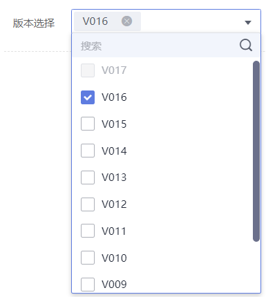
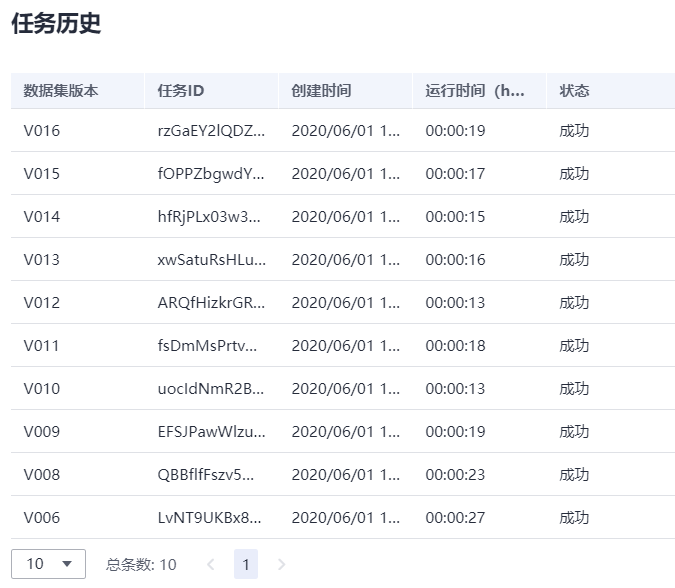

# 数据特征分析

基于图片或目标框对图片的各项特征，如模糊度、亮度进行分析，并绘制可视化曲线，帮助处理数据集。

您还可以选择数据集的多个版本，查看其可视化曲线，进行对比分析。

## 背景信息

-   只有“图片”的数据集，且版本标注类型为“物体检测“和“图像分类“的数据集版本支持数据特征分析。
-   只有发布后的数据集支持数据特征分析。发布后的Default格式数据集版本支持数据特征分析。
-   数据特征分析的数据范围，不同类型的数据集，选取范围不同：
    -   对于标注任务类型为“物体检测”的数据集版本，当已标注样本数为0时，发布版本后，数据特征页签版本置灰不可选，无法显示数据特征。否则，显示已标注的图片的数据特征。
    -   对于标注任务类型为“图像分类”的数据集版本，当已标注样本数为0时，发布版本后，数据特征页签版本置灰不可选，无法显示数据特征。否则，显示全部的图片的数据特征。

-   数据集中的图片数量要达到一定量级才会具有意义，一般来说，需要有大约1000+的图片。
-   “图像分类“支持分析指标有：“分辨率“、“图片高宽比“、“图片亮度“、“图片饱和度“、“清晰度“和“图像色彩的丰富程度“。“物体检测“支持所有的分析指标。目前ModelArts支持的所有分析指标请参见[支持分析指标及其说明](#zh-cn_topic_0197745910_section9138115545716)。

## 数据特征分析

1.  登录ModelArts管理控制台，在左侧菜单栏中选择“数据管理\>数据集“，进入“数据集“管理页面。
2.  选择对应的数据集，单击操作列的“数据特征“，进入数据集概览页的数据特征页面。

    您也可以在单击数据集名称进入数据集概览页后，单击“数据特征“页签进入。

3.  由于发布后的数据集不会默认启动数据特征分析，针对数据集的各个版本，需手动启动特征分析任务。在数据特征页签下，单击“特征分析“。

    **图 1**  选择特征分析  
    

4.  在弹出的对话框中配置需要进行特征分析的数据集版本，然后单击“确定“启动分析。

    “版本选择“，即选择当前数据集的已发布版本。

    **图 2**  启动数据特征分析任务  
    

5.  数据特征分析任务启动后，需执行一段时间，根据数据量不同等待时间不同，请耐心等待。当您选择分析的版本出现在“版本选择“列表下，且可勾选时，即表示分析已完成。

    **图 3**  可选择已执行特征分析的版本  
    

6.  查看数据特征分析结果。

    “版本选择“：在右侧下拉框中选择进行对比的版本。也可以只选择一个版本。

    “类型“：选择需要分析的类型。支持“all“、“train“、“eval“和“inference“。

    “数据特征指标“：在右侧下拉框中勾选需要展示的指标。详细指标说明请参见[支持分析指标及其说明](#zh-cn_topic_0197745910_section9138115545716)。

    选择完成后，页面将自动呈现您选择对应版本及其指标数据，如[图4](#zh-cn_topic_0197745910_fig6831162485710)所示，您可以根据呈现的图表了解数据分布情况，帮助您更好的处理您的数据。

    **图 4**  数据特征分析  
    

7.  查看分析任务的历史记录。

    在数据特征分析后，您可以在“数据特征“页签下，单击右侧“任务历史“，可在弹出对话框中查看历史分析任务及其状态。

    **图 5**  任务历史  
    

## 支持分析指标及其说明

**表 1**  分析指标列表

<table><thead align="left"><tr id="zh-cn_topic_0197745910_row1727515015244"><th class="cellrowborder" valign="top" width="26.46%" id="mcps1.2.4.1.1">
<strong id="zh-cn_topic_0197745910_b166191744347">名称</strong>

</th>
<th class="cellrowborder" valign="top" width="35.13%" id="mcps1.2.4.1.2">
<strong id="zh-cn_topic_0197745910_b2621204419412">说明</strong>

</th>
<th class="cellrowborder" valign="top" width="38.41%" id="mcps1.2.4.1.3">
<strong id="zh-cn_topic_0197745910_b76225448412">分析说明</strong>

</th>
</tr>
</thead>
<tbody><tr id="zh-cn_topic_0197745910_row13276050172418"><td class="cellrowborder" valign="top" width="26.46%" headers="mcps1.2.4.1.1 ">
分辨率

Resolution

</td>
<td class="cellrowborder" valign="top" width="35.13%" headers="mcps1.2.4.1.2 ">
图像分辨率。此处使用面积值作为统计值。

</td>
<td class="cellrowborder" valign="top" width="38.41%" headers="mcps1.2.4.1.3 ">
通过指标分析结果查看是否有偏移点。如果存在偏移点，可以对偏移点做resize操作或直接删除。

</td>
</tr>
<tr id="zh-cn_topic_0197745910_row102761050112413"><td class="cellrowborder" valign="top" width="26.46%" headers="mcps1.2.4.1.1 ">
图片高宽比

Aspect Ratio

</td>
<td class="cellrowborder" valign="top" width="35.13%" headers="mcps1.2.4.1.2 ">
图像高宽比，即图片的高度/图片的宽度。

</td>
<td class="cellrowborder" valign="top" width="38.41%" headers="mcps1.2.4.1.3 ">
一般呈正态分布，一般用于比较训练集和真实场景数据集的差异。

</td>
</tr>
<tr id="zh-cn_topic_0197745910_row827635018242"><td class="cellrowborder" valign="top" width="26.46%" headers="mcps1.2.4.1.1 ">
图片亮度

Brightness

</td>
<td class="cellrowborder" valign="top" width="35.13%" headers="mcps1.2.4.1.2 ">
图片亮度，值越大代表观感上亮度越高。

</td>
<td class="cellrowborder" valign="top" width="38.41%" headers="mcps1.2.4.1.3 ">
一般呈正态分布，可根据分布中心判断数据集整体偏亮还是偏暗。可根据使用场景调整，比如使用场景是夜晚，图片整体应该偏暗。

</td>
</tr>
<tr id="zh-cn_topic_0197745910_row6276750152412"><td class="cellrowborder" valign="top" width="26.46%" headers="mcps1.2.4.1.1 ">
图片饱和度

Saturation

</td>
<td class="cellrowborder" valign="top" width="35.13%" headers="mcps1.2.4.1.2 ">
图片的色彩饱和度，值越大表示图片整体色彩越容易分辨。

</td>
<td class="cellrowborder" valign="top" width="38.41%" headers="mcps1.2.4.1.3 ">
一般呈正态分布，一般用于比较训练集和真实场景数据集的差异。

</td>
</tr>
<tr id="zh-cn_topic_0197745910_row1276165018245"><td class="cellrowborder" valign="top" width="26.46%" headers="mcps1.2.4.1.1 ">
清晰度

Clarity

</td>
<td class="cellrowborder" valign="top" width="35.13%" headers="mcps1.2.4.1.2 ">
图片清晰程度，使用拉普拉斯算子计算所得，值越大代表边缘越清晰，图片整体越清晰。

</td>
<td class="cellrowborder" valign="top" width="38.41%" headers="mcps1.2.4.1.3 ">
可根据使用场景判断清晰度是否满足需要。比如使用场景的数据采集来自高清摄像头，那么清晰度对应的需要高一些。可通过对数据集做锐化或模糊操作，添加噪声对清晰度做调整。

</td>
</tr>
<tr id="zh-cn_topic_0197745910_row1566118516141"><td class="cellrowborder" valign="top" width="26.46%" headers="mcps1.2.4.1.1 ">
图像色彩的丰富程度

Colorfulness

</td>
<td class="cellrowborder" valign="top" width="35.13%" headers="mcps1.2.4.1.2 ">
横坐标：图像的色彩丰富程度，值越大代表色彩越丰富。

纵坐标：图片数量。

</td>
<td class="cellrowborder" valign="top" width="38.41%" headers="mcps1.2.4.1.3 ">
是观感上的色彩丰富程度，一般用于比较训练集和真实场景数据集的差异。

</td>
</tr>
<tr id="zh-cn_topic_0197745910_row15276650132419"><td class="cellrowborder" valign="top" width="26.46%" headers="mcps1.2.4.1.1 ">
按单张图片中框的个数统计图片分布

Bounding Box Quantity

</td>
<td class="cellrowborder" valign="top" width="35.13%" headers="mcps1.2.4.1.2 ">
横坐标：单张图片中框的个数。

纵坐标：图片数量。

</td>
<td class="cellrowborder" valign="top" width="38.41%" headers="mcps1.2.4.1.3 ">
对模型而言一张图片的框个数越多越难检测，需要越多的这种数据用作训练。

</td>
</tr>
<tr id="zh-cn_topic_0197745910_row172764507245"><td class="cellrowborder" valign="top" width="26.46%" headers="mcps1.2.4.1.1 ">
按单张图片中框的面积标准差统计图片分布

Standard Deviation of Bounding Boxes Per Image

</td>
<td class="cellrowborder" valign="top" width="35.13%" headers="mcps1.2.4.1.2 ">
横坐标：单张图片中框的标准差。单张图片只有一个框时，标准差为0。标准差的值越大，表示图片中框大小不一程度越高。

纵坐标：图片数量。

</td>
<td class="cellrowborder" valign="top" width="38.41%" headers="mcps1.2.4.1.3 ">
对模型而言一张图中框如果比较多且大小不一，是比较难检测的，可以根据场景添加数据用作训练，或者实际使用没有这种场景可直接删除。

</td>
</tr>
<tr id="zh-cn_topic_0197745910_row540933516250"><td class="cellrowborder" valign="top" width="26.46%" headers="mcps1.2.4.1.1 ">
按高宽比统计框数量的分布

Aspect Ratio of Bounding Boxes

</td>
<td class="cellrowborder" valign="top" width="35.13%" headers="mcps1.2.4.1.2 ">
横坐标：目标框的高宽比。

纵坐标：框数量（统计所有图片中的框）。

</td>
<td class="cellrowborder" valign="top" width="38.41%" headers="mcps1.2.4.1.3 ">
一般呈泊松分布，但与使用场景强相关。多用于比较训练集和验证集的差异，如训练集都是长方形框的情况下，验证集如果是接近正方形的框会有比较大影响。

</td>
</tr>
<tr id="zh-cn_topic_0197745910_row441010350253"><td class="cellrowborder" valign="top" width="26.46%" headers="mcps1.2.4.1.1 ">
按面积占比统计框数量的分布

Area Ratio of Bounding Boxes

</td>
<td class="cellrowborder" valign="top" width="35.13%" headers="mcps1.2.4.1.2 ">
横坐标：目标框的面积占比，即目标框的面积占整个图片面积的比例，越大表示物体在图片中的占比越大。

纵坐标：框数量（统计所有图片中的框）。

</td>
<td class="cellrowborder" valign="top" width="38.41%" headers="mcps1.2.4.1.3 ">
主要判断模型中使用的anchor的分布，如果目标框普遍较大，anchor就可以选择较大。

</td>
</tr>
<tr id="zh-cn_topic_0197745910_row14410035172515"><td class="cellrowborder" valign="top" width="26.46%" headers="mcps1.2.4.1.1 ">
按边缘化程度统计框数量的分布

Marginalization Value of Bounding Boxes

</td>
<td class="cellrowborder" valign="top" width="35.13%" headers="mcps1.2.4.1.2 ">
横坐标：边缘化程度，即目标框中心点距离图片中心点的距离占图片总距离的比值，值越大表示物体越靠近边缘。

纵坐标：框数量（统计所有图片中的框）。

</td>
<td class="cellrowborder" valign="top" width="38.41%" headers="mcps1.2.4.1.3 ">
一般呈正态分布。用于判断物体是否处于图片边缘，有一些只露出一部分的边缘物体，可根据需要添加数据集或不标注。

</td>
</tr>
<tr id="zh-cn_topic_0197745910_row104103353254"><td class="cellrowborder" valign="top" width="26.46%" headers="mcps1.2.4.1.1 ">
按堆叠度统计框数量的分布

Overlap Score of Bounding Boxes

</td>
<td class="cellrowborder" valign="top" width="35.13%" headers="mcps1.2.4.1.2 ">
横坐标：堆叠度，单个框被其他的框重叠的部分，取值范围为0～1，值越大表示被其他框覆盖的越多。

纵坐标：框数量（统计所有图片中的框）。

</td>
<td class="cellrowborder" valign="top" width="38.41%" headers="mcps1.2.4.1.3 ">
主要用于判断待检测物体的堆叠程度，堆叠物体一般对于检测难度较高，可根据实际使用需要添加数据集或不标注部分物体。

</td>
</tr>
<tr id="zh-cn_topic_0197745910_row1541053572511"><td class="cellrowborder" valign="top" width="26.46%" headers="mcps1.2.4.1.1 ">
按亮度统计框数量的分布

Brightness of Bounding Boxes

</td>
<td class="cellrowborder" valign="top" width="35.13%" headers="mcps1.2.4.1.2 ">
横坐标：目标框的图片亮度，值越大表示越亮。

纵坐标：框数量（统计所有图片中的框）。

</td>
<td class="cellrowborder" valign="top" width="38.41%" headers="mcps1.2.4.1.3 ">
一般呈正态分布。主要用于判断待检测物体的亮度。在一些特殊场景中只有物体的部分亮度较暗，可以看是否满足要求。

</td>
</tr>
<tr id="zh-cn_topic_0197745910_row1941193512258"><td class="cellrowborder" valign="top" width="26.46%" headers="mcps1.2.4.1.1 ">
按清晰度统计框数量的分布

Clarity of Bounding Boxes

</td>
<td class="cellrowborder" valign="top" width="35.13%" headers="mcps1.2.4.1.2 ">
横坐标：目标框的清晰度，值越大表示越清晰。

纵坐标：框数量（统计所有图片中的框）。

</td>
<td class="cellrowborder" valign="top" width="38.41%" headers="mcps1.2.4.1.3 ">
主要用于判断待检测物体是否存在模糊的情况。比如运动中的物体在采集中可能变得模糊，需要重新采集。

</td>
</tr>
</tbody>
</table>

