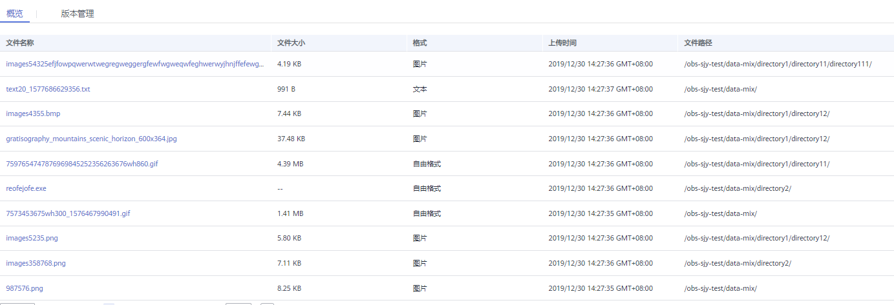
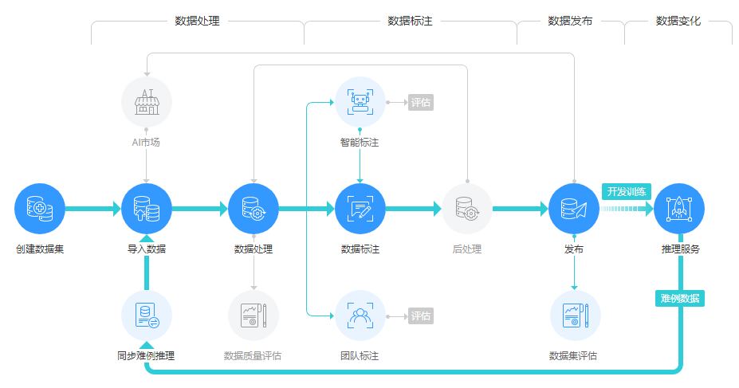

# 数据管理简介

在ModelArts中，您可以在“数据管理“页面，完成数据导入、数据标注等操作，为模型构建做好数据准备。ModelArts以数据集为数据基础，进行模型开发或训练等操作。

## 数据集的类型

当前ModelArts支持如下格式的数据集，包含文件型和表格型。

-   文件型
    -   图片：对图像类数据进行处理，支持 .jpg、.png、.jpeg、.bmp四种图像格式，支持用户进行图像分类、物体检测、图像分割三种类型的标注。
    -   音频：对音频类数据进行处理，支持.wav格式，支持用户进行声音分类、语音内容、语音分割三种类型的标注。
    -   文本：对文本类数据进行处理，支持.txt、.csv格式，支持用户进行文本分类、命名实体、文本三元组三种类型的标注。
    -   视频：对视频类数据进行处理，支持.mp4格式，支持用户进行视频标注。
    -   自由格式：管理的数据可以为任意格式，目前不支持标注，适用于无需标注或开发者自行定义标注的场景。如果您的数据集需存在多种格式数据，或者您的数据格式不符合其他类型数据集时，可选择自由格式的数据集。

        **图 1**  自由格式数据集示例  
        

-   表格型

    表格：适合表格等结构化数据处理。数据格式支持csv。不支持标注，支持对部分表格数据进行预览，但是最多支持100条数据预览。

## 规格限制

-   除图片类型之外的数据集（如视频、文本、音频等），单个样本大小限制：5GB。
-   针对图片类数据集（物体检测、图像分类、图像分割），单个图片大小限制：25MB。
-   单个manifest文件大小限制：5GB。
-   文本文件单行大小限制：100KB。
-   数据管理标注结果文件大小限制：100MB。

## 数据集管理流程及功能简介

**图 2**  标注管理全流程  

**表 1**  功能介绍

<table><thead align="left"><tr id="row180012175219"><th class="cellrowborder" valign="top" width="26.38%" id="mcps1.2.3.1.1">
功能

</th>
<th class="cellrowborder" valign="top" width="73.61999999999999%" id="mcps1.2.3.1.2">
说明

</th>
</tr>
</thead>
<tbody><tr id="row48001117529"><td class="cellrowborder" valign="top" width="26.38%" headers="mcps1.2.3.1.1 ">
<a href="创建数据集.md">创建数据集</a>

</td>
<td class="cellrowborder" valign="top" width="73.61999999999999%" headers="mcps1.2.3.1.2 ">
创建一个新的数据集。

</td>
</tr>
<tr id="row7801151135215"><td class="cellrowborder" valign="top" width="26.38%" headers="mcps1.2.3.1.1 ">
<a href="导入操作简介.md">导入操作</a>

</td>
<td class="cellrowborder" valign="top" width="73.61999999999999%" headers="mcps1.2.3.1.2 ">
将本地Manifest文件或者OBS的数据导入数据集中。

</td>
</tr>
<tr id="row11123189187"><td class="cellrowborder" valign="top" width="26.38%" headers="mcps1.2.3.1.1 ">
<a href="数据管理简介.md">数据标注</a>

</td>
<td class="cellrowborder" valign="top" width="73.61999999999999%" headers="mcps1.2.3.1.2 ">
支持对数据集创建不同类型的数据标注作业，对数据进行标注。

</td>
</tr>
<tr id="row198012018521"><td class="cellrowborder" valign="top" width="26.38%" headers="mcps1.2.3.1.1 ">
<a href="智能标注.md">智能标注</a>

</td>
<td class="cellrowborder" valign="top" width="73.61999999999999%" headers="mcps1.2.3.1.2 ">
支持对未标注的数据快速完成数据标注，为您节省70%以上的标注时间。

</td>
</tr>
<tr id="row38015135213"><td class="cellrowborder" valign="top" width="26.38%" headers="mcps1.2.3.1.1 ">
<a href="自动分组.md">自动分组</a>

</td>
<td class="cellrowborder" valign="top" width="73.61999999999999%" headers="mcps1.2.3.1.2 ">
您可以针对您选中的数据，执行自动分组，提升您的数据标注效率。

</td>
</tr>
<tr id="row1080110195219"><td class="cellrowborder" valign="top" width="26.38%" headers="mcps1.2.3.1.1 ">
<a href="数据特征分析.md">数据特征分析</a>

</td>
<td class="cellrowborder" valign="top" width="73.61999999999999%" headers="mcps1.2.3.1.2 ">
对数据进行特征分析，帮助您了解数据。

</td>
</tr>
<tr id="row6801417526"><td class="cellrowborder" valign="top" width="26.38%" headers="mcps1.2.3.1.1 ">
<a href="一键模型上线.md">一键模型上线</a>

</td>
<td class="cellrowborder" valign="top" width="73.61999999999999%" headers="mcps1.2.3.1.2 ">
将已完成标注的数据，通过一键模型上线，一次性完成训练、导入模型、部署为在线服务的操作。

</td>
</tr>
<tr id="row1780111115528"><td class="cellrowborder" valign="top" width="26.38%" headers="mcps1.2.3.1.1 ">
<a href="团队标注简介.md">团队标注简介</a>

</td>
<td class="cellrowborder" valign="top" width="73.61999999999999%" headers="mcps1.2.3.1.2 ">
支持多人共同完成同一个数据标注作业，且支持标注作业创建者统一管理标注任务。添加团队及其成员，参与到数据集的标注工作。

</td>
</tr>
<tr id="row1280118117527"><td class="cellrowborder" valign="top" width="26.38%" headers="mcps1.2.3.1.1 ">
<a href="数据处理.md">数据处理</a>

</td>
<td class="cellrowborder" valign="top" width="73.61999999999999%" headers="mcps1.2.3.1.2 ">
为了保障数据质量，以免对后续操作（如数据标注、模型训练等）带来负面影响，开发过程通常需要进行数据处理。常见的数据处理类型有：数据校验、数据清洗、数据选择、数据增强。

</td>
</tr>
<tr id="row5390131314914"><td class="cellrowborder" valign="top" width="26.38%" headers="mcps1.2.3.1.1 ">
<a href="导出数据.md">导出数据</a>

</td>
<td class="cellrowborder" valign="top" width="73.61999999999999%" headers="mcps1.2.3.1.2 ">
支持将部分数据导出为新的数据集或者将数据导出至OBS。同时支持对任务历史进行查看和管理。

</td>
</tr>
<tr id="row18150122319920"><td class="cellrowborder" valign="top" width="26.38%" headers="mcps1.2.3.1.1 ">
<a href="修改数据集.md">修改数据集</a>

</td>
<td class="cellrowborder" valign="top" width="73.61999999999999%" headers="mcps1.2.3.1.2 ">
修改数据集的基本信息。如数据集名称、描述或标签等信息。

</td>
</tr>
<tr id="row994610203919"><td class="cellrowborder" valign="top" width="26.38%" headers="mcps1.2.3.1.1 ">
<a href="发布数据集.md">发布数据集</a>

</td>
<td class="cellrowborder" valign="top" width="73.61999999999999%" headers="mcps1.2.3.1.2 ">
将标注后的数据集发布为新版本，以便应用于后续的模型构建。

</td>
</tr>
<tr id="row10653131817914"><td class="cellrowborder" valign="top" width="26.38%" headers="mcps1.2.3.1.1 ">
<a href="管理数据集版本.md">管理数据集版本</a>

</td>
<td class="cellrowborder" valign="top" width="73.61999999999999%" headers="mcps1.2.3.1.2 ">
通过数据集版本查看演进过程。

</td>
</tr>
<tr id="row180119115527"><td class="cellrowborder" valign="top" width="26.38%" headers="mcps1.2.3.1.1 ">
<a href="删除数据集.md">删除数据集</a>

</td>
<td class="cellrowborder" valign="top" width="73.61999999999999%" headers="mcps1.2.3.1.2 ">
删除数据集以释放资源。

</td>
</tr>
</tbody>
</table>

## 不同类型数据集支持的功能列表

其中，不同类型的数据集，支持不同的功能，详细信息请参见[表2](#table475114812297)。

**表 2**  不同类型数据集支持的功能

<table><thead align="left"><tr id="row127514842918"><th class="cellrowborder" valign="top" width="7.720000000000001%" id="mcps1.2.14.1.1">
数据集类型

</th>
<th class="cellrowborder" valign="top" width="7.720000000000001%" id="mcps1.2.14.1.2">
创建数据集

</th>
<th class="cellrowborder" valign="top" width="7.720000000000001%" id="mcps1.2.14.1.3">
导入数据

</th>
<th class="cellrowborder" valign="top" width="7.539999999999999%" id="mcps1.2.14.1.4">
导出数据

</th>
<th class="cellrowborder" valign="top" width="7.920000000000001%" id="mcps1.2.14.1.5">
发布数据集

</th>
<th class="cellrowborder" valign="top" width="7.53%" id="mcps1.2.14.1.6">
修改数据集

</th>
<th class="cellrowborder" valign="top" width="7.75%" id="mcps1.2.14.1.7">
管理版本

</th>
<th class="cellrowborder" valign="top" width="7.5200000000000005%" id="mcps1.2.14.1.8">
数据标注

</th>
<th class="cellrowborder" valign="top" width="7.6899999999999995%" id="mcps1.2.14.1.9">
智能标注

</th>
<th class="cellrowborder" valign="top" width="7.670000000000001%" id="mcps1.2.14.1.10">
团队标注

</th>
<th class="cellrowborder" valign="top" width="7.7700000000000005%" id="mcps1.2.14.1.11">
自动分组

</th>
<th class="cellrowborder" valign="top" width="7.7299999999999995%" id="mcps1.2.14.1.12">
数据特征

</th>
<th class="cellrowborder" valign="top" width="7.720000000000001%" id="mcps1.2.14.1.13">
一键模型上线

</th>
</tr>
</thead>
<tbody><tr id="row1475228202911"><td class="cellrowborder" valign="top" width="7.720000000000001%" headers="mcps1.2.14.1.1 ">
图像

</td>
<td class="cellrowborder" valign="top" width="7.720000000000001%" headers="mcps1.2.14.1.2 ">
支持

</td>
<td class="cellrowborder" valign="top" width="7.720000000000001%" headers="mcps1.2.14.1.3 ">
支持

</td>
<td class="cellrowborder" valign="top" width="7.539999999999999%" headers="mcps1.2.14.1.4 ">
支持

</td>
<td class="cellrowborder" valign="top" width="7.920000000000001%" headers="mcps1.2.14.1.5 ">
支持

</td>
<td class="cellrowborder" valign="top" width="7.53%" headers="mcps1.2.14.1.6 ">
支持

</td>
<td class="cellrowborder" valign="top" width="7.75%" headers="mcps1.2.14.1.7 ">
支持

</td>
<td class="cellrowborder" valign="top" width="7.5200000000000005%" headers="mcps1.2.14.1.8 ">
支持

</td>
<td class="cellrowborder" valign="top" width="7.6899999999999995%" headers="mcps1.2.14.1.9 ">
支持

</td>
<td class="cellrowborder" valign="top" width="7.670000000000001%" headers="mcps1.2.14.1.10 ">
支持

</td>
<td class="cellrowborder" valign="top" width="7.7700000000000005%" headers="mcps1.2.14.1.11 ">
支持

</td>
<td class="cellrowborder" valign="top" width="7.7299999999999995%" headers="mcps1.2.14.1.12 ">
支持

</td>
<td class="cellrowborder" valign="top" width="7.720000000000001%" headers="mcps1.2.14.1.13 ">
支持

</td>
</tr>
<tr id="row18752148112912"><td class="cellrowborder" valign="top" width="7.720000000000001%" headers="mcps1.2.14.1.1 ">
音频

</td>
<td class="cellrowborder" valign="top" width="7.720000000000001%" headers="mcps1.2.14.1.2 ">
支持

</td>
<td class="cellrowborder" valign="top" width="7.720000000000001%" headers="mcps1.2.14.1.3 ">
支持

</td>
<td class="cellrowborder" valign="top" width="7.539999999999999%" headers="mcps1.2.14.1.4 ">
-

</td>
<td class="cellrowborder" valign="top" width="7.920000000000001%" headers="mcps1.2.14.1.5 ">
支持

</td>
<td class="cellrowborder" valign="top" width="7.53%" headers="mcps1.2.14.1.6 ">
支持

</td>
<td class="cellrowborder" valign="top" width="7.75%" headers="mcps1.2.14.1.7 ">
支持

</td>
<td class="cellrowborder" valign="top" width="7.5200000000000005%" headers="mcps1.2.14.1.8 ">
支持

</td>
<td class="cellrowborder" valign="top" width="7.6899999999999995%" headers="mcps1.2.14.1.9 ">
-

</td>
<td class="cellrowborder" valign="top" width="7.670000000000001%" headers="mcps1.2.14.1.10 ">
支持

</td>
<td class="cellrowborder" valign="top" width="7.7700000000000005%" headers="mcps1.2.14.1.11 ">
-

</td>
<td class="cellrowborder" valign="top" width="7.7299999999999995%" headers="mcps1.2.14.1.12 ">
-

</td>
<td class="cellrowborder" valign="top" width="7.720000000000001%" headers="mcps1.2.14.1.13 ">
-

</td>
</tr>
<tr id="row1875215822917"><td class="cellrowborder" valign="top" width="7.720000000000001%" headers="mcps1.2.14.1.1 ">
文本

</td>
<td class="cellrowborder" valign="top" width="7.720000000000001%" headers="mcps1.2.14.1.2 ">
支持

</td>
<td class="cellrowborder" valign="top" width="7.720000000000001%" headers="mcps1.2.14.1.3 ">
支持

</td>
<td class="cellrowborder" valign="top" width="7.539999999999999%" headers="mcps1.2.14.1.4 ">
-

</td>
<td class="cellrowborder" valign="top" width="7.920000000000001%" headers="mcps1.2.14.1.5 ">
支持

</td>
<td class="cellrowborder" valign="top" width="7.53%" headers="mcps1.2.14.1.6 ">
支持

</td>
<td class="cellrowborder" valign="top" width="7.75%" headers="mcps1.2.14.1.7 ">
支持

</td>
<td class="cellrowborder" valign="top" width="7.5200000000000005%" headers="mcps1.2.14.1.8 ">
支持

</td>
<td class="cellrowborder" valign="top" width="7.6899999999999995%" headers="mcps1.2.14.1.9 ">
-

</td>
<td class="cellrowborder" valign="top" width="7.670000000000001%" headers="mcps1.2.14.1.10 ">
支持

</td>
<td class="cellrowborder" valign="top" width="7.7700000000000005%" headers="mcps1.2.14.1.11 ">
-

</td>
<td class="cellrowborder" valign="top" width="7.7299999999999995%" headers="mcps1.2.14.1.12 ">
-

</td>
<td class="cellrowborder" valign="top" width="7.720000000000001%" headers="mcps1.2.14.1.13 ">
-

</td>
</tr>
<tr id="row8752108102919"><td class="cellrowborder" valign="top" width="7.720000000000001%" headers="mcps1.2.14.1.1 ">
视频

</td>
<td class="cellrowborder" valign="top" width="7.720000000000001%" headers="mcps1.2.14.1.2 ">
支持

</td>
<td class="cellrowborder" valign="top" width="7.720000000000001%" headers="mcps1.2.14.1.3 ">
支持

</td>
<td class="cellrowborder" valign="top" width="7.539999999999999%" headers="mcps1.2.14.1.4 ">
-

</td>
<td class="cellrowborder" valign="top" width="7.920000000000001%" headers="mcps1.2.14.1.5 ">
支持

</td>
<td class="cellrowborder" valign="top" width="7.53%" headers="mcps1.2.14.1.6 ">
支持

</td>
<td class="cellrowborder" valign="top" width="7.75%" headers="mcps1.2.14.1.7 ">
支持

</td>
<td class="cellrowborder" valign="top" width="7.5200000000000005%" headers="mcps1.2.14.1.8 ">
支持

</td>
<td class="cellrowborder" valign="top" width="7.6899999999999995%" headers="mcps1.2.14.1.9 ">
-

</td>
<td class="cellrowborder" valign="top" width="7.670000000000001%" headers="mcps1.2.14.1.10 ">
-

</td>
<td class="cellrowborder" valign="top" width="7.7700000000000005%" headers="mcps1.2.14.1.11 ">
-

</td>
<td class="cellrowborder" valign="top" width="7.7299999999999995%" headers="mcps1.2.14.1.12 ">
-

</td>
<td class="cellrowborder" valign="top" width="7.720000000000001%" headers="mcps1.2.14.1.13 ">
-

</td>
</tr>
<tr id="row775310862910"><td class="cellrowborder" valign="top" width="7.720000000000001%" headers="mcps1.2.14.1.1 ">
自由格式

</td>
<td class="cellrowborder" valign="top" width="7.720000000000001%" headers="mcps1.2.14.1.2 ">
支持

</td>
<td class="cellrowborder" valign="top" width="7.720000000000001%" headers="mcps1.2.14.1.3 ">
支持

</td>
<td class="cellrowborder" valign="top" width="7.539999999999999%" headers="mcps1.2.14.1.4 ">
-

</td>
<td class="cellrowborder" valign="top" width="7.920000000000001%" headers="mcps1.2.14.1.5 ">
支持

</td>
<td class="cellrowborder" valign="top" width="7.53%" headers="mcps1.2.14.1.6 ">
支持

</td>
<td class="cellrowborder" valign="top" width="7.75%" headers="mcps1.2.14.1.7 ">
支持

</td>
<td class="cellrowborder" valign="top" width="7.5200000000000005%" headers="mcps1.2.14.1.8 ">
-

</td>
<td class="cellrowborder" valign="top" width="7.6899999999999995%" headers="mcps1.2.14.1.9 ">
-

</td>
<td class="cellrowborder" valign="top" width="7.670000000000001%" headers="mcps1.2.14.1.10 ">
-

</td>
<td class="cellrowborder" valign="top" width="7.7700000000000005%" headers="mcps1.2.14.1.11 ">
-

</td>
<td class="cellrowborder" valign="top" width="7.7299999999999995%" headers="mcps1.2.14.1.12 ">
-

</td>
<td class="cellrowborder" valign="top" width="7.720000000000001%" headers="mcps1.2.14.1.13 ">
-

</td>
</tr>
<tr id="row137538862910"><td class="cellrowborder" valign="top" width="7.720000000000001%" headers="mcps1.2.14.1.1 ">
表格

</td>
<td class="cellrowborder" valign="top" width="7.720000000000001%" headers="mcps1.2.14.1.2 ">
支持

</td>
<td class="cellrowborder" valign="top" width="7.720000000000001%" headers="mcps1.2.14.1.3 ">
支持

</td>
<td class="cellrowborder" valign="top" width="7.539999999999999%" headers="mcps1.2.14.1.4 ">
-

</td>
<td class="cellrowborder" valign="top" width="7.920000000000001%" headers="mcps1.2.14.1.5 ">
支持

</td>
<td class="cellrowborder" valign="top" width="7.53%" headers="mcps1.2.14.1.6 ">
支持

</td>
<td class="cellrowborder" valign="top" width="7.75%" headers="mcps1.2.14.1.7 ">
支持

</td>
<td class="cellrowborder" valign="top" width="7.5200000000000005%" headers="mcps1.2.14.1.8 ">
-

</td>
<td class="cellrowborder" valign="top" width="7.6899999999999995%" headers="mcps1.2.14.1.9 ">
-

</td>
<td class="cellrowborder" valign="top" width="7.670000000000001%" headers="mcps1.2.14.1.10 ">
-

</td>
<td class="cellrowborder" valign="top" width="7.7700000000000005%" headers="mcps1.2.14.1.11 ">
-

</td>
<td class="cellrowborder" valign="top" width="7.7299999999999995%" headers="mcps1.2.14.1.12 ">
-

</td>
<td class="cellrowborder" valign="top" width="7.720000000000001%" headers="mcps1.2.14.1.13 ">
-

</td>
</tr>
</tbody>
</table>

