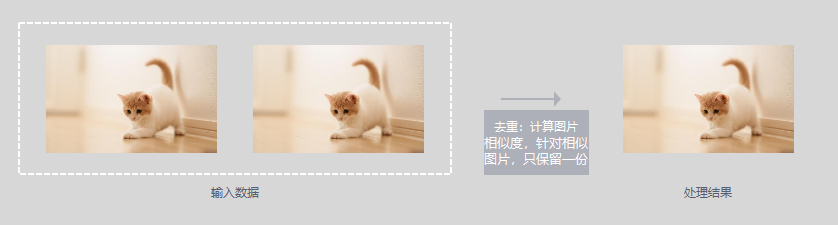
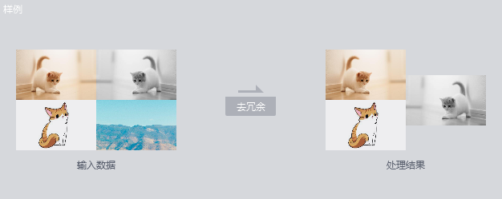

# 数据选择<a name="modelarts_23_0319"></a>

## 数据选择算子概述<a name="zh-cn_topic_0262111317_section545825234111"></a>

ModelArts提供以下数据选择算子：

-   SimDeduplication：可以依据用户设置的相似程度阈值完成图像去重处理。图像去重是图像数据处理常见的数据处理方法。图像重复指图像内容完全一样，或者有少量的尺度、位移、色彩、亮度变化，或者是添加了少量其他内容等。

    **图 1**  SimDeduplication效果图<a name="zh-cn_topic_0262111317_fig141057521594"></a>  
    

    **表 1**  高级参数说明

    <a name="zh-cn_topic_0262111317_table37212291488"></a>
    <table><thead align="left"><tr id="zh-cn_topic_0262111317_row1071172913810"><th class="cellrowborder" valign="top" width="21.207879212078794%" id="mcps1.2.5.1.1"><p id="zh-cn_topic_0262111317_p1714292815"><a name="zh-cn_topic_0262111317_p1714292815"></a><a name="zh-cn_topic_0262111317_p1714292815"></a>参数名</p>
    </th>
    <th class="cellrowborder" valign="top" width="8.879112088791121%" id="mcps1.2.5.1.2"><p id="zh-cn_topic_0262111317_p107113291485"><a name="zh-cn_topic_0262111317_p107113291485"></a><a name="zh-cn_topic_0262111317_p107113291485"></a>是否必选</p>
    </th>
    <th class="cellrowborder" valign="top" width="10.998900109989002%" id="mcps1.2.5.1.3"><p id="zh-cn_topic_0262111317_p67112291288"><a name="zh-cn_topic_0262111317_p67112291288"></a><a name="zh-cn_topic_0262111317_p67112291288"></a>默认值</p>
    </th>
    <th class="cellrowborder" valign="top" width="58.91410858914108%" id="mcps1.2.5.1.4"><p id="zh-cn_topic_0262111317_p20716292810"><a name="zh-cn_topic_0262111317_p20716292810"></a><a name="zh-cn_topic_0262111317_p20716292810"></a>参数说明</p>
    </th>
    </tr>
    </thead>
    <tbody><tr id="zh-cn_topic_0262111317_row47110290812"><td class="cellrowborder" valign="top" width="21.207879212078794%" headers="mcps1.2.5.1.1 "><p id="zh-cn_topic_0262111317_p137113291484"><a name="zh-cn_topic_0262111317_p137113291484"></a><a name="zh-cn_topic_0262111317_p137113291484"></a>simlarity_threshold</p>
    </td>
    <td class="cellrowborder" valign="top" width="8.879112088791121%" headers="mcps1.2.5.1.2 "><p id="zh-cn_topic_0262111317_p171142918810"><a name="zh-cn_topic_0262111317_p171142918810"></a><a name="zh-cn_topic_0262111317_p171142918810"></a>否</p>
    </td>
    <td class="cellrowborder" valign="top" width="10.998900109989002%" headers="mcps1.2.5.1.3 "><p id="zh-cn_topic_0262111317_p177112292818"><a name="zh-cn_topic_0262111317_p177112292818"></a><a name="zh-cn_topic_0262111317_p177112292818"></a>0.9</p>
    </td>
    <td class="cellrowborder" valign="top" width="58.91410858914108%" headers="mcps1.2.5.1.4 "><p id="zh-cn_topic_0262111317_p57113291684"><a name="zh-cn_topic_0262111317_p57113291684"></a><a name="zh-cn_topic_0262111317_p57113291684"></a>相似程度阈值，两张图片间的相似度大于阈值时，其中一张会作为重复图片被过滤掉。取值范围为0~1。</p>
    </td>
    </tr>
    <tr id="zh-cn_topic_0262111317_row77216293819"><td class="cellrowborder" valign="top" width="21.207879212078794%" headers="mcps1.2.5.1.1 "><p id="zh-cn_topic_0262111317_p1711929485"><a name="zh-cn_topic_0262111317_p1711929485"></a><a name="zh-cn_topic_0262111317_p1711929485"></a>do_validation</p>
    </td>
    <td class="cellrowborder" valign="top" width="8.879112088791121%" headers="mcps1.2.5.1.2 "><p id="zh-cn_topic_0262111317_p1571132915812"><a name="zh-cn_topic_0262111317_p1571132915812"></a><a name="zh-cn_topic_0262111317_p1571132915812"></a>否</p>
    </td>
    <td class="cellrowborder" valign="top" width="10.998900109989002%" headers="mcps1.2.5.1.3 "><p id="zh-cn_topic_0262111317_p471132916811"><a name="zh-cn_topic_0262111317_p471132916811"></a><a name="zh-cn_topic_0262111317_p471132916811"></a>True</p>
    </td>
    <td class="cellrowborder" valign="top" width="58.91410858914108%" headers="mcps1.2.5.1.4 "><p id="zh-cn_topic_0262111317_p12710292813"><a name="zh-cn_topic_0262111317_p12710292813"></a><a name="zh-cn_topic_0262111317_p12710292813"></a>是否做数据校验，可填True或者False。表示数据去重前需要做数据校验，否则只做数据去重。</p>
    </td>
    </tr>
    </tbody>
    </table>

-   RRD：可以依据用户设置的比例去除差异最大的数据。

    **图 2**  RRD效果图<a name="zh-cn_topic_0262111317_fig12484151181020"></a>  
    

    **表 2**  高级参数说明

    <a name="zh-cn_topic_0262111317_table9901181815119"></a>
    <table><thead align="left"><tr id="zh-cn_topic_0262111317_row18902118121114"><th class="cellrowborder" valign="top" width="16.400000000000002%" id="mcps1.2.5.1.1"><p id="zh-cn_topic_0262111317_p2408105171318"><a name="zh-cn_topic_0262111317_p2408105171318"></a><a name="zh-cn_topic_0262111317_p2408105171318"></a>参数名</p>
    </th>
    <th class="cellrowborder" valign="top" width="10.48%" id="mcps1.2.5.1.2"><p id="zh-cn_topic_0262111317_p2408951161319"><a name="zh-cn_topic_0262111317_p2408951161319"></a><a name="zh-cn_topic_0262111317_p2408951161319"></a>是否必选</p>
    </th>
    <th class="cellrowborder" valign="top" width="12.7%" id="mcps1.2.5.1.3"><p id="zh-cn_topic_0262111317_p54080515133"><a name="zh-cn_topic_0262111317_p54080515133"></a><a name="zh-cn_topic_0262111317_p54080515133"></a>默认值</p>
    </th>
    <th class="cellrowborder" valign="top" width="60.419999999999995%" id="mcps1.2.5.1.4"><p id="zh-cn_topic_0262111317_p640875131319"><a name="zh-cn_topic_0262111317_p640875131319"></a><a name="zh-cn_topic_0262111317_p640875131319"></a>参数说明</p>
    </th>
    </tr>
    </thead>
    <tbody><tr id="zh-cn_topic_0262111317_row1490241851111"><td class="cellrowborder" valign="top" width="16.400000000000002%" headers="mcps1.2.5.1.1 "><p id="zh-cn_topic_0262111317_p1969913710152"><a name="zh-cn_topic_0262111317_p1969913710152"></a><a name="zh-cn_topic_0262111317_p1969913710152"></a>sample_ratio</p>
    </td>
    <td class="cellrowborder" valign="top" width="10.48%" headers="mcps1.2.5.1.2 "><p id="zh-cn_topic_0262111317_p640825111317"><a name="zh-cn_topic_0262111317_p640825111317"></a><a name="zh-cn_topic_0262111317_p640825111317"></a>否</p>
    </td>
    <td class="cellrowborder" valign="top" width="12.7%" headers="mcps1.2.5.1.3 "><p id="zh-cn_topic_0262111317_p14408185141312"><a name="zh-cn_topic_0262111317_p14408185141312"></a><a name="zh-cn_topic_0262111317_p14408185141312"></a>0.9</p>
    </td>
    <td class="cellrowborder" valign="top" width="60.419999999999995%" headers="mcps1.2.5.1.4 "><p id="zh-cn_topic_0262111317_p134081951171310"><a name="zh-cn_topic_0262111317_p134081951171310"></a><a name="zh-cn_topic_0262111317_p134081951171310"></a>数据留下的百分比。取值范围为0~1。例如0.9表示保留百分之90的原数据。</p>
    </td>
    </tr>
    <tr id="zh-cn_topic_0262111317_row37101415191613"><td class="cellrowborder" valign="top" width="16.400000000000002%" headers="mcps1.2.5.1.1 "><p id="zh-cn_topic_0262111317_p671061571617"><a name="zh-cn_topic_0262111317_p671061571617"></a><a name="zh-cn_topic_0262111317_p671061571617"></a>n_clusters</p>
    </td>
    <td class="cellrowborder" valign="top" width="10.48%" headers="mcps1.2.5.1.2 "><p id="zh-cn_topic_0262111317_p16710101591610"><a name="zh-cn_topic_0262111317_p16710101591610"></a><a name="zh-cn_topic_0262111317_p16710101591610"></a>auto</p>
    </td>
    <td class="cellrowborder" valign="top" width="12.7%" headers="mcps1.2.5.1.3 "><p id="zh-cn_topic_0262111317_p1471041513166"><a name="zh-cn_topic_0262111317_p1471041513166"></a><a name="zh-cn_topic_0262111317_p1471041513166"></a>auto</p>
    </td>
    <td class="cellrowborder" valign="top" width="60.419999999999995%" headers="mcps1.2.5.1.4 "><p id="zh-cn_topic_0262111317_p071018152162"><a name="zh-cn_topic_0262111317_p071018152162"></a><a name="zh-cn_topic_0262111317_p071018152162"></a>数据样本的种类数，默认为auto，即按照目录中图片个数取类别总数，可指定具体类别数，如 4</p>
    </td>
    </tr>
    <tr id="zh-cn_topic_0262111317_row1090216183118"><td class="cellrowborder" valign="top" width="16.400000000000002%" headers="mcps1.2.5.1.1 "><p id="zh-cn_topic_0262111317_p4408551151319"><a name="zh-cn_topic_0262111317_p4408551151319"></a><a name="zh-cn_topic_0262111317_p4408551151319"></a>do_validation</p>
    </td>
    <td class="cellrowborder" valign="top" width="10.48%" headers="mcps1.2.5.1.2 "><p id="zh-cn_topic_0262111317_p44082510139"><a name="zh-cn_topic_0262111317_p44082510139"></a><a name="zh-cn_topic_0262111317_p44082510139"></a>否</p>
    </td>
    <td class="cellrowborder" valign="top" width="12.7%" headers="mcps1.2.5.1.3 "><p id="zh-cn_topic_0262111317_p540820517138"><a name="zh-cn_topic_0262111317_p540820517138"></a><a name="zh-cn_topic_0262111317_p540820517138"></a>True</p>
    </td>
    <td class="cellrowborder" valign="top" width="60.419999999999995%" headers="mcps1.2.5.1.4 "><p id="zh-cn_topic_0262111317_p74081051191312"><a name="zh-cn_topic_0262111317_p74081051191312"></a><a name="zh-cn_topic_0262111317_p74081051191312"></a>是否做数据校验，可填True或者False。表示数据去冗余前需要做数据校验，否则只做数据去重。</p>
    </td>
    </tr>
    </tbody>
    </table>


## 输入要求<a name="zh-cn_topic_0262111317_section1182518553429"></a>

算子输入分为两种，“数据集“或“OBS目录“。

-   选择“数据集“，请从下拉框中选择ModelArts中管理的数据集及其版本。要求数据集类型与您在本任务中选择的场景类别一致。
-   选择“OBS目录“，存放结构又分两种情况，“仅包含图片“或“包含图片和标注信息“。
    -   “仅包含图片“：当目录下全是图片时，支持jpg、jpeg、png、bmp格式，嵌套子目录的图片也将全部读入。
    -   “包含图片和标注信息“：根据不同数据类型，结构不同。

        图像分类，其目录结构如下所示。如下目录结构，仅支持单标签场景。

        ```
        input_path/
            --label1/
                ----1.jpg
            --label2/
                ----2.jpg
            --../
        ```

        物体检测，其目录结构如下所示。支持jpg、jpeg、png、bmp格式的图片，xml为标准的PACAL VOC格式标注文件。

        ```
        input_path/
            --1.jpg
            --1.xml
            --2.jpg
            --2.xml
            ...
        ```


## 输出说明<a name="zh-cn_topic_0262111317_section885518434215"></a>

-   **图像分类**

    输出数据的目录结构如下所示。

    ```
    output_path/
        --Data/
            ----class1/  # 若输入数据有标注信息会一并输出，class1为标注类别
                ------1.jpg
            ----class2/
                ------2.jpg
                ------3.jpg
        --output.manifest
    ```

    其中manifest文件内容示例如下所示。

    ```
    {
    	"id": "xss", 
    	"source": "obs://home/fc8e2688015d4a1784dcbda44d840307_14.jpg",
    	"usage": "train", 
    	"annotation": [
    		{
    			"name": "Cat", 
    			"type": "modelarts/image_classification"
    		}
    	]
    }
    ```


-   **物体检测**

    输出数据的目录结构如下所示。

    ```
    output_path/
        --Data/
            ----1.jpg
            ----1.xml  # 若输入数据有标注信息会一并输出，xml为标注文件
            ----2.jpg
            ----3.jpg
        --output.manifest
    ```

    其中manifest文件内容示例如下所示。

    ```
    {
    	"source":"obs://fake/be462ea9c5abc09f.jpg",
    	"annotation":[
    		{
    			"annotation-loc":"obs://fake/be462ea9c5abc09f.xml",
    			"type":"modelarts/object_detection",
    			"annotation-format":"PASCAL VOC",
    			"annotated-by":"modelarts/hard_example_algo"
    			}
    	]
    }
    ```


