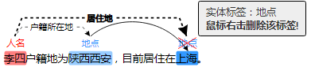
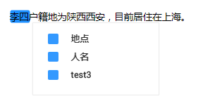
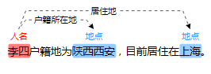
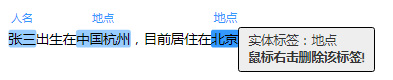

# 文本三元组

三元组标注适用于标注出语句当中形如（主语/Subject，谓词/Predicate，宾语/Object）结构化知识的场景，标注时不但可以标注出语句当中的实体，还可以标注出实体之间的关系，其在依存句法分析、信息抽取等自然语言处理任务中经常用到。

文本三元组类型的数据标注，需要关注两种标签，“实体标签“和“关系标签“。“关系标签“需设置对应的“起始实体“和“结束实体“。

-   支持设置多个“实体标签“和“关系标签“。一个文本数据中，也可以标注多个“实体标签“和“关系标签“
-   创建数据集时定义的“实体标签“，不支持删除。

## 注意事项

在开始标注之前，需确保数据集对应的“实体标签“和“关系标签“已定义好。“关系标签“需设置对应的“起始实体“和“结束实体“。“关系标签“只能添加至其设置好的“起始实体“和“结束实体“之间。

例如，如[图1](#fig7817507378)所示，当两个文本都被标注为“地点“，那么针对这两个实体，无法添加本示例中的任意一个关系标签。当无法添加某个关系标签时，界面将显示一个红色的叉号，如[图2](#fig1336110468410)所示。

**图 1**  实体标签和关系标签的示例  

**图 2**  无法添加关系标签  

## 进入数据集详情页

1.  登录ModelArts管理控制台，在左侧菜单栏中选择“数据管理（Beta） \> 数据集“，进入“数据集“管理页面。
2.  在数据集列表中，基于“标注类型“选择需要进行标注的数据集，单击数据集名称进入数据集概览页。

    此操作默认进入数据集当前版本的概览页，如果需要对其他版本进行数据标注，请先在“版本管理“操作中，将需要进行数据标注的版本设置为“当前版本。“详细操作指导请参见[管理数据集版本](管理数据集版本.md)。

3.  在数据集概览页中，单击右上角“开始标注“，进入数据集详情页。数据集详情页默认展示此数据集下全部数据。

## 标注文本

数据集详情页中，展示了此数据集中“未标注“和“已标注“的文本，默认显示“未标注“的文本列表。

1.  在“未标注“页签文本列表中，页面左侧罗列“标注对象列表“。在列表中单击需标注的文本对象，选中相应文本内容，在页面呈现的实体类型列表中选择实体名称，完成实体标注。

    **图 3**  实体标注  
    

2.  在完成多个实体标注后，鼠标左键依次单击起始实体和终止实体，在呈现的关系类型列表中选择一个对应的关系类型，完成关系标注。

    **图 4**  关系标注  
    

3.  当所有的标注对象都已完成标注，单击页面下方“保存当前页“完成“未标注“列表的文本标注。

> **说明：**   
>“文本三元组”类型的数据集，不支持在标注页面修改标签，需要进入“修改数据集“页面，修改“实体标签“和“关系标签“。  

## 修改标注

当数据完成标注后，您还可以进入已标注页签，对已标注的数据进行修改。

在数据集详情页，单击“已标注“页签，在左侧文本列表中选中一行文本，右侧区域显示具体的标注信息。将鼠标移动至对应的实体标签或关系类型，单击鼠标右键，可删除此标注。单击鼠标左键，依次想验证起始实体和终止实体，可增加关系类型，增加关系标注。

**图 5**  在文本中修改标签  

您也可以在单击页面下方的“删除当前项标签“按钮，删除选中文本对象中的所有标签。

**图 6**  删除当前项标签  

## 添加文件

除了数据集输入位置自动同步的数据外，您还可以在ModelArts界面中，直接添加文件，用于数据标注。

1.  在数据集详情页面，单击“未标注“页签，然后单击左上角“添加文件“。
2.  在弹出的“添加文件“对话框中，选择上传文件。

    选择本地环境中需要上传的文件，可以一次性选择多个文件。文件格式只支持“txt“或“csv“，且一次上传文件的总大小不能超过8MB。

    **图 7**  添加图片  
    

3.  在添加文件对话框中，单击“上传文件“，完成添加文件的操作。您添加的文件内容将自动呈现在“未标注“的“标注对象列表“中。

## 删除文件

通过数据删除操作，可将需要丢弃的文件数据快速删除。

-   在“未标注“页面中，单击选中需要删除的文本，然后单击左上角“删除“，即可完成文本的删除操作。
-   在“已标注“页面中，选中待删除的文本，然后单击“删除“，删除单个文本。或者选择“勾选当前页“选中该页面所有文本，然后单击左上角“删除“，即可完成当前页所有文本的删除操作。

其中，被选中的文本，其背景将显示为蓝色。如果当前页面无选中文本时，“删除“按钮为灰色，无法执行删除操作。

