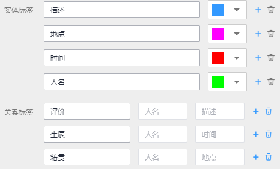

# 文本三元组

三元组标注适用于标注出语句当中形如（主语/Subject，谓词/Predicate，宾语/Object）结构化知识的场景，标注时不但可以标注出语句当中的实体，还可以标注出实体之间的关系，其在依存句法分析、信息抽取等自然语言处理任务中经常用到。

文本三元组类型的数据标注，需要关注两种标签，“实体标签“和“关系标签“。“关系标签“需设置对应的“起始实体“和“终止实体“。

-   支持设置多个“实体标签“和“关系标签“。一个文本数据中，也可以标注多个“实体标签“和“关系标签“
-   创建数据集时定义的“实体标签“，不支持删除。

## 注意事项

在开始标注之前，需确保标注作业对应的“实体标签“和“关系标签“已定义好。“关系标签“需设置对应的“起始实体“和“终止实体“。“关系标签“只能添加至其设置好的“起始实体“和“终止实体“之间。

例如，如[图1](#fig7817507378)所示，当两个文本都被标注为“地点“，那么针对这两个实体，无法添加本示例中的任意一个关系标签。当无法添加某个关系标签时，界面将显示一个红色的叉号，如[图2](#fig1336110468410)所示。

**图 1**  实体标签和关系标签的示例  

**图 2**  无法添加关系标签  

## 开始标注

1.  登录ModelArts管理控制台，在左侧菜单栏中选择“数据管理\> 数据标注“，进入“数据标注“管理页面。
2.  在数据集列表中，基于“标注类型“选择需要进行标注的数据集，单击标注作业名称进入标注作业标注详情页。
3.  在标注作业标注详情中，展示此标注作业下全部数据。

## 同步新数据

ModelArts会自动将数据集中新增的数据同步至标注作业，包含数据及当前标注作业支持的标注信息。

为了快速获取数据集中最新数据，可在标注作业详情页的“未标注“页签中，单击“同步新数据“，快速将数据集中的数据添加到标注作业中。

## 标注文本

标注作业详情页中，展示了此标注作业中“未标注“和“已标注“的文本，默认显示“未标注“的文本列表。

1.  在“未标注“页签文本列表中，页面左侧罗列“标注对象列表“。在列表中单击需标注的文本对象，选中相应文本内容，在页面呈现的实体类型列表中选择实体名称，完成实体标注。

    **图 3**  实体标注  
    

2.  在完成多个实体标注后，鼠标左键依次单击起始实体和终止实体，在呈现的关系类型列表中选择一个对应的关系类型，完成关系标注。

    **图 4**  关系标注  
    

3.  当所有的标注对象都已完成标注，单击页面下方“保存当前页“完成“未标注“列表的文本标注。

> **说明：** 
>“文本三元组”类型的数据集，不支持在标注页面修改标签，需要进入“标签管理“页面，修改“实体标签“和“关系标签“。

## 修改标注

当数据完成标注后，您还可以进入已标注页签，对已标注的数据进行修改。

在标注作业详情页，单击“已标注“页签，在左侧文本列表中选中一行文本，右侧区域显示具体的标注信息。将鼠标移动至对应的实体标签或关系类型，单击鼠标右键，可删除此标注。单击鼠标左键，依次单击连接起始实体和终止实体，可增加关系类型，增加关系标注。

**图 5**  在文本中修改标签  

您也可以在单击页面下方的“删除当前项标签“按钮，删除选中文本对象中的所有标签。

**图 6**  删除当前项标签  

## 添加文件

除了同步新数据外，您还可以在标注详情页面中，直接添加数据，用于数据标注。

1.  在标注作业详情页面，单击“未标注“页签，然后单击左上角“添加数据“。
2.  在弹出的导入对话框中，选择数据来源、导入方式、导入路径等参数，导入数据。单击确定。

    导入数据的详细操作介绍请参见[导入操作简介](导入操作简介.md)。

    **图 7**  导入数据  
    

## 删除文件

通过数据删除操作，可将需要丢弃的文件数据快速删除。

-   在“未标注“页面中，单击选中需要删除的文本，然后单击左上角“删除“，即可完成文本的删除操作。
-   在“已标注“页面中，选中待删除的文本，然后单击“删除“，删除单个文本。或者勾选“选择当前页“选中该页面所有文本，然后单击左上角“删除“，即可完成当前页所有文本的删除操作。

其中，被选中的文本，其背景将显示为蓝色。如果当前页面无选中文本时，“删除“按钮为灰色，无法执行删除操作。

