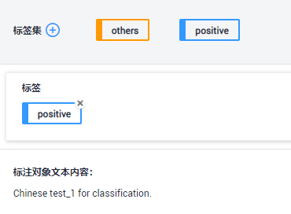
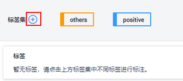
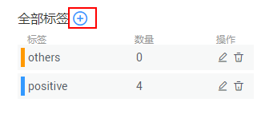
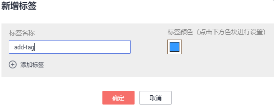
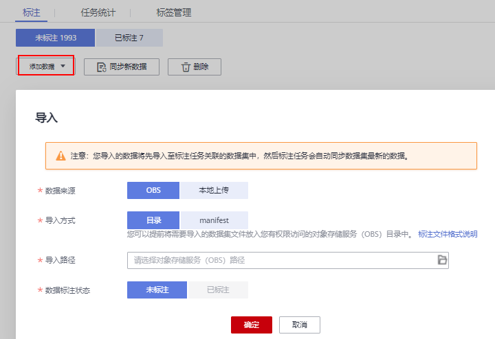

# 文本分类

由于模型训练过程需要大量有标签的数据，因此在模型训练之前需对没有标签的文本添加标签。您也可以对已标注文本进行修改、删除和重新标注。

针对文本分类场景，是对文本的内容按照标签进行分类处理，开始标注前，您需要了解：

-   文本标注支持多标签，即一个标注对象可添加多个标签。
-   标签名是由中文、大小写字母、数字、中划线或下划线组成，且不超过32位的字符串。

## 开始标注

1.  登录ModelArts管理控制台，在左侧菜单栏中选择“数据管理\> 数据标注“，进入“数据标注“管理页面。
2.  在数据集列表中，基于“标注类型“选择需要进行标注的数据集，单击标注作业名称进入标注作业标注详情页。
3.  在标注作业标注详情中，展示此标注作业下全部数据。

## 同步新数据

ModelArts会自动将数据集中新增的数据同步至标注作业，包含数据及当前标注作业支持的标注信息。

为了快速获取数据集中最新数据，可在标注作业详情页的“未标注“页签中，单击“同步新数据“，快速将数据集中的数据添加到标注作业中。

## 标注文本

标注作业详情页中，展示了此标注作业中“未标注“和“已标注“的文本，默认显示“未标注“的文本列表。

1.  在“未标注“页签文本列表中，页面左侧罗列“标注对象列表“。在列表中单击需标注的文本对象，选择右侧“标签集“中的标签进行标注。一个标注对象可添加多个标签。

    以此类推，不断选中标注对象，并为其添加标签。

    **图 1**  文本分类标注  
    

2.  当所有的标注对象都已完成标注，单击页面下方“保存当前页“，完成“未标注“列表的文本标注。

## 添加标签

-   在“未标注“页签添加：单击页面中标签集右侧的加号，然后在弹出的“新增标签“页中，添加标签名称，选择标签颜色，单击“确定“完成标签的新增。

    **图 2**  添加标签（1）  
    

-   在“已标注“页签添加：在右侧单击页面中全部标签加号，然后在弹出的“新增标签“页中，添加标签名称，选择标签颜色，单击“确定“完成标签的新增。

    **图 3**  添加标签（2）  
    

    **图 4**  新增标签  
    

## 查看已标注文本

在标注作业详情页，单击“已标注“页签，您可以查看已完成标注的文本列表。您也可以在右侧的“全部标签“中了解当前标注作业支持的所有标签信息。

## 修改标注

当数据完成标注后，您还可以进入已标注页签，对已标注的数据进行修改。

-   **基于文本修改**

    在标注作业详情页，单击“已标注“页签，然后在文本列表中选中待修改的文本。

    在文本列表中，单击文本，当文本背景变为蓝色时，表示已选择。当文本有多个标签时，可以单击文本标签上方的删除单个标签。

-   **基于标签修改**

    在标注作业详情页，单击“已标注“页签，在图片列表右侧，显示全部标签的信息。

    -   批量修改：在“全部标签“区域中，单击操作列的编辑图标，然后在文本框中修改标签名称，选择标签颜色，单击“确定“完成修改。
    -   批量删除：在“全部标签“区域中，单击操作列的删除图标，在弹出对话框中，可选择“仅删除标签“或“删除标签及仅包含此标签的标注对象“，然后单击“确定“。

## 添加文件

除了同步新数据外，您还可以在标注详情页面中，直接添加数据，用于数据标注。

1.  在标注作业详情页面，单击“未标注“页签，然后单击左上角“添加数据“。
2.  在弹出的导入对话框中，选择数据来源、导入方式、导入路径等参数，导入数据。单击确定。

    导入数据的详细操作介绍请参见[导入操作简介](导入操作简介.md)。

    **图 5**  导入数据  
    

## 删除文件

通过数据删除操作，可将需要丢弃的文件数据快速删除。

-   在“未标注“页面中，单击选中需要删除的文本对象，然后单击左上角“删除“，即可完成文本的删除操作。
-   在“已标注“页面中，选中待删除的文本对象，然后单击“删除“，删除单个文本。或者选择“选择当前页“选中该页面所有文本，然后单击左上角“删除“，即可完成当前页所有文本的删除操作。

其中，被选中的文本，其背景将显示为蓝色。

