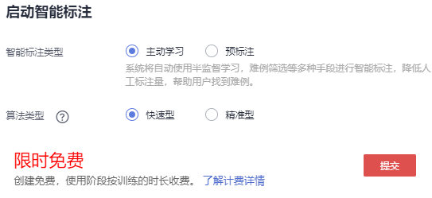
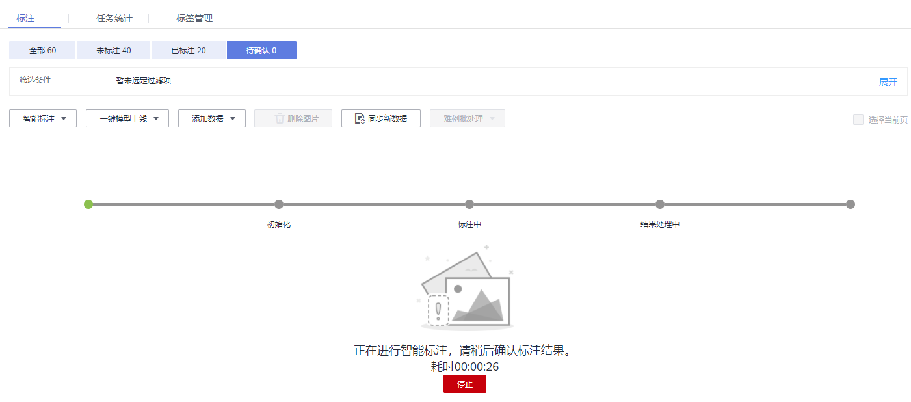
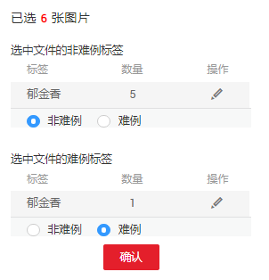
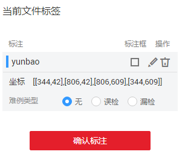

# 智能标注

除了人工标注外，ModelArts还提供了智能标注功能，快速完成数据标注，为您节省70%以上的标注时间。智能标注是指基于当前标注阶段的标签及图片学习训练，选中系统中已有的模型进行智能标注，快速完成剩余图片的标注操作。

## 背景信息

-   目前只有“图像分类”和“物体检测”类型的数据集支持智能标注功能。
-   启动智能标注时，需数据集存在至少2种标签，且每种标签已标注的图片不少于5张。
-   启动智能标注时，必须存在未标注图片。
-   启动智能标注前，保证当前系统中不存在正在进行中的智能标注任务。

## 智能标注

1.  登录ModelArts管理控制台，在左侧菜单栏中选择“数据管理（Beta） \> 数据集“，进入“数据集“管理页面。
2.  在数据集列表中，选择“物体检测”或“图像分类”类型的数据集，单击数据集名称进入“数据集概览页“。
3.  在“数据集概览页“，单击右上角“开始标注“，进入数据集详情页。
4.  在数据集详情页，单击“待确认“页签，然后单击“启动智能标注“。
5.  在弹出的“启动智能标注“对话框中，选择智能标注类型，然后单击“提交“。

    -   “智能标注类型“：“主动学习“或“预标注“。“主动学习“表示系统将自动使用半监督学习，难例筛选等多种手段进行智能标注，降低人工标注量，帮助用户找到难例。“预标注“表示选择用户模型管理里面的模型，选择模型时需要注意模型类型和数据集的标注类型相匹配。

        > **说明：**   
        >针对“物体检测”类型的数据集，选择“主动学习“时，只支持识别和标注矩形框。且不需设置“算法类型“。  

    -   “算法类型“：选择“主动学习“标注类型时才需指定算法类型，“快速型“或“精准型“。“快速型“仅使用已标注的样本进行训练；“精准型“会额外使用未标注的样本做半监督训练，使得模型精度更高。
    -   “选择智能标注模型“：选择“预标注“标注类型时才需指定。从当前账号管理的模型列表中选择一个匹配的模型，用于智能标注。

    **图 1**  启动智能标注（图像分类）  
    

    **图 2**  启动智能标注（物体检测）  
    

    启动智能标注后，界面显示标注进度。

    **图 3**  标注进度  
    

6.  智能标注完成后，“待确认“页面将呈现所有标注后的图片列表。
    -   图像分类数据集

        勾选需要确认的图片，在右侧展示此图片的“标签“和“难例标签“（“难例“或“非难例“），您可以根据实际情况判断，修正标签，然后单击“确认“完成智能标注结果的确认。

        确认完成后的图片将被归类至“已标注“页面下。

        **图 4**  确认智能标注结果（图像分类）  
        

    -   物体检测数据集

        在需确认图片右下角，单击进入确认页面，在右侧展示此图片的“标注“、“标注框“和“难例类型“（“无“、“误检“或“漏检“），您可以根据实际情况判断，修正标注，然后单击“确认标注“完成智能标注结果的确认。

        确认完成后的图片将被归类至“已标注“页面下。

        **图 5**  确认智能标注结果  
        

