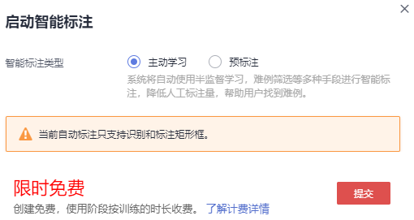

# 智能标注

除了人工标注外，ModelArts还提供了智能标注功能，快速完成数据标注，为您节省70%以上的标注时间。智能标注是指基于当前标注阶段的标签及图片学习训练，选中系统中已有的模型进行智能标注，快速完成剩余图片的标注操作。

## 背景信息

-   目前只有“图像分类”和“物体检测”类型的标注作业支持智能标注功能。
-   启动智能标注时，需标注作业存在至少2种标签，且每种标签已标注的图片不少于5张。
-   启动智能标注时，必须存在未标注图片。
-   启动智能标注前，保证当前系统中不存在正在进行中的智能标注任务。
-   检查用于标注的图片数据，确保您的图片数据中，不存在RGBA四通道图片。如果存在四通道图片，智能标注任务将运行失败，因此，请从数据集中删除四通道图片后，再启动智能标注。

## 启动智能标注作业

1.  登录ModelArts管理控制台，在左侧菜单栏中选择“数据管理 \> 数据标注“，进入“数据标注“管理页面。
2.  在标注作业列表中，选择“物体检测”或“图像分类”类型的标注作业，单击操作列的“智能标注“启动智能标注作业。
3.  在弹出的“启动智能标注“对话框中，选择智能标注类型，可选“主动学习“或者“预标注“，详见[表1](#zh-cn_topic_0209622045_table898214481813)和[表2](#zh-cn_topic_0209622045_table4748115061313)。

    **表 1**  主动学习

    
    <table><thead align="left"><tr id="zh-cn_topic_0209622045_row898216482815"><th class="cellrowborder" valign="top" width="15.03%" id="mcps1.2.3.1.1">
参数

    </th>
    <th class="cellrowborder" valign="top" width="84.97%" id="mcps1.2.3.1.2">
说明

    </th>
    </tr>
    </thead>
    <tbody><tr id="zh-cn_topic_0209622045_row1281819611565"><td class="cellrowborder" valign="top" width="15.03%" headers="mcps1.2.3.1.1 ">
智能标注类型

    </td>
    <td class="cellrowborder" valign="top" width="84.97%" headers="mcps1.2.3.1.2 ">
“主动学习”。“主动学习”表示系统将自动使用半监督学习、难例筛选等多种手段进行智能标注，降低人工标注量，帮助用户找到难例。

    </td>
    </tr>
    <tr id="zh-cn_topic_0209622045_row1498216481983"><td class="cellrowborder" valign="top" width="15.03%" headers="mcps1.2.3.1.1 ">
算法类型

    </td>
    <td class="cellrowborder" valign="top" width="84.97%" headers="mcps1.2.3.1.2 ">
针对“图像分类”类型的数据集，您需要选择以下参数。

    
“快速型”：仅使用已标注的样本进行训练。

    
“精准型”：会额外使用未标注的样本做半监督训练，使得模型精度更高。

    </td>
    </tr>
    </tbody>
    </table>

    **表 2**  预标注

    
    <table><thead align="left"><tr id="zh-cn_topic_0209622045_row1974855081317"><th class="cellrowborder" valign="top" width="14.99%" id="mcps1.2.3.1.1">
参数

    </th>
    <th class="cellrowborder" valign="top" width="85.00999999999999%" id="mcps1.2.3.1.2">
说明

    </th>
    </tr>
    </thead>
    <tbody><tr id="zh-cn_topic_0209622045_row1337895218585"><td class="cellrowborder" valign="top" width="14.99%" headers="mcps1.2.3.1.1 ">
智能标注类型

    </td>
    <td class="cellrowborder" valign="top" width="85.00999999999999%" headers="mcps1.2.3.1.2 ">
“预标注”。“预标注”表示选择用户模型管理里面的模型,选择模型时需要注意模型类型和数据集的标注类型相匹配。预标注结束后，如果标注结果符合平台定义的标准标注格式，系统将进行难例筛选，该步骤不影响预标注结果。

    </td>
    </tr>
    <tr id="zh-cn_topic_0209622045_row7748050151314"><td class="cellrowborder" valign="top" width="14.99%" headers="mcps1.2.3.1.1 ">
选择模型及版本

    </td>
    <td class="cellrowborder" valign="top" width="85.00999999999999%" headers="mcps1.2.3.1.2 "><ul id="zh-cn_topic_0209622045_ul15863193332016"><li>“我的模型”。您可以根据实际需求选择您的模型。您需要在目标模型的左侧单击下拉三角标，选择合适的版本。您的模型导入参见<a href="https://support.huaweicloud.com/engineers-modelarts/modelarts_23_0204.html" target="_blank" rel="noopener noreferrer">导入模型</a>。</li><li>“市场订阅模型”。您可以根据实际需求选择AI Gallery中已订阅的模型。您需要在目标模型的左侧单击下拉三角标，选择合适的版本。查找模型参见<a href="https://support.huaweicloud.com/engineers-modelarts/modelarts_23_0253.html" target="_blank" rel="noopener noreferrer">我的订阅模型</a>。</li></ul>
    </td>
    </tr>
    <tr id="zh-cn_topic_0209622045_row7748115011133"><td class="cellrowborder" valign="top" width="14.99%" headers="mcps1.2.3.1.1 ">
计算节点规格

    </td>
    <td class="cellrowborder" valign="top" width="85.00999999999999%" headers="mcps1.2.3.1.2 ">
在下拉框中，您可以选择目前ModelArts支持的节点规格选项。

    </td>
    </tr>
    <tr id="zh-cn_topic_0209622045_row17748125010132"><td class="cellrowborder" valign="top" width="14.99%" headers="mcps1.2.3.1.1 ">
计算节点个数

    </td>
    <td class="cellrowborder" valign="top" width="85.00999999999999%" headers="mcps1.2.3.1.2 ">
默认为1。您可以根据您的实际情况选择，最大为5。

    </td>
    </tr>
    </tbody>
    </table>

    > **说明：** 
    >-   针对“物体检测”类型的标注作业，选择“主动学习“时，只支持识别和标注矩形框。
    >-   当系统中智能标注作业过多时，可能会出现排队的情况，导致作业一直处于“标注中“的状态。请您耐心等待，系统会按照顺序完成标注作业。

    **图 1**  启动智能标注（图像分类）  
    

    **图 2**  启动智能标注（物体检测）  
    

    **图 3**  启动智能标注（预标注）  
    

4.  完成参数设置后，单击“提交“，即可启动智能标注。
5.  在标注作业列表中，单击标注作业名称进入“标注作业详情“页。
6.  在“数据集概览页标注作业详情页“，选择“标注”页签，单击“待确认“页签，即可查看智能标注进度。

    您也可以在该页签，“启动智能标注“或者查看“智能标注历史“

    **图 4**  标注进度  
    

7.  智能标注完成后，“待确认“页面将呈现所有标注后的图片列表。
    -   图像分类标注作业

        在“待确认“页面查看标签是否准确，勾选标注准确的图片，然后单击“确认“完成智能标注结果的确认。确认完成后的图片将被归类至“已标注“页面下。

        针对标为“难例”的图片，您可以根据实际情况判断，手工修正标签。详细操作及示例请参见[•针对“图像分类”数据集](难例确认.md#zh-cn_topic_0217235047_li11832620174618)。

    -   物体检测标注作业

        在“待确认“页面，单击图片查看标注详情，查看标签及目标框是否准确，针对标注准确的图片单击“确认标注“完成智能标注结果的确认。确认完成后的图片将被归类至“已标注“页面下。

        针对标为“难例”的图片，您可以根据实际情况判断，手工修正标签或目标框。详细操作及示例请参见[•针对“物体检测”数据集](难例确认.md#zh-cn_topic_0217235047_li33622146467)。

