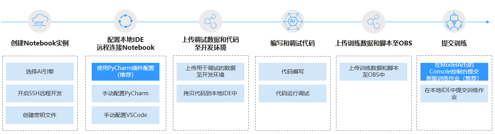

# 本地IDE操作流程

ModelArts支持通过本地IDE环境远程连接到Notebook中，开发基于Pytorch、Tensorflow和MindSpore引擎的AI模型。具体操作流程如下图所示。

**图 1**  使用本地IDE开发流程  

1.  [创建Notebook实例](创建Notebook实例.md)

    在ModelArts控制台中创建一个Notebook开发环境实例，选择要使用的AI框架，并开启SSH远程开发功能。

2.  配置本地IDE远程连接Notebook

    在用户的PC端配置本地IDE环境，远程连接到ModelArts的开发环境中。

    支持通过PyCharm和VSCode 2类本地IDE连接云上Notebook。PyCharm和VSCode可以使用插件自动化配置，也可以手工配置。

3.  [上传数据和代码至开发环境中](在本地IDE中上传数据至Notebook.md)，进行代码调试。
    -   代码直接拷贝至本地IDE中即可，本地IDE中会自动同步至云上开发环境。
    -   小于500MB数据量直接拷贝至本地IDE中即可。
    -   大于500MB数据量请先上传到OBS中，从OBS上传到默认存储EFS或云硬盘EVS。

4.  在本地IDE中编码和调试

    在本地IDE中编写代码，并调试运行。

5.  将调试好的训练脚本和用于训练的数据集上传至OBS目录。
6.  提交训练作业。提交训练作业有如下2种方式：

    -   在本地IDE中提交训练作业（当前仅支持提交到旧版训练作业）
        -   可以基于PyCharm ToolKit直接提交训练作业，具体参考[使用PyCharm ToolKit提交训练作业](https://support.huaweicloud.com/tg-modelarts/modelarts_15_0007.html)。
        -   也可以通过调用ModelArts提供的SDK，创建训练作业，上云训练，调用SDK创建训练作业的操作请参见[调用SDK创建训练作业](https://support.huaweicloud.com/sdkreference-modelarts/modelarts_04_0131.html)。

    -   在ModelArts的Console控制台页面中提交训练作业，具体参考[创建训练作业](https://support.huaweicloud.com/engineers-modelarts/modelarts_23_0286.html)。

