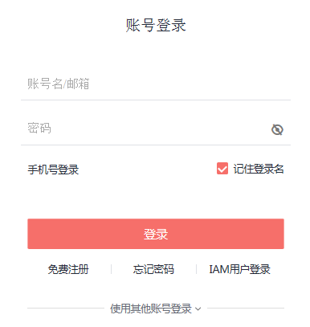
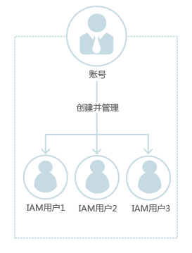
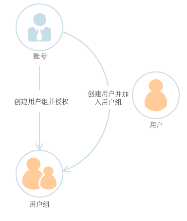
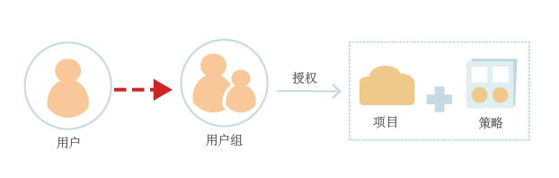
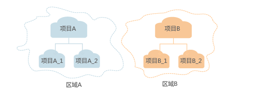

# 权限管理基本概念

如果您需要对ModelArts进行精细的权限管理，您可以使用统一身份认证服务（Identity and Access Management，简称IAM），通过IAM，您可以：

-   根据企业的业务组织，在您的华为云账号中，给企业中不同职能部门的员工创建IAM用户，让员工拥有唯一安全凭证，并使用ModelArts资源。
-   根据企业用户的职能，设置不同的访问权限，以达到用户之间的权限隔离。

如果华为云账号已经能满足您的要求，不需要创建独立的IAM用户，您可以跳过本章节，不影响您使用ModelArts服务的其它功能。

本手册写作使用IAM的常见操作，包括创建用户、用户组、给用户组授权以及创建自定义策略，如果需要使用IAM进行其它操作，请参见[《统一身份认证服务用户指南》](https://support.huaweicloud.com/usermanual-iam/zh-cn_topic_0079496985.html)。

## 账号

当您首次使用华为云时，需要使用手机号注册一个账号，该账号是您的华为云资源归属、资源使用计费的主体，对其所拥有的资源及云服务具有完全的访问权限，可以重置用户密码、分配用户权限等。账号统一接收所有IAM用户进行资源操作时产生的费用账单。账号在登录华为云云控制台时，使用“账号登录”方式登录。

如果您忘记了账号的登录密码，可以重置密码，重置方法请参见：[忘记账号密码](https://support.huaweicloud.com/iam_faq/iam_01_0314.html#section0)。

**图 1**  账号登录  

## IAM用户

由账号在IAM中创建的用户，是云服务的使用人员，具有独立的身份凭证（密码和访问密钥），根据账号授予的权限使用资源。IAM用户不进行独立的计费，由所属账户统一付费。

如果您忘记了IAM用户的登录密码，可以重置密码，重置方法请参见：[IAM用户忘记密码](https://support.huaweicloud.com/iam_faq/iam_01_0314.html#section1)。

**图 2**  IAM用户登录  

## 账号与IAM用户的关系

账号与IAM用户可以类比为父子关系，账号是资源归属以及计费的主体，对其拥有的资源具有所有权限。IAM用户由账号创建，只能拥有账号授予的资源使用权限，账号可以随时修改或者撤销IAM用户的使用权限。IAM用户进行资源操作时产生的费用统一计入账号中，IAM用户不需要为资源付费。

**图 3**  账号与IAM用户的关系  

## 身份凭证

身份凭证是识别用户身份的依据，您通过控制台或者API访问华为云时，需要使用身份凭证来通过系统的鉴权认证。身份凭证包括密码和访问密钥，您可以在IAM中管理自己以及账号中IAM用户的身份凭证。

-   密码：常见的身份凭证，密码可以用来登录华为云界面控制台，还可以调用华为云的API接口。
-   访问密钥：即AK/SK（Access Key ID/Secret Access Key），调用华为云API接口的身份凭证，不能登录界面控制台。访问密钥中具有验证身份的签名，通过加密签名验证可以确保机密性、完整性和请求双方身份的正确性。

## 用户组

用户组是用户的集合，IAM通过用户组功能实现用户的授权。您在IAM中创建的用户，需要加入特定用户组后，用户才具备对应的权限，否则他们无法访问您账号中的任何资源或是云服务。一个用户可以加入多个用户组，以获得不同的权限。

“admin”为系统缺省提供的用户组，具有所有云服务资源的操作权限。将用户加入该用户组后，用户可以操作并使用所有云资源，包括但不仅限于创建用户组及用户、修改用户组权限、管理华为云云资源等。

**图 4**  创建用户以及用户组  

## 授权

授权是您将用户完成具体工作需要的权限授予用户，授权通过策略定义的权限生效，通过给用户组授予策略（包括系统策略和自定义策略），用户组中的用户就能获得策略中定义的权限，这一过程称为授权。用户获得具体云服务的权限后，可以对云服务进行操作，例如，管理您账号中的ECS资源。

**图 5**  授权模型  

## 项目

华为云的区域默认对应一个项目，这个项目由系统预置，用来隔离物理区域间的资源（计算资源、存储资源和网络资源），以默认项目为单位进行授权，用户可以访问您账号中该区域的所有资源。如果您希望进行更加精细的权限控制，可以在区域默认的项目中创建子项目，并在子项目中购买资源，然后以子项目为单位进行授权，使得用户仅能访问特定子项目中资源，使得资源的权限控制更加精确。

**图 6**  项目隔离模型  

