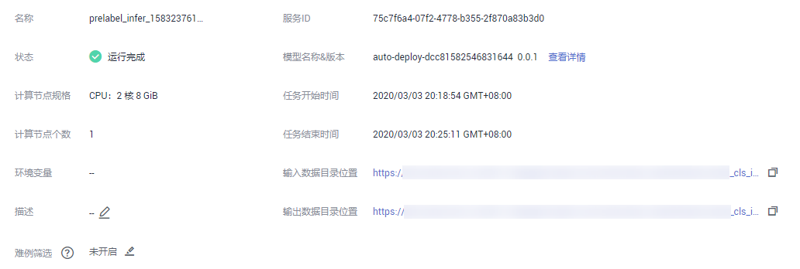

# 查看批量服务预测结果

当您在部署批量服务时，会选择输出数据目录位置，您可以查看“运行完成“状态的批量服务运行结果。

1.  登录ModelArts管理控制台，在左侧菜单栏中选择“部署上线\>批量服务“，进入“批量服务“管理页面。
2.  单击状态为“运行完成“的目标服务名称，进入服务详情页面。

    -   您可以查看服务的“名称“、“状态“、“服务ID“、“输入数据目录位置“、“输出数据目录位置“、“网络配置“和“描述“。
    -   您也可以通过单击描述右侧的，对描述信息进行编辑。

    **图 1**  批量服务详情  
    

3.  单击“输出数据目录位置“后的“查看详情“，可以获取批量服务预测结果。
    -   当输入为图片时，每张图片输出一个结果，输出结果格式为：图片名\_\_result.txt。例如：IMG\_20180919\_115016.jpg\_result.txt 。
    -   当输入为音频时，每个音频输出一个结果，输出结果格式为：音频名\_\_result.txt。例如：1-36929-A-47.wav\_result.txt 。
    -   当输入为表格数据时，输出结果格式为：表格名\_\_result.txt。例如：train.csv\_result.txt 。

