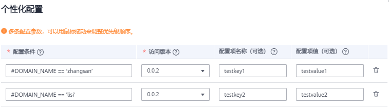

# 查看服务详情<a name="modelarts_23_0061"></a>

当模型部署为在线服务成功后，您可以进入“在线服务“页面，来查看服务详情。

1.  登录ModelArts管理控制台，在左侧菜单栏中选择“部署上线\>在线服务“，进入“在线服务“管理页面。
2.  单击目标服务名称，进入服务详情页面。

    您可以查看服务的“名称“、“状态“等信息，详情说明请参见[表1](#table54131529105213)。

    **表 1**  在线服务配置

    <a name="table54131529105213"></a>
    <table><thead align="left"><tr id="row194131229195210"><th class="cellrowborder" valign="top" width="19.939999999999998%" id="mcps1.2.3.1.1"><p id="p16413132911521"><a name="p16413132911521"></a><a name="p16413132911521"></a>参数</p>
    </th>
    <th class="cellrowborder" valign="top" width="80.06%" id="mcps1.2.3.1.2"><p id="p144138297525"><a name="p144138297525"></a><a name="p144138297525"></a>说明</p>
    </th>
    </tr>
    </thead>
    <tbody><tr id="row741362955217"><td class="cellrowborder" valign="top" width="19.939999999999998%" headers="mcps1.2.3.1.1 "><p id="p2041392925218"><a name="p2041392925218"></a><a name="p2041392925218"></a>名称</p>
    </td>
    <td class="cellrowborder" valign="top" width="80.06%" headers="mcps1.2.3.1.2 "><p id="p16413129135213"><a name="p16413129135213"></a><a name="p16413129135213"></a>在线服务名称。</p>
    </td>
    </tr>
    <tr id="row174131429195215"><td class="cellrowborder" valign="top" width="19.939999999999998%" headers="mcps1.2.3.1.1 "><p id="p1541372917527"><a name="p1541372917527"></a><a name="p1541372917527"></a>状态</p>
    </td>
    <td class="cellrowborder" valign="top" width="80.06%" headers="mcps1.2.3.1.2 "><p id="p17413172915210"><a name="p17413172915210"></a><a name="p17413172915210"></a>在线服务当前状态。</p>
    </td>
    </tr>
    <tr id="row169680273610"><td class="cellrowborder" valign="top" width="19.939999999999998%" headers="mcps1.2.3.1.1 "><p id="p149685270617"><a name="p149685270617"></a><a name="p149685270617"></a>来源</p>
    </td>
    <td class="cellrowborder" valign="top" width="80.06%" headers="mcps1.2.3.1.2 "><p id="p209686271862"><a name="p209686271862"></a><a name="p209686271862"></a>在线服务的模型来源。</p>
    </td>
    </tr>
    <tr id="row19413929145215"><td class="cellrowborder" valign="top" width="19.939999999999998%" headers="mcps1.2.3.1.1 "><p id="p114130294521"><a name="p114130294521"></a><a name="p114130294521"></a>调用失败次数/总次数</p>
    </td>
    <td class="cellrowborder" valign="top" width="80.06%" headers="mcps1.2.3.1.2 "><p id="p33953311403"><a name="p33953311403"></a><a name="p33953311403"></a>服务调用次数从创建后开始统计。</p>
    <p id="p1241312915525"><a name="p1241312915525"></a><a name="p1241312915525"></a>如修改模型数量，或在模型处于“未就绪”时对服务发起调用，不计入统计。</p>
    </td>
    </tr>
    <tr id="row641352919525"><td class="cellrowborder" valign="top" width="19.939999999999998%" headers="mcps1.2.3.1.1 "><p id="p104131829115212"><a name="p104131829115212"></a><a name="p104131829115212"></a>网络配置</p>
    </td>
    <td class="cellrowborder" valign="top" width="80.06%" headers="mcps1.2.3.1.2 "><p id="p841362975214"><a name="p841362975214"></a><a name="p841362975214"></a>如果您使用专属资源池，显示专属资源池的自定义网络配置。</p>
    </td>
    </tr>
    <tr id="row54131629115215"><td class="cellrowborder" valign="top" width="19.939999999999998%" headers="mcps1.2.3.1.1 "><p id="p114131629185210"><a name="p114131629185210"></a><a name="p114131629185210"></a>描述</p>
    </td>
    <td class="cellrowborder" valign="top" width="80.06%" headers="mcps1.2.3.1.2 "><p id="p4413192935218"><a name="p4413192935218"></a><a name="p4413192935218"></a>您可以单击编辑按钮，添加服务描述。</p>
    </td>
    </tr>
    <tr id="row1641332914525"><td class="cellrowborder" valign="top" width="19.939999999999998%" headers="mcps1.2.3.1.1 "><p id="p10413122919527"><a name="p10413122919527"></a><a name="p10413122919527"></a>个性化配置</p>
    </td>
    <td class="cellrowborder" valign="top" width="80.06%" headers="mcps1.2.3.1.2 "><p id="p08265196337"><a name="p08265196337"></a><a name="p08265196337"></a>您可以为在线服务的不同版本设定不同配置条件，并支持携带自定义运行参数，丰富版本分流策略或同一版本内的不同运行配置。您可以打开个性化配置按钮，单击<span class="parmname" id="parmname101614334300"><a name="parmname101614334300"></a><a name="parmname101614334300"></a>“查看配置”</span><a href="#section242152442020">修改服务个性化配置</a>。</p>
    </td>
    </tr>
    <tr id="row1294129727"><td class="cellrowborder" valign="top" width="19.939999999999998%" headers="mcps1.2.3.1.1 "><p id="p172959291727"><a name="p172959291727"></a><a name="p172959291727"></a>数据采集</p>
    </td>
    <td class="cellrowborder" valign="top" width="80.06%" headers="mcps1.2.3.1.2 "><p id="p1129515296210"><a name="p1129515296210"></a><a name="p1129515296210"></a>启用数据采集后，调用在线服务产生的数据将存储至指定的OBS路径。</p>
    </td>
    </tr>
    <tr id="row297618326211"><td class="cellrowborder" valign="top" width="19.939999999999998%" headers="mcps1.2.3.1.1 "><p id="p49763323216"><a name="p49763323216"></a><a name="p49763323216"></a>难例筛选</p>
    </td>
    <td class="cellrowborder" valign="top" width="80.06%" headers="mcps1.2.3.1.2 "><p id="p129771932127"><a name="p129771932127"></a><a name="p129771932127"></a>开启难例筛选后，系统将自动识别所有样本数据中的难例样本。</p>
    </td>
    </tr>
    <tr id="row16591183614220"><td class="cellrowborder" valign="top" width="19.939999999999998%" headers="mcps1.2.3.1.1 "><p id="p115916361226"><a name="p115916361226"></a><a name="p115916361226"></a>同步数据</p>
    </td>
    <td class="cellrowborder" valign="top" width="80.06%" headers="mcps1.2.3.1.2 "><p id="p1559119361421"><a name="p1559119361421"></a><a name="p1559119361421"></a>针对数据采集的结果数据，支持将此数据同步至某一数据集中，统一管理和应用。</p>
    </td>
    </tr>
    <tr id="row198048355410"><td class="cellrowborder" valign="top" width="19.939999999999998%" headers="mcps1.2.3.1.1 "><p id="p1380418351345"><a name="p1380418351345"></a><a name="p1380418351345"></a>服务流量限制</p>
    </td>
    <td class="cellrowborder" valign="top" width="80.06%" headers="mcps1.2.3.1.2 "><p id="p15804103514416"><a name="p15804103514416"></a><a name="p15804103514416"></a>服务流量限制是指每秒内一个服务能够被访问的次数上限。</p>
    </td>
    </tr>
    </tbody>
    </table>

    **图 1**  在线服务详情<a name="fig949315272199"></a>  
    

3.  您可以在在线服务的详情页面，通过切换页签查看更多详细信息，详情说明请参见[表2](#table62441712183917)。

    **表 2**  在线服务详情

    <a name="table62441712183917"></a>
    <table><thead align="left"><tr id="row192441612203917"><th class="cellrowborder" valign="top" width="25.47%" id="mcps1.2.3.1.1"><p id="p19244812153916"><a name="p19244812153916"></a><a name="p19244812153916"></a>参数</p>
    </th>
    <th class="cellrowborder" valign="top" width="74.53%" id="mcps1.2.3.1.2"><p id="p2244712163916"><a name="p2244712163916"></a><a name="p2244712163916"></a>说明</p>
    </th>
    </tr>
    </thead>
    <tbody><tr id="row1824431253918"><td class="cellrowborder" valign="top" width="25.47%" headers="mcps1.2.3.1.1 "><p id="p14244312133911"><a name="p14244312133911"></a><a name="p14244312133911"></a>调用指南</p>
    </td>
    <td class="cellrowborder" valign="top" width="74.53%" headers="mcps1.2.3.1.2 "><p id="p15244101211399"><a name="p15244101211399"></a><a name="p15244101211399"></a>展示API接口地址、模型信息、输入参数、输出参数。您可以通过<a name="image958013525469"></a><a name="image958013525469"></a><span></span>复制API接口地址，调用服务。如果您支持APP认证方式，可以在调用指南查看API接口地址和授权管理详情，包括<span class="parmname" id="parmname1017214544213"><a name="parmname1017214544213"></a><a name="parmname1017214544213"></a>“应用名称”</span>、<span class="parmname" id="parmname12992195819219"><a name="parmname12992195819219"></a><a name="parmname12992195819219"></a>“AppKey”</span>、<span class="parmname" id="parmname101992212217"><a name="parmname101992212217"></a><a name="parmname101992212217"></a>“AppSecret”</span>等信息。您也可以在此处对APP应用进行<span class="uicontrol" id="uicontrol9329622182314"><a name="uicontrol9329622182314"></a><a name="uicontrol9329622182314"></a>“添加授权”</span>或<span class="uicontrol" id="uicontrol16452151872316"><a name="uicontrol16452151872316"></a><a name="uicontrol16452151872316"></a>“解除授权”</span>的操作。</p>
    </td>
    </tr>
    <tr id="row1024431211397"><td class="cellrowborder" valign="top" width="25.47%" headers="mcps1.2.3.1.1 "><p id="p624415125392"><a name="p624415125392"></a><a name="p624415125392"></a>预测</p>
    </td>
    <td class="cellrowborder" valign="top" width="74.53%" headers="mcps1.2.3.1.2 "><p id="p1624571243913"><a name="p1624571243913"></a><a name="p1624571243913"></a>对在线服务进行预测测试。具体操作请参见<a href="测试服务.md">测试服务</a>。</p>
    </td>
    </tr>
    <tr id="row524521233916"><td class="cellrowborder" valign="top" width="25.47%" headers="mcps1.2.3.1.1 "><p id="p3245191263911"><a name="p3245191263911"></a><a name="p3245191263911"></a>配置更新记录</p>
    </td>
    <td class="cellrowborder" valign="top" width="74.53%" headers="mcps1.2.3.1.2 "><p id="p18245151219399"><a name="p18245151219399"></a><a name="p18245151219399"></a>展示<span class="parmname" id="parmname165071635124915"><a name="parmname165071635124915"></a><a name="parmname165071635124915"></a>“当前配置”</span>详情和<span class="parmname" id="parmname4966123934919"><a name="parmname4966123934919"></a><a name="parmname4966123934919"></a>“历史更新记录”</span>。</p>
    <a name="ul159717196486"></a><a name="ul159717196486"></a><ul id="ul159717196486"><li><span class="parmname" id="parmname3953153514484"><a name="parmname3953153514484"></a><a name="parmname3953153514484"></a>“当前配置”</span>：模型名称、版本、状态、分流、</li><li><span class="parmname" id="parmname35171921134912"><a name="parmname35171921134912"></a><a name="parmname35171921134912"></a>“历史更新记录”</span>：展示历史模型相关信息。</li></ul>
    </td>
    </tr>
    <tr id="row77033445268"><td class="cellrowborder" valign="top" width="25.47%" headers="mcps1.2.3.1.1 "><p id="p1270315447265"><a name="p1270315447265"></a><a name="p1270315447265"></a>难例筛选</p>
    </td>
    <td class="cellrowborder" valign="top" width="74.53%" headers="mcps1.2.3.1.2 "><p id="p670310442269"><a name="p670310442269"></a><a name="p670310442269"></a>针对部署为在线服务的模型，调用URL或通过Console输入预测的数据，可通难例筛选功能，将此类数据筛选出难例，并输出至数据集，用于后续的模型训练。</p>
    </td>
    </tr>
    <tr id="row52459125399"><td class="cellrowborder" valign="top" width="25.47%" headers="mcps1.2.3.1.1 "><p id="p824531210394"><a name="p824531210394"></a><a name="p824531210394"></a>监控信息</p>
    </td>
    <td class="cellrowborder" valign="top" width="74.53%" headers="mcps1.2.3.1.2 "><p id="p362281735210"><a name="p362281735210"></a><a name="p362281735210"></a>展示当前服务的<span class="parmname" id="parmname66225177522"><a name="parmname66225177522"></a><a name="parmname66225177522"></a>“资源统计信息”</span>和<span class="parmname" id="parmname462261715523"><a name="parmname462261715523"></a><a name="parmname462261715523"></a>“模型调用次数统计”</span>。</p>
    <a name="ul12345215524"></a><a name="ul12345215524"></a><ul id="ul12345215524"><li><span class="parmname" id="parmname183765955314"><a name="parmname183765955314"></a><a name="parmname183765955314"></a>“资源统计信息”</span>：包括CPU、内存、GPU的可用和已用信息。</li><li><span class="parmname" id="parmname128575154534"><a name="parmname128575154534"></a><a name="parmname128575154534"></a>“模型调用次数统计”</span>：当前模型的调用次数，从模型状态为“已就绪”后开始统计。</li></ul>
    </td>
    </tr>
    <tr id="row112141948102817"><td class="cellrowborder" valign="top" width="25.47%" headers="mcps1.2.3.1.1 "><p id="p121514882813"><a name="p121514882813"></a><a name="p121514882813"></a>事件</p>
    </td>
    <td class="cellrowborder" valign="top" width="74.53%" headers="mcps1.2.3.1.2 "><p id="p9215144892817"><a name="p9215144892817"></a><a name="p9215144892817"></a>展示当前服务使用过程中的关键操作，比如服务部署进度、部署异常的详细原因、服务被启动、停止、更新的时间点等。</p>
    </td>
    </tr>
    <tr id="row5245101211398"><td class="cellrowborder" valign="top" width="25.47%" headers="mcps1.2.3.1.1 "><p id="p8245131217395"><a name="p8245131217395"></a><a name="p8245131217395"></a>日志</p>
    </td>
    <td class="cellrowborder" valign="top" width="74.53%" headers="mcps1.2.3.1.2 "><p id="p52461512113918"><a name="p52461512113918"></a><a name="p52461512113918"></a>展示当前服务下每个模型的日志信息。包含最近5分钟、最近30分钟、最近1小时和自定义时间段。</p>
    <p id="p51322576501"><a name="p51322576501"></a><a name="p51322576501"></a>自定义时间段您可以选择开始时间和结束时间。</p>
    </td>
    </tr>
    </tbody>
    </table>


## 修改服务个性化配置<a name="section242152442020"></a>

服务个性化配置规则由配置条件、访问版本、自定义运行参数（包括配置项名称和配置项值）组成。

您可以为在线服务的不同版本设定不同配置条件，并支持携带自定义运行参数。

个性化配置规则的优先级与顺序相对应，从高到低设置。您可以通过拖动个性化配置规则的顺序更换优先级。

当匹配了某一规则后就不再继续下一规则的判断，最多允许配置10个条件。

**表 3**  个性化配置参数

<a name="table569619576249"></a>
<table><thead align="left"><tr id="row3697657132419"><th class="cellrowborder" valign="top" width="17.61%" id="mcps1.2.4.1.1"><p id="p1769720570242"><a name="p1769720570242"></a><a name="p1769720570242"></a>参数</p>
</th>
<th class="cellrowborder" valign="top" width="9.62%" id="mcps1.2.4.1.2"><p id="p1334613148267"><a name="p1334613148267"></a><a name="p1334613148267"></a>是否必选</p>
</th>
<th class="cellrowborder" valign="top" width="72.77%" id="mcps1.2.4.1.3"><p id="p14697115714248"><a name="p14697115714248"></a><a name="p14697115714248"></a>说明</p>
</th>
</tr>
</thead>
<tbody><tr id="row76974579240"><td class="cellrowborder" valign="top" width="17.61%" headers="mcps1.2.4.1.1 "><p id="p1269785710249"><a name="p1269785710249"></a><a name="p1269785710249"></a>配置条件</p>
</td>
<td class="cellrowborder" valign="top" width="9.62%" headers="mcps1.2.4.1.2 "><p id="p134671402613"><a name="p134671402613"></a><a name="p134671402613"></a>必选</p>
</td>
<td class="cellrowborder" valign="top" width="72.77%" headers="mcps1.2.4.1.3 "><p id="p166971573241"><a name="p166971573241"></a><a name="p166971573241"></a>SPEL（Spring Expression Language）规则的表达式，当前仅支持字符型的“相等”和<span class="parmname" id="parmname1853216561545"><a name="parmname1853216561545"></a><a name="parmname1853216561545"></a>“matches”</span>。</p>
</td>
</tr>
<tr id="row176971157172416"><td class="cellrowborder" valign="top" width="17.61%" headers="mcps1.2.4.1.1 "><p id="p13697135719243"><a name="p13697135719243"></a><a name="p13697135719243"></a>访问版本</p>
</td>
<td class="cellrowborder" valign="top" width="9.62%" headers="mcps1.2.4.1.2 "><p id="p13346151432618"><a name="p13346151432618"></a><a name="p13346151432618"></a>必选</p>
</td>
<td class="cellrowborder" valign="top" width="72.77%" headers="mcps1.2.4.1.3 "><p id="p4697357172413"><a name="p4697357172413"></a><a name="p4697357172413"></a>服务个性化配置规则对应的访问版本。当匹配到规则时，请求该版本的在线服务。</p>
</td>
</tr>
<tr id="row15697257112410"><td class="cellrowborder" valign="top" width="17.61%" headers="mcps1.2.4.1.1 "><p id="p156972057192410"><a name="p156972057192410"></a><a name="p156972057192410"></a>配置项名称</p>
</td>
<td class="cellrowborder" valign="top" width="9.62%" headers="mcps1.2.4.1.2 "><p id="p1934661414262"><a name="p1934661414262"></a><a name="p1934661414262"></a>可选</p>
</td>
<td class="cellrowborder" valign="top" width="72.77%" headers="mcps1.2.4.1.3 "><p id="p145781245175612"><a name="p145781245175612"></a><a name="p145781245175612"></a>自定义运行参数的Key值，不超过128个字符。</p>
<p id="p18791114735410"><a name="p18791114735410"></a><a name="p18791114735410"></a>当需要通过Header（http消息头）携带自定义运行参数至在线服务时，可以配置。</p>
</td>
</tr>
<tr id="row9657155816257"><td class="cellrowborder" valign="top" width="17.61%" headers="mcps1.2.4.1.1 "><p id="p2657205872519"><a name="p2657205872519"></a><a name="p2657205872519"></a>配置项值</p>
</td>
<td class="cellrowborder" valign="top" width="9.62%" headers="mcps1.2.4.1.2 "><p id="p23461014172611"><a name="p23461014172611"></a><a name="p23461014172611"></a>可选</p>
</td>
<td class="cellrowborder" valign="top" width="72.77%" headers="mcps1.2.4.1.3 "><p id="p19219217125617"><a name="p19219217125617"></a><a name="p19219217125617"></a>自定义运行参数的Value值，不超过256个字符。</p>
<p id="p1774884845418"><a name="p1774884845418"></a><a name="p1774884845418"></a>当需要通过Header（http消息头）携带自定义运行参数至在线服务时，可以配置。</p>
</td>
</tr>
</tbody>
</table>

可以设置以下三种场景：

-   如果在线服务部署多个版本用于灰度发布，可以使用个性化配置实现按用户分流。

    **表 4**  按内置变量配置条件

    <a name="table19377505490"></a>
    <table><thead align="left"><tr id="row893765015493"><th class="cellrowborder" valign="top" width="20.61%" id="mcps1.2.3.1.1"><p id="p8937450124911"><a name="p8937450124911"></a><a name="p8937450124911"></a>内置变量</p>
    </th>
    <th class="cellrowborder" valign="top" width="79.39%" id="mcps1.2.3.1.2"><p id="p2937175084914"><a name="p2937175084914"></a><a name="p2937175084914"></a>说明</p>
    </th>
    </tr>
    </thead>
    <tbody><tr id="row193725094912"><td class="cellrowborder" valign="top" width="20.61%" headers="mcps1.2.3.1.1 "><p id="p1293719505498"><a name="p1293719505498"></a><a name="p1293719505498"></a>DOMAIN_NAME</p>
    </td>
    <td class="cellrowborder" valign="top" width="79.39%" headers="mcps1.2.3.1.2 "><p id="p13937155012492"><a name="p13937155012492"></a><a name="p13937155012492"></a>调用预测请求的帐号名。</p>
    </td>
    </tr>
    <tr id="row19937195014914"><td class="cellrowborder" valign="top" width="20.61%" headers="mcps1.2.3.1.1 "><p id="p14937115011499"><a name="p14937115011499"></a><a name="p14937115011499"></a>DOMAIN_ID</p>
    </td>
    <td class="cellrowborder" valign="top" width="79.39%" headers="mcps1.2.3.1.2 "><p id="p5937205024910"><a name="p5937205024910"></a><a name="p5937205024910"></a>调用预测请求的帐号ID。</p>
    </td>
    </tr>
    <tr id="row1793716500497"><td class="cellrowborder" valign="top" width="20.61%" headers="mcps1.2.3.1.1 "><p id="p15937195034915"><a name="p15937195034915"></a><a name="p15937195034915"></a>PROJECT_NAME</p>
    </td>
    <td class="cellrowborder" valign="top" width="79.39%" headers="mcps1.2.3.1.2 "><p id="p8937175020492"><a name="p8937175020492"></a><a name="p8937175020492"></a>调用预测请求的项目名。</p>
    </td>
    </tr>
    <tr id="row18937450144916"><td class="cellrowborder" valign="top" width="20.61%" headers="mcps1.2.3.1.1 "><p id="p1993795020492"><a name="p1993795020492"></a><a name="p1993795020492"></a>PROJECT_ID</p>
    </td>
    <td class="cellrowborder" valign="top" width="79.39%" headers="mcps1.2.3.1.2 "><p id="p1193795019494"><a name="p1193795019494"></a><a name="p1193795019494"></a>调用预测请求的项目ID。</p>
    </td>
    </tr>
    <tr id="row9715114065218"><td class="cellrowborder" valign="top" width="20.61%" headers="mcps1.2.3.1.1 "><p id="p1771615404522"><a name="p1771615404522"></a><a name="p1771615404522"></a>USER_NAME</p>
    </td>
    <td class="cellrowborder" valign="top" width="79.39%" headers="mcps1.2.3.1.2 "><p id="p1371674045216"><a name="p1371674045216"></a><a name="p1371674045216"></a>调用预测请求的用户名。</p>
    </td>
    </tr>
    <tr id="row1284974475219"><td class="cellrowborder" valign="top" width="20.61%" headers="mcps1.2.3.1.1 "><p id="p198496449529"><a name="p198496449529"></a><a name="p198496449529"></a>USER_ID</p>
    </td>
    <td class="cellrowborder" valign="top" width="79.39%" headers="mcps1.2.3.1.2 "><p id="p38491344185217"><a name="p38491344185217"></a><a name="p38491344185217"></a>调用预测请求的用户ID。</p>
    </td>
    </tr>
    </tbody>
    </table>

    “\#“表示引用变量，匹配的字符串需要用单引号。

    ```
    #{内置变量} == '字符串'
    #{内置变量} matches '正则表达式'
    ```

    -   示例一：

        当调用预测请求的帐号名为“zhangsan“时，匹配至指定版本。

        ```
        #DOMAIN_NAME == 'zhangsan'
        ```

    -   示例二：

        当调用预测请求的帐号名以“op“开头时，匹配至指定版本。

        ```
        #DOMAIN_NAME matches 'op.*'
        ```

        **表 5**  常用的正则匹配表达式

        <a name="table52770525547"></a>
        <table><thead align="left"><tr id="row62771525548"><th class="cellrowborder" valign="top" width="15.8%" id="mcps1.2.3.1.1"><p id="p1927711526548"><a name="p1927711526548"></a><a name="p1927711526548"></a>字符</p>
        </th>
        <th class="cellrowborder" valign="top" width="84.2%" id="mcps1.2.3.1.2"><p id="p112771952195410"><a name="p112771952195410"></a><a name="p112771952195410"></a>描述</p>
        </th>
        </tr>
        </thead>
        <tbody><tr id="row927715218542"><td class="cellrowborder" valign="top" width="15.8%" headers="mcps1.2.3.1.1 "><p id="p8277652155415"><a name="p8277652155415"></a><a name="p8277652155415"></a><span class="parmname" id="parmname3987138185714"><a name="parmname3987138185714"></a><a name="parmname3987138185714"></a>“.”</span></p>
        </td>
        <td class="cellrowborder" valign="top" width="84.2%" headers="mcps1.2.3.1.2 "><p id="p7277115265416"><a name="p7277115265416"></a><a name="p7277115265416"></a>匹配除<span class="parmvalue" id="parmvalue6798999575"><a name="parmvalue6798999575"></a><a name="parmvalue6798999575"></a>“\n”</span>之外的任何单个字符串。需匹配包括<span class="parmvalue" id="parmvalue512032416573"><a name="parmvalue512032416573"></a><a name="parmvalue512032416573"></a>“\n”</span>在内的任何字符，请使用<span class="parmvalue" id="parmvalue86401218185719"><a name="parmvalue86401218185719"></a><a name="parmvalue86401218185719"></a>“(.|\n)”</span>的模式。</p>
        </td>
        </tr>
        <tr id="row102771052145420"><td class="cellrowborder" valign="top" width="15.8%" headers="mcps1.2.3.1.1 "><p id="p927719524541"><a name="p927719524541"></a><a name="p927719524541"></a><span class="parmname" id="parmname7631185785815"><a name="parmname7631185785815"></a><a name="parmname7631185785815"></a>“*”</span></p>
        </td>
        <td class="cellrowborder" valign="top" width="84.2%" headers="mcps1.2.3.1.2 "><p id="p827745211540"><a name="p827745211540"></a><a name="p827745211540"></a>匹配前面的子表达式零次或多次。例如，<span class="parmvalue" id="parmvalue965010366581"><a name="parmvalue965010366581"></a><a name="parmvalue965010366581"></a>“zo*”</span>能匹配<span class="parmvalue" id="parmvalue0493543125816"><a name="parmvalue0493543125816"></a><a name="parmvalue0493543125816"></a>“z”</span>以及<span class="parmvalue" id="parmvalue1198175265812"><a name="parmvalue1198175265812"></a><a name="parmvalue1198175265812"></a>“zoo”</span>。</p>
        </td>
        </tr>
        <tr id="row169010228018"><td class="cellrowborder" valign="top" width="15.8%" headers="mcps1.2.3.1.1 "><p id="p790116222001"><a name="p790116222001"></a><a name="p790116222001"></a><span class="parmname" id="parmname1514416515010"><a name="parmname1514416515010"></a><a name="parmname1514416515010"></a>“+”</span></p>
        </td>
        <td class="cellrowborder" valign="top" width="84.2%" headers="mcps1.2.3.1.2 "><p id="p190212218017"><a name="p190212218017"></a><a name="p190212218017"></a>匹配前面的子表达式一次或多次。例如，<span class="parmvalue" id="parmvalue1012696717"><a name="parmvalue1012696717"></a><a name="parmvalue1012696717"></a>“zo+”</span>能匹配<span class="parmvalue" id="parmvalue1640219151819"><a name="parmvalue1640219151819"></a><a name="parmvalue1640219151819"></a>“zo”</span>以及<span class="parmvalue" id="parmvalue1968111201615"><a name="parmvalue1968111201615"></a><a name="parmvalue1968111201615"></a>“zoo”</span>，但不能匹配<span class="parmvalue" id="parmvalue924252511116"><a name="parmvalue924252511116"></a><a name="parmvalue924252511116"></a>“z”</span>。</p>
        </td>
        </tr>
        <tr id="row13247434216"><td class="cellrowborder" valign="top" width="15.8%" headers="mcps1.2.3.1.1 "><p id="p17248534914"><a name="p17248534914"></a><a name="p17248534914"></a><span class="parmname" id="parmname137038381327"><a name="parmname137038381327"></a><a name="parmname137038381327"></a>“?”</span></p>
        </td>
        <td class="cellrowborder" valign="top" width="84.2%" headers="mcps1.2.3.1.2 "><p id="p13248134119"><a name="p13248134119"></a><a name="p13248134119"></a>匹配前面的子表达式零次或一次。例如，<span class="parmvalue" id="parmvalue353311410210"><a name="parmvalue353311410210"></a><a name="parmvalue353311410210"></a>“do(es)?”</span>可以匹配<span class="parmvalue" id="parmvalue151746114217"><a name="parmvalue151746114217"></a><a name="parmvalue151746114217"></a>“does”</span>或<span class="parmvalue" id="parmvalue128431416926"><a name="parmvalue128431416926"></a><a name="parmvalue128431416926"></a>“does”</span>中的<span class="parmvalue" id="parmvalue9464222721"><a name="parmvalue9464222721"></a><a name="parmvalue9464222721"></a>“do”</span>。</p>
        </td>
        </tr>
        <tr id="row10277175255418"><td class="cellrowborder" valign="top" width="15.8%" headers="mcps1.2.3.1.1 "><p id="p527705235419"><a name="p527705235419"></a><a name="p527705235419"></a><span class="parmname" id="parmname1293411537014"><a name="parmname1293411537014"></a><a name="parmname1293411537014"></a>“^”</span></p>
        </td>
        <td class="cellrowborder" valign="top" width="84.2%" headers="mcps1.2.3.1.2 "><p id="p142771525546"><a name="p142771525546"></a><a name="p142771525546"></a>匹配输入字符串的开始位置。</p>
        </td>
        </tr>
        <tr id="row19201184515599"><td class="cellrowborder" valign="top" width="15.8%" headers="mcps1.2.3.1.1 "><p id="p52011345155910"><a name="p52011345155910"></a><a name="p52011345155910"></a><span class="parmname" id="parmname1967185615014"><a name="parmname1967185615014"></a><a name="parmname1967185615014"></a>“$”</span></p>
        </td>
        <td class="cellrowborder" valign="top" width="84.2%" headers="mcps1.2.3.1.2 "><p id="p5201204545911"><a name="p5201204545911"></a><a name="p5201204545911"></a>匹配输入字符串的结束位置。</p>
        </td>
        </tr>
        <tr id="row620094975917"><td class="cellrowborder" valign="top" width="15.8%" headers="mcps1.2.3.1.1 "><p id="p820094912590"><a name="p820094912590"></a><a name="p820094912590"></a><span class="parmname" id="parmname115667278512"><a name="parmname115667278512"></a><a name="parmname115667278512"></a>“{n}”</span></p>
        </td>
        <td class="cellrowborder" valign="top" width="84.2%" headers="mcps1.2.3.1.2 "><p id="p420044985917"><a name="p420044985917"></a><a name="p420044985917"></a><em id="i185711425435"><a name="i185711425435"></a><a name="i185711425435"></a>n</em>是一个非负整数。匹配确定的<em id="i3571152518313"><a name="i3571152518313"></a><a name="i3571152518313"></a>n</em>次。例如，<span class="parmvalue" id="parmvalue187313431858"><a name="parmvalue187313431858"></a><a name="parmvalue187313431858"></a>“o{2}”</span>不能匹配<span class="parmvalue" id="parmvalue560195019517"><a name="parmvalue560195019517"></a><a name="parmvalue560195019517"></a>“Bob”</span>中的<span class="parmvalue" id="parmvalue16987105713511"><a name="parmvalue16987105713511"></a><a name="parmvalue16987105713511"></a>“o”</span>，但是能匹配<span class="parmvalue" id="parmvalue17441571466"><a name="parmvalue17441571466"></a><a name="parmvalue17441571466"></a>“food”</span>中的两个<span class="parmvalue" id="parmvalue5256141117616"><a name="parmvalue5256141117616"></a><a name="parmvalue5256141117616"></a>“o”</span>。</p>
        </td>
        </tr>
        <tr id="row4988175215597"><td class="cellrowborder" valign="top" width="15.8%" headers="mcps1.2.3.1.1 "><p id="p791217571143"><a name="p791217571143"></a><a name="p791217571143"></a><span class="parmname" id="parmname13329173016519"><a name="parmname13329173016519"></a><a name="parmname13329173016519"></a>“x|y”</span></p>
        </td>
        <td class="cellrowborder" valign="top" width="84.2%" headers="mcps1.2.3.1.2 "><p id="p29881152185912"><a name="p29881152185912"></a><a name="p29881152185912"></a>匹配x或y。例如，<span class="parmvalue" id="parmvalue1736219206619"><a name="parmvalue1736219206619"></a><a name="parmvalue1736219206619"></a>“z|food”</span>能匹配<span class="parmvalue" id="parmvalue13875726468"><a name="parmvalue13875726468"></a><a name="parmvalue13875726468"></a>“z”</span>或<span class="parmvalue" id="parmvalue157378351965"><a name="parmvalue157378351965"></a><a name="parmvalue157378351965"></a>“food”</span>。<span class="parmvalue" id="parmvalue38087454619"><a name="parmvalue38087454619"></a><a name="parmvalue38087454619"></a>“(z|f)ood”</span>则匹配<span class="parmvalue" id="parmvalue123391521960"><a name="parmvalue123391521960"></a><a name="parmvalue123391521960"></a>“zood”</span>或<span class="parmvalue" id="parmvalue14101515714"><a name="parmvalue14101515714"></a><a name="parmvalue14101515714"></a>“food”</span>。</p>
        </td>
        </tr>
        <tr id="row12517145720596"><td class="cellrowborder" valign="top" width="15.8%" headers="mcps1.2.3.1.1 "><p id="p15517557155912"><a name="p15517557155912"></a><a name="p15517557155912"></a><span class="parmname" id="parmname118214335518"><a name="parmname118214335518"></a><a name="parmname118214335518"></a>“[xyz]”</span></p>
        </td>
        <td class="cellrowborder" valign="top" width="84.2%" headers="mcps1.2.3.1.2 "><p id="p1551715712595"><a name="p1551715712595"></a><a name="p1551715712595"></a>字符集合。匹配所包含的任意一个字符。例如，<span class="parmvalue" id="parmvalue11559151415713"><a name="parmvalue11559151415713"></a><a name="parmvalue11559151415713"></a>“[abc]”</span>可以匹配<span class="parmvalue" id="parmvalue1889422174"><a name="parmvalue1889422174"></a><a name="parmvalue1889422174"></a>“plain”</span>中的<span class="parmvalue" id="parmvalue1482612713719"><a name="parmvalue1482612713719"></a><a name="parmvalue1482612713719"></a>“a”</span>。</p>
        </td>
        </tr>
        </tbody>
        </table>

        更多正则表达式请参考[表达式全集](https://tool.oschina.net/uploads/apidocs/jquery/regexp.html)。

        **图 2**  按用户分流<a name="fig19860141184710"></a>  
        


-   如果在线服务部署多个版本用于灰度发布，可以使用个性化配置实现通过Header来访问不同版本。

    您需要通过"\#HEADER\_"开头说明引用header作为条件

    ```
    #HEADER_{key} == '{value}'
    #HEADER_{key} matches '{value}'
    ```

    -   示例一：

        当预测的http请求的header中存在version，且值为0.0.1则符合条件。不存在此header或者值不为0.0.1都不符合条件。

        ```
        #HEADER_version == '0.0.1'
        ```

    -   示例二：

        当预测的http请求的header中存在testheader且值符合正以mock开头时，可匹配到这条规则。

        ```
        #HEADER_testheader matches 'mock.*'
        ```

        **图 3**  通过Header访问不同版本<a name="fig386192143714"></a>  
        


-   如果在线服务部署的版本支持使用不同的运行配置，您可以通过“配置项名称“和“配置项值“携带自定义运行参数至在线服务，实现不同用户使用不同运行配置。

    示例：

    用户zhangsan访问时，模型使用配置A；用户lisi访问时，模型使用配置B。当匹配到运行配置条件时，ModelArts会在请求里增加一个Header，传入自定义运行参数，其中Key是“配置项名称“，Value是“配置项值“。

    **图 4**  个性化配置规则支持传入自定义运行参数。<a name="fig913111016189"></a>  
    


