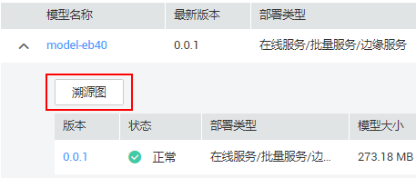
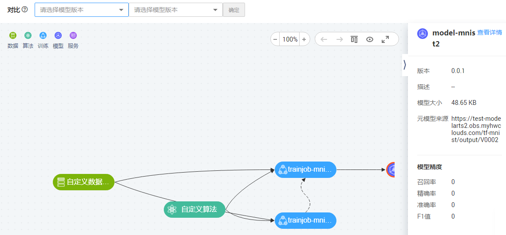

# 查看模型溯源图

针对已导入的模型，您可以查看其溯源图，了解其数据、训练、模型等相关信息，方便您进行模型调优等操作。

## 查看溯源图

1.  在“模型管理 \> 模型“页面，单击模型名称左侧的小三角展开此模型的版本列表，单击列表左上角的“溯源图“，进入溯源图页面，如[图1](#fig786476114817)所示。也可以单击模型名称，进入模型详情页面，单击左上角的“溯源图“，进入溯源图页面，如[图2](#fig11983172814713)所示。

    **图 1**  在模型列表中进入查看溯源图  
    

    **图 2**  在模型详情页中进入查看溯源图  
    

2.  在打开的溯源图页面，您可以查看到“数据“、“算法“、“训练“、“模型“及“服务“之间的溯源图，并且您可以选择2个不同版本的模型进行对比。

    > **说明：**   
    >如果您在导入模型时，“元数据来源“选择“从OBS中选择“或者“从容器镜像中选择“时，溯源图只能查看到“模型“的信息，前面的“数据“、“算法“、“训练“信息无法溯源。  

    **图 3**  查看模型溯源图  
    

