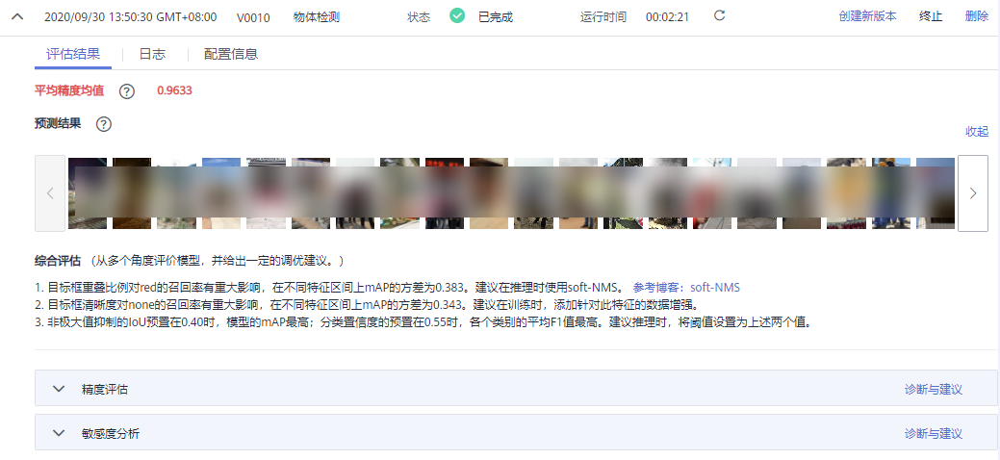

# 查看评估结果

每一个评估作业在运行结束后将产生一个评估结果。您可以选择查看单个作业的评估结果。

## 查看评估结果

1.  登录ModelArts管理控制台，在左侧菜单栏中选择“模型管理 \> 评估/诊断“。
2.  在“评估/诊断“管理页面，选择需查看结果的评估作业，单击作业名称，进入“版本管理“页面。
3.  在“版本管理“页面，选择对应的作业版本，单击左侧的小三角，可展开查看此作业版本的评估结果。

    不同的模型情况，其给出的评估指标及建议也不相同，请仔细阅读界面中给出的结果和建议信息，可根据诊断建议优化您的模型。

    **图 1**  评估结果  
    

