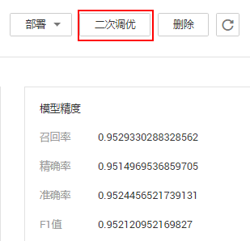

# 模型二次调优

模型二次调优即在原有模型的基础上，增加数据进行训练，也称为增量训练。目前只有“模型来源“为“预置算法“的模型支持二次调优。

## 前提条件

ModelArts模型管理中已存在“模型来源“为“预置算法“的模型。

## 操作步骤

1.  登录ModelArts管理控制台，在左侧导航栏中选择“模型管理 \> 模型“，进入模型列表页面。
2.  选择“模型来源“为“预置算法“的模型，首先单击模型名称左侧的展开模型的所有版本列表，然后在对应的模型版本中，单击操作列的“更多 \> 二次调优“，进入“创建训练作业“页面。

    您也可以单击模型的名称，进入模型详情页，单击右上角的“二次调优“，进入“创建训练作业“页面。

    **图 1**  从模型列表中进入二次调优  
    

    **图 2**  从模型详情页进入二次调优  
    

3.  在“创建训练作业“页面，您可以使用更改后的数据集或者新的数据集，然后填写其他相关参数，具体参数说明请参见[创建训练作业](创建训练作业.md#section210412592420)，然后提交作业。
4.  训练作业运行成功后，会在“模型管理“页面，目标模型栏目下，生成调优后新的模型版本， 该模型描述为“finetuned from version: v x.x.x“。至此即完成一次模型调优。

