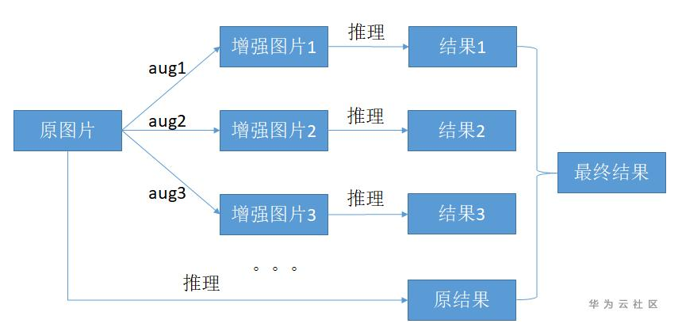
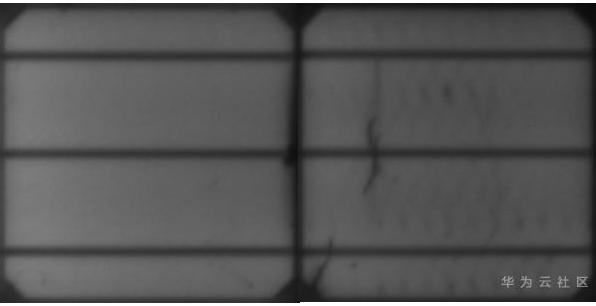
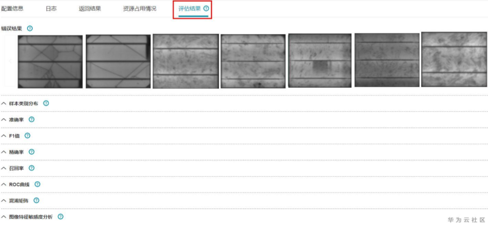

# 模型优化中常见优化模型精度的方法<a name="modelarts_eval_0011"></a>

## 前言<a name="zh-cn_topic_0275437247_section9971128114520"></a>

在很多深度学习的比赛项目中，各种方法trick层出不穷，其中有一种颇受争议的方法就是在测试时使用增强的手段，将输入的源图片生成多份分别送入模型，然后对所有的推理结果做一个综合整合。这种方法被称为**测试时增强**（test time augmentation，TTA），本章节介绍测试时增强的原理及建议。

## 原理说明<a name="zh-cn_topic_0275437247_section133914016452"></a>

-   **TTA流程**

    TTA的基本流程是通过对原图做增强操作，获得很多份增强后的样本与原图组成一个数据组，然后用这些样本获取推理结果，最后把多份的推理结果按一定方法合成得到最后的推理结果再进行精度指标计算。

    **图 1**  TTA流程图<a name="zh-cn_topic_0275437247_fig173031185213"></a>  
    

    这么看上去需要确认很多问题：

    1.  原图片需要用什么增强方法来生成新的样本。
    2.  生成的样本在获取推理结果之后应该使用什么样的方法进行合成。

    我们举个简单的例子来说明TTA的作用以及如何利用ModelArts平台提供的功能来使用TTA。

-   **TTA使用实例**

    -   数据集：数据集样例图片如下所示。其中左侧为正常样本图像，共754张，右侧为有瑕疵的电板图像，共358张，经过一定的增强手段后扩充至1508张正常类图片，1432张有瑕疵类图片。

        **图 2**  数据集样例<a name="zh-cn_topic_0275437247_fig13010128367"></a>  
        

    -   使用框架及算法：pytorch官方提供的训练[imagenet开源代码](https://github.com/pytorch/examples/tree/master/imagenet)。
    -   训练策略：50个epoch，初始学习率lr0.001，batchsize16用Adam的优化器训练。

    原模型精度信息

    <a name="zh-cn_topic_0275437247_table1281427133812"></a>
    <table><thead align="left"><tr id="zh-cn_topic_0275437247_row6752713815"><th class="cellrowborder" valign="top" width="33.33333333333333%" id="mcps1.1.4.1.1"><p id="zh-cn_topic_0275437247_p17716276382"><a name="zh-cn_topic_0275437247_p17716276382"></a><a name="zh-cn_topic_0275437247_p17716276382"></a>精度信息</p>
    </th>
    <th class="cellrowborder" valign="top" width="33.33333333333333%" id="mcps1.1.4.1.2"><p id="zh-cn_topic_0275437247_p878278385"><a name="zh-cn_topic_0275437247_p878278385"></a><a name="zh-cn_topic_0275437247_p878278385"></a>正常类</p>
    </th>
    <th class="cellrowborder" valign="top" width="33.33333333333333%" id="mcps1.1.4.1.3"><p id="zh-cn_topic_0275437247_p471627163818"><a name="zh-cn_topic_0275437247_p471627163818"></a><a name="zh-cn_topic_0275437247_p471627163818"></a>有瑕疵非正常类</p>
    </th>
    </tr>
    </thead>
    <tbody><tr id="zh-cn_topic_0275437247_row1186278388"><td class="cellrowborder" valign="top" width="33.33333333333333%" headers="mcps1.1.4.1.1 "><p id="zh-cn_topic_0275437247_p15782714389"><a name="zh-cn_topic_0275437247_p15782714389"></a><a name="zh-cn_topic_0275437247_p15782714389"></a>召回率recall</p>
    </td>
    <td class="cellrowborder" valign="top" width="33.33333333333333%" headers="mcps1.1.4.1.2 "><p id="zh-cn_topic_0275437247_p38527103812"><a name="zh-cn_topic_0275437247_p38527103812"></a><a name="zh-cn_topic_0275437247_p38527103812"></a>97.2%</p>
    </td>
    <td class="cellrowborder" valign="top" width="33.33333333333333%" headers="mcps1.1.4.1.3 "><p id="zh-cn_topic_0275437247_p78132716383"><a name="zh-cn_topic_0275437247_p78132716383"></a><a name="zh-cn_topic_0275437247_p78132716383"></a>71.3%</p>
    </td>
    </tr>
    <tr id="zh-cn_topic_0275437247_row148112720387"><td class="cellrowborder" valign="top" headers="mcps1.1.4.1.1 "><p id="zh-cn_topic_0275437247_p1381027153818"><a name="zh-cn_topic_0275437247_p1381027153818"></a><a name="zh-cn_topic_0275437247_p1381027153818"></a>准确率accuracy</p>
    </td>
    <td class="cellrowborder" colspan="2" valign="top" headers="mcps1.1.4.1.2 mcps1.1.4.1.3 "><p id="zh-cn_topic_0275437247_p128192753810"><a name="zh-cn_topic_0275437247_p128192753810"></a><a name="zh-cn_topic_0275437247_p128192753810"></a>89.13%</p>
    </td>
    </tr>
    </tbody>
    </table>

-   **TTA过程**
    1.  <a name="zh-cn_topic_0275437247_li1319917421312"></a>首先，需选定使用的增强方法来获取多样本。这里有两种方法：
        1.  从训练中使用的增强手段入手，用训练中使用的增强手段获取多样本。

            如pytorch训练imagenet的代码中，使用了算子transforms.RandomHorizontalFlip\(\)做垂直方向的翻转操作。那么对于模型而言，应该也见过很多经过垂直翻转的图片，所以我们可以用垂直方向的翻转来作为增强手段的一种。

        2.  进行模型评估，从模型评估的结果中分析该使用什么样的增强方法。

            对原模型进行评估，评估代码如下，这里是修改了开源代码中validate部分做前向部分推理的代码：

            ```
            with torch.no_grad():
            end = time.time()
            for i, (images, target) in enumerate(val_loader):
            if args.gpu is not None:
            images = images.cuda(args.gpu, non_blocking=True)
            target = target.cuda(args.gpu, non_blocking=True)
            
            # compute output
            output_origin = model(images)
            output = output_origin
            loss = criterion(output, target)
            pred_list += output.cpu().numpy()[:, :2].tolist()
            target_list += target.cpu().numpy().tolist()
            # measure accuracy and record loss
            acc1, acc5 = accuracy(output, target, topk=(1, 5), i=i)
            losses.update(loss.item(), images.size(0))
            top1.update(acc1[0], images.size(0))
            top5.update(acc5[0], images.size(0))
            
            # measure elapsed time
            batch_time.update(time.time() - end)
            end = time.time()
            
            if i % args.print_freq == 0:
            progress.display(i)
            # TODO: this should also be done with the ProgressMeter
            print(' * Acc@1 {top1.avg:.3f} Acc@5 {top5.avg:.3f}'
            .format(top1=top1, top5=top5))
            name_list = val_loader.dataset.samples
            for idx in range(len(name_list)):
            name_list[idx] = name_list[idx][0]
            analyse(task_type='image_classification', save_path='./', pred_list=pred_list, label_list=target_list, name_list=name_list)
            ```

            评估就是需要获得三个list，推理的直接的结果logits组合成的pred\_list，存储的是每一张图片直接的预测结果，如\[\[8.725419998168945, 21.92235565185547\]...\[xxx, xxx\]\]。一个真实的label值组成的target\_list，存储的是每一张图片的真实标签，如\[0, 1, 0, 1, 1..., 1, 0\]。还有原图像文件存储的路径组合成的name\_list，如\[xxx.jpg, ... xxx.jpg\]，这里是从pytorch度数据模块的类中通过val\_loader.dataset.samples获取到后重新组合的。然后调用deep\_moxing库中的analyse接口，在save\_path下会生成一个model\_analysis\_results.json的文件，将这个文件上传到页面上任意一个训练任务的输出目录下，就能在页面的评估界面上看到对模型评估的结果。

            **图 3**  评估结果<a name="zh-cn_topic_0275437247_fig14840399370"></a>  
            

            这结果中需要分析模型的敏感度。

            **表 1**  图像清晰度敏感度分析

            <a name="zh-cn_topic_0275437247_table61171828142817"></a>
            <table><thead align="left"><tr id="zh-cn_topic_0275437247_row101172284283"><th class="cellrowborder" valign="top" width="33.33333333333333%" id="mcps1.2.4.1.1"><p id="zh-cn_topic_0275437247_p756710311174"><a name="zh-cn_topic_0275437247_p756710311174"></a><a name="zh-cn_topic_0275437247_p756710311174"></a>特征值分布</p>
            </th>
            <th class="cellrowborder" valign="top" width="33.33333333333333%" id="mcps1.2.4.1.2"><p id="zh-cn_topic_0275437247_p16117428152813"><a name="zh-cn_topic_0275437247_p16117428152813"></a><a name="zh-cn_topic_0275437247_p16117428152813"></a>0</p>
            </th>
            <th class="cellrowborder" valign="top" width="33.33333333333333%" id="mcps1.2.4.1.3"><p id="zh-cn_topic_0275437247_p31171281285"><a name="zh-cn_topic_0275437247_p31171281285"></a><a name="zh-cn_topic_0275437247_p31171281285"></a>1</p>
            </th>
            </tr>
            </thead>
            <tbody><tr id="zh-cn_topic_0275437247_row1511816288282"><td class="cellrowborder" valign="top" width="33.33333333333333%" headers="mcps1.2.4.1.1 "><p id="zh-cn_topic_0275437247_p256720311779"><a name="zh-cn_topic_0275437247_p256720311779"></a><a name="zh-cn_topic_0275437247_p256720311779"></a>0% - 20%</p>
            </td>
            <td class="cellrowborder" valign="top" width="33.33333333333333%" headers="mcps1.2.4.1.2 "><p id="zh-cn_topic_0275437247_p21181628122810"><a name="zh-cn_topic_0275437247_p21181628122810"></a><a name="zh-cn_topic_0275437247_p21181628122810"></a>0.7929</p>
            </td>
            <td class="cellrowborder" valign="top" width="33.33333333333333%" headers="mcps1.2.4.1.3 "><p id="zh-cn_topic_0275437247_p011811284286"><a name="zh-cn_topic_0275437247_p011811284286"></a><a name="zh-cn_topic_0275437247_p011811284286"></a>0.8727</p>
            </td>
            </tr>
            <tr id="zh-cn_topic_0275437247_row411992812812"><td class="cellrowborder" valign="top" width="33.33333333333333%" headers="mcps1.2.4.1.1 "><p id="zh-cn_topic_0275437247_p2056710311470"><a name="zh-cn_topic_0275437247_p2056710311470"></a><a name="zh-cn_topic_0275437247_p2056710311470"></a>20% - 40%</p>
            </td>
            <td class="cellrowborder" valign="top" width="33.33333333333333%" headers="mcps1.2.4.1.2 "><p id="zh-cn_topic_0275437247_p151207285282"><a name="zh-cn_topic_0275437247_p151207285282"></a><a name="zh-cn_topic_0275437247_p151207285282"></a>0.8816</p>
            </td>
            <td class="cellrowborder" valign="top" width="33.33333333333333%" headers="mcps1.2.4.1.3 "><p id="zh-cn_topic_0275437247_p9120192822814"><a name="zh-cn_topic_0275437247_p9120192822814"></a><a name="zh-cn_topic_0275437247_p9120192822814"></a>0.7429</p>
            </td>
            </tr>
            <tr id="zh-cn_topic_0275437247_row101203282287"><td class="cellrowborder" valign="top" width="33.33333333333333%" headers="mcps1.2.4.1.1 "><p id="zh-cn_topic_0275437247_p20567231277"><a name="zh-cn_topic_0275437247_p20567231277"></a><a name="zh-cn_topic_0275437247_p20567231277"></a>40% - 60%</p>
            </td>
            <td class="cellrowborder" valign="top" width="33.33333333333333%" headers="mcps1.2.4.1.2 "><p id="zh-cn_topic_0275437247_p0120182810282"><a name="zh-cn_topic_0275437247_p0120182810282"></a><a name="zh-cn_topic_0275437247_p0120182810282"></a>0.9363</p>
            </td>
            <td class="cellrowborder" valign="top" width="33.33333333333333%" headers="mcps1.2.4.1.3 "><p id="zh-cn_topic_0275437247_p212002810286"><a name="zh-cn_topic_0275437247_p212002810286"></a><a name="zh-cn_topic_0275437247_p212002810286"></a>0.7229</p>
            </td>
            </tr>
            <tr id="zh-cn_topic_0275437247_row812013284287"><td class="cellrowborder" valign="top" width="33.33333333333333%" headers="mcps1.2.4.1.1 "><p id="zh-cn_topic_0275437247_p656713311273"><a name="zh-cn_topic_0275437247_p656713311273"></a><a name="zh-cn_topic_0275437247_p656713311273"></a>60% - 80%</p>
            </td>
            <td class="cellrowborder" valign="top" width="33.33333333333333%" headers="mcps1.2.4.1.2 "><p id="zh-cn_topic_0275437247_p1812012286283"><a name="zh-cn_topic_0275437247_p1812012286283"></a><a name="zh-cn_topic_0275437247_p1812012286283"></a>0.9462</p>
            </td>
            <td class="cellrowborder" valign="top" width="33.33333333333333%" headers="mcps1.2.4.1.3 "><p id="zh-cn_topic_0275437247_p1612018287283"><a name="zh-cn_topic_0275437247_p1612018287283"></a><a name="zh-cn_topic_0275437247_p1612018287283"></a>0.7912</p>
            </td>
            </tr>
            <tr id="zh-cn_topic_0275437247_row6120128122810"><td class="cellrowborder" valign="top" width="33.33333333333333%" headers="mcps1.2.4.1.1 "><p id="zh-cn_topic_0275437247_p8567531178"><a name="zh-cn_topic_0275437247_p8567531178"></a><a name="zh-cn_topic_0275437247_p8567531178"></a>80% - 100%</p>
            </td>
            <td class="cellrowborder" valign="top" width="33.33333333333333%" headers="mcps1.2.4.1.2 "><p id="zh-cn_topic_0275437247_p912022817280"><a name="zh-cn_topic_0275437247_p912022817280"></a><a name="zh-cn_topic_0275437247_p912022817280"></a>0.9751</p>
            </td>
            <td class="cellrowborder" valign="top" width="33.33333333333333%" headers="mcps1.2.4.1.3 "><p id="zh-cn_topic_0275437247_p61201428152815"><a name="zh-cn_topic_0275437247_p61201428152815"></a><a name="zh-cn_topic_0275437247_p61201428152815"></a>0.7619</p>
            </td>
            </tr>
            <tr id="zh-cn_topic_0275437247_row20120228142819"><td class="cellrowborder" valign="top" width="33.33333333333333%" headers="mcps1.2.4.1.1 "><p id="zh-cn_topic_0275437247_p7567123115714"><a name="zh-cn_topic_0275437247_p7567123115714"></a><a name="zh-cn_topic_0275437247_p7567123115714"></a>标准差</p>
            </td>
            <td class="cellrowborder" valign="top" width="33.33333333333333%" headers="mcps1.2.4.1.2 "><p id="zh-cn_topic_0275437247_p20120172882812"><a name="zh-cn_topic_0275437247_p20120172882812"></a><a name="zh-cn_topic_0275437247_p20120172882812"></a>0.0643</p>
            </td>
            <td class="cellrowborder" valign="top" width="33.33333333333333%" headers="mcps1.2.4.1.3 "><p id="zh-cn_topic_0275437247_p121208284288"><a name="zh-cn_topic_0275437247_p121208284288"></a><a name="zh-cn_topic_0275437247_p121208284288"></a>0.0523</p>
            </td>
            </tr>
            </tbody>
            </table>

            上述结果中能看到，0类（正常类）随着图像清晰度的增大F1-score会提升，也就是说，模型在清晰的图片上，对正常类的检测表现更好，而在1类（瑕疵类）随着图像清晰读增大精度会下降，说明对模型而言，模糊的图片能让它检测有瑕疵类更加准确。由于该模型侧重于对瑕疵类的鉴别，所以可以使用图像模糊的手段作为TTA的增强方法。

    2.  接下来可以看看在pytorch中，如何加入TTA。

        PyTorch的好处在于，可以直接获取到输入模型前的tensor并进行想要的操作。如在eval中。

        ```
        with torch.no_grad():         
            end = time.time()         
            for i, (images, target) in enumerate(val_loader):             
                if args.gpu is not None:                 
                images = images.cuda(args.gpu, non_blocking=True)
        ```

        这里拿到的images就是已经做好前处理的一个batch的图片数据。由步骤[1](#zh-cn_topic_0275437247_li1319917421312)中确定了两种增强方法，竖直方向的翻转和模糊。

        PyTorch中的翻转，在版本大于0.4.0时，可以使用如下代码：

        ```
        def flip(x, dim):     
            indices = [slice(None)] * x.dim()     
            indices[dim] = torch.arange(x.size(dim) - 1, -1, -1, dtype=torch.long, device=x.device)    
            return x[tuple(indices)]
        ```

        dim为模式，这里使用2为竖直方向的翻转，3为水平方向，1为做通道翻转。使用img\_flip = flip\(images, 2\)就能得到竖直方向翻转的图片。

        模糊稍多一些操作，可以利用cv2中自带的blur操作。

        ```
        img = images.numpy() 
        img[0] = cv2.blur(img[0], (3, 3)) 
        images_blur = torch.from_numpy(img.copy())
        ```

    3.  结果合成。

        现在得到了三个输出，原图的推理结果origin\_result、竖直方向翻转后得到的结果flip\_output、模糊后得到的blur\_output。

        那么该如何合成呢？

        先看flip\_output，一个想法是，原训练中见过的做过翻转的图片所占的比例是多少，在最终的输出一张做过翻转的图片对结果的贡献权重就是多少。那么相信很多有深度学习经验的同学们知道，一般模型做FLIP的概率为0.5，也就是模型见过的做过翻转的图片，大致比例上为0.5，那么flip的结果最终结果的贡献就也是0.5，可得：

        **logits = 0.5\*origin\_result + 0.5\*flip\_result**

        此时，模型的精度结果为：

        **表 2**  模型精度结果

        <a name="zh-cn_topic_0275437247_table34974820331"></a>
        <table><thead align="left"><tr id="zh-cn_topic_0275437247_row24971814333"><th class="cellrowborder" valign="top" width="25%" id="mcps1.2.5.1.1"><p id="zh-cn_topic_0275437247_p167507117337"><a name="zh-cn_topic_0275437247_p167507117337"></a><a name="zh-cn_topic_0275437247_p167507117337"></a>操作</p>
        </th>
        <th class="cellrowborder" valign="top" width="25%" id="mcps1.2.5.1.2"><p id="zh-cn_topic_0275437247_p1175091163310"><a name="zh-cn_topic_0275437247_p1175091163310"></a><a name="zh-cn_topic_0275437247_p1175091163310"></a>acc</p>
        </th>
        <th class="cellrowborder" valign="top" width="25%" id="mcps1.2.5.1.3"><p id="zh-cn_topic_0275437247_p175031163315"><a name="zh-cn_topic_0275437247_p175031163315"></a><a name="zh-cn_topic_0275437247_p175031163315"></a>norm类recall</p>
        </th>
        <th class="cellrowborder" valign="top" width="25%" id="mcps1.2.5.1.4"><p id="zh-cn_topic_0275437247_p1675010119338"><a name="zh-cn_topic_0275437247_p1675010119338"></a><a name="zh-cn_topic_0275437247_p1675010119338"></a>abnorm类recall</p>
        </th>
        </tr>
        </thead>
        <tbody><tr id="zh-cn_topic_0275437247_row1749715843310"><td class="cellrowborder" valign="top" width="25%" headers="mcps1.2.5.1.1 "><p id="zh-cn_topic_0275437247_p375016112338"><a name="zh-cn_topic_0275437247_p375016112338"></a><a name="zh-cn_topic_0275437247_p375016112338"></a>原版</p>
        </td>
        <td class="cellrowborder" valign="top" width="25%" headers="mcps1.2.5.1.2 "><p id="zh-cn_topic_0275437247_p197509111333"><a name="zh-cn_topic_0275437247_p197509111333"></a><a name="zh-cn_topic_0275437247_p197509111333"></a><strong id="zh-cn_topic_0275437247_b4499152273314"><a name="zh-cn_topic_0275437247_b4499152273314"></a><a name="zh-cn_topic_0275437247_b4499152273314"></a>89.13%</strong></p>
        </td>
        <td class="cellrowborder" valign="top" width="25%" headers="mcps1.2.5.1.3 "><p id="zh-cn_topic_0275437247_p175011111334"><a name="zh-cn_topic_0275437247_p175011111334"></a><a name="zh-cn_topic_0275437247_p175011111334"></a><strong id="zh-cn_topic_0275437247_b16500112215335"><a name="zh-cn_topic_0275437247_b16500112215335"></a><a name="zh-cn_topic_0275437247_b16500112215335"></a>97.2%</strong></p>
        </td>
        <td class="cellrowborder" valign="top" width="25%" headers="mcps1.2.5.1.4 "><p id="zh-cn_topic_0275437247_p17750811123316"><a name="zh-cn_topic_0275437247_p17750811123316"></a><a name="zh-cn_topic_0275437247_p17750811123316"></a>71.3%</p>
        </td>
        </tr>
        <tr id="zh-cn_topic_0275437247_row1349815812337"><td class="cellrowborder" valign="top" width="25%" headers="mcps1.2.5.1.1 "><p id="zh-cn_topic_0275437247_p975041118331"><a name="zh-cn_topic_0275437247_p975041118331"></a><a name="zh-cn_topic_0275437247_p975041118331"></a>flip结果合成</p>
        </td>
        <td class="cellrowborder" valign="top" width="25%" headers="mcps1.2.5.1.2 "><p id="zh-cn_topic_0275437247_p19750511133312"><a name="zh-cn_topic_0275437247_p19750511133312"></a><a name="zh-cn_topic_0275437247_p19750511133312"></a>87.74%</p>
        </td>
        <td class="cellrowborder" valign="top" width="25%" headers="mcps1.2.5.1.3 "><p id="zh-cn_topic_0275437247_p12750141117332"><a name="zh-cn_topic_0275437247_p12750141117332"></a><a name="zh-cn_topic_0275437247_p12750141117332"></a>93.7%</p>
        </td>
        <td class="cellrowborder" valign="top" width="25%" headers="mcps1.2.5.1.4 "><p id="zh-cn_topic_0275437247_p875071193314"><a name="zh-cn_topic_0275437247_p875071193314"></a><a name="zh-cn_topic_0275437247_p875071193314"></a><strong id="zh-cn_topic_0275437247_b12843132423317"><a name="zh-cn_topic_0275437247_b12843132423317"></a><a name="zh-cn_topic_0275437247_b12843132423317"></a>72.7%</strong></p>
        </td>
        </tr>
        </tbody>
        </table>

        可以看到，虽然损失了norm类的精度，但是相对而言更重要的指标abnorm类的recall有提升。

        然后分析blur\_output，可以看到，位于最低的0-20%时，瑕疵类的精度是最高的，但是norm类的精度掉的太多，而且模糊本身就是提升abnorm类精度的，所以我们做一个折中，同样取blur图片的贡献值为0.5，可得公式：

        **logit = 0.5\*origin\_result + 0.5\*blur\_output**

        此时，模型的精度结果为：

        **表 3**  模型精度结果

        <a name="zh-cn_topic_0275437247_table861213569339"></a>
        <table><thead align="left"><tr id="zh-cn_topic_0275437247_row17613115615337"><th class="cellrowborder" valign="top" width="25%" id="mcps1.2.5.1.1"><p id="zh-cn_topic_0275437247_p17488165917339"><a name="zh-cn_topic_0275437247_p17488165917339"></a><a name="zh-cn_topic_0275437247_p17488165917339"></a>操作</p>
        </th>
        <th class="cellrowborder" valign="top" width="25%" id="mcps1.2.5.1.2"><p id="zh-cn_topic_0275437247_p948875916336"><a name="zh-cn_topic_0275437247_p948875916336"></a><a name="zh-cn_topic_0275437247_p948875916336"></a>acc</p>
        </th>
        <th class="cellrowborder" valign="top" width="25%" id="mcps1.2.5.1.3"><p id="zh-cn_topic_0275437247_p1348875973310"><a name="zh-cn_topic_0275437247_p1348875973310"></a><a name="zh-cn_topic_0275437247_p1348875973310"></a>norm类recall</p>
        </th>
        <th class="cellrowborder" valign="top" width="25%" id="mcps1.2.5.1.4"><p id="zh-cn_topic_0275437247_p6488165993318"><a name="zh-cn_topic_0275437247_p6488165993318"></a><a name="zh-cn_topic_0275437247_p6488165993318"></a>abnorm类recall</p>
        </th>
        </tr>
        </thead>
        <tbody><tr id="zh-cn_topic_0275437247_row1561305619332"><td class="cellrowborder" valign="top" width="25%" headers="mcps1.2.5.1.1 "><p id="zh-cn_topic_0275437247_p16488459183310"><a name="zh-cn_topic_0275437247_p16488459183310"></a><a name="zh-cn_topic_0275437247_p16488459183310"></a>原版</p>
        </td>
        <td class="cellrowborder" valign="top" width="25%" headers="mcps1.2.5.1.2 "><p id="zh-cn_topic_0275437247_p14488159193317"><a name="zh-cn_topic_0275437247_p14488159193317"></a><a name="zh-cn_topic_0275437247_p14488159193317"></a><strong id="zh-cn_topic_0275437247_b2766515193413"><a name="zh-cn_topic_0275437247_b2766515193413"></a><a name="zh-cn_topic_0275437247_b2766515193413"></a>89.13%</strong></p>
        </td>
        <td class="cellrowborder" valign="top" width="25%" headers="mcps1.2.5.1.3 "><p id="zh-cn_topic_0275437247_p114882598337"><a name="zh-cn_topic_0275437247_p114882598337"></a><a name="zh-cn_topic_0275437247_p114882598337"></a><strong id="zh-cn_topic_0275437247_b976881553413"><a name="zh-cn_topic_0275437247_b976881553413"></a><a name="zh-cn_topic_0275437247_b976881553413"></a>97.2%</strong></p>
        </td>
        <td class="cellrowborder" valign="top" width="25%" headers="mcps1.2.5.1.4 "><p id="zh-cn_topic_0275437247_p174881159123319"><a name="zh-cn_topic_0275437247_p174881159123319"></a><a name="zh-cn_topic_0275437247_p174881159123319"></a>71.3%</p>
        </td>
        </tr>
        <tr id="zh-cn_topic_0275437247_row26132056193311"><td class="cellrowborder" valign="top" width="25%" headers="mcps1.2.5.1.1 "><p id="zh-cn_topic_0275437247_p1348835933311"><a name="zh-cn_topic_0275437247_p1348835933311"></a><a name="zh-cn_topic_0275437247_p1348835933311"></a>blur结果合成</p>
        </td>
        <td class="cellrowborder" valign="top" width="25%" headers="mcps1.2.5.1.2 "><p id="zh-cn_topic_0275437247_p7488135915337"><a name="zh-cn_topic_0275437247_p7488135915337"></a><a name="zh-cn_topic_0275437247_p7488135915337"></a>88.117%</p>
        </td>
        <td class="cellrowborder" valign="top" width="25%" headers="mcps1.2.5.1.3 "><p id="zh-cn_topic_0275437247_p10489165963320"><a name="zh-cn_topic_0275437247_p10489165963320"></a><a name="zh-cn_topic_0275437247_p10489165963320"></a>94.8%</p>
        </td>
        <td class="cellrowborder" valign="top" width="25%" headers="mcps1.2.5.1.4 "><p id="zh-cn_topic_0275437247_p248945914337"><a name="zh-cn_topic_0275437247_p248945914337"></a><a name="zh-cn_topic_0275437247_p248945914337"></a><strong id="zh-cn_topic_0275437247_b89703173342"><a name="zh-cn_topic_0275437247_b89703173342"></a><a name="zh-cn_topic_0275437247_b89703173342"></a>73.3%</strong></p>
        </td>
        </tr>
        </tbody>
        </table>

        可以看到，norm类的精度下降较多，abnorm类增长明显，与模型评估的分析结果一致。

        综上，我们调整的结果虽然对norm类的损失较多导致整体精度下降，但是这是符合模型分析的结果的，我们需要的指标就是abnorm类recall的提升，而且可以看到，模型评估的结果要稍好于使用原版增强的合成结果。


## 总结<a name="zh-cn_topic_0275437247_section18480342143414"></a>

这里实验了两种使用test time augmatation的方法，一种是根据训练过程自带的增强方法来选择测试前增强，另一种是通过对模型进行敏感度分析，分析图片什么样的特征范围对于模型的判别最有帮助。当然，这里很重要的一点：**TTA会增加模型推理的时间，对推理时延要求很高的人工智能算法应用请仔细抉择选择合适的解决方法。**

