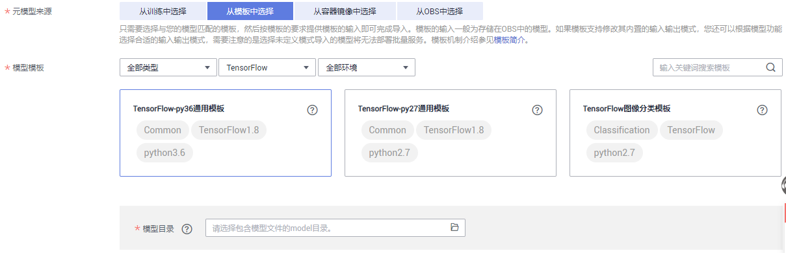

# 模型模板简介

相同功能的模型配置信息重复率高，将相同功能的配置整合成一个通用的模板，通过使用该模板，可以方便快捷的导入模型，而不用编写config.json配置文件。简单来说，模板将AI引擎以及模型配置模板化，每种模板对应于1种具体的AI引擎及1种推理模式，借助模板，可以快速导入模型到ModelArts。

## 背景信息

模板分两大类型：通用类型，非通用类型。

-   非通用类型模板，针对特定的场景所定制的，固定输入输出模式，不可覆盖，如“TensorFlow图像分类模板“，固定使用预置图像处理模式。
-   通用模板，搭载特定的AI引擎以及运行环境，内置的输入输出模式为未定义模式，即不定义具体的输入输出格式，用户需根据模型功能或业务场景重新选择新的输入输出模式来覆盖内置的未定义模式，如图像分类模型应选择预置图像处理模式，而目标检测模型则应选择预置物体检测模式。

    > **说明：** 
    >使用未定义模式的模型将无法部署批量服务。

## 如何使用模板

以[TensorFlow-py36通用模板](TensorFlow-py36通用模板.md)为例，您需要事先将模型包上传至OBS。模型文件应存放在model目录下，通过该模板创建模型时，您需要选择到model这一目录。

1.  在“导入模型“页面，在“元模型来源“参数中选择“从模板中选择“。
2.  在“模型模板”区域，选择一个通用模板。

    ModelArts还提供“类型“、“引擎“、“环境“三个筛选条件，帮助您更快找到想要的模板。如果这个三个筛选条件不能满足您的要求，可以使用关键词搜索，找到目标模板。

    **图 1**  选择模板  
    

3.  在“模型目录“中，选择模型文件存储的model目录。详细规范请参见[模板说明](模板说明.md)。

    > **说明：** 
    >当训练作业执行多次时，将基于V001、V002等规则生成不同的版本目录，且生成的模型将存储在不同版本目录下的model文件夹。此处选择模型文件时，需指定对应版本目录下的model文件夹。

4.  如果您选择的模板允许覆盖其中的默认输入输出模式，您可以根据模型功能或业务场景在“输入输出模式“中，选择相应的输入输出模式。“输入输出模式“是对“config.json“中API的抽象，描述模型对外提供推理的接口。一个“输入输出模式“描述一个或多个API接口，每个模板对应于一个“输入输出模式“。

    当前支持的“输入输出模式“及其说明请参见[输入输出模式说明](输入输出模式说明.md)。

## 支持的模板

-   [TensorFlow图像分类模板](TensorFlow图像分类模板.md)
-   [TensorFlow-py27通用模板](TensorFlow-py27通用模板.md)
-   [TensorFlow-py36通用模板](TensorFlow-py36通用模板.md)
-   [MXNet-py27通用模板](MXNet-py27通用模板.md)
-   [MXNet-py36通用模板](MXNet-py36通用模板.md)
-   [PyTorch-py27通用模板](PyTorch-py27通用模板.md)
-   [PyTorch-py36通用模板](PyTorch-py36通用模板.md)
-   [Caffe-CPU-py27通用模板](Caffe-CPU-py27通用模板.md)
-   [Caffe-GPU-py27通用模板](Caffe-GPU-py27通用模板.md)
-   [Caffe-CPU-py36通用模板](Caffe-CPU-py36通用模板.md)
-   [Caffe-GPU-py36通用模板](Caffe-GPU-py36通用模板.md)
-   [ARM-Ascend模板](ARM-Ascend模板.md)

## 支持的输入输出模式

-   [预置物体检测模式](预置物体检测模式.md)
-   [预置图像处理模式](预置图像处理模式.md)
-   [预置预测分析模式](预置预测分析模式.md)
-   [未定义模式](未定义模式.md)

