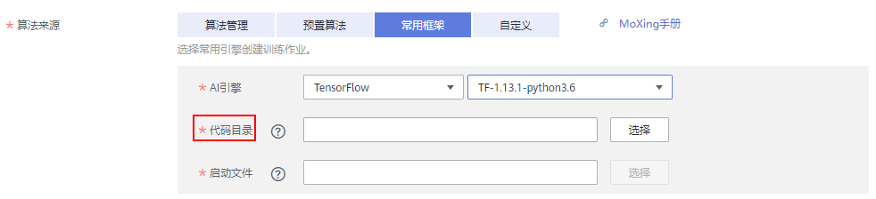
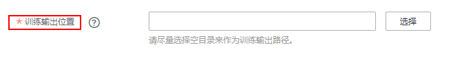
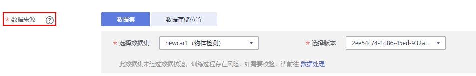
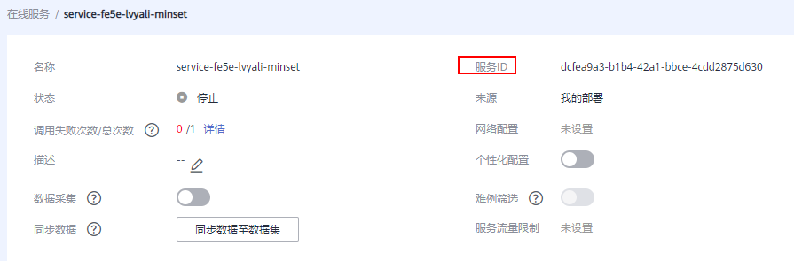
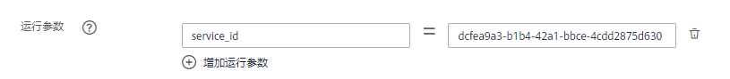

# 模型评估代码示例<a name="modelarts_23_0128"></a>

针对图像分类、图像语义分割、物体检测以及利用ModelArts推理服务进行引擎无关的模型评估等常用场景，提供代码示例，您可以参考示例编写您的评估代码。

-   [图像分类评估代码示例](#section8133184576)
-   [图像语义分割评估代码示例](#section79471053131411)
-   [物体检测评估代码示例](#section206532572177)
-   [调用ModelArts推理服务接口进行模型评估代码示例](#section194949281157)（与引擎无关的模型评估）

## 图像分类评估代码示例<a name="section8133184576"></a>

以下样例代码对应训练模型为预置算法ResNet\_v1\_50（TensorFlow引擎）。

-   “model\_url“：模型目录，界面上选择模型版本后，后台自动添加此参数，无需手工添加。
-   “data\_url“：数据集目录，界面上选择数据集版本后，后台自动添加此参数，无需手工添加。

```
import json
import logging
import os
import sys
import tempfile

import h5py
import numpy as np
from PIL import Image

import moxing as mox
import tensorflow as tf
from deep_moxing.framework.manifest_api.manifest_api import get_sample_list
from deep_moxing.model_analysis.api import analyse, tmp_save
from deep_moxing.model_analysis.common.constant import TMP_FILE_NAME

logging.basicConfig(level=logging.DEBUG)

FLAGS = tf.app.flags.FLAGS
tf.app.flags.DEFINE_string('model_url', '', 'path to saved model')
tf.app.flags.DEFINE_string('data_url', '', 'path to output files')
tf.app.flags.DEFINE_string('adv_param_json',
                           '{"attack_method":"i-FGSM","eps":30, "iter_times":4}',
                           'params for attacks')
FLAGS(sys.argv, known_only=True)


def _preprocess(data_path):
    img = Image.open(data_path)
    img = img.convert('RGB')
    img = np.asarray(img, dtype=np.float32)
    img = img[np.newaxis, :, :, :]
    return img


def softmax(x):
    x = np.array(x)
    orig_shape = x.shape
    if len(x.shape) > 1:
        # Matrix
        x = np.apply_along_axis(lambda x: np.exp(x - np.max(x)), 1, x)
        denominator = np.apply_along_axis(lambda x: 1.0 / np.sum(x), 1, x)
        if len(denominator.shape) == 1:
            denominator = denominator.reshape((denominator.shape[0], 1))
        x = x * denominator
    else:
        # Vector
        x_max = np.max(x)
        x = x - x_max
        numerator = np.exp(x)
        denominator = 1.0 / np.sum(numerator)
        x = numerator.dot(denominator)
    assert x.shape == orig_shape
    return x


def get_dataset(data_path, label_map_dict):
    label_list = []
    img_name_list = []
    if 'manifest' in data_path:
        manifest, _ = get_sample_list(
            manifest_path=data_path, task_type='image_classification')
        for item in manifest:
            if len(item[1]) != 0:
                label_list.append(label_map_dict.get(item[1][0]))
                img_name_list.append(item[0])
            else:
                continue
    else:
        label_name_list = os.listdir(data_path)
        label_dict = {}
        for idx, item in enumerate(label_name_list):
            label_dict[str(idx)] = item
            sub_img_list = os.listdir(os.path.join(data_path, item))
            img_name_list += [
                os.path.join(data_path, item, img_name) for img_name in sub_img_list
            ]
            label_list += [label_map_dict.get(item)] * len(sub_img_list)
    return img_name_list, label_list


def deal_ckpt_and_data_with_obs():
    pb_dir = FLAGS.model_url
    data_path = FLAGS.data_url

    if pb_dir.startswith('obs://'):
        mox.file.copy_parallel(pb_dir, '/cache/ckpt/')
        pb_dir = '/cache/ckpt'
        print('------------- download success ------------')
    if data_path.startswith('obs://'):
        mox.file.copy_parallel(data_path, '/cache/data/')
        data_path = '/cache/data/'
        print('------------- download dataset success ------------')
    assert os.path.isdir(pb_dir), 'Error, pb_dir must be a directory'
    return pb_dir, data_path


def evalution():
    pb_dir, data_path = deal_ckpt_and_data_with_obs()
    adv_param_json = FLAGS.adv_param_json
    index_file = os.path.join(pb_dir, 'index')
    try:
        label_file = h5py.File(index_file, 'r')
        label_array = label_file['labels_list'][:].tolist()
        label_array = [item.decode('utf-8') for item in label_array]
    except Exception as e:
        logging.warning(e)
        logging.warning('index file is not a h5 file, try json.')
        with open(index_file, 'r') as load_f:
            label_file = json.load(load_f)
        label_array = label_file['labels_list'][:]
    label_map_dict = {}
    label_dict = {}
    for idx, item in enumerate(label_array):
        label_map_dict[item] = idx
        label_dict[idx] = item
    print(label_map_dict)
    print(label_dict)

    data_file_list, label_list = get_dataset(data_path, label_map_dict)

    assert len(label_list) > 0, 'missing valid data'
    assert None not in label_list, 'dataset and model not match'

    pred_list = []
    file_name_list = []
    img_list = []
    for img_path in data_file_list:
        img = _preprocess(img_path)
        img_list.append(img)
        file_name_list.append(img_path)
    config = tf.ConfigProto()
    config.gpu_options.allow_growth = True
    config.gpu_options.visible_device_list = '0'
    with tf.Session(graph=tf.Graph(), config=config) as sess:
        meta_graph_def = tf.saved_model.loader.load(
            sess, [tf.saved_model.tag_constants.SERVING], pb_dir)
        signature = meta_graph_def.signature_def
        signature_key = 'predict_object'
        input_key = 'images'
        output_key = 'logits'
        x_tensor_name = signature[signature_key].inputs[input_key].name
        y_tensor_name = signature[signature_key].outputs[output_key].name
        x = sess.graph.get_tensor_by_name(x_tensor_name)
        y = sess.graph.get_tensor_by_name(y_tensor_name)
        for img in img_list:
            pred_output = sess.run([y], {x: img})
            pred_output = softmax(pred_output[0])
            pred_list.append(pred_output[0].tolist())

    label_dict = json.dumps(label_dict)
    task_type = 'image_classification'

    # analyse
    res = analyse(
        task_type=task_type,
        pred_list=pred_list,
        label_list=label_list,
        name_list=file_name_list,
        label_map_dict=label_dict)


if __name__ == "__main__":
    evalution()
```

## 图像语义分割评估代码示例<a name="section79471053131411"></a>

以下样例代码对应训练模型为D-LinkNet道路分割模型（TensorFlow引擎）。

-   “model\_url“：模型目录，界面上选择模型版本后，后台自动添加此参数，无需手工添加。
-   “data\_url“：数据集目录，界面上选择数据集版本后，后台自动添加此参数，无需手工添加

```
import glob
import json
import logging
import os
import sys

import numpy as np
from PIL import Image

import moxing as mox
import tensorflow as tf
from deep_moxing.model_analysis.api import analyse

logging.basicConfig(level=logging.DEBUG)

FLAGS = tf.app.flags.FLAGS
tf.app.flags.DEFINE_string('model_url', '', 'path to saved model')
tf.app.flags.DEFINE_string('data_url', '', 'path to data files')
FLAGS(sys.argv, known_only=True)


def _norm(img):
    mean = np.mean(img, axis=(0, 1), keepdims=True)
    std = np.std(img, axis=(0, 1), keepdims=True)
    img = (img - mean) / std
    return img


def _preprocess(data_path):
    img = Image.open(data_path)
    img = img.convert('RGB')
    img = np.asarray(img, dtype=np.float32)
    img = _norm(img)
    img = img[np.newaxis, :, :, :]
    return img


def evalution():
    pb_dir = FLAGS.model_url
    data_path = FLAGS.data_url

    if data_path.startswith('obs://'):
        mox.file.copy_parallel(data_path, '/cache/dataset')
        image_data_path = '/cache/dataset/eval_uint8'
        label_path = '/cache/dataset/eval_label'
    else:
        image_data_path = os.path.join(data_path, 'eval_uint8')
        label_path = os.path.join(data_path, 'eval_label')
    if pb_dir.startswith('obs://'):
        mox.file.copy_parallel(pb_dir, '/cache/model')
        pb_dir = '/cache/model'

    label_dict = {'0': 'background', '1': 'road'}

    pred_list = []
    file_name_list = []
    img_list = []

    label_list = []
    label_file_list = glob.glob(label_path + '/*.' + 'png')
    label_file_list = sorted(label_file_list)
    for img_path in label_file_list:
        label_img = Image.open(img_path)
        label_img = np.asarray(label_img, dtype=np.uint8)
        label_img = (label_img > 128).astype(np.int8)
        label_list.append(label_img)

    data_file_list = glob.glob(image_data_path + '/*.' + 'jpg')
    data_file_list = sorted(data_file_list)
    for img_path in data_file_list:
        img = _preprocess(img_path)
        img_list.append(img)
        file_name_list.append(img_path)

    config = tf.ConfigProto()
    config.gpu_options.allow_growth = True
    config.gpu_options.visible_device_list = '0'
    with tf.Session(graph=tf.Graph(), config=config) as sess:
        meta_graph_def = tf.saved_model.loader.load(
            sess, [tf.saved_model.tag_constants.SERVING], pb_dir)
        signature = meta_graph_def.signature_def
        signature_key = 'segmentation'
        input_key = 'images'
        output_key = 'logists'
        x_tensor_name = signature[signature_key].inputs[input_key].name
        y_tensor_name = signature[signature_key].outputs[output_key].name
        x = sess.graph.get_tensor_by_name(x_tensor_name)
        y = sess.graph.get_tensor_by_name(y_tensor_name)
        for idx, img in enumerate(img_list):
            pred_output, = sess.run([y], {x: img})
            pred_output = np.squeeze(pred_output)
            pred_list.append(pred_output.tolist())
            logging.info(file_name_list[idx])

    label_dict = json.dumps(label_dict)
    task_type = 'image_segmentation'

    # analyse
    res = analyse(
        task_type=task_type,
        pred_list=pred_list,
        label_list=label_list,
        name_list=file_name_list,
        label_map_dict=label_dict,)


if __name__ == "__main__":
    evalution()
```

## 物体检测评估代码示例<a name="section206532572177"></a>

以下样例代码对应训练模型为预置算法Faster\_RCNN\_ResNet\_v1\_50（TensorFlow引擎）。

-   “model\_url“：模型目录，界面上选择模型版本后，后台自动添加此参数，无需手工添加。
-   “data\_url“：数据集目录，界面上选择数据集版本后，后台自动添加此参数，无需手工添加。

```
import moxing as mox
from deep_moxing.model_analysis.api import analyse
from deep_moxing.framework.manifest_api.manifest_api import get_list
import tensorflow as tf
from PIL import Image
import numpy as np
import xml.etree.ElementTree as ET
import h5py
import os
import json
import logging
import time
import sys

logging.basicConfig(level=logging.DEBUG)

FLAGS = tf.app.flags.FLAGS
tf.app.flags.DEFINE_string('model_url', '', 'path to saved model')
tf.app.flags.DEFINE_string('data_url', '', 'path to output files')
FLAGS(sys.argv, known_only=True)


def _get_label(label_path, label_map_dict):
    root = ET.parse(label_path).getroot()
    bbox_list = []
    label_list = []
    for obj in root.iter('object'):
        xml_box = obj.find('bndbox')
        xmin = int(float(xml_box.find('xmin').text))
        ymin = int(float(xml_box.find('ymin').text))
        xmax = int(float(xml_box.find('xmax').text))
        ymax = int(float(xml_box.find('ymax').text))
        label_name = obj.find('name').text
        bbox_list.append([ymin, xmin, ymax, xmax])
        label_list.append(label_map_dict.get(label_name))
    assert None not in label_list, 'dataset and model not match'
    return [bbox_list, label_list]


def _preprocess(data_path):
    img = Image.open(data_path)
    img = img.convert('RGB')
    img = np.asarray(img, dtype=np.float32)
    img = img[np.newaxis, :, :, :]
    return img


def get_data_ckpt_local():
    pb_dir = FLAGS.model_url
    data_path = FLAGS.data_url
    data_file_list = []
    label_file_list = []
    if 'manifest' in data_path:
        data_file_list, label_file_list = get_list(manifest_path=data_path)
        print('------------- download ------------')
        mox.file.copy_parallel(pb_dir, '/cache/ckpt/')
        pb_dir = '/cache/ckpt'
        print('------------- download success ------------')
    elif data_path.startswith('obs://'):
        print('------------- download ------------')
        mox.file.copy_parallel(pb_dir, '/cache/ckpt/')
        mox.file.copy_parallel(data_path, '/cache/data/')
        pb_dir = '/cache/ckpt'
        data_path = '/cache/data/'
        print('------------- download success ------------')

    if pb_dir:
        assert os.path.isdir(pb_dir), 'Error, pb_dir must be a directory'

    index_file = os.path.join(pb_dir, 'index')
    label_list = []
    file_name_list = []
    img_list = []
    try:
        label_file = h5py.File(index_file, 'r')
        label_array = label_file['labels_list'][:].tolist()
        label_array = [item.decode('utf-8') for item in label_array]
    except Exception as e:
        logging.warning(e)
        logging.warning('index file is not a h5 file, try json.')
        with open(index_file, 'r') as load_f:
            label_file = json.load(load_f)
        label_array = label_file['labels_list'][:]
    label_map_dict = {}
    label_dict = {}
    for idx, item in enumerate(label_array):
        label_map_dict[item] = idx
        label_dict[idx] = item
    if 'manifest' in data_path:
        for img_path, xml_path in zip(data_file_list, label_file_list):
            label = _get_label(xml_path, label_map_dict)
            img = _preprocess(img_path)
            label_list.append(label)
            img_list.append(img)
            file_name_list.append(img_path)
    else:
        file_list = os.listdir(data_path)
        for item in file_list:
            if ('jpg' in item) or ('bmp' in item) or ('png' in item):
                xml_path = os.path.join(data_path, item.split('.')[0] + '.xml')
                img_path = os.path.join(data_path, item)
                label = _get_label(xml_path, label_map_dict)
                img = _preprocess(img_path)
                label_list.append(label)
                img_list.append(img)
                file_name_list.append(img_path)
            else:
                continue
    assert len(label_list) > 0, 'missing valid data'
    return pb_dir, label_list, label_dict, file_name_list, img_list


def evalution():
    pred_list = []
    pb_dir, label_list, label_dict, file_name_list, img_list = get_data_ckpt_local()
    config = tf.ConfigProto()
    config.gpu_options.allow_growth = True
    config.gpu_options.visible_device_list = '0'
    with tf.Session(graph=tf.Graph(), config=config) as sess:
        meta_graph_def = tf.saved_model.loader.load(
            sess, [tf.saved_model.tag_constants.SERVING], pb_dir)
        signature = meta_graph_def.signature_def
        signature_key = 'predict_object'
        input_key = 'images'
        output_key0 = 'detection_boxes'
        output_key1 = 'detection_classes'
        output_key2 = 'detection_scores'
        x_tensor_name = signature[signature_key].inputs[input_key].name
        y_tensor_name0 = signature[signature_key].outputs[output_key0].name
        y_tensor_name1 = signature[signature_key].outputs[output_key1].name
        y_tensor_name2 = signature[signature_key].outputs[output_key2].name
        x = sess.graph.get_tensor_by_name(x_tensor_name)
        y0 = sess.graph.get_tensor_by_name(y_tensor_name0)
        y1 = sess.graph.get_tensor_by_name(y_tensor_name1)
        y2 = sess.graph.get_tensor_by_name(y_tensor_name2)
        start = time.time()
        for img in img_list:
            pred_detection_boxes, pred_detection_classes, \
                pred_detection_scores = sess.run([y0, y1, y2], {x: img})
            if pred_detection_boxes.ndim == 3:
                pred_detection_boxes = pred_detection_boxes[0]
                pred_detection_classes = pred_detection_classes[0]
                pred_detection_scores = pred_detection_scores[0]
            pred_list.append([
                pred_detection_boxes.tolist(),
                (pred_detection_classes - 1).tolist(),
                pred_detection_scores.tolist()
            ])
        end = time.time()
        fps = len(img_list) / (end - start)

    diy_metric = {'fps': {'value': {'fps': fps}}}
    label_dict = json.dumps(label_dict)
    task_type = 'image_object_detection'

    # analyse
    res = analyse(
        task_type=task_type,
        pred_list=pred_list,
        label_list=label_list,
        name_list=file_name_list,
        custom_metric=diy_metric,
        label_map_dict=label_dict)

if __name__ == "__main__":
    evalution()
```

## 调用ModelArts推理服务接口进行模型评估代码示例<a name="section194949281157"></a>

完成模型部署后，用户可以调用在线服务推理接口进行模型评估，推荐用户使用创建训练作业的方式来跑该示例。

准备工作

-   已完成在线服务的部署。
-   该示例需要安装[ModelArst SDK依赖包](https://cnnorth1-modelarts-sdk.obs.cn-north-1.myhuaweicloud.com/modelarts-latest-py2.py3-none-any.whl)，下载ModelArts SDK的安装包到本地，并上传到OBS评估代码所在的同级目录中，即代码目录下。

    **图 1**  代码目录<a name="fig1793924016281"></a>  
    

    代码目录文件如下：

    ```
    |----code_dir
       |----eval.py
       |----modelarts-latest-py2.py3-none-any.whl
    ```


该样例代码为使用标准的检测服务进行模型评估的样例。用户可以参考[使用常用框架训练模型](zh-cn_topic_0216621183.md)创建训练作业完成模型评估。其中代码中的三个运行参数分别从如下位置传入后台：

-   “train\_url“：评估结果输出目录。

    **图 2**  train\_url<a name="fig07331052113718"></a>  
    

-   “data\_url“：数据来源目录。

    **图 3**  data\_url<a name="fig158041842385"></a>  
    

-   “service\_id“：已部署的标准在线服务ID。用户可以在已部署的在线服务详情页获取服务ID。

    **图 4**  获取service\_id<a name="fig024218175314"></a>  
    

    **图 5**  通过运行参数传入service\_id<a name="fig1535384564420"></a>  
    


下面为eval.py代码示例，代码中需要更改LABEL\_MAP\_DICT常量，与您自己的数据集适配。

```
import moxing as mox
import argparse
import xml.etree.ElementTree as ET
import os
whl_path = os.path.join(os.path.abspath(os.path.dirname(__file__)), 'modelarts-latest-py2.py3-none-any.whl')
os.system('pip install ' + whl_path)
from modelarts.session import Session
from modelarts.model import Predictor
from deep_moxing.model_analysis.api import analyse


# label map dict，标签与类别数字的对应关系。
LABEL_MAP_DICT = {'blue': 0, 'none': 1, 'red': 2, 'white': 3, 'yellow': 4}
os.environ['COMMON_REQUEST_TIME_OUT'] = '30'


# 获取图片的真实标签，返回值为框的坐标和框的类别名称。
def get_xml_info(xml_path):
    """
    :return: {'bbox':[[], []], 'name': [], 'data_file':str}
    """
    tree = ET.ElementTree()
    xml_parser = ET.XMLParser(target=ET.TreeBuilder())
    xml_parser.feed(mox.file.read(xml_path, binary=True))
    tree._root = xml_parser.close()
    xml_tree = tree
    objs = xml_tree.findall('object')

    # 获取所有已标注的目标框结果。
    bbox_list = []
    name_list = []
    for ix, obj in enumerate(objs):
        bbox = obj.find('bndbox')
        name_list.append(obj.find('name').text.lower().strip())
        bbox_list.append([float(bbox.find('ymin').text.lower().strip()),
                          float(bbox.find('xmin').text.lower().strip()),
                          float(bbox.find('ymax').text.lower().strip()),
                          float(bbox.find('xmax').text.lower().strip())])
    return {'bbox': bbox_list, 'name': name_list}


def inference(data_path, predictor_instance):
    predict_result = predictor_instance.predict(data=data_path, data_type='images')
    return predict_result


def predict(data_url, service_id, train_url):
    pred_list = []
    name_list = []
    label_list = []
    # 拷贝数据集到本地。
    mox.file.copy_parallel(data_url, '/cache/data/')
    # 初始化Session，使用Modelarts SDK。
    session = Session()
    predictor_instance = Predictor(session, service_id=service_id)
    # 不断送入图片。
    for filename in mox.file.list_directory('/cache/data/'):
        if '.jpg' in filename or '.png' in filename or 'jpeg' in filename:
            data_path = os.path.join('/cache/data/', filename)
            xml_path = os.path.join('/cache/data/', filename.split('.')[0] + '.xml')
            # 获取推理结果。
            result = inference(data_path, predictor_instance)
            # 获取真实标签。
            label = get_xml_info(xml_path)
            # 原图路径name_list，必须是OBS路径。
            name_list.append(os.path.join(data_url, filename))
            for idx in range(len(label['name'])):
                label['name'][idx] = LABEL_MAP_DICT[label['name'][idx]]
            # 组织真实标签结果label_list。
            label_list.append([label['bbox'], label['name']])
            # 组织推理标签结果pred_list。
            if result is not None:
                for idx in range(len(result['detection_classes'])):
                    result['detection_classes'][idx] = LABEL_MAP_DICT[result['detection_classes'][idx]]
                pred_list.append([result['detection_boxes'], result['detection_classes'], result['detection_scores']])
            else:
                pred_list.append([[[]], [], []])

    mox.file.make_dirs('/cache/output/')
    analyse(task_type='image_object_detection', pred_list=pred_list, name_list=name_list, label_list=label_list,
            label_map_dict={value:key for key, value in LABEL_MAP_DICT.items()}, save_path='/cache/output/')
    # 拷贝结果到输出目录。
    mox.file.copy_parallel('/cache/output/', train_url)


if __name__ == '__main__':
    parser = argparse.ArgumentParser(description='Process some integers.')
    parser.add_argument('--data_url', default='',
                        type=str,
                        help='data root directory path')
    parser.add_argument('--train_url',
                        default='',
                        type=str,
                        help='output path')
    parser.add_argument('--service_id',
                        default='',
                        type=str,
                        help='inference service id')

    args, unknown = parser.parse_known_args()
    predict(args.data_url, args.service_id, args.train_url)
```

