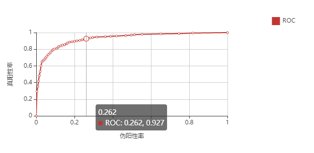
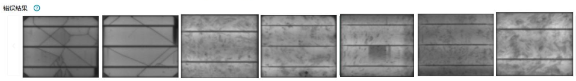

# 模型评估接口<a name="modelarts_23_0311"></a>

自定义推理代码可以让代码自行计算推理结果，并按ModelArts定义的规则调用analyse评估接口。

-   [接口说明（通用接口）](#section1912114581720)
-   [接口说明（自定义的评估指标）](#section855419291067)

## 接口说明（通用接口）<a name="section1912114581720"></a>

ModelArts提供了“analyse“接口，可以将推理结果以规定格式保存。该接口用于按指定格式保存推理结果，用户需要在自己的推理结束后，按下述规则自行调用。

```
analyse(task_type='',
         pred_list=[],
         label_list=[],
         name_list=[],
         custom_metric='',
         label_map_dict=''
)
```

**表 1**  参数说明

<a name="table885042710388"></a>
<table><thead align="left"><tr id="row118502270388"><th class="cellrowborder" valign="top" width="20.32%" id="mcps1.2.4.1.1"><p id="p1185019275380"><a name="p1185019275380"></a><a name="p1185019275380"></a>参数</p>
</th>
<th class="cellrowborder" valign="top" width="12.06%" id="mcps1.2.4.1.2"><p id="p7385544144013"><a name="p7385544144013"></a><a name="p7385544144013"></a>是否必选</p>
</th>
<th class="cellrowborder" valign="top" width="67.62%" id="mcps1.2.4.1.3"><p id="p7850172716387"><a name="p7850172716387"></a><a name="p7850172716387"></a>说明</p>
</th>
</tr>
</thead>
<tbody><tr id="row5850202714388"><td class="cellrowborder" valign="top" width="20.32%" headers="mcps1.2.4.1.1 "><p id="p485018277389"><a name="p485018277389"></a><a name="p485018277389"></a>task_type</p>
</td>
<td class="cellrowborder" valign="top" width="12.06%" headers="mcps1.2.4.1.2 "><p id="p19385154418404"><a name="p19385154418404"></a><a name="p19385154418404"></a>是</p>
</td>
<td class="cellrowborder" valign="top" width="67.62%" headers="mcps1.2.4.1.3 "><p id="p3432096013"><a name="p3432096013"></a><a name="p3432096013"></a>任务类型。支持<span class="parmname" id="parmname943119102"><a name="parmname943119102"></a><a name="parmname943119102"></a>“image_classification”</span>、<span class="parmname" id="parmname9431091011"><a name="parmname9431091011"></a><a name="parmname9431091011"></a>“image_object_detection”</span>、</p>
<p id="p1841199701"><a name="p1841199701"></a><a name="p1841199701"></a><span class="parmname" id="parmname85331311904"><a name="parmname85331311904"></a><a name="parmname85331311904"></a>“image_segmentation”</span>。</p>
<a name="ul171691224595"></a><a name="ul171691224595"></a><ul id="ul171691224595"><li><span class="parmname" id="parmname1284514024219"><a name="parmname1284514024219"></a><a name="parmname1284514024219"></a>“image_classification”</span>表示图像分类。</li><li><span class="parmname" id="parmname1131683422"><a name="parmname1131683422"></a><a name="parmname1131683422"></a>“image_object_detection”</span>表示物体检测。</li><li><span class="parmname" id="parmname6560843212"><a name="parmname6560843212"></a><a name="parmname6560843212"></a>“image_segmentation”</span>表示图像语义分割。</li></ul>
</td>
</tr>
<tr id="row88501227103817"><td class="cellrowborder" valign="top" width="20.32%" headers="mcps1.2.4.1.1 "><p id="p197011323144415"><a name="p197011323144415"></a><a name="p197011323144415"></a>pred_list</p>
</td>
<td class="cellrowborder" valign="top" width="12.06%" headers="mcps1.2.4.1.2 "><p id="p1480619302440"><a name="p1480619302440"></a><a name="p1480619302440"></a>是</p>
</td>
<td class="cellrowborder" valign="top" width="67.62%" headers="mcps1.2.4.1.3 "><p id="p9699102354418"><a name="p9699102354418"></a><a name="p9699102354418"></a>模型预测输出列表。</p>
</td>
</tr>
<tr id="row1851112793810"><td class="cellrowborder" valign="top" width="20.32%" headers="mcps1.2.4.1.1 "><p id="p6850132720388"><a name="p6850132720388"></a><a name="p6850132720388"></a>label_list</p>
</td>
<td class="cellrowborder" valign="top" width="12.06%" headers="mcps1.2.4.1.2 "><p id="p19386114474017"><a name="p19386114474017"></a><a name="p19386114474017"></a>是</p>
</td>
<td class="cellrowborder" valign="top" width="67.62%" headers="mcps1.2.4.1.3 "><p id="p0851427183818"><a name="p0851427183818"></a><a name="p0851427183818"></a>所有图片的标签列表。</p>
</td>
</tr>
<tr id="row58518271386"><td class="cellrowborder" valign="top" width="20.32%" headers="mcps1.2.4.1.1 "><p id="p15851827103810"><a name="p15851827103810"></a><a name="p15851827103810"></a>name_list</p>
</td>
<td class="cellrowborder" valign="top" width="12.06%" headers="mcps1.2.4.1.2 "><p id="p1338654411408"><a name="p1338654411408"></a><a name="p1338654411408"></a>是</p>
</td>
<td class="cellrowborder" valign="top" width="67.62%" headers="mcps1.2.4.1.3 "><p id="p485172718384"><a name="p485172718384"></a><a name="p485172718384"></a>所有图片对应的OBS路径。此处需使用绝对路径。</p>
</td>
</tr>
<tr id="row1290711335401"><td class="cellrowborder" valign="top" width="20.32%" headers="mcps1.2.4.1.1 "><p id="p585142753816"><a name="p585142753816"></a><a name="p585142753816"></a>custom_metric</p>
</td>
<td class="cellrowborder" valign="top" width="12.06%" headers="mcps1.2.4.1.2 "><p id="p14386644124015"><a name="p14386644124015"></a><a name="p14386644124015"></a>否</p>
</td>
<td class="cellrowborder" valign="top" width="67.62%" headers="mcps1.2.4.1.3 "><p id="p1485172793815"><a name="p1485172793815"></a><a name="p1485172793815"></a>用户自定义的指标。</p>
</td>
</tr>
<tr id="row8908103318402"><td class="cellrowborder" valign="top" width="20.32%" headers="mcps1.2.4.1.1 "><p id="p11908133164015"><a name="p11908133164015"></a><a name="p11908133164015"></a>label_map_dict</p>
</td>
<td class="cellrowborder" valign="top" width="12.06%" headers="mcps1.2.4.1.2 "><p id="p738615446408"><a name="p738615446408"></a><a name="p738615446408"></a>否</p>
</td>
<td class="cellrowborder" valign="top" width="67.62%" headers="mcps1.2.4.1.3 "><p id="p690863311405"><a name="p690863311405"></a><a name="p690863311405"></a>标签索引和名称。如果不设置，系统默认使用{"0": "0", "1": "1", "2": "2", ...}作为展示标签。例如，{"0": "dog", "1": "cat", "2": "horse"}</p>
</td>
</tr>
</tbody>
</table>

“pred\_list“、  “label\_list“、“name\_list“必须是长度相同的Python list对象，3个list中的对象必须**一一对应**，例如“pred\_list“的第一个元素是第一张图片的预测结果，“label\_list“的第一个元素是第一张图片的标签，“name\_list“的第一个元素是第一张图片的完整绝对路径。

其中“name\_list“为OBS中图片存储的路径，涉及到相关指标为敏感度分析和推理结果查看，需要与pred和labellist一一对应。示例如下：

```
['obs://test/cat/xxx.jpg', ..., 'obs://test/dog/yyy.jpg']
```

图像分类的评估代码中，“pred\_list“的样例如下所示。“pred\_list“的元素是一维numpy ndarray或者一维python list，长度为分类类别个数。表示该张图片在各个类别上的置信度。

```
[
[0.87, 0.11, 0.02], 
[0.1, 0.7, 0.2], 
[0.03, 0.04, 0.93], 
[0.25, 0.65, 0.1], 
[0.3, 0.34, 0.36]
]
```

“label\_list“的样例如下所示，“label\_list“的元素为整型数值，表示该张图片的标签分类。

```
[0, 1, 2, 1, 2]
```

图像语义分割的评估代码中，“pred\_list“中的元素样式为该张图片各个像素的推理分类结果，shape与图片大小一致。

```
[
   [[0, 2, 1, 1, 0, 1, 2, ...]
    [0, 1, 0, 0, 0, 0, 0, ...]
    ...
    [2, 1, 1, 0, 0, 1, 2, ...]],
    ...
]
```

“label\_list“中的元素样式， 该张图片各个像素的标签分类，shape与图片大小一致。

```
[
   [[1, 2, 0, 1, 0, 1, 2, ...]
    [0, 0, 0, 0, 0, 1, 0, ...]
    ...
    [2, 2, 1, 0, 0, 1, 2, ...]],
    ...
]
```

物体检测的评估代码中，“pred\_list“的样例如下所示。Python list包含3个元素，第1个是二维数组或numpy ndarray对象，形状为“num\(一张图片中框的个数\)\*4\(ymin, xmin, ymax, xmax\)“。第2个是一维数组或numpy ndarray对象，长度为“num\(一张图片中框的个数\)“。第3个是一维数组或numpy ndarray对象，长度为“num\(一张图片中框的个数\)“。表示“\[目标框坐标，目标框类别，目标框对应类别置信度\]“。

```
[
	[
		[
			[142.26546  , 172.09337  , 182.41393  , 206.43747  ],
			[149.60696  , 232.63474  , 185.081    , 262.0958   ],
			[151.28708  , 305.58755  , 186.05899  , 335.83026  ]
		],
        [1, 1, 1],
        [0.999926  , 0.9999119 , 0.99985504]
	],
		
    [
		[
			[184.18466 , 100.23248 , 231.96555 , 147.65791 ],
			[ 43.406055, 252.89429 ,  84.62765 , 290.55862 ]
		],
        [3, 3],
        [0.99985814, 0.99972576]
	],
    ...
]
```

“label\_list“的元素样例如下所示，Python list包含2个元素，第1个是二维数组或numpy ndarray对象，形状为“num\(一张图片中框的个数\)\*4\(ymin, xmin, ymax, xmax\)“,。第2个是一维数组或numpy ndarray对象，长度为“num\(一张图片中框的个数\)“。表示“\[目标框坐标，目标框类别\]“。

```
[
	[
		[
			[182., 100., 229., 146.],
			[ 44., 250.,  83., 290.]
		],
		[3, 3]
	],
	[
		[
			[148., 303., 191., 336.],
			[149., 231., 189., 262.],
			[141., 171., 184., 206.],
			[132., 344., 183., 387.],
			[144., 399., 189., 430.]
		],
		[1., 1., 1., 2., 4.]
	],
	...
]
```

## 接口说明（自定义的评估指标）<a name="section855419291067"></a>

如果有自定义的评估指标，要绘制在界面上，只要按一定的规则生成JSON的结构体，并写入到生成的JSON文件即可。

如下为可选的展现形式及其JSON结构体示例。您也可以将多个样式拼凑成一个完整的JSON体格式，完整示例可参见[ 多种样式拼凑成一个JSON](#li1933618362411)。

[绘图样式](#li1664612471883)

[表格样式](#li129845418920)

[图片样式](#li19506643694)

-   <a name="li1664612471883"></a>**绘图样式**

    **图 1**  绘图样式示例<a name="fig93181821477"></a>  
    

    JSON结构体

    ```
    折线图
    'line_chart':{'name':{'x_axis_name':str,
                          'y_axis_name':str,
                          'x_axis_range':[x_min, x_min+x_step, x_min+2*x_step, ..., x_max],
                          'y_axis_range':[y_min, y_min+y_step, y_min+2*y_step, ..., y_max],
                          'curve':{'label_1':[(x0,y0),(x1,y1),...],
                                   'label_2':[(x0,y0),(x1,y1),...],
                                   ...}
                          },
                  ...}
    饼图:饼上显示值或百分比
    'pie_chart':{'name':{'label':[label_name_1, label_name_2, ...]
                         'value':[value_1, value_2, ...]
                         },
                ...}
    柱形图:柱上方显示值
    'column_chart':{'name':{'x_axis_name':str,
                           'y_axis_name':str,
                           'x_axis_range':[x_min, x_min+x_step, x_min+2*x_step, ..., x_max],
                           'y_axis_range':[y_min, y_min+y_step, y_min+2*y_step, ..., y_max],
                           'x_value':{[value_1, value_2, ...value_n+1]},
                           'y_value':{[value_1, value_2, ...value_n]}
                           },
                    ...
    ```

-   <a name="li129845418920"></a>**表格样式**

    ```
    'table':{'name': {'top_left_cell':'cell text',
                      'row_labels':[name_1, name_2, ..., name_m],
                      'col_labels':[name_1, name_2, ..., name_n],
                      'cell_value':[[v11, v12, v13, ...,v1n], [], ...,[vm1, vm2, ...,vmn]]
                     },
            ...}
    ```

-   <a name="li19506643694"></a>**图片样式**

    **图 2**  图片样式示例<a name="fig974451110107"></a>  
    

    JSON结构体

    ```
    "get_negative_samples_cls":[
      {
          "labels":[
            {
                "name":"类别名",
                "type":0,
                "property":{
    
                }
            }
          ],
          "predict_labels":[
              {
                  "name":"类别名",
                  "type":0,
                  "property":{
    
                  }
              }
          ],
          "score":"0.424",
          "data_info":"/data/leedsbutterfly/images/0090180.png"
      }
    ]
    ```

-   <a name="li1933618362411"></a>**多种样式拼凑成一个JSON**

    可以将多个样式拼凑成一个完整的JSON体格式，如下示例是绘制一张折线图和表格的JSON体结构，需要填入关于该项的一些描述和标题信息。

    ```
    {
      'zh-cn':{
        'op_name_1': {
            'title': '中文标题',
            'description': '描述',
            'value':{'key':v1, 'key':v2, 'key':v3, ...},
            'table':{'name': {'top_left_cell':'cell text',
                          'row_labels':[name_1, name_2, ..., name_m],
                          'col_labels':[name_1, name_2, ..., name_n]
                          'cell_value':[[v11, v12, v13, ...,v1n], [], ...,[vm1, vm2, ...,vmn]]
                         },
                ...},
            'line_chart':{'name':{'x_axis_name':str,
                           'y_axis_name':str,
                           'x_axis_range':[x_min, x_min+x_step, x_min+2*step, ..., x_max],
                           'y_axis_range':[y_min, y_min+y_step, y_min+2*step, ..., y_max],
                           'curve':{'label_1':[(x0,y0),(x1,y1),...],
                                    'label_2':[(x0,y0),(x1,y1),...],
                                    ...}
                           },
                   ...}
          },
    }
    ```


