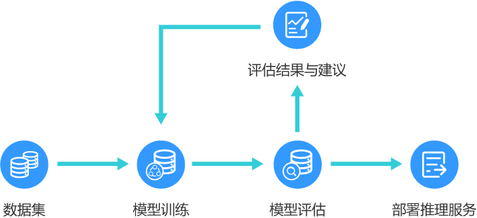

# 模型评估简介

在模型导入ModelArts之后，您可以通过模型的评估/诊断来判断模型是否满足业务要求。

## 模型评估的作用

针对不同类型模型的评估任务，提供相应的评估指标，在展示评估结果的同时，会根据不同的数据特征对模型进行详细的评估，获得每个数据特征对评估指标的敏感度，并给出优化建议。使得用户可以全面了解模型对不同数据特征的适应性，使得模型调优可以做到有的放矢。

针对预置算法或者添加了评估代码的训练作业，可以在训练结束后查看评估结果。详细指导和说明请参见[评估结果](zh-cn_topic_0171858286.md#section18514614151518)。

**图 1**  模型评估  

## 关于评估作业和作业版本

-   一个评估作业可以包含多个版本。
-   在同一作业中，您可以更改数据集或评估代码，创建一个新的版本。
-   一个评估作业版本，运行成功后可生成一个评估结果。您可以在版本管理下的评估结果页面查看各类评估指标对应的评估结果。

## 模型评估使用限制

-   模型评估/诊断目前支持三种类型的模型和数据集：“图像分类“、“物体检测“和“语义分割“。
-   进行评估/诊断的模型，使用的AI引擎为TensorFlow或PyTorch。目前只支持使用“TF-1.13.1-python3.6“、“TF-2.1.0-python3.6“、“PyTorch-1.4.0-python3.6“引擎编写评估代码。
-   只支持使用GPU资源。且资源池当前仅支持单节点运行模式，暂不支持分布式。
-   自动学习生成的模型暂时不支持模型评估。
-   由ModelArts提供的TensorFlow预置算法可以通过配置参数来设定训练后使用评估，或者导入到模型管理模块之后创建评估作业。

## 模型评估相关操作

-   [创建模型评估作业](创建模型评估作业.md)
-   [查看评估结果](查看评估结果.md)
-   [评估指标说明](评估指标说明.md)
-   [管理评估作业版本](管理评估作业版本.md)

