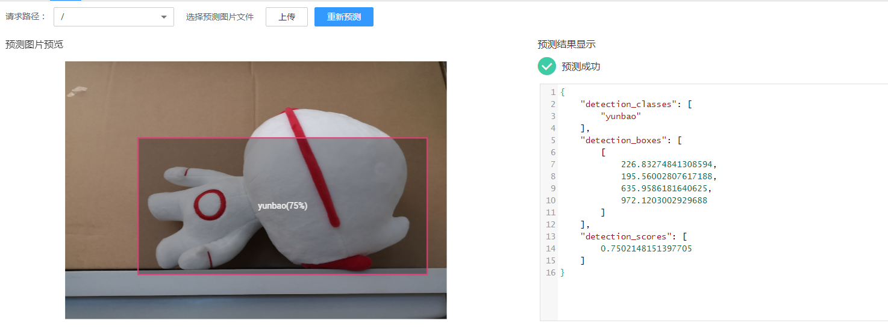
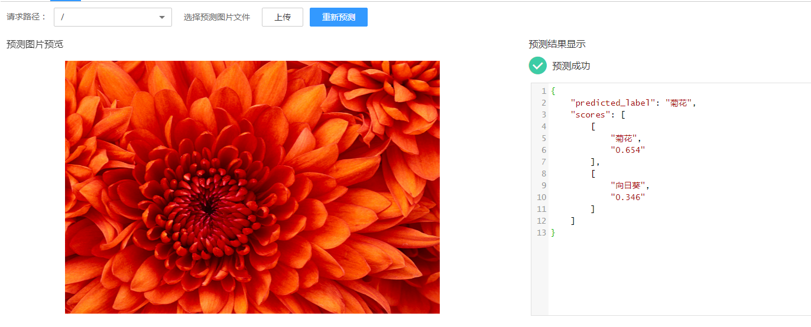

# 模型配置文件编写说明<a name="modelarts_23_0092"></a>

模型开发者发布模型时需要编写配置文件。模型配置文件描述模型用途、模型计算框架、模型精度、推理代码依赖包以及模型对外API接口。

## 配置文件格式说明<a name="section677218485416"></a>

配置文件为JSON格式，参数说明如[表1](#table7143191919436)所示。

**表 1**  参数说明

<a name="table7143191919436"></a>
<table><thead align="left"><tr id="row11203161917436"><th class="cellrowborder" valign="top" width="15.67%" id="mcps1.2.5.1.1"><p id="p1220313195432"><a name="p1220313195432"></a><a name="p1220313195432"></a>参数</p>
</th>
<th class="cellrowborder" valign="top" width="10.979999999999999%" id="mcps1.2.5.1.2"><p id="p19203171918436"><a name="p19203171918436"></a><a name="p19203171918436"></a>是否必选</p>
</th>
<th class="cellrowborder" valign="top" width="10.549999999999999%" id="mcps1.2.5.1.3"><p id="p14203151918436"><a name="p14203151918436"></a><a name="p14203151918436"></a>参数类型</p>
</th>
<th class="cellrowborder" valign="top" width="62.8%" id="mcps1.2.5.1.4"><p id="p42031019164312"><a name="p42031019164312"></a><a name="p42031019164312"></a>描述</p>
</th>
</tr>
</thead>
<tbody><tr id="row1720381944316"><td class="cellrowborder" valign="top" width="15.67%" headers="mcps1.2.5.1.1 "><p id="p2203181924319"><a name="p2203181924319"></a><a name="p2203181924319"></a>model_algorithm</p>
</td>
<td class="cellrowborder" valign="top" width="10.979999999999999%" headers="mcps1.2.5.1.2 "><p id="p15203121915435"><a name="p15203121915435"></a><a name="p15203121915435"></a>是</p>
</td>
<td class="cellrowborder" valign="top" width="10.549999999999999%" headers="mcps1.2.5.1.3 "><p id="p122031196437"><a name="p122031196437"></a><a name="p122031196437"></a>String</p>
</td>
<td class="cellrowborder" valign="top" width="62.8%" headers="mcps1.2.5.1.4 "><p id="p42031319124311"><a name="p42031319124311"></a><a name="p42031319124311"></a>模型算法，表明该模型的用途，由模型开发者填写，以便使用者理解该模型的用途，可选image_classification（图像分类）、object_detection（物体检测）、predict_analysis（预测分析）以及开发者自定义的算法。</p>
</td>
</tr>
<tr id="row1320321911433"><td class="cellrowborder" valign="top" width="15.67%" headers="mcps1.2.5.1.1 "><p id="p132031619184317"><a name="p132031619184317"></a><a name="p132031619184317"></a>model_type</p>
</td>
<td class="cellrowborder" valign="top" width="10.979999999999999%" headers="mcps1.2.5.1.2 "><p id="p16203131954319"><a name="p16203131954319"></a><a name="p16203131954319"></a>是</p>
</td>
<td class="cellrowborder" valign="top" width="10.549999999999999%" headers="mcps1.2.5.1.3 "><p id="p1204171919439"><a name="p1204171919439"></a><a name="p1204171919439"></a>String</p>
</td>
<td class="cellrowborder" valign="top" width="62.8%" headers="mcps1.2.5.1.4 "><p id="p1120471924312"><a name="p1120471924312"></a><a name="p1120471924312"></a>模型AI引擎，表明模型使用的计算框架，可选的框架有TensorFlow、MXNet、Spark_MLlib、Caffe、Scikit_Learn、XGBoost、Image、PyTorch。</p>
<p id="p9314105645618"><a name="p9314105645618"></a><a name="p9314105645618"></a>Image镜像制作规范可参见<a href="自定义镜像简介.md">自定义镜像制作规范</a>。</p>
</td>
</tr>
<tr id="row1520411964314"><td class="cellrowborder" valign="top" width="15.67%" headers="mcps1.2.5.1.1 "><p id="p7204719144316"><a name="p7204719144316"></a><a name="p7204719144316"></a>runtime</p>
</td>
<td class="cellrowborder" valign="top" width="10.979999999999999%" headers="mcps1.2.5.1.2 "><p id="p18204719164310"><a name="p18204719164310"></a><a name="p18204719164310"></a>否</p>
</td>
<td class="cellrowborder" valign="top" width="10.549999999999999%" headers="mcps1.2.5.1.3 "><p id="p19204171914431"><a name="p19204171914431"></a><a name="p19204171914431"></a>String</p>
</td>
<td class="cellrowborder" valign="top" width="62.8%" headers="mcps1.2.5.1.4 "><p id="p5204141974315"><a name="p5204141974315"></a><a name="p5204141974315"></a>模型运行时环境，runtime可选值与model_type相关，请选择您使用的引擎及其对应开发环境。目前支持的运行环境列表请参见<a href="从OBS中选择元模型.md#table191424319137">表1</a>。</p>
</td>
</tr>
<tr id="row82045192436"><td class="cellrowborder" valign="top" width="15.67%" headers="mcps1.2.5.1.1 "><p id="p19204819124318"><a name="p19204819124318"></a><a name="p19204819124318"></a>swr_location</p>
</td>
<td class="cellrowborder" valign="top" width="10.979999999999999%" headers="mcps1.2.5.1.2 "><p id="p720418190433"><a name="p720418190433"></a><a name="p720418190433"></a>否</p>
</td>
<td class="cellrowborder" valign="top" width="10.549999999999999%" headers="mcps1.2.5.1.3 "><p id="p520421915435"><a name="p520421915435"></a><a name="p520421915435"></a>String</p>
</td>
<td class="cellrowborder" valign="top" width="62.8%" headers="mcps1.2.5.1.4 "><p id="p14204719104314"><a name="p14204719104314"></a><a name="p14204719104314"></a>SWR镜像模板地址。当使用<span class="parmname" id="parmname34289423213"><a name="parmname34289423213"></a><a name="parmname34289423213"></a>“从OBS中选择”</span>的导入方式导入自定义镜像模型（Image类型）时，<span class="parmname" id="parmname137861136164415"><a name="parmname137861136164415"></a><a name="parmname137861136164415"></a>“swr_location”</span>必填，<span class="parmname" id="parmname18271140114420"><a name="parmname18271140114420"></a><a name="parmname18271140114420"></a>“swr_location”</span>为docker镜像在SWR上的模板地址，表示直接使用SWR的docker镜像发布模型。对于Image类型的模型建议您使用<span class="parmname" id="parmname3811121113513"><a name="parmname3811121113513"></a><a name="parmname3811121113513"></a>“从容器镜像中选择”</span>的导入方式导入。</p>
</td>
</tr>
<tr id="row1920411974313"><td class="cellrowborder" valign="top" width="15.67%" headers="mcps1.2.5.1.1 "><p id="p6204171916437"><a name="p6204171916437"></a><a name="p6204171916437"></a>metrics</p>
</td>
<td class="cellrowborder" valign="top" width="10.979999999999999%" headers="mcps1.2.5.1.2 "><p id="p152046199435"><a name="p152046199435"></a><a name="p152046199435"></a>否</p>
</td>
<td class="cellrowborder" valign="top" width="10.549999999999999%" headers="mcps1.2.5.1.3 "><p id="p3204419174317"><a name="p3204419174317"></a><a name="p3204419174317"></a>object数据结构</p>
</td>
<td class="cellrowborder" valign="top" width="62.8%" headers="mcps1.2.5.1.4 "><p id="p19204171944317"><a name="p19204171944317"></a><a name="p19204171944317"></a>模型的精度信息，包括平均数、召回率、精确率、准确率，metrics object数据结构说明如<a href="#table81712704511">表2</a>所示。</p>
</td>
</tr>
<tr id="row5204101913436"><td class="cellrowborder" valign="top" width="15.67%" headers="mcps1.2.5.1.1 "><p id="p3204419104311"><a name="p3204419104311"></a><a name="p3204419104311"></a>apis</p>
</td>
<td class="cellrowborder" valign="top" width="10.979999999999999%" headers="mcps1.2.5.1.2 "><p id="p82041319154310"><a name="p82041319154310"></a><a name="p82041319154310"></a>是</p>
</td>
<td class="cellrowborder" valign="top" width="10.549999999999999%" headers="mcps1.2.5.1.3 "><p id="p9204191934319"><a name="p9204191934319"></a><a name="p9204191934319"></a>api数据结构数组</p>
</td>
<td class="cellrowborder" valign="top" width="62.8%" headers="mcps1.2.5.1.4 "><p id="p42041719154316"><a name="p42041719154316"></a><a name="p42041719154316"></a>表示模型可对外提供的restful api数组，api数据结构如<a href="#table1683418482455">表3</a>所示。</p>
</td>
</tr>
<tr id="row1820551910435"><td class="cellrowborder" valign="top" width="15.67%" headers="mcps1.2.5.1.1 "><p id="p0205111917436"><a name="p0205111917436"></a><a name="p0205111917436"></a>dependencies</p>
</td>
<td class="cellrowborder" valign="top" width="10.979999999999999%" headers="mcps1.2.5.1.2 "><p id="p520571915435"><a name="p520571915435"></a><a name="p520571915435"></a>否</p>
</td>
<td class="cellrowborder" valign="top" width="10.549999999999999%" headers="mcps1.2.5.1.3 "><p id="p1205171954314"><a name="p1205171954314"></a><a name="p1205171954314"></a>dependency结构数组</p>
</td>
<td class="cellrowborder" valign="top" width="62.8%" headers="mcps1.2.5.1.4 "><p id="p152054194432"><a name="p152054194432"></a><a name="p152054194432"></a>推理代码及模型依赖的包，模型开发者需要提供包名、安装方式、版本约束，dependency结构数组说明如<a href="#table13709813144819">表6</a>所示。自定义镜像模型不支持安装依赖包。</p>
</td>
</tr>
<tr id="row1375212074819"><td class="cellrowborder" valign="top" width="15.67%" headers="mcps1.2.5.1.1 "><p id="p775222016488"><a name="p775222016488"></a><a name="p775222016488"></a>health</p>
</td>
<td class="cellrowborder" valign="top" width="10.979999999999999%" headers="mcps1.2.5.1.2 "><p id="p27525206488"><a name="p27525206488"></a><a name="p27525206488"></a>否</p>
</td>
<td class="cellrowborder" valign="top" width="10.549999999999999%" headers="mcps1.2.5.1.3 "><p id="p975282054820"><a name="p975282054820"></a><a name="p975282054820"></a>health数据结构</p>
</td>
<td class="cellrowborder" valign="top" width="62.8%" headers="mcps1.2.5.1.4 "><p id="p1075252034819"><a name="p1075252034819"></a><a name="p1075252034819"></a>镜像健康接口配置信息，仅自定义镜像支持。health数据结构如<a href="#table115896191852">表8</a>所示。</p>
</td>
</tr>
</tbody>
</table>

**表 2**  metrics object数据结构说明

<a name="table81712704511"></a>
<table><thead align="left"><tr id="row1777142774517"><th class="cellrowborder" valign="top" width="17.778222177782226%" id="mcps1.2.5.1.1"><p id="p177713278458"><a name="p177713278458"></a><a name="p177713278458"></a>参数</p>
</th>
<th class="cellrowborder" valign="top" width="17.778222177782226%" id="mcps1.2.5.1.2"><p id="p377112719457"><a name="p377112719457"></a><a name="p377112719457"></a>是否必选</p>
</th>
<th class="cellrowborder" valign="top" width="21.72782721727827%" id="mcps1.2.5.1.3"><p id="p1277427144516"><a name="p1277427144516"></a><a name="p1277427144516"></a>参数类型</p>
</th>
<th class="cellrowborder" valign="top" width="42.71572842715729%" id="mcps1.2.5.1.4"><p id="p177702715455"><a name="p177702715455"></a><a name="p177702715455"></a>描述</p>
</th>
</tr>
</thead>
<tbody><tr id="row13774279450"><td class="cellrowborder" valign="top" width="17.778222177782226%" headers="mcps1.2.5.1.1 "><p id="p07711279456"><a name="p07711279456"></a><a name="p07711279456"></a>f1</p>
</td>
<td class="cellrowborder" valign="top" width="17.778222177782226%" headers="mcps1.2.5.1.2 "><p id="p97711275458"><a name="p97711275458"></a><a name="p97711275458"></a>否</p>
</td>
<td class="cellrowborder" valign="top" width="21.72782721727827%" headers="mcps1.2.5.1.3 "><p id="p127720278454"><a name="p127720278454"></a><a name="p127720278454"></a>Number</p>
</td>
<td class="cellrowborder" valign="top" width="42.71572842715729%" headers="mcps1.2.5.1.4 "><p id="p15771227104512"><a name="p15771227104512"></a><a name="p15771227104512"></a>平均数。精确到小数点后17位，超过17位时，取前17位数值。</p>
</td>
</tr>
<tr id="row1077182754519"><td class="cellrowborder" valign="top" width="17.778222177782226%" headers="mcps1.2.5.1.1 "><p id="p1781227104514"><a name="p1781227104514"></a><a name="p1781227104514"></a>recall</p>
</td>
<td class="cellrowborder" valign="top" width="17.778222177782226%" headers="mcps1.2.5.1.2 "><p id="p178727144520"><a name="p178727144520"></a><a name="p178727144520"></a>否</p>
</td>
<td class="cellrowborder" valign="top" width="21.72782721727827%" headers="mcps1.2.5.1.3 "><p id="p0781127114520"><a name="p0781127114520"></a><a name="p0781127114520"></a>Number</p>
</td>
<td class="cellrowborder" valign="top" width="42.71572842715729%" headers="mcps1.2.5.1.4 "><p id="p20785275455"><a name="p20785275455"></a><a name="p20785275455"></a>召回率。精确到小数点后17位，超过17位时，取前17位数值。</p>
</td>
</tr>
<tr id="row107832734518"><td class="cellrowborder" valign="top" width="17.778222177782226%" headers="mcps1.2.5.1.1 "><p id="p13781927194513"><a name="p13781927194513"></a><a name="p13781927194513"></a>precision</p>
</td>
<td class="cellrowborder" valign="top" width="17.778222177782226%" headers="mcps1.2.5.1.2 "><p id="p18780272459"><a name="p18780272459"></a><a name="p18780272459"></a>否</p>
</td>
<td class="cellrowborder" valign="top" width="21.72782721727827%" headers="mcps1.2.5.1.3 "><p id="p19788274453"><a name="p19788274453"></a><a name="p19788274453"></a>Number</p>
</td>
<td class="cellrowborder" valign="top" width="42.71572842715729%" headers="mcps1.2.5.1.4 "><p id="p578427104513"><a name="p578427104513"></a><a name="p578427104513"></a>精确率。精确到小数点后17位，超过17位时，取前17位数值。</p>
</td>
</tr>
<tr id="row7781727144511"><td class="cellrowborder" valign="top" width="17.778222177782226%" headers="mcps1.2.5.1.1 "><p id="p127812744519"><a name="p127812744519"></a><a name="p127812744519"></a>accuracy</p>
</td>
<td class="cellrowborder" valign="top" width="17.778222177782226%" headers="mcps1.2.5.1.2 "><p id="p978182764519"><a name="p978182764519"></a><a name="p978182764519"></a>否</p>
</td>
<td class="cellrowborder" valign="top" width="21.72782721727827%" headers="mcps1.2.5.1.3 "><p id="p5781427134514"><a name="p5781427134514"></a><a name="p5781427134514"></a>Number</p>
</td>
<td class="cellrowborder" valign="top" width="42.71572842715729%" headers="mcps1.2.5.1.4 "><p id="p17972717452"><a name="p17972717452"></a><a name="p17972717452"></a>准确率。精确到小数点后17位，超过17位时，取前17位数值。</p>
</td>
</tr>
</tbody>
</table>

**表 3**  api数据结构说明

<a name="table1683418482455"></a>
<table><thead align="left"><tr id="row3892114815451"><th class="cellrowborder" valign="top" width="17.778222177782226%" id="mcps1.2.5.1.1"><p id="p9892174812451"><a name="p9892174812451"></a><a name="p9892174812451"></a>参数</p>
</th>
<th class="cellrowborder" valign="top" width="17.778222177782226%" id="mcps1.2.5.1.2"><p id="p489254812453"><a name="p489254812453"></a><a name="p489254812453"></a>是否必选</p>
</th>
<th class="cellrowborder" valign="top" width="21.72782721727827%" id="mcps1.2.5.1.3"><p id="p198921448124517"><a name="p198921448124517"></a><a name="p198921448124517"></a>参数类型</p>
</th>
<th class="cellrowborder" valign="top" width="42.71572842715729%" id="mcps1.2.5.1.4"><p id="p789214810458"><a name="p789214810458"></a><a name="p789214810458"></a>描述</p>
</th>
</tr>
</thead>
<tbody><tr id="row389204815453"><td class="cellrowborder" valign="top" width="17.778222177782226%" headers="mcps1.2.5.1.1 "><p id="p11892448174516"><a name="p11892448174516"></a><a name="p11892448174516"></a>protocol</p>
</td>
<td class="cellrowborder" valign="top" width="17.778222177782226%" headers="mcps1.2.5.1.2 "><p id="p789224844518"><a name="p789224844518"></a><a name="p789224844518"></a>是</p>
</td>
<td class="cellrowborder" valign="top" width="21.72782721727827%" headers="mcps1.2.5.1.3 "><p id="p16892648104516"><a name="p16892648104516"></a><a name="p16892648104516"></a>String</p>
</td>
<td class="cellrowborder" valign="top" width="42.71572842715729%" headers="mcps1.2.5.1.4 "><p id="p12892134816455"><a name="p12892134816455"></a><a name="p12892134816455"></a>请求协议。</p>
</td>
</tr>
<tr id="row11893148164512"><td class="cellrowborder" valign="top" width="17.778222177782226%" headers="mcps1.2.5.1.1 "><p id="p20893248154514"><a name="p20893248154514"></a><a name="p20893248154514"></a>url</p>
</td>
<td class="cellrowborder" valign="top" width="17.778222177782226%" headers="mcps1.2.5.1.2 "><p id="p1089311480458"><a name="p1089311480458"></a><a name="p1089311480458"></a>是</p>
</td>
<td class="cellrowborder" valign="top" width="21.72782721727827%" headers="mcps1.2.5.1.3 "><p id="p14893154834518"><a name="p14893154834518"></a><a name="p14893154834518"></a>String</p>
</td>
<td class="cellrowborder" valign="top" width="42.71572842715729%" headers="mcps1.2.5.1.4 "><p id="p16893184814512"><a name="p16893184814512"></a><a name="p16893184814512"></a>请求路径。</p>
</td>
</tr>
<tr id="row178931548114515"><td class="cellrowborder" valign="top" width="17.778222177782226%" headers="mcps1.2.5.1.1 "><p id="p18893124817455"><a name="p18893124817455"></a><a name="p18893124817455"></a>method</p>
</td>
<td class="cellrowborder" valign="top" width="17.778222177782226%" headers="mcps1.2.5.1.2 "><p id="p1089315481459"><a name="p1089315481459"></a><a name="p1089315481459"></a>是</p>
</td>
<td class="cellrowborder" valign="top" width="21.72782721727827%" headers="mcps1.2.5.1.3 "><p id="p989364874518"><a name="p989364874518"></a><a name="p989364874518"></a>String</p>
</td>
<td class="cellrowborder" valign="top" width="42.71572842715729%" headers="mcps1.2.5.1.4 "><p id="p7893948134520"><a name="p7893948134520"></a><a name="p7893948134520"></a>请求方法。</p>
</td>
</tr>
<tr id="row18893948144513"><td class="cellrowborder" valign="top" width="17.778222177782226%" headers="mcps1.2.5.1.1 "><p id="p389334812455"><a name="p389334812455"></a><a name="p389334812455"></a>request</p>
</td>
<td class="cellrowborder" valign="top" width="17.778222177782226%" headers="mcps1.2.5.1.2 "><p id="p168931148164514"><a name="p168931148164514"></a><a name="p168931148164514"></a>是</p>
</td>
<td class="cellrowborder" valign="top" width="21.72782721727827%" headers="mcps1.2.5.1.3 "><p id="p2893448114515"><a name="p2893448114515"></a><a name="p2893448114515"></a>Object</p>
</td>
<td class="cellrowborder" valign="top" width="42.71572842715729%" headers="mcps1.2.5.1.4 "><p id="p88935489458"><a name="p88935489458"></a><a name="p88935489458"></a>请求体，request结构说明如<a href="#table332913335466">表4</a>所示。</p>
</td>
</tr>
<tr id="row574651734618"><td class="cellrowborder" valign="top" width="17.778222177782226%" headers="mcps1.2.5.1.1 "><p id="p0713161811466"><a name="p0713161811466"></a><a name="p0713161811466"></a>response</p>
</td>
<td class="cellrowborder" valign="top" width="17.778222177782226%" headers="mcps1.2.5.1.2 "><p id="p20713318194617"><a name="p20713318194617"></a><a name="p20713318194617"></a>是</p>
</td>
<td class="cellrowborder" valign="top" width="21.72782721727827%" headers="mcps1.2.5.1.3 "><p id="p27135188463"><a name="p27135188463"></a><a name="p27135188463"></a>Object</p>
</td>
<td class="cellrowborder" valign="top" width="42.71572842715729%" headers="mcps1.2.5.1.4 "><p id="p971361804617"><a name="p971361804617"></a><a name="p971361804617"></a>响应体，response结构说明如<a href="#table17521240184711">表5</a>所示。</p>
</td>
</tr>
</tbody>
</table>

**表 4**  request结构说明

<a name="table332913335466"></a>
<table><thead align="left"><tr id="row113891633204616"><th class="cellrowborder" valign="top" width="17.778222177782226%" id="mcps1.2.5.1.1"><p id="p1738983314468"><a name="p1738983314468"></a><a name="p1738983314468"></a>参数</p>
</th>
<th class="cellrowborder" valign="top" width="17.778222177782226%" id="mcps1.2.5.1.2"><p id="p438913338467"><a name="p438913338467"></a><a name="p438913338467"></a>是否必选</p>
</th>
<th class="cellrowborder" valign="top" width="21.72782721727827%" id="mcps1.2.5.1.3"><p id="p1038915336462"><a name="p1038915336462"></a><a name="p1038915336462"></a>参数类型</p>
</th>
<th class="cellrowborder" valign="top" width="42.71572842715729%" id="mcps1.2.5.1.4"><p id="p1238916337467"><a name="p1238916337467"></a><a name="p1238916337467"></a>描述</p>
</th>
</tr>
</thead>
<tbody><tr id="row1038918334464"><td class="cellrowborder" valign="top" width="17.778222177782226%" headers="mcps1.2.5.1.1 "><p id="p23898337466"><a name="p23898337466"></a><a name="p23898337466"></a>Content-type</p>
</td>
<td class="cellrowborder" valign="top" width="17.778222177782226%" headers="mcps1.2.5.1.2 "><p id="p1390153315468"><a name="p1390153315468"></a><a name="p1390153315468"></a>是</p>
</td>
<td class="cellrowborder" valign="top" width="21.72782721727827%" headers="mcps1.2.5.1.3 "><p id="p4390103312468"><a name="p4390103312468"></a><a name="p4390103312468"></a>String</p>
</td>
<td class="cellrowborder" valign="top" width="42.71572842715729%" headers="mcps1.2.5.1.4 "><p id="p239003384620"><a name="p239003384620"></a><a name="p239003384620"></a>data以指定内容类型发送。</p>
</td>
</tr>
<tr id="row103901133124613"><td class="cellrowborder" valign="top" width="17.778222177782226%" headers="mcps1.2.5.1.1 "><p id="p143908334466"><a name="p143908334466"></a><a name="p143908334466"></a>data</p>
</td>
<td class="cellrowborder" valign="top" width="17.778222177782226%" headers="mcps1.2.5.1.2 "><p id="p18390733154612"><a name="p18390733154612"></a><a name="p18390733154612"></a>是</p>
</td>
<td class="cellrowborder" valign="top" width="21.72782721727827%" headers="mcps1.2.5.1.3 "><p id="p14390113313463"><a name="p14390113313463"></a><a name="p14390113313463"></a>String</p>
</td>
<td class="cellrowborder" valign="top" width="42.71572842715729%" headers="mcps1.2.5.1.4 "><p id="p1039083318467"><a name="p1039083318467"></a><a name="p1039083318467"></a>请求体以json schema描述。</p>
</td>
</tr>
</tbody>
</table>

**表 5**  response结构说明

<a name="table17521240184711"></a>
<table><thead align="left"><tr id="row55811540164720"><th class="cellrowborder" valign="top" width="17.778222177782226%" id="mcps1.2.5.1.1"><p id="p155811940194714"><a name="p155811940194714"></a><a name="p155811940194714"></a>参数</p>
</th>
<th class="cellrowborder" valign="top" width="17.778222177782226%" id="mcps1.2.5.1.2"><p id="p13581174011475"><a name="p13581174011475"></a><a name="p13581174011475"></a>是否必选</p>
</th>
<th class="cellrowborder" valign="top" width="21.72782721727827%" id="mcps1.2.5.1.3"><p id="p10581124024718"><a name="p10581124024718"></a><a name="p10581124024718"></a>参数类型</p>
</th>
<th class="cellrowborder" valign="top" width="42.71572842715729%" id="mcps1.2.5.1.4"><p id="p35815401478"><a name="p35815401478"></a><a name="p35815401478"></a>描述</p>
</th>
</tr>
</thead>
<tbody><tr id="row758174084715"><td class="cellrowborder" valign="top" width="17.778222177782226%" headers="mcps1.2.5.1.1 "><p id="p358111409473"><a name="p358111409473"></a><a name="p358111409473"></a>Content-type</p>
</td>
<td class="cellrowborder" valign="top" width="17.778222177782226%" headers="mcps1.2.5.1.2 "><p id="p858174084715"><a name="p858174084715"></a><a name="p858174084715"></a>是</p>
</td>
<td class="cellrowborder" valign="top" width="21.72782721727827%" headers="mcps1.2.5.1.3 "><p id="p25811740104715"><a name="p25811740104715"></a><a name="p25811740104715"></a>String</p>
</td>
<td class="cellrowborder" valign="top" width="42.71572842715729%" headers="mcps1.2.5.1.4 "><p id="p2581940154720"><a name="p2581940154720"></a><a name="p2581940154720"></a>data以指定内容类型发送。</p>
</td>
</tr>
<tr id="row1858114034716"><td class="cellrowborder" valign="top" width="17.778222177782226%" headers="mcps1.2.5.1.1 "><p id="p16581040104720"><a name="p16581040104720"></a><a name="p16581040104720"></a>data</p>
</td>
<td class="cellrowborder" valign="top" width="17.778222177782226%" headers="mcps1.2.5.1.2 "><p id="p195811640124712"><a name="p195811640124712"></a><a name="p195811640124712"></a>是</p>
</td>
<td class="cellrowborder" valign="top" width="21.72782721727827%" headers="mcps1.2.5.1.3 "><p id="p1858119401471"><a name="p1858119401471"></a><a name="p1858119401471"></a>String</p>
</td>
<td class="cellrowborder" valign="top" width="42.71572842715729%" headers="mcps1.2.5.1.4 "><p id="p958184014719"><a name="p958184014719"></a><a name="p958184014719"></a>响应体以json schema描述。</p>
</td>
</tr>
</tbody>
</table>

**表 6**  dependency结构数组说明

<a name="table13709813144819"></a>
<table><thead align="left"><tr id="row378771334813"><th class="cellrowborder" valign="top" width="17.778222177782226%" id="mcps1.2.5.1.1"><p id="p678871394814"><a name="p678871394814"></a><a name="p678871394814"></a>参数</p>
</th>
<th class="cellrowborder" valign="top" width="17.778222177782226%" id="mcps1.2.5.1.2"><p id="p17788171394816"><a name="p17788171394816"></a><a name="p17788171394816"></a>是否必选</p>
</th>
<th class="cellrowborder" valign="top" width="21.72782721727827%" id="mcps1.2.5.1.3"><p id="p1278861394811"><a name="p1278861394811"></a><a name="p1278861394811"></a>参数类型</p>
</th>
<th class="cellrowborder" valign="top" width="42.71572842715729%" id="mcps1.2.5.1.4"><p id="p1078819134484"><a name="p1078819134484"></a><a name="p1078819134484"></a>描述</p>
</th>
</tr>
</thead>
<tbody><tr id="row14788141320486"><td class="cellrowborder" valign="top" width="17.778222177782226%" headers="mcps1.2.5.1.1 "><p id="p197885134486"><a name="p197885134486"></a><a name="p197885134486"></a>installer</p>
</td>
<td class="cellrowborder" valign="top" width="17.778222177782226%" headers="mcps1.2.5.1.2 "><p id="p1578813132481"><a name="p1578813132481"></a><a name="p1578813132481"></a>是</p>
</td>
<td class="cellrowborder" valign="top" width="21.72782721727827%" headers="mcps1.2.5.1.3 "><p id="p9788413114816"><a name="p9788413114816"></a><a name="p9788413114816"></a>String</p>
</td>
<td class="cellrowborder" valign="top" width="42.71572842715729%" headers="mcps1.2.5.1.4 "><p id="p14788213184813"><a name="p14788213184813"></a><a name="p14788213184813"></a>安装方式，当前只支持<span class="parmvalue" id="parmvalue20844127218"><a name="parmvalue20844127218"></a><a name="parmvalue20844127218"></a>“pip”</span>。</p>
</td>
</tr>
<tr id="row19788013184811"><td class="cellrowborder" valign="top" width="17.778222177782226%" headers="mcps1.2.5.1.1 "><p id="p178851311482"><a name="p178851311482"></a><a name="p178851311482"></a>packages</p>
</td>
<td class="cellrowborder" valign="top" width="17.778222177782226%" headers="mcps1.2.5.1.2 "><p id="p157883136488"><a name="p157883136488"></a><a name="p157883136488"></a>是</p>
</td>
<td class="cellrowborder" valign="top" width="21.72782721727827%" headers="mcps1.2.5.1.3 "><p id="p14788131313484"><a name="p14788131313484"></a><a name="p14788131313484"></a>package结构数组</p>
</td>
<td class="cellrowborder" valign="top" width="42.71572842715729%" headers="mcps1.2.5.1.4 "><p id="p14788513114819"><a name="p14788513114819"></a><a name="p14788513114819"></a>依赖包集合，package结构数组说明如<a href="#table47885356482">表7</a>所示。</p>
</td>
</tr>
</tbody>
</table>

**表 7**  package结构数组说明

<a name="table47885356482"></a>
<table><thead align="left"><tr id="row16884635134816"><th class="cellrowborder" valign="top" width="17.778222177782226%" id="mcps1.2.5.1.1"><p id="p14884113524810"><a name="p14884113524810"></a><a name="p14884113524810"></a>参数</p>
</th>
<th class="cellrowborder" valign="top" width="17.778222177782226%" id="mcps1.2.5.1.2"><p id="p19884193517486"><a name="p19884193517486"></a><a name="p19884193517486"></a>是否必选</p>
</th>
<th class="cellrowborder" valign="top" width="21.72782721727827%" id="mcps1.2.5.1.3"><p id="p98841735154817"><a name="p98841735154817"></a><a name="p98841735154817"></a>参数类型</p>
</th>
<th class="cellrowborder" valign="top" width="42.71572842715729%" id="mcps1.2.5.1.4"><p id="p48842353486"><a name="p48842353486"></a><a name="p48842353486"></a>描述</p>
</th>
</tr>
</thead>
<tbody><tr id="row68851135114810"><td class="cellrowborder" valign="top" width="17.778222177782226%" headers="mcps1.2.5.1.1 "><p id="p118851235154818"><a name="p118851235154818"></a><a name="p118851235154818"></a>package_name</p>
</td>
<td class="cellrowborder" valign="top" width="17.778222177782226%" headers="mcps1.2.5.1.2 "><p id="p16885173574813"><a name="p16885173574813"></a><a name="p16885173574813"></a>是</p>
</td>
<td class="cellrowborder" valign="top" width="21.72782721727827%" headers="mcps1.2.5.1.3 "><p id="p118851735124810"><a name="p118851735124810"></a><a name="p118851735124810"></a>String</p>
</td>
<td class="cellrowborder" valign="top" width="42.71572842715729%" headers="mcps1.2.5.1.4 "><p id="p888553514485"><a name="p888553514485"></a><a name="p888553514485"></a>依赖包名称。不能含有中文及特殊字符&amp;!'"&lt;&gt;=。</p>
</td>
</tr>
<tr id="row14885163574810"><td class="cellrowborder" valign="top" width="17.778222177782226%" headers="mcps1.2.5.1.1 "><p id="p9885183584810"><a name="p9885183584810"></a><a name="p9885183584810"></a>package_version</p>
</td>
<td class="cellrowborder" valign="top" width="17.778222177782226%" headers="mcps1.2.5.1.2 "><p id="p6886183514480"><a name="p6886183514480"></a><a name="p6886183514480"></a>否</p>
</td>
<td class="cellrowborder" valign="top" width="21.72782721727827%" headers="mcps1.2.5.1.3 "><p id="p5886123520482"><a name="p5886123520482"></a><a name="p5886123520482"></a>String</p>
</td>
<td class="cellrowborder" valign="top" width="42.71572842715729%" headers="mcps1.2.5.1.4 "><p id="p11886163504816"><a name="p11886163504816"></a><a name="p11886163504816"></a>依赖包版本，如果不强依赖于版本号，则该项不填。不能含有中文及特殊字符&amp;!'"&lt;&gt;=。</p>
</td>
</tr>
<tr id="row16886335184816"><td class="cellrowborder" valign="top" width="17.778222177782226%" headers="mcps1.2.5.1.1 "><p id="p188613574812"><a name="p188613574812"></a><a name="p188613574812"></a>restraint</p>
</td>
<td class="cellrowborder" valign="top" width="17.778222177782226%" headers="mcps1.2.5.1.2 "><p id="p1088793514815"><a name="p1088793514815"></a><a name="p1088793514815"></a>否</p>
</td>
<td class="cellrowborder" valign="top" width="21.72782721727827%" headers="mcps1.2.5.1.3 "><p id="p208871135104811"><a name="p208871135104811"></a><a name="p208871135104811"></a>String</p>
</td>
<td class="cellrowborder" valign="top" width="42.71572842715729%" headers="mcps1.2.5.1.4 "><p id="p1229462518493"><a name="p1229462518493"></a><a name="p1229462518493"></a>版本限制条件，当且仅当<span class="parmname" id="parmname72949257495"><a name="parmname72949257495"></a><a name="parmname72949257495"></a>“package_version”</span>存在时必填，可选<span class="parmvalue" id="parmvalue32945253493"><a name="parmvalue32945253493"></a><a name="parmvalue32945253493"></a>“EXACT/ATLEAST/ATMOST”</span>。</p>
<a name="ul510374493"></a><a name="ul510374493"></a><ul id="ul510374493"><li><span class="parmname" id="parmname10243174114491"><a name="parmname10243174114491"></a><a name="parmname10243174114491"></a>“EXACT”</span>表示安装给定版本。</li><li><span class="parmname" id="parmname1879674474916"><a name="parmname1879674474916"></a><a name="parmname1879674474916"></a>“ATLEAST”</span>表示安装版本不小于给定版本。</li><li><span class="parmname" id="parmname2014104724915"><a name="parmname2014104724915"></a><a name="parmname2014104724915"></a>“ATMOST”</span>表示安装包版本不大于给定版本。</li></ul>
</td>
</tr>
</tbody>
</table>

**表 8**  health数据结构说明

<a name="table115896191852"></a>
<table><thead align="left"><tr id="row858981916518"><th class="cellrowborder" valign="top" width="17.778222177782226%" id="mcps1.2.5.1.1"><p id="p9589111914520"><a name="p9589111914520"></a><a name="p9589111914520"></a>参数</p>
</th>
<th class="cellrowborder" valign="top" width="17.778222177782226%" id="mcps1.2.5.1.2"><p id="p16589619857"><a name="p16589619857"></a><a name="p16589619857"></a>是否必选</p>
</th>
<th class="cellrowborder" valign="top" width="21.72782721727827%" id="mcps1.2.5.1.3"><p id="p458919191054"><a name="p458919191054"></a><a name="p458919191054"></a>参数类型</p>
</th>
<th class="cellrowborder" valign="top" width="42.71572842715729%" id="mcps1.2.5.1.4"><p id="p1558913190517"><a name="p1558913190517"></a><a name="p1558913190517"></a>描述</p>
</th>
</tr>
</thead>
<tbody><tr id="row165891219551"><td class="cellrowborder" valign="top" width="17.778222177782226%" headers="mcps1.2.5.1.1 "><p id="p8589171912511"><a name="p8589171912511"></a><a name="p8589171912511"></a>url</p>
</td>
<td class="cellrowborder" valign="top" width="17.778222177782226%" headers="mcps1.2.5.1.2 "><p id="p135894191752"><a name="p135894191752"></a><a name="p135894191752"></a>是</p>
</td>
<td class="cellrowborder" valign="top" width="21.72782721727827%" headers="mcps1.2.5.1.3 "><p id="p758981918519"><a name="p758981918519"></a><a name="p758981918519"></a>String</p>
</td>
<td class="cellrowborder" valign="top" width="42.71572842715729%" headers="mcps1.2.5.1.4 "><p id="p185891619859"><a name="p185891619859"></a><a name="p185891619859"></a>健康检查接口请求路径。</p>
</td>
</tr>
<tr id="row185895191518"><td class="cellrowborder" valign="top" width="17.778222177782226%" headers="mcps1.2.5.1.1 "><p id="p1558915195518"><a name="p1558915195518"></a><a name="p1558915195518"></a>protocol</p>
</td>
<td class="cellrowborder" valign="top" width="17.778222177782226%" headers="mcps1.2.5.1.2 "><p id="p8589219353"><a name="p8589219353"></a><a name="p8589219353"></a>否</p>
</td>
<td class="cellrowborder" valign="top" width="21.72782721727827%" headers="mcps1.2.5.1.3 "><p id="p165898191353"><a name="p165898191353"></a><a name="p165898191353"></a>String</p>
</td>
<td class="cellrowborder" valign="top" width="42.71572842715729%" headers="mcps1.2.5.1.4 "><p id="p5589131920510"><a name="p5589131920510"></a><a name="p5589131920510"></a>健康检查接口请求协议，当前仅支持http。</p>
</td>
</tr>
<tr id="row1958921919519"><td class="cellrowborder" valign="top" width="17.778222177782226%" headers="mcps1.2.5.1.1 "><p id="p95891119159"><a name="p95891119159"></a><a name="p95891119159"></a>initial_delay_seconds</p>
</td>
<td class="cellrowborder" valign="top" width="17.778222177782226%" headers="mcps1.2.5.1.2 "><p id="p4589519656"><a name="p4589519656"></a><a name="p4589519656"></a>否</p>
</td>
<td class="cellrowborder" valign="top" width="21.72782721727827%" headers="mcps1.2.5.1.3 "><p id="p11589719855"><a name="p11589719855"></a><a name="p11589719855"></a>String</p>
</td>
<td class="cellrowborder" valign="top" width="42.71572842715729%" headers="mcps1.2.5.1.4 "><p id="p543917256911"><a name="p543917256911"></a><a name="p543917256911"></a>实例启动后，延迟initial_delay_seconds秒再执行健康检查。</p>
</td>
</tr>
<tr id="row108032531082"><td class="cellrowborder" valign="top" width="17.778222177782226%" headers="mcps1.2.5.1.1 "><p id="p1280314535816"><a name="p1280314535816"></a><a name="p1280314535816"></a>timeout_seconds</p>
</td>
<td class="cellrowborder" valign="top" width="17.778222177782226%" headers="mcps1.2.5.1.2 "><p id="p15803053387"><a name="p15803053387"></a><a name="p15803053387"></a>否</p>
</td>
<td class="cellrowborder" valign="top" width="21.72782721727827%" headers="mcps1.2.5.1.3 "><p id="p380318533817"><a name="p380318533817"></a><a name="p380318533817"></a>String</p>
</td>
<td class="cellrowborder" valign="top" width="42.71572842715729%" headers="mcps1.2.5.1.4 "><p id="p58039531481"><a name="p58039531481"></a><a name="p58039531481"></a>健康检查超时时间</p>
</td>
</tr>
</tbody>
</table>

## 目标检测模型配置文件示例<a name="section218715919415"></a>

```
{
    "model_type": "TensorFlow",
    "model_algorithm": "object_detection",
    "metrics": {
        "f1": 0.345294,
        "accuracy": 0.462963,
        "precision": 0.338977,
        "recall": 0.351852
    },
    "apis": [{
        "protocol": "https",
        "url": "/",
        "method": "post",
        "request": {
            "Content-type": "multipart/form-data",
            "data": {
                "type": "object",
                "properties": {
                    "images": {
                        "type": "file"
                    }
                }
            }
        },
        "response": {
            "Content-type": "multipart/form-data",
            "data": {
                "type": "object",


                "properties": {
                    "detection_classes": {
                        "type": "array",
                        "items": [{
                            "type": "string"
                        }]
                    },
                    "detection_boxes": {
                        "type": "array",
                        "items": [{
                            "type": "array",
                            "minItems": 4,
                            "maxItems": 4,
                            "items": [{
                                "type": "number"
                            }]
                        }]
                    },
                    "detection_scores": {
                        "type": "number"
                    }
                }
            }
        }
    }],
    "dependencies": [{
        "installer": "pip",
        "packages": [{
                "restraint": "ATLEAST",
                "package_version": "1.15.0",
                "package_name": "numpy"
            },
            {
                "restraint": "",
                "package_version": "",
                "package_name": "h5py"
            },
            {
                "restraint": "ATLEAST",
                "package_version": "1.8.0",
                "package_name": "tensorflow"
            },
            {
                "restraint": "ATLEAST",
                "package_version": "5.2.0",
                "package_name": "Pillow"
            }
        ]
    }]
}
```

**图 1**  推理示例<a name="fig19819585330"></a>  


## 图像分类模型配置文件示例<a name="section8806755101916"></a>

```
{
    "model_type": "TensorFlow",
    "model_algorithm": "image_classification",
    "metrics": {
        "f1": 0.345294,
        "accuracy": 0.462963,
        "precision": 0.338977,
        "recall": 0.351852
    },
    "apis": [{
        "protocol": "https",
        "url": "/",
        "method": "post",
        "request": {
            "Content-type": "multipart/form-data",
            "data": {
                "type": "object",
                "properties": {
                    "images": {
                        "type": "file"
                    }
                }
            }
        },
        "response": {
            "Content-type": "multipart/form-data",
            "data": {
                "type": "object",


                "properties": {
                    "predicted_label": {
                        "type": "string"
                    },
                    "scores": {
                        "type": "array",
                        "items": [{
                            "type": "array",
                            "minItems": 2,
                            "maxItems": 2,
                            "items": [{
                                    "type": "string"
                                },
                                {
                                    "type": "number"
                                }
                            ]
                        }]
                    }
                }
            }
        }
    }],
    "dependencies": [{
        "installer": "pip",
        "packages": [{
                "restraint": "ATLEAST",
                "package_version": "1.15.0",
                "package_name": "numpy"
            },
            {
                "restraint": "",
                "package_version": "",
                "package_name": "h5py"
            },
            {
                "restraint": "ATLEAST",
                "package_version": "1.8.0",
                "package_name": "tensorflow"
            },
            {
                "restraint": "ATLEAST",
                "package_version": "5.2.0",
                "package_name": "Pillow"
            }
        ]
    }]
}
```

**图 2**  推理结果示例<a name="fig1298715512193"></a>  


## 自定义镜像类型的模型配置文件示例<a name="section9113122232018"></a>

```
{
    "model_algorithm": "image_classification",
    "model_type": "Image",

    "metrics": {
        "f1": 0.345294,
        "accuracy": 0.462963,
        "precision": 0.338977,
        "recall": 0.351852
    },
    "apis": [{
        "protocol": "https",
        "url": "/",
        "method": "post",
        "request": {
            "Content-type": "multipart/form-data",
            "data": {
                "type": "object",
                "properties": {
                    "images": {
                        "type": "file"
                    }
                }
            }
        },
        "response": {
            "Content-type": "multipart/form-data",
            "data": {
                "type": "object",
                "required": [
                    "predicted_label",
                    "scores"
                ],
                "properties": {
                    "predicted_label": {
                        "type": "string"
                    },
                    "scores": {
                        "type": "array",
                        "items": [{
                            "type": "array",
                            "minItems": 2,
                            "maxItems": 2,
                            "items": [{
                                    "type": "string"
                                },
                                {
                                    "type": "number"
                                }
                            ]
                        }]
                    }
                }
            }
        }
    }]
}
```

## 使用自定义依赖包的模型配置文件示例<a name="section119911955122011"></a>

如下示例中，定义了TensorFlow-1.14的依赖环境。

```
{
     // 模型算法为图片分类
     "model_algorithm": "image_classification",
     // 模型类型为TensorFlow
     // 由于自定义推理，模型类型可以不用准确定义，环境由依赖包决定
     "model_type": "TensorFlow",
     // 模型自定义脚本的运行时环境为python3.6, 同时支持python2.7
     "runtime": "python3.6",
     // 模型服务提供一个表单请求的API，请求类型为文件，请求key值为’images’
     "apis": [{
             "procotol": "https",
             "url": "/",
             "method": "post",
             "request": {
                 "Content-type": "multipart/form-data",
                 "data": {
                     "type": "object",
                     "properties": {
                         "images": {
                             "type": "file"
                         }
                     }
                 }
             },
             "response": {
                 "Content-type": "applicaton/json",
                 "data": {
                     "type": "object",
                     "properties": {
                         "mnist_result": {
                             "type": "array",
             "item": [{
                "type": "string"
                         }]
                         }
                     }
                 }
             }
         }
     ],
     // 模型的精度信息（仅作为模型展示用途）
     "metrics": {
         "f1": 0.124555,
         "recall": 0.171875,
         "precision": 0.0023493892851938493,
         "accuracy": 0.00746268656716417
     },
    "dependencies": [{
        "installer": "pip",
        "packages": [{
                "restraint": "ATLEAST",
                "package_version": "1.14.0",
                "package_name": "tensorflow"
            }
        ]
    }]
 }
```

