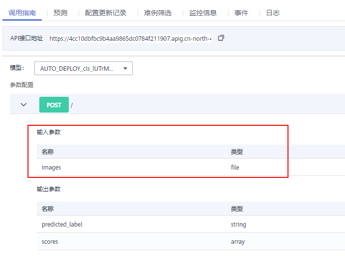
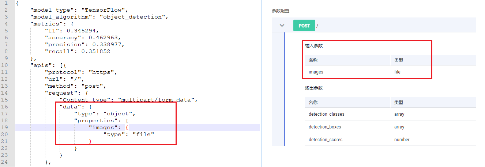

# 测试服务

模型部署为在线服务成功后，您可以在“预测“页签进行代码调试或添加文件测试。根据模型定义的输入请求不同（JSON文本或文件），测试服务包括如下两种方式：

1.  [JSON文本预测](#section15840106121611)：如当前部署服务的模型，其输入类型指定的为JSON文本类，即不含有文件类型的输入，可以在“预测“页签输入JSON代码进行服务预测。
2.  [文件预测](#section1666533761611)：如当前部署服务的模型，其输入类型指定为文件类，可包含图片、音频或视频等场景，可以在“预测“页签添加图片进行服务预测。

> **说明：** 
>-   如果您的输入类型为图片，请注意测试服务单张图片输入应小于8MB。
>-   图片支持以下类型：“png“、“psd“、“jpg“、“jpeg“、“bmp“、“gif“、“webp“、“psd“、“svg“、“tiff“。
>-   该功能为调测使用，实际生产建议使用API调用。根据鉴权方式的不同，可以根据实际情况选择[访问在线服务（Token认证）](访问在线服务（Token认证）.md)、[访问在线服务（AK/SK认证\)](访问在线服务（AK-SK认证).md)或者[访问在线服务（APP认证）](访问在线服务（APP认证）.md)。

## 了解服务的输入参数

针对您部署上线的服务，您可以在服务详情页面的“调用指南“中，了解本服务的输入参数，即上文提到的输入请求类型。

**图 1**  查看服务的调用指南  

调用指南中的输入参数取决于您选择的模型来源：

-   如果您的模型来源于自动学习或预置算法，其输入输出参数由ModelArts官方定义，请直接参考“调用指南“中的说明，并在预测页签中输入对应的JSON文本或文件进行服务测试。
-   如果您的模型是自定义的，即推理代码和配置文件是自行编写的（[配置文件编写说明](模型配置文件编写说明.md)），“调用指南“只是将您编写的配置文件进行了可视化展示。调用指南的输入参数与配置文件对应关系如下所示。

    **图 2**  配置文件与调用指南的对应关系  
    

-   如果您的模型是采用模型模板导入，不同的模板指定了其对应的输入输出模式，请参见[模型模板简介](模型模板简介.md)的相关说明。

## JSON文本预测

1.  登录ModelArts管理控制台，在左侧菜单栏中选择“部署上线\>在线服务“，进入“在线服务“管理页面。
2.  单击目标服务名称，进入服务详情页面。在“预测“页签的预测代码下，输入预测代码，然后单击“预测“即可进行服务的预测，如[图3](#fig1410523111237)所示，attr\_7为需要目标列，predictioncol为目标列attr\_7的预测结果。

    JSON文本类的预测代码和返回结果样例，可参见[银行存款预测样例](https://support.huaweicloud.com/bestpractice-modelarts/modelarts_10_0002.html)。此样例是使用自动学习功能训练的模型，其输入类型为ModelArts官方定义，不可更改。

    **图 3**  预测代码  
    

    > **说明：** 
    >输入数据中attr\_7的值可任意填写，或为空，不会影响预测结果。

## 文件预测

1.  登录ModelArts管理控制台，在左侧菜单栏中选择“部署上线\>在线服务“，进入“在线服务“管理页面。
2.  单击目标服务名称，进入服务详情页面。在“预测“页签，单击“上传“，然后选择测试文件。文件上传成功后，单击“预测“即可进行服务的预测，如[图4](#fig16667810142416)所示，输出标签名称，以及位置坐标和检测的评分。

    文件类的预测代码和返回结果样例，可参见[花卉识别样例](https://support.huaweicloud.com/bestpractice-modelarts/modelarts_10_0003.html)。此样例是使用预置算法训练的模型，其输入类型为ModelArts官方定义，不可更改，如需自定义的模型，请参见[手写数字识别样例](https://support.huaweicloud.com/bestpractice-modelarts/modelarts_10_0010.html)。

    **图 4**  图片预测  
    

