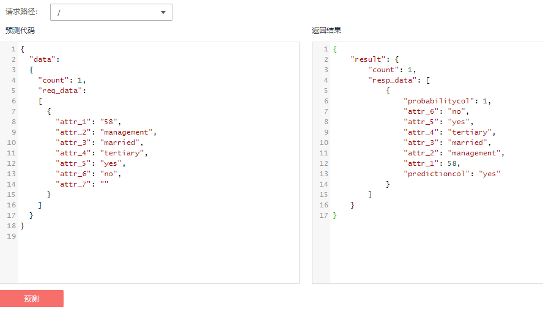

# 测试服务

模型部署为在线服务成功后，您可以在“预测“页签进行代码调试或添加图片测试。测试服务包括如下两种方式：

1.  [代码预测](#section15840106121611)：如当前服务是数值类预测，可以在“预测“页签输入代码进行服务预测。
2.  [图片预测](#section1666533761611)：如当前服务是图片识别类预测，可以在“预测“页签添加图片进行服务预测。

## 代码预测

1.  登录ModelArts管理控制台，在左侧菜单栏中选择“部署上线\>在线服务“，进入“在线服务“管理页面。
2.  单击目标服务名称，进入服务详情页面。在“预测“页签的预测代码下，输入预测代码，然后单击“预测“即可进行服务的预测，如[图1](#fig26681359117)所示，attr\_7为需要目标列，predictioncol为目标列attr\_7的预测结果。

    **图 1**  预测代码  
    

    > **说明：**   
    >输入数据中attr\_7的值可任意填写，或为空，不会影响预测结果。  

## 图片预测

1.  登录ModelArts管理控制台，在左侧菜单栏中选择“部署上线\>在线服务“，进入“在线服务“管理页面。
2.  单击目标服务名称，进入服务详情页面。在“预测“页签，单击图片选择按钮，然后选择测试图片。图片上传成功后，单击“预测“即可进行服务的测试，如[图2](#fig1673675818299)所示，输出标签名称“yunbao”，以及位置坐标和检测的评分。

    **图 2**  图片预测  
    

