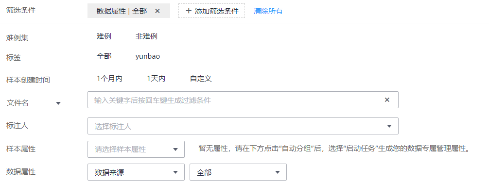
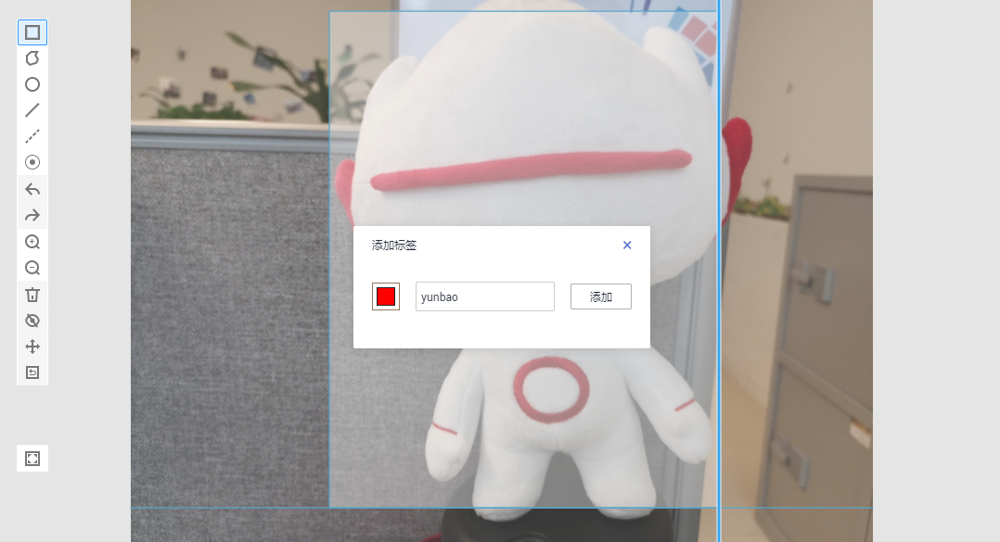
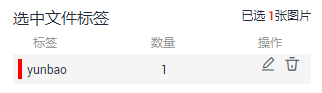
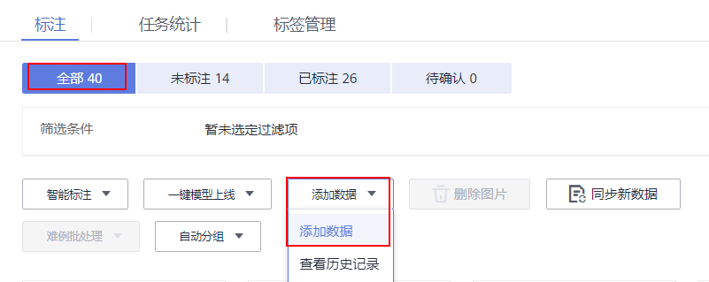
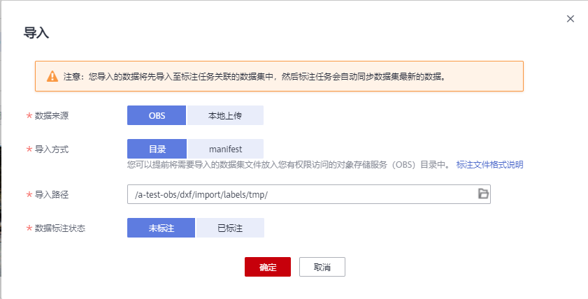
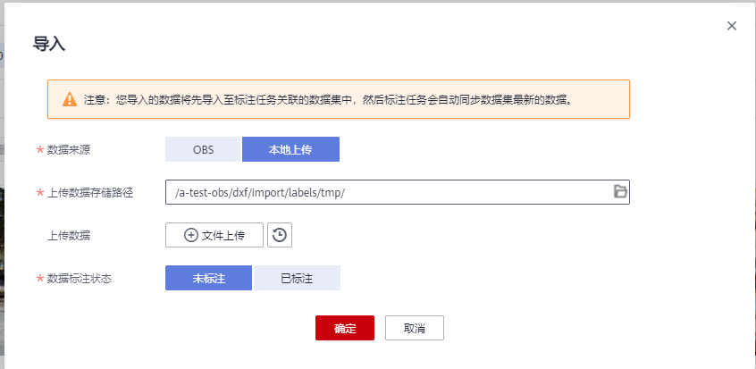

# 物体检测

由于模型训练过程需要大量有标签的图片数据，因此在模型训练之前需对没有标签的图片添加标签。您可以通过手工标注或智能一键标注的方式添加标签，快速完成对图片的标注操作，也可以对已标注图片修改或删除标签进行重新标注。

针对物体检测场景，开始标注前，您需要了解：

-   图片中所有目标物体都要标注。
-   目标物体清晰无遮挡的，必须画框。
-   画框仅包含整个物体。框内包含整个物体的全部，画框边缘不要压着物体，边缘和物体间不要留着空隙，避免背景对模型训练造成干扰。

## 开始标注

1.  登录ModelArts管理控制台，在左侧菜单栏中选择“数据管理\> 数据标注“，进入“数据标注“管理页面。
2.  在数据集列表中，基于“标注类型“选择需要进行标注的数据集，单击标注作业名称进入标注作业标注详情页。
3.  在标注作业标注详情中，展示此标注作业下全部数据。

## 同步新数据

ModelArts会自动将数据集中新增的数据同步至标注作业，包含数据及当前标注作业支持的标注信息。

为了快速获取数据集中最新数据，可在标注作业详情页的“全部“、“未标注“或“已标注“页签中，单击“同步新数据“，快速将数据集中的数据添加到标注作业中。

## 筛选数据

在标注作业详情页面，默认展示作业中全部数据，您可以在“全部“、“未标注“或“已标注“页签下，在筛选条件区域，单击“展开“，添加筛选条件，快速过滤出您想要查看的数据。

支持的筛选条件如下所示，您可以设置一个或多个选项进行筛选。

-   难例集：难例或非难例。
-   标签：您可以选择全部标签，或者基于您指定的标签，选中其中一个或多个。
-   样本创建时间：1个月内、1天内或自定义，如果选择自定义，可以在时间框中指定明确时间范围。
-   文件名或目录：根据文件名称或者文件存储目录筛选。
-   标注人：选择执行标注操作的帐号名称。
-   样本属性：表示自动分组生成的属性。只有启用了[自动分组](https://support.huaweicloud.com/engineers-modelarts/modelarts_23_0213.html)任务后才可使用此筛选条件。
-   数据属性：暂不支持。

**图 1**  筛选条件  

## 标注图片（手工标注）

标注作业详情页中，展示了此数据集中“未标注“和“已标注“的图片，默认显示“全部“的图片列表。

1.  在“未标注“页签图片列表中，单击图片，自动跳转到标注页面。在标注页面，常用按钮的使用可参见[表2](#table194471512463)。
2.  在页面上方工具栏选择合适的标注图形，系统默认的标注图形为矩形。本示例使用矩形工具进行标注。

    > **说明：** 
    >页面左侧可以选择多种形状对图片进行标注。标注第一张图片时，一旦选择其中一种，其他所有图片都需要使用此形状进行标注。

    **表 1**  支持的标注框

    
    <table><thead align="left"><tr id="row45211039618"><th class="cellrowborder" valign="top" width="21.78%" id="mcps1.2.3.1.1">
图标

    </th>
    <th class="cellrowborder" valign="top" width="78.22%" id="mcps1.2.3.1.2">
使用说明

    </th>
    </tr>
    </thead>
    <tbody><tr id="row1552113392120"><td class="cellrowborder" valign="top" width="21.78%" headers="mcps1.2.3.1.1 ">

    </td>
    <td class="cellrowborder" valign="top" width="78.22%" headers="mcps1.2.3.1.2 ">
矩形。鼠标单击标注对象左上角边缘位置，界面将出现矩形框，移动鼠标使得矩形框覆盖标注对象，然后单击完成标注。

    </td>
    </tr>
    <tr id="row2052111391612"><td class="cellrowborder" valign="top" width="21.78%" headers="mcps1.2.3.1.1 ">

    </td>
    <td class="cellrowborder" valign="top" width="78.22%" headers="mcps1.2.3.1.2 ">
多边形。在标注对象所在范围内，鼠标左键单击完成一个点的标注，沿着物体的形状边缘，通过鼠标指定多个点，最终单击到第一个点的位置，由所有的点组成一个多边形形状。使得需标注的对象在此标注框内。

    </td>
    </tr>
    <tr id="row11521163914113"><td class="cellrowborder" valign="top" width="21.78%" headers="mcps1.2.3.1.1 ">

    </td>
    <td class="cellrowborder" valign="top" width="78.22%" headers="mcps1.2.3.1.2 ">
圆形。在标注对象中，选择物体的中心点位置，单击鼠标确定圆心，然后移动鼠标，使得圆形框覆盖标注对象，然后再单击鼠标完成标注。

    </td>
    </tr>
    <tr id="row652133917116"><td class="cellrowborder" valign="top" width="21.78%" headers="mcps1.2.3.1.1 ">

    </td>
    <td class="cellrowborder" valign="top" width="78.22%" headers="mcps1.2.3.1.2 ">
直线。在标注对象中，选择物体的起始点，单击鼠标确定直线的起始点，然后使得直线覆盖标注对象，然后再单击鼠标完成标注。

    </td>
    </tr>
    <tr id="row480321710392"><td class="cellrowborder" valign="top" width="21.78%" headers="mcps1.2.3.1.1 ">

    </td>
    <td class="cellrowborder" valign="top" width="78.22%" headers="mcps1.2.3.1.2 ">
虚线。在标注对象中，选择物体的起始点，单击鼠标确定虚线的起始点，然后使得虚线覆盖标注对象，然后再单击鼠标完成标注。

    </td>
    </tr>
    <tr id="row118041179396"><td class="cellrowborder" valign="top" width="21.78%" headers="mcps1.2.3.1.1 ">

    </td>
    <td class="cellrowborder" valign="top" width="78.22%" headers="mcps1.2.3.1.2 ">
点。单击图片中的物体所在位置，即可完成点的标注。

    </td>
    </tr>
    </tbody>
    </table>

3.  在弹出的添加标签文本框中，直接输入新的标签名，在文本框前面选中标签颜色，然后单击“添加“。如果已存在标签，从下拉列表中选择已有的标签，单击“添加“。

    逐步标注图片中所有物体所在位置，一张图片可添加多个标签。完成一张图片标注后，可单击图片下方图片列表，快速选中其他未标注的图片，然后在标注页面中执行标注操作。

    **图 2**  添加物体检测标签  
    

4.  单击页面上方“返回数据标注预览“查看标注信息，在弹框中单击“确定“保存当前标注并离开标注页面。

    选中的图片被自动移动至“已标注“页签，且在“未标注“和“全部“页签中，标签的信息也将随着标注步骤进行更新，如增加的标签名称、标签对应的图片数量。

**表 2**  标注界面的常用按钮

<table><thead align="left"><tr id="row18447951114610"><th class="cellrowborder" valign="top" width="22.62%" id="mcps1.2.3.1.1">
按钮图标

</th>
<th class="cellrowborder" valign="top" width="77.38000000000001%" id="mcps1.2.3.1.2">
功能说明

</th>
</tr>
</thead>
<tbody><tr id="row644714515462"><td class="cellrowborder" valign="top" width="22.62%" headers="mcps1.2.3.1.1 ">

</td>
<td class="cellrowborder" valign="top" width="77.38000000000001%" headers="mcps1.2.3.1.2 ">
撤销上一个操作。

</td>
</tr>
<tr id="row20447125118461"><td class="cellrowborder" valign="top" width="22.62%" headers="mcps1.2.3.1.1 ">

</td>
<td class="cellrowborder" valign="top" width="77.38000000000001%" headers="mcps1.2.3.1.2 ">
重做上一个操作。

</td>
</tr>
<tr id="row1644765117461"><td class="cellrowborder" valign="top" width="22.62%" headers="mcps1.2.3.1.1 ">

</td>
<td class="cellrowborder" valign="top" width="77.38000000000001%" headers="mcps1.2.3.1.2 ">
放大图片。

</td>
</tr>
<tr id="row1944755120463"><td class="cellrowborder" valign="top" width="22.62%" headers="mcps1.2.3.1.1 ">

</td>
<td class="cellrowborder" valign="top" width="77.38000000000001%" headers="mcps1.2.3.1.2 ">
缩小图片。

</td>
</tr>
<tr id="row8448125115465"><td class="cellrowborder" valign="top" width="22.62%" headers="mcps1.2.3.1.1 ">

</td>
<td class="cellrowborder" valign="top" width="77.38000000000001%" headers="mcps1.2.3.1.2 ">
删除当前图片中的所有标注框。

</td>
</tr>
<tr id="row18448135113463"><td class="cellrowborder" valign="top" width="22.62%" headers="mcps1.2.3.1.1 ">

</td>
<td class="cellrowborder" valign="top" width="77.38000000000001%" headers="mcps1.2.3.1.2 ">
显示或隐藏标注框。只有在已标注图片中可使用此操作。

</td>
</tr>
<tr id="row1844812519463"><td class="cellrowborder" valign="top" width="22.62%" headers="mcps1.2.3.1.1 ">

</td>
<td class="cellrowborder" valign="top" width="77.38000000000001%" headers="mcps1.2.3.1.2 ">
拖动，可将标注好的框拖动至其他位置，也可以选择框的边缘，更改框的大小。

</td>
</tr>
<tr id="row6436356154711"><td class="cellrowborder" valign="top" width="22.62%" headers="mcps1.2.3.1.1 ">

</td>
<td class="cellrowborder" valign="top" width="77.38000000000001%" headers="mcps1.2.3.1.2 ">
复位，与上方拖动为同组操作，当执行了拖动后，可以单击复位按钮快速将标注框恢复为拖动前的形状和位置。

</td>
</tr>
<tr id="row1443895694719"><td class="cellrowborder" valign="top" width="22.62%" headers="mcps1.2.3.1.1 ">

</td>
<td class="cellrowborder" valign="top" width="77.38000000000001%" headers="mcps1.2.3.1.2 ">
全屏显示标注的图片。

</td>
</tr>
</tbody>
</table>

## 查看已标注图片

在标注作业详情页，单击“已标注“页签，您可以查看已完成标注的图片列表。单击图片，可在右侧的“当前文件标签“中了解当前图片的标签信息。

## 修改标注

当数据完成标注后，您还可以进入已标注页签，对已标注的数据进行修改。

-   **基于图片修改**

    在标注作业详情页面，单击“标注“页签，选择“已标注”页签，然后在图片列表中选中待修改的图片，单击图片跳转到标注页面，在右侧标签信息区域中对图片信息进行修改。

    -   修改标签：“标注“区域中，单击编辑图标，在文本框中输入正确的标签名，然后单击确定图标完成修改。也可以单击标签，在图片标注区域，调整标注框的位置和大小，完成调整后，单击其他标签即可保存修改。
    -   删除标签：在“标注“区域中，单击删除图标即可删除此图片中的标签。

        标签删除后，单击页面左上角的“返回数据标注预览“离开标注页面，在弹出对话框中保存标注。图标的标签全部删除后，该图片会重新回到“未标注“页签。

        **图 3**  编辑物体检测标签  
        

-   **基于标签修改**

    在标注作业详情页中，单击“已标注“页签，在图片列表右侧，显示全部标签的信息。

    -   修改标签：单击操作列的编辑图标，然后在弹出的对话框中输入修改后的标签和颜色，然后单击“确定“完成修改。修改后，之前添加了此标签的图片，都将被标注为新的标签名称。
    -   删除标签：单击操作列的删除图标可删除此标签。

    **图 4**  物体检测的全部标签  
    

## 添加数据

除了同步数据集中的新数据外，您还可以在标注作业中，直接添加图片，用于数据标注。添加的数据将先导入至标注任务关联的数据集中，然后标注任务会自动同步数据集中最新的数据。

1.  在标注作业详情页面，单击“全部“或“未标注“页签，然后单击左上角“添加数据“，选择添加数据。

    **图 5**  添加数据  
    

2.  在弹出的导入对话框中，选择数据来源和导入方式，选择导入的数据路径和数据标注状态。

    **图 6**  添加图片  
    

    

3.  在导入对话框中，单击“确定“，完成添加数据的操作。

    您添加的图片将自动呈现在“全部“的图片列表中。

## 删除图片

通过数据删除操作，可将需要丢弃的图片数据快速删除。

在“全部“、“未标注“或“已标注“页面中，依次选中需要删除的图片，或者选择“选择当前页“选中该页面所有图片，然后单击左上角“删除图片“。在弹出的对话框中，根据实际情况选择是否勾选“同时删除源文件“，确认信息无误后，单击“确定“完成图片删除操作。

其中，被选中的图片，其左上角将显示为勾选状态。如果当前页面无选中图片时，“删除图片“按钮为灰色，无法执行删除操作。

> **说明：** 
>如果勾选了“同时删除源文件“，删除图片操作将删除对应OBS目录下存储的图片，此操作可能会影响已使用此源文件的其他数据集或数据集版本，有可能导致展示异常或训练/推理异常。删除后，数据将无法恢复，请谨慎操作。

