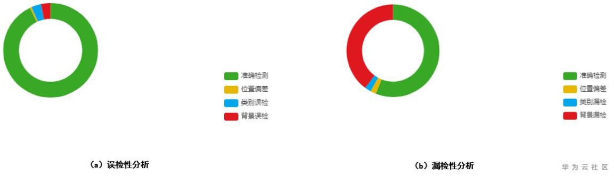
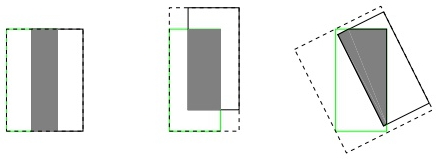
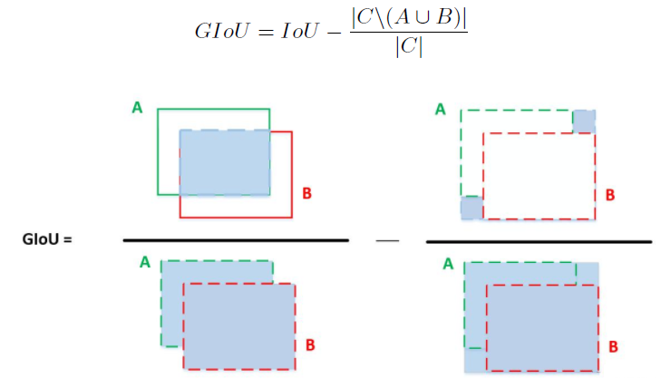
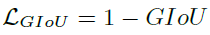
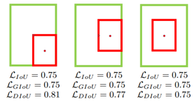
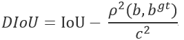
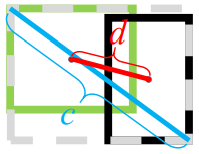
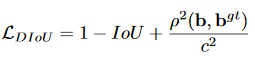
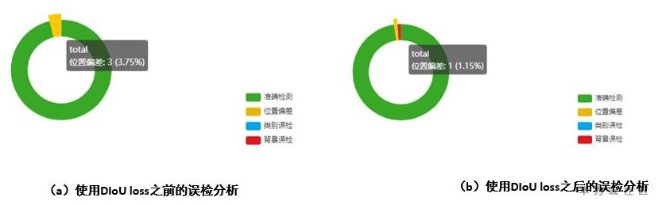
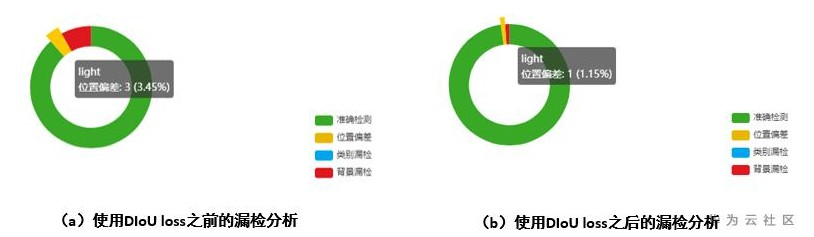

# 物体检测模型的位置误差分析以及相关的解决方法

## 问题描述

在物体检测的模型评估阶段，目标检测的假阳性（误检分析）以及假阴性（漏检分析）是比较重要的一环。在假阳性分析方面，位置误差主要表现在位置误检概率，在假阴性分析方面，位置误差主要表现在位置漏检概率。

ModelArts中对应的模型评估结果展示为：

**图 1**  模型评估结果  

上图展示的是对检测的推理结果进行的分析举例，其中图a表示的是假阳性（误检方面）的位置偏差，类别误检以及背景误检的分析，图b表示的是假阴性（漏检方面）的位置偏差，类别漏检以及背景漏检的分析。

从上图示例中可以看出，在误检以及漏检分析方面，位置误差占比比较大。建议参考如下相关算法和技术说明，了解如何降低位置误差的概率，提升模型推理的准确度。

## 解决方法

-   **GIoU loss**

    GIoU loss最早由斯坦福大学提出，针对IoU loss以下缺点进行改进：

    1.  当预测框A和目标框B不相交时，计算两者的IoU\(A,B\)=0，无法准确反映出两者的位置以及距离关系，此时损失函数不可导，IoU Loss无法优化两个框不相交的情况。
    2.  假设预测框和目标框的大小都确定，只要两个框的相交值是确定的，其IoU值是相同时，IoU值不能反映两个框是如何相交的，下图所示的相同的两个预测框和目标框之前相交的三种情况，IoU值是相同的，但是位置关系差别较大。

    **图 2**  相同IoU下的预测框和目标框之间的位置关系图  
    

    计算GIoU的公式如下，其中A代表预测框，B代表目标框，C代表A和B最小的公共面积区域。

    **图 3**  GIoU计算示意图  
    

    相应的GIoU loss表示为：

    

-   **DIoU loss**

    DIoU顾名思义就是代表Distance IoU，将目标框与anchor之间的距离，重叠率以及尺度都整合在一起，使得检测模型在训练的时候，目标回归变得更加的稳定，主要有以下两个优点：

    1.  更加直接的回归最小化anchor框与目标框之间的归一化距离，使得收敛速度快。
    2.  在GIoU loss不能回归的场景，例如目标框包含预测框的情况（下图所示），也能快速的回归bbox。

    **图 4**  绿色代表目标框，红色代表预测框  
    

    计算DIoU的公式如下：

    

    相关的字符意义如下所示：

    

    绿色表示预测框，黑色表示目标框，d表示两个框中心点之间的欧式距离，c表示最小公共区域对角线的长度。

    相应的DIoU loss表示如下：

    

## 实验验证

在交通信号灯的数据集上面进行验证，该数据集主要检测十字路口处的交通信号灯，只有一个类别，使用DIoU loss之前和之后在误检分析（假阳性）的对比情况，可以看出，使用DIoU loss之后，位置偏差得到比较大的改善。

**图 5**  误检情况下，使用DIoU loss之前和之后的位置偏差对比图  

使用DIoU loss之前和之后在漏检分析（假阴性）的对比情况，可以看出，使用DIoU loss之后，位置偏差得到比较大的改善。

**图 6**  漏检情况下，使用DIoU loss之前和之后的位置偏差对比图  

## 用户建议

在模型推理结果中，如果位置误差占比比较大，推荐在训练的时候，建议使用GIoU loss和DIoU loss进行模型优化和加强。

