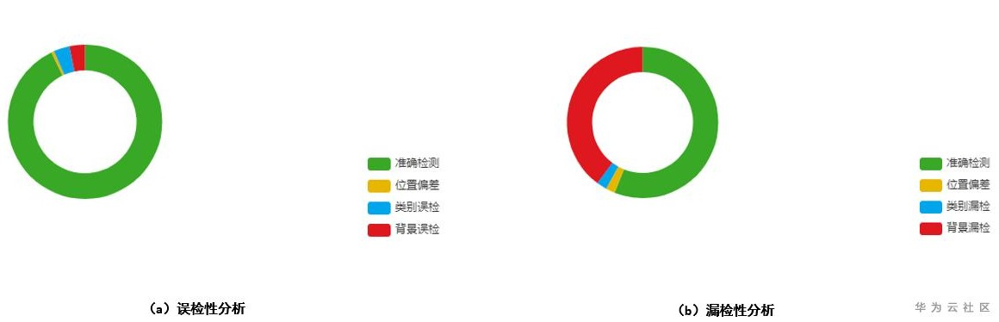
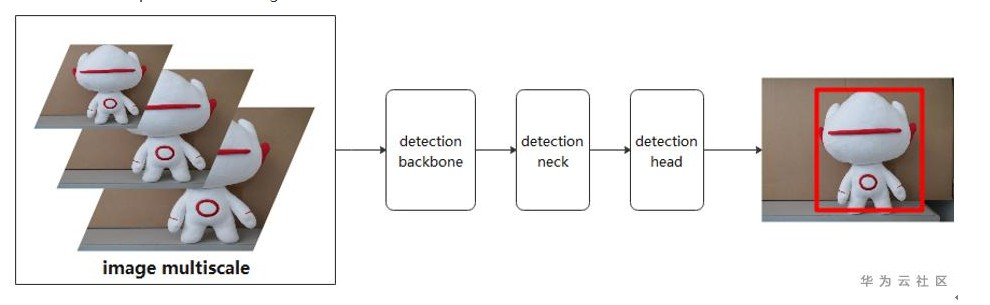
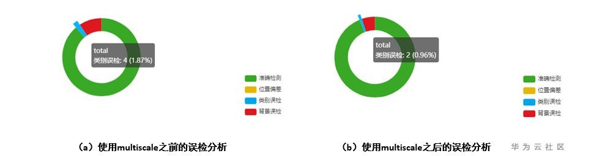
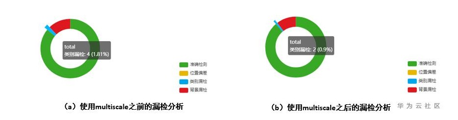

# 物体检测模型的分类误差分析以及解决方法

## 问题描述

在物体检测的模型评估阶段，目标检测的假阳性（误检分析）以及假阴性（漏检分析）是比较重要的一环。

-   在假阳性分析方面，类别误差主要表现在类别误检率。
-   在假阴性分析方面，类别误差主要表现在类别漏检概率。

ModelArts中对应的模型评估结果展示为：

**图 1**  模型评估结果  

上图展示的是对检测的推理结果进行的分析举例，其中图a表示的是假阳性（误检方面）的位置偏差，类别误检以及背景误检的分析，图b表示的是假阴性（漏检方面）的位置偏差，类别漏检以及背景漏检的分析。

从上图示例中可以看出，在误检以及漏检分析方面，类别误差占比比较大。建议参考如下相关算法和技术说明，了解如何降低类别误差的概率，提升模型推理的准确度。

## 解决方法

Multi scale是目标检测中常用的一种数据处理方式，您可以在自己的模型中自行定义multi scale的储存大小。一般在模型训练时，建议每隔固定训练步数做一次scale，保证单个epoch训练中的图像 multi scale输入。具体multi scale的训练过程如下所示：

**图 2**  MultiScale训练过程  

## 实验验证

在摄像头类型识别的数据集上面进行验证，该数据集总共有14类别，分别代表14种不同的摄像头，使用multi scale之前和之后在误检分析（假阳性）的对比情况，可以看出，使用multi scale之后，类别误检得到比较大的改善。

**图 3**  使用multi scale之后的误检分析对比  

下面是使用multi scale之前和之后在漏检分析（假阴性）的对比情况，可以看出，使用multi scale之后，类别漏检得到比较大的改善。

**图 4**  使用multi scale之后的漏检分析对比  

## 用户建议

在模型推理结果中，如果类别误差占比比较大，推荐在训练的时候，使用multi scale进行模型的训练优化。

