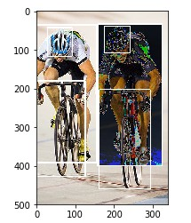
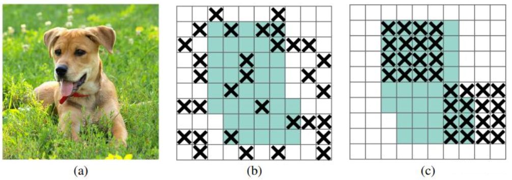

# 物体检测模型的目标框亮度敏感度分析以及相关的解决方法<a name="modelarts_eval_0005"></a>

## 问题描述<a name="zh-cn_topic_0275437221_section121841056164714"></a>

在目标检测任务中，不同数据集的目标框亮度可能会有差异，目标框亮度敏感度就是衡量这个差异的变量，而不同目标框亮度的数值对模型训练以及推理都会有影响。下图表示的就是同一个图片中，目标框内部标签的亮度值不一样。

**图 1**  目标框亮度不均匀场景<a name="zh-cn_topic_0275437221_fig1213519294816"></a>  


## 解决方法<a name="zh-cn_topic_0275437221_section37571871307"></a>

在深度学习任务中，dropout是一种被广泛使用的正则化技术，这种技术存在的缺点就是随机的丢弃掉特征层的某一个单元，使得相邻特征单元共享的语义信息也会一起丢弃掉，DropBlock改进了上述问题，即可以按照特征块来进行丢弃，对深度学习网络进行正则化处理。DropBlock 是类似dropout 的简单方法。二者的主要区别在于DropBlock丢弃层特征图的相邻区域，而不是丢弃单独的随机单元。详细介绍参见DropBlock论文

DropBlock模块主要有2个参数：block\_size、γ

-   block\_size：表示dropout的方块的大小（长，宽），当block\_size=1，DropBlock退化为传统的dropout，正常可以取3、5、7。
-   γ：表示drop过程中的概率，也就是伯努利函数的概率。

Dropout和Dropblock的对比。其中，b图表示Dropout，c图表示DropBlock。

**图 2**  Dropout和Dropblock原理对比图<a name="zh-cn_topic_0275437221_fig1880314110220"></a>  


TensorFlow版的官方实现方式如下：

```
class Dropblock(object):
  """DropBlock: a regularization method for convolutional neural networks.
    DropBlock is a form of structured dropout, where units in a contiguous
    region of a feature map are dropped together. DropBlock works better than
    dropout on convolutional layers due to the fact that activation units in
    convolutional layers are spatially correlated.
    See https://arxiv.org/pdf/1810.12890.pdf for details.
  """

  def __init__(self,
               dropblock_keep_prob=None,
               dropblock_size=None,
               data_format='channels_last'):
    self._dropblock_keep_prob = dropblock_keep_prob
    self._dropblock_size = dropblock_size
    self._data_format = data_format

  def __call__(self, net, is_training=False):
    """Builds Dropblock layer.
    Args:
      net: `Tensor` input tensor.
      is_training: `bool` if True, the model is in training mode.
    Returns:
      A version of input tensor with DropBlock applied.
    """
    if (not is_training or self._dropblock_keep_prob is None or
        self._dropblock_keep_prob == 1.0):
      return net

    logging.info('Applying DropBlock: dropblock_size %d,'
                 'net.shape %s', self._dropblock_size, net.shape)

    if self._data_format == 'channels_last':
      _, height, width, _ = net.get_shape().as_list()
    else:
      _, _, height, width = net.get_shape().as_list()

    total_size = width * height
    dropblock_size = min(self._dropblock_size, min(width, height))
    # Seed_drop_rate is the gamma parameter of DropBlcok.
    seed_drop_rate = (
        1.0 - self._dropblock_keep_prob) * total_size / dropblock_size**2 / (
            (width - self._dropblock_size + 1) *
            (height - self._dropblock_size + 1))

    # Forces the block to be inside the feature map.
    w_i, h_i = tf.meshgrid(tf.range(width), tf.range(height))
    valid_block = tf.logical_and(
        tf.logical_and(w_i >= int(dropblock_size // 2),
                       w_i < width - (dropblock_size - 1) // 2),
        tf.logical_and(h_i >= int(dropblock_size // 2),
                       h_i < width - (dropblock_size - 1) // 2))

    if self._data_format == 'channels_last':
      valid_block = tf.reshape(valid_block, [1, height, width, 1])
    else:
      valid_block = tf.reshape(valid_block, [1, 1, height, width])

    randnoise = tf.random_uniform(net.shape, dtype=tf.float32)
    valid_block = tf.cast(valid_block, dtype=tf.float32)
    seed_keep_rate = tf.cast(1 - seed_drop_rate, dtype=tf.float32)
    block_pattern = (1 - valid_block + seed_keep_rate + randnoise) >= 1
    block_pattern = tf.cast(block_pattern, dtype=tf.float32)

    if self._data_format == 'channels_last':
      ksize = [1, self._dropblock_size, self._dropblock_size, 1]
    else:
      ksize = [1, 1, self._dropblock_size, self._dropblock_size]
    block_pattern = -tf.nn.max_pool(
        -block_pattern,
        ksize=ksize,
        strides=[1, 1, 1, 1],
        padding='SAME',
        data_format='NHWC' if self._data_format == 'channels_last' else 'NCHW')

    percent_ones = tf.cast(tf.reduce_sum(block_pattern), tf.float32) / tf.cast(
        tf.size(block_pattern), tf.float32)

    net = net / tf.cast(percent_ones, net.dtype) * tf.cast(
        block_pattern, net.dtype)
    return net
```

## 实验验证<a name="zh-cn_topic_0275437221_section10248420145"></a>

在开源数据集Canine Coccidiosis Parasite上面进行实验，该数据集只有一个类别，使用DropBlock之前，模型对目标框亮度敏感度如[表1](#zh-cn_topic_0275437221_table970414587510)所示。

**表 1**  目标框亮度敏感度分析

<a name="zh-cn_topic_0275437221_table970414587510"></a>
<table><thead align="left"><tr id="zh-cn_topic_0275437221_row170415581253"><th class="cellrowborder" valign="top" width="50%" id="mcps1.2.3.1.1"><p id="zh-cn_topic_0275437221_p1170435819512"><a name="zh-cn_topic_0275437221_p1170435819512"></a><a name="zh-cn_topic_0275437221_p1170435819512"></a>特征值分布</p>
</th>
<th class="cellrowborder" valign="top" width="50%" id="mcps1.2.3.1.2"><p id="zh-cn_topic_0275437221_p27051958755"><a name="zh-cn_topic_0275437221_p27051958755"></a><a name="zh-cn_topic_0275437221_p27051958755"></a>coccidia</p>
</th>
</tr>
</thead>
<tbody><tr id="zh-cn_topic_0275437221_row370513586515"><td class="cellrowborder" valign="top" width="50%" headers="mcps1.2.3.1.1 "><p id="zh-cn_topic_0275437221_p1985684210465"><a name="zh-cn_topic_0275437221_p1985684210465"></a><a name="zh-cn_topic_0275437221_p1985684210465"></a>0% - 20%</p>
</td>
<td class="cellrowborder" valign="top" width="50%" headers="mcps1.2.3.1.2 "><p id="zh-cn_topic_0275437221_p8705658756"><a name="zh-cn_topic_0275437221_p8705658756"></a><a name="zh-cn_topic_0275437221_p8705658756"></a>0.8065</p>
</td>
</tr>
<tr id="zh-cn_topic_0275437221_row177051581756"><td class="cellrowborder" valign="top" width="50%" headers="mcps1.2.3.1.1 "><p id="zh-cn_topic_0275437221_p1185617428467"><a name="zh-cn_topic_0275437221_p1185617428467"></a><a name="zh-cn_topic_0275437221_p1185617428467"></a>20% - 40%</p>
</td>
<td class="cellrowborder" valign="top" width="50%" headers="mcps1.2.3.1.2 "><p id="zh-cn_topic_0275437221_p1970511581159"><a name="zh-cn_topic_0275437221_p1970511581159"></a><a name="zh-cn_topic_0275437221_p1970511581159"></a>0.871</p>
</td>
</tr>
<tr id="zh-cn_topic_0275437221_row67051658957"><td class="cellrowborder" valign="top" width="50%" headers="mcps1.2.3.1.1 "><p id="zh-cn_topic_0275437221_p178564426468"><a name="zh-cn_topic_0275437221_p178564426468"></a><a name="zh-cn_topic_0275437221_p178564426468"></a>40% - 60%</p>
</td>
<td class="cellrowborder" valign="top" width="50%" headers="mcps1.2.3.1.2 "><p id="zh-cn_topic_0275437221_p37051258955"><a name="zh-cn_topic_0275437221_p37051258955"></a><a name="zh-cn_topic_0275437221_p37051258955"></a>0.9355</p>
</td>
</tr>
<tr id="zh-cn_topic_0275437221_row1170520589520"><td class="cellrowborder" valign="top" width="50%" headers="mcps1.2.3.1.1 "><p id="zh-cn_topic_0275437221_p16856342134619"><a name="zh-cn_topic_0275437221_p16856342134619"></a><a name="zh-cn_topic_0275437221_p16856342134619"></a>60% - 80%</p>
</td>
<td class="cellrowborder" valign="top" width="50%" headers="mcps1.2.3.1.2 "><p id="zh-cn_topic_0275437221_p177051058957"><a name="zh-cn_topic_0275437221_p177051058957"></a><a name="zh-cn_topic_0275437221_p177051058957"></a>0.8065</p>
</td>
</tr>
<tr id="zh-cn_topic_0275437221_row870575815510"><td class="cellrowborder" valign="top" width="50%" headers="mcps1.2.3.1.1 "><p id="zh-cn_topic_0275437221_p285620421462"><a name="zh-cn_topic_0275437221_p285620421462"></a><a name="zh-cn_topic_0275437221_p285620421462"></a>80% - 100%</p>
</td>
<td class="cellrowborder" valign="top" width="50%" headers="mcps1.2.3.1.2 "><p id="zh-cn_topic_0275437221_p1270519589510"><a name="zh-cn_topic_0275437221_p1270519589510"></a><a name="zh-cn_topic_0275437221_p1270519589510"></a>0.9677</p>
</td>
</tr>
<tr id="zh-cn_topic_0275437221_row97052581257"><td class="cellrowborder" valign="top" width="50%" headers="mcps1.2.3.1.1 "><p id="zh-cn_topic_0275437221_p18561942194612"><a name="zh-cn_topic_0275437221_p18561942194612"></a><a name="zh-cn_topic_0275437221_p18561942194612"></a>标准差</p>
</td>
<td class="cellrowborder" valign="top" width="50%" headers="mcps1.2.3.1.2 "><p id="zh-cn_topic_0275437221_p207051358858"><a name="zh-cn_topic_0275437221_p207051358858"></a><a name="zh-cn_topic_0275437221_p207051358858"></a>0.0658</p>
</td>
</tr>
</tbody>
</table>

使用DropBlock之后，模型对目标框亮度敏感度的结果如[表2](#zh-cn_topic_0275437221_table123481219975)所示，可以看到，使用DropBlock之后，类别的目标框亮度敏感度从原来的0.0658降低到0.0204，在模型评估阶段可以有效降低检测模型对目标框的亮度敏感度。

**表 2**  目标框亮度敏感度分析

<a name="zh-cn_topic_0275437221_table123481219975"></a>
<table><thead align="left"><tr id="zh-cn_topic_0275437221_row23484195710"><th class="cellrowborder" valign="top" width="50%" id="mcps1.2.3.1.1"><p id="zh-cn_topic_0275437221_p133481319176"><a name="zh-cn_topic_0275437221_p133481319176"></a><a name="zh-cn_topic_0275437221_p133481319176"></a>特征值分布</p>
</th>
<th class="cellrowborder" valign="top" width="50%" id="mcps1.2.3.1.2"><p id="zh-cn_topic_0275437221_p18348319078"><a name="zh-cn_topic_0275437221_p18348319078"></a><a name="zh-cn_topic_0275437221_p18348319078"></a>coccidia</p>
</th>
</tr>
</thead>
<tbody><tr id="zh-cn_topic_0275437221_row534810191976"><td class="cellrowborder" valign="top" width="50%" headers="mcps1.2.3.1.1 "><p id="zh-cn_topic_0275437221_p1934817191776"><a name="zh-cn_topic_0275437221_p1934817191776"></a><a name="zh-cn_topic_0275437221_p1934817191776"></a>0% - 20%</p>
</td>
<td class="cellrowborder" valign="top" width="50%" headers="mcps1.2.3.1.2 "><p id="zh-cn_topic_0275437221_p125711419710"><a name="zh-cn_topic_0275437221_p125711419710"></a><a name="zh-cn_topic_0275437221_p125711419710"></a>0.9355</p>
</td>
</tr>
<tr id="zh-cn_topic_0275437221_row17348111917711"><td class="cellrowborder" valign="top" width="50%" headers="mcps1.2.3.1.1 "><p id="zh-cn_topic_0275437221_p1934811918714"><a name="zh-cn_topic_0275437221_p1934811918714"></a><a name="zh-cn_topic_0275437221_p1934811918714"></a>20% - 40%</p>
</td>
<td class="cellrowborder" valign="top" width="50%" headers="mcps1.2.3.1.2 "><p id="zh-cn_topic_0275437221_p2570184110716"><a name="zh-cn_topic_0275437221_p2570184110716"></a><a name="zh-cn_topic_0275437221_p2570184110716"></a>0.9677</p>
</td>
</tr>
<tr id="zh-cn_topic_0275437221_row4348719478"><td class="cellrowborder" valign="top" width="50%" headers="mcps1.2.3.1.1 "><p id="zh-cn_topic_0275437221_p234817192714"><a name="zh-cn_topic_0275437221_p234817192714"></a><a name="zh-cn_topic_0275437221_p234817192714"></a>40% - 60%</p>
</td>
<td class="cellrowborder" valign="top" width="50%" headers="mcps1.2.3.1.2 "><p id="zh-cn_topic_0275437221_p857018412715"><a name="zh-cn_topic_0275437221_p857018412715"></a><a name="zh-cn_topic_0275437221_p857018412715"></a>0.9677</p>
</td>
</tr>
<tr id="zh-cn_topic_0275437221_row33484192713"><td class="cellrowborder" valign="top" width="50%" headers="mcps1.2.3.1.1 "><p id="zh-cn_topic_0275437221_p163489194717"><a name="zh-cn_topic_0275437221_p163489194717"></a><a name="zh-cn_topic_0275437221_p163489194717"></a>60% - 80%</p>
</td>
<td class="cellrowborder" valign="top" width="50%" headers="mcps1.2.3.1.2 "><p id="zh-cn_topic_0275437221_p25696411274"><a name="zh-cn_topic_0275437221_p25696411274"></a><a name="zh-cn_topic_0275437221_p25696411274"></a>0.9677</p>
</td>
</tr>
<tr id="zh-cn_topic_0275437221_row834841914715"><td class="cellrowborder" valign="top" width="50%" headers="mcps1.2.3.1.1 "><p id="zh-cn_topic_0275437221_p19348191910711"><a name="zh-cn_topic_0275437221_p19348191910711"></a><a name="zh-cn_topic_0275437221_p19348191910711"></a>80% - 100%</p>
</td>
<td class="cellrowborder" valign="top" width="50%" headers="mcps1.2.3.1.2 "><p id="zh-cn_topic_0275437221_p105687411372"><a name="zh-cn_topic_0275437221_p105687411372"></a><a name="zh-cn_topic_0275437221_p105687411372"></a>1</p>
</td>
</tr>
<tr id="zh-cn_topic_0275437221_row1534817192079"><td class="cellrowborder" valign="top" width="50%" headers="mcps1.2.3.1.1 "><p id="zh-cn_topic_0275437221_p163489198715"><a name="zh-cn_topic_0275437221_p163489198715"></a><a name="zh-cn_topic_0275437221_p163489198715"></a>标准差</p>
</td>
<td class="cellrowborder" valign="top" width="50%" headers="mcps1.2.3.1.2 "><p id="zh-cn_topic_0275437221_p256717411879"><a name="zh-cn_topic_0275437221_p256717411879"></a><a name="zh-cn_topic_0275437221_p256717411879"></a>0.0204</p>
</td>
</tr>
</tbody>
</table>

## 用户建议<a name="zh-cn_topic_0275437221_section198886298416"></a>

在模型推理结果中，如果检测出来的类别对于目标框亮度的敏感程度比较大，推荐在训练时，使用DropBlock进行模型优化和加强。

