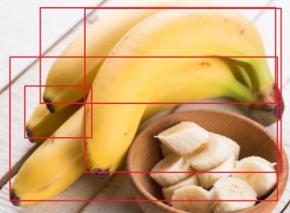

# 物体检测模型的目标框堆叠敏感度分析以及相关的解决方法<a name="modelarts_eval_0009"></a>

## 问题描述<a name="zh-cn_topic_0275437245_section42891421182314"></a>

在目标检测任务中，一张图片的的单个目标框可能会被其他目标框覆盖，目标框的堆叠度就是描述这种现象的指标，值越大表示被其他框覆盖的越多。检测模型对于具有不同堆叠度数据集的检测效果是不一样的，下图表示的是含有比较多重叠框的场景。建议参考如下相关算法和技术说明，了解如何降低模型对于堆叠度的敏感程度。

**图 1**  多重叠框的场景示例<a name="zh-cn_topic_0275437245_fig1183710420240"></a>  


## 解决方法<a name="zh-cn_topic_0275437245_section58841017142420"></a>

NMS在模型推理阶段是利用物体之间的IoU以及相应的阈值进行处理，那么就会出现重叠度比较高的多个物体不能检测出来的问题，传统的检测模型中的NMS处理流程如下所示，其中B表示检测的框。

```
  输入：B={(Bi, Si )}_(i=1 to N), 其中Si是Bi的得分；D=空集  
  Step 1    B中选择最大得分框M  
  Step 2    将M以及得分添加到D中，同时在B中删掉M以及其得分  
  Step 3    for Bi in B:  
               if  IoU(M, Bi) >= NMS_threshold  
                  在B中去掉Bi以及其得分  
               end if  
             end for  
  Step 4 重复Step 1 ~ 3，直至B=空集  
  输出：D
```

传统的NMS的缺点有以下几个方面：

1.  依据NMS的阈值暴力删除框，大于阈值的框全部去除，这种筛选规则比较严格，公式如下，其中si表示类别预测概率

    

2.  关键的计算在于IoU，即两个框的重叠部分，两个框的其他位置关系没有考虑全面。

    Soft NMS采用一种更为平滑的筛选规则，修正传统的NMS的暴力去除机制如下：

    

    另外的一种高斯表达

    

    那么soft NMS就可以减小目标检测模型对于目标框堆叠度的敏感程度


## 实验验证<a name="zh-cn_topic_0275437245_section191021179276"></a>

下面在开源水果数据集fruit上面进行验证，下表是使用soft NMS之前的目标框堆叠度敏感程度分析。

**表 1**  使用soft NMS之前的目标框重叠的特征敏感度分析

<a name="zh-cn_topic_0275437245_table27921514289"></a>
<table><thead align="left"><tr id="zh-cn_topic_0275437245_row2792185152814"><th class="cellrowborder" valign="top" width="25%" id="mcps1.2.5.1.1"><p id="zh-cn_topic_0275437245_p730319132202"><a name="zh-cn_topic_0275437245_p730319132202"></a><a name="zh-cn_topic_0275437245_p730319132202"></a>特征值分布</p>
</th>
<th class="cellrowborder" valign="top" width="25%" id="mcps1.2.5.1.2"><p id="zh-cn_topic_0275437245_p479219502817"><a name="zh-cn_topic_0275437245_p479219502817"></a><a name="zh-cn_topic_0275437245_p479219502817"></a>Apple</p>
</th>
<th class="cellrowborder" valign="top" width="25%" id="mcps1.2.5.1.3"><p id="zh-cn_topic_0275437245_p3793175152814"><a name="zh-cn_topic_0275437245_p3793175152814"></a><a name="zh-cn_topic_0275437245_p3793175152814"></a>Banana</p>
</th>
<th class="cellrowborder" valign="top" width="25%" id="mcps1.2.5.1.4"><p id="zh-cn_topic_0275437245_p579335152812"><a name="zh-cn_topic_0275437245_p579335152812"></a><a name="zh-cn_topic_0275437245_p579335152812"></a>Orange</p>
</th>
</tr>
</thead>
<tbody><tr id="zh-cn_topic_0275437245_row67933542818"><td class="cellrowborder" valign="top" width="25%" headers="mcps1.2.5.1.1 "><p id="zh-cn_topic_0275437245_p83033135207"><a name="zh-cn_topic_0275437245_p83033135207"></a><a name="zh-cn_topic_0275437245_p83033135207"></a>0% - 20%</p>
</td>
<td class="cellrowborder" valign="top" width="25%" headers="mcps1.2.5.1.2 "><p id="zh-cn_topic_0275437245_p117938512283"><a name="zh-cn_topic_0275437245_p117938512283"></a><a name="zh-cn_topic_0275437245_p117938512283"></a>1</p>
</td>
<td class="cellrowborder" valign="top" width="25%" headers="mcps1.2.5.1.3 "><p id="zh-cn_topic_0275437245_p479318514285"><a name="zh-cn_topic_0275437245_p479318514285"></a><a name="zh-cn_topic_0275437245_p479318514285"></a>0</p>
</td>
<td class="cellrowborder" valign="top" width="25%" headers="mcps1.2.5.1.4 "><p id="zh-cn_topic_0275437245_p107931356288"><a name="zh-cn_topic_0275437245_p107931356288"></a><a name="zh-cn_topic_0275437245_p107931356288"></a>1</p>
</td>
</tr>
<tr id="zh-cn_topic_0275437245_row279316552815"><td class="cellrowborder" valign="top" width="25%" headers="mcps1.2.5.1.1 "><p id="zh-cn_topic_0275437245_p16303613152014"><a name="zh-cn_topic_0275437245_p16303613152014"></a><a name="zh-cn_topic_0275437245_p16303613152014"></a>20% - 40%</p>
</td>
<td class="cellrowborder" valign="top" width="25%" headers="mcps1.2.5.1.2 "><p id="zh-cn_topic_0275437245_p09151456122817"><a name="zh-cn_topic_0275437245_p09151456122817"></a><a name="zh-cn_topic_0275437245_p09151456122817"></a>1</p>
</td>
<td class="cellrowborder" valign="top" width="25%" headers="mcps1.2.5.1.3 "><p id="zh-cn_topic_0275437245_p779385152818"><a name="zh-cn_topic_0275437245_p779385152818"></a><a name="zh-cn_topic_0275437245_p779385152818"></a>0.8</p>
</td>
<td class="cellrowborder" valign="top" width="25%" headers="mcps1.2.5.1.4 "><p id="zh-cn_topic_0275437245_p1779313592816"><a name="zh-cn_topic_0275437245_p1779313592816"></a><a name="zh-cn_topic_0275437245_p1779313592816"></a>0.9167</p>
</td>
</tr>
<tr id="zh-cn_topic_0275437245_row5793651285"><td class="cellrowborder" valign="top" width="25%" headers="mcps1.2.5.1.1 "><p id="zh-cn_topic_0275437245_p19303191362011"><a name="zh-cn_topic_0275437245_p19303191362011"></a><a name="zh-cn_topic_0275437245_p19303191362011"></a>40% - 60%</p>
</td>
<td class="cellrowborder" valign="top" width="25%" headers="mcps1.2.5.1.2 "><p id="zh-cn_topic_0275437245_p193013561282"><a name="zh-cn_topic_0275437245_p193013561282"></a><a name="zh-cn_topic_0275437245_p193013561282"></a>1</p>
</td>
<td class="cellrowborder" valign="top" width="25%" headers="mcps1.2.5.1.3 "><p id="zh-cn_topic_0275437245_p579375202814"><a name="zh-cn_topic_0275437245_p579375202814"></a><a name="zh-cn_topic_0275437245_p579375202814"></a>1</p>
</td>
<td class="cellrowborder" valign="top" width="25%" headers="mcps1.2.5.1.4 "><p id="zh-cn_topic_0275437245_p288919916296"><a name="zh-cn_topic_0275437245_p288919916296"></a><a name="zh-cn_topic_0275437245_p288919916296"></a>1</p>
</td>
</tr>
<tr id="zh-cn_topic_0275437245_row177936592811"><td class="cellrowborder" valign="top" width="25%" headers="mcps1.2.5.1.1 "><p id="zh-cn_topic_0275437245_p14303213152019"><a name="zh-cn_topic_0275437245_p14303213152019"></a><a name="zh-cn_topic_0275437245_p14303213152019"></a>60% - 80%</p>
</td>
<td class="cellrowborder" valign="top" width="25%" headers="mcps1.2.5.1.2 "><p id="zh-cn_topic_0275437245_p7932115672815"><a name="zh-cn_topic_0275437245_p7932115672815"></a><a name="zh-cn_topic_0275437245_p7932115672815"></a>1</p>
</td>
<td class="cellrowborder" valign="top" width="25%" headers="mcps1.2.5.1.3 "><p id="zh-cn_topic_0275437245_p479311542812"><a name="zh-cn_topic_0275437245_p479311542812"></a><a name="zh-cn_topic_0275437245_p479311542812"></a>0.3333</p>
</td>
<td class="cellrowborder" valign="top" width="25%" headers="mcps1.2.5.1.4 "><p id="zh-cn_topic_0275437245_p1689515910299"><a name="zh-cn_topic_0275437245_p1689515910299"></a><a name="zh-cn_topic_0275437245_p1689515910299"></a>1</p>
</td>
</tr>
<tr id="zh-cn_topic_0275437245_row6793158282"><td class="cellrowborder" valign="top" width="25%" headers="mcps1.2.5.1.1 "><p id="zh-cn_topic_0275437245_p130319135201"><a name="zh-cn_topic_0275437245_p130319135201"></a><a name="zh-cn_topic_0275437245_p130319135201"></a>80% - 100%</p>
</td>
<td class="cellrowborder" valign="top" width="25%" headers="mcps1.2.5.1.2 "><p id="zh-cn_topic_0275437245_p693516564281"><a name="zh-cn_topic_0275437245_p693516564281"></a><a name="zh-cn_topic_0275437245_p693516564281"></a>1</p>
</td>
<td class="cellrowborder" valign="top" width="25%" headers="mcps1.2.5.1.3 "><p id="zh-cn_topic_0275437245_p979316511280"><a name="zh-cn_topic_0275437245_p979316511280"></a><a name="zh-cn_topic_0275437245_p979316511280"></a>0.9091</p>
</td>
<td class="cellrowborder" valign="top" width="25%" headers="mcps1.2.5.1.4 "><p id="zh-cn_topic_0275437245_p1689718919290"><a name="zh-cn_topic_0275437245_p1689718919290"></a><a name="zh-cn_topic_0275437245_p1689718919290"></a>1</p>
</td>
</tr>
<tr id="zh-cn_topic_0275437245_row16961632152815"><td class="cellrowborder" valign="top" width="25%" headers="mcps1.2.5.1.1 "><p id="zh-cn_topic_0275437245_p830331317201"><a name="zh-cn_topic_0275437245_p830331317201"></a><a name="zh-cn_topic_0275437245_p830331317201"></a>标准差</p>
</td>
<td class="cellrowborder" valign="top" width="25%" headers="mcps1.2.5.1.2 "><p id="zh-cn_topic_0275437245_p16696133262819"><a name="zh-cn_topic_0275437245_p16696133262819"></a><a name="zh-cn_topic_0275437245_p16696133262819"></a>0</p>
</td>
<td class="cellrowborder" valign="top" width="25%" headers="mcps1.2.5.1.3 "><p id="zh-cn_topic_0275437245_p66961932152812"><a name="zh-cn_topic_0275437245_p66961932152812"></a><a name="zh-cn_topic_0275437245_p66961932152812"></a>0.3811</p>
</td>
<td class="cellrowborder" valign="top" width="25%" headers="mcps1.2.5.1.4 "><p id="zh-cn_topic_0275437245_p1269623214289"><a name="zh-cn_topic_0275437245_p1269623214289"></a><a name="zh-cn_topic_0275437245_p1269623214289"></a>0.0333</p>
</td>
</tr>
</tbody>
</table>

其中特征值分布表示将整个数据集堆叠度按照百分比区间进行划分，而对应的值则是召回率。可以看见banana的敏感度在0.3811。

下面的图是使用了soft NMS之后，目标框堆叠度敏感程度的变化，可以看到banana类别对于目标框的堆叠度的敏感程度降低，从0.3811降到了0.2487，从而验证了该算法能够在目标框重叠方面优化模型。

**表 2**  使用soft NMS之后的目标框重叠的特征敏感度分析

<a name="zh-cn_topic_0275437245_table123904312920"></a>
<table><thead align="left"><tr id="zh-cn_topic_0275437245_row163918435298"><th class="cellrowborder" valign="top" width="25%" id="mcps1.2.5.1.1"><p id="zh-cn_topic_0275437245_p19397435296"><a name="zh-cn_topic_0275437245_p19397435296"></a><a name="zh-cn_topic_0275437245_p19397435296"></a>特征值分布</p>
</th>
<th class="cellrowborder" valign="top" width="25%" id="mcps1.2.5.1.2"><p id="zh-cn_topic_0275437245_p6391243202910"><a name="zh-cn_topic_0275437245_p6391243202910"></a><a name="zh-cn_topic_0275437245_p6391243202910"></a>Apple</p>
</th>
<th class="cellrowborder" valign="top" width="25%" id="mcps1.2.5.1.3"><p id="zh-cn_topic_0275437245_p133917430299"><a name="zh-cn_topic_0275437245_p133917430299"></a><a name="zh-cn_topic_0275437245_p133917430299"></a>Banana</p>
</th>
<th class="cellrowborder" valign="top" width="25%" id="mcps1.2.5.1.4"><p id="zh-cn_topic_0275437245_p1639154372915"><a name="zh-cn_topic_0275437245_p1639154372915"></a><a name="zh-cn_topic_0275437245_p1639154372915"></a>Orange</p>
</th>
</tr>
</thead>
<tbody><tr id="zh-cn_topic_0275437245_row123917436291"><td class="cellrowborder" valign="top" width="25%" headers="mcps1.2.5.1.1 "><p id="zh-cn_topic_0275437245_p5391543162916"><a name="zh-cn_topic_0275437245_p5391543162916"></a><a name="zh-cn_topic_0275437245_p5391543162916"></a>0% - 20%</p>
</td>
<td class="cellrowborder" valign="top" width="25%" headers="mcps1.2.5.1.2 "><p id="zh-cn_topic_0275437245_p2398439298"><a name="zh-cn_topic_0275437245_p2398439298"></a><a name="zh-cn_topic_0275437245_p2398439298"></a>1</p>
</td>
<td class="cellrowborder" valign="top" width="25%" headers="mcps1.2.5.1.3 "><p id="zh-cn_topic_0275437245_p83994318299"><a name="zh-cn_topic_0275437245_p83994318299"></a><a name="zh-cn_topic_0275437245_p83994318299"></a>1</p>
</td>
<td class="cellrowborder" valign="top" width="25%" headers="mcps1.2.5.1.4 "><p id="zh-cn_topic_0275437245_p1399438291"><a name="zh-cn_topic_0275437245_p1399438291"></a><a name="zh-cn_topic_0275437245_p1399438291"></a>1</p>
</td>
</tr>
<tr id="zh-cn_topic_0275437245_row10399431295"><td class="cellrowborder" valign="top" width="25%" headers="mcps1.2.5.1.1 "><p id="zh-cn_topic_0275437245_p539543162917"><a name="zh-cn_topic_0275437245_p539543162917"></a><a name="zh-cn_topic_0275437245_p539543162917"></a>20% - 40%</p>
</td>
<td class="cellrowborder" valign="top" width="25%" headers="mcps1.2.5.1.2 "><p id="zh-cn_topic_0275437245_p193964392910"><a name="zh-cn_topic_0275437245_p193964392910"></a><a name="zh-cn_topic_0275437245_p193964392910"></a>1</p>
</td>
<td class="cellrowborder" valign="top" width="25%" headers="mcps1.2.5.1.3 "><p id="zh-cn_topic_0275437245_p83964332910"><a name="zh-cn_topic_0275437245_p83964332910"></a><a name="zh-cn_topic_0275437245_p83964332910"></a>0.8</p>
</td>
<td class="cellrowborder" valign="top" width="25%" headers="mcps1.2.5.1.4 "><p id="zh-cn_topic_0275437245_p839164312294"><a name="zh-cn_topic_0275437245_p839164312294"></a><a name="zh-cn_topic_0275437245_p839164312294"></a>0.9167</p>
</td>
</tr>
<tr id="zh-cn_topic_0275437245_row183919439294"><td class="cellrowborder" valign="top" width="25%" headers="mcps1.2.5.1.1 "><p id="zh-cn_topic_0275437245_p939114372913"><a name="zh-cn_topic_0275437245_p939114372913"></a><a name="zh-cn_topic_0275437245_p939114372913"></a>40% - 60%</p>
</td>
<td class="cellrowborder" valign="top" width="25%" headers="mcps1.2.5.1.2 "><p id="zh-cn_topic_0275437245_p13391643152917"><a name="zh-cn_topic_0275437245_p13391643152917"></a><a name="zh-cn_topic_0275437245_p13391643152917"></a>1</p>
</td>
<td class="cellrowborder" valign="top" width="25%" headers="mcps1.2.5.1.3 "><p id="zh-cn_topic_0275437245_p73974362917"><a name="zh-cn_topic_0275437245_p73974362917"></a><a name="zh-cn_topic_0275437245_p73974362917"></a>1</p>
</td>
<td class="cellrowborder" valign="top" width="25%" headers="mcps1.2.5.1.4 "><p id="zh-cn_topic_0275437245_p939443172918"><a name="zh-cn_topic_0275437245_p939443172918"></a><a name="zh-cn_topic_0275437245_p939443172918"></a>1</p>
</td>
</tr>
<tr id="zh-cn_topic_0275437245_row439174314291"><td class="cellrowborder" valign="top" width="25%" headers="mcps1.2.5.1.1 "><p id="zh-cn_topic_0275437245_p139243192920"><a name="zh-cn_topic_0275437245_p139243192920"></a><a name="zh-cn_topic_0275437245_p139243192920"></a>60% - 80%</p>
</td>
<td class="cellrowborder" valign="top" width="25%" headers="mcps1.2.5.1.2 "><p id="zh-cn_topic_0275437245_p539104310299"><a name="zh-cn_topic_0275437245_p539104310299"></a><a name="zh-cn_topic_0275437245_p539104310299"></a>1</p>
</td>
<td class="cellrowborder" valign="top" width="25%" headers="mcps1.2.5.1.3 "><p id="zh-cn_topic_0275437245_p193910431295"><a name="zh-cn_topic_0275437245_p193910431295"></a><a name="zh-cn_topic_0275437245_p193910431295"></a>0.3333</p>
</td>
<td class="cellrowborder" valign="top" width="25%" headers="mcps1.2.5.1.4 "><p id="zh-cn_topic_0275437245_p133944352915"><a name="zh-cn_topic_0275437245_p133944352915"></a><a name="zh-cn_topic_0275437245_p133944352915"></a>1</p>
</td>
</tr>
<tr id="zh-cn_topic_0275437245_row339164332915"><td class="cellrowborder" valign="top" width="25%" headers="mcps1.2.5.1.1 "><p id="zh-cn_topic_0275437245_p1939194313294"><a name="zh-cn_topic_0275437245_p1939194313294"></a><a name="zh-cn_topic_0275437245_p1939194313294"></a>80% - 100%</p>
</td>
<td class="cellrowborder" valign="top" width="25%" headers="mcps1.2.5.1.2 "><p id="zh-cn_topic_0275437245_p183915434298"><a name="zh-cn_topic_0275437245_p183915434298"></a><a name="zh-cn_topic_0275437245_p183915434298"></a>1</p>
</td>
<td class="cellrowborder" valign="top" width="25%" headers="mcps1.2.5.1.3 "><p id="zh-cn_topic_0275437245_p53954342916"><a name="zh-cn_topic_0275437245_p53954342916"></a><a name="zh-cn_topic_0275437245_p53954342916"></a>0.9091</p>
</td>
<td class="cellrowborder" valign="top" width="25%" headers="mcps1.2.5.1.4 "><p id="zh-cn_topic_0275437245_p1939643142918"><a name="zh-cn_topic_0275437245_p1939643142918"></a><a name="zh-cn_topic_0275437245_p1939643142918"></a>1</p>
</td>
</tr>
<tr id="zh-cn_topic_0275437245_row43934382911"><td class="cellrowborder" valign="top" width="25%" headers="mcps1.2.5.1.1 "><p id="zh-cn_topic_0275437245_p143944312298"><a name="zh-cn_topic_0275437245_p143944312298"></a><a name="zh-cn_topic_0275437245_p143944312298"></a>标准差</p>
</td>
<td class="cellrowborder" valign="top" width="25%" headers="mcps1.2.5.1.2 "><p id="zh-cn_topic_0275437245_p173913433299"><a name="zh-cn_topic_0275437245_p173913433299"></a><a name="zh-cn_topic_0275437245_p173913433299"></a>0</p>
</td>
<td class="cellrowborder" valign="top" width="25%" headers="mcps1.2.5.1.3 "><p id="zh-cn_topic_0275437245_p1740943102915"><a name="zh-cn_topic_0275437245_p1740943102915"></a><a name="zh-cn_topic_0275437245_p1740943102915"></a>0.2487</p>
</td>
<td class="cellrowborder" valign="top" width="25%" headers="mcps1.2.5.1.4 "><p id="zh-cn_topic_0275437245_p144034312294"><a name="zh-cn_topic_0275437245_p144034312294"></a><a name="zh-cn_topic_0275437245_p144034312294"></a>0.0333</p>
</td>
</tr>
</tbody>
</table>

## 用户建议<a name="zh-cn_topic_0275437245_section811110269277"></a>

在模型推理结果中，如果检测出来的类别对于目标框堆叠度的敏感程度比较大，推荐在训练以及推理的时候，使用soft NMS进行模型优化和加强。

