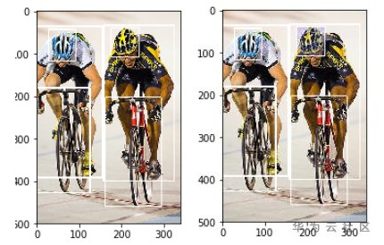
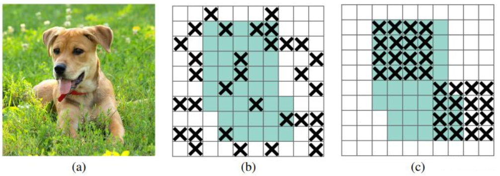

# 物体检测模型的目标框清晰度敏感度分析以及相关的解决方法<a name="modelarts_eval_0006"></a>

## 问题描述<a name="zh-cn_topic_0275437222_section869811741713"></a>

在目标检测任务中，不同数据集的目标框的清晰度可能会有差异，目标框清晰度的敏感度就是衡量这个差异的变量，而不同的目标框清晰度的数值对模型训练以及推理都会有影响。

左图是原始图，右图是其中一个目标框的清晰度发生了变化。

**图 1**  目标框清晰度举例<a name="zh-cn_topic_0275437222_fig1528010242176"></a>  


## 解决方法<a name="zh-cn_topic_0275437222_section11561181422312"></a>

在深度学习任务中，Dropout是一种被广泛使用的正则化技术，这种技术存在的缺点就是随机的丢弃掉特征层的某一个单元，使得相邻特征单元共享的语义信息也会一起丢弃掉，DropBlock改进了上述问题，即可以按照特征块来进行丢弃，对深度学习网络进行正则化处理。DropBlock 是类似dropout 的简单方法。二者的主要区别在于DropBlock丢弃层特征图的相邻区域，而不是丢弃单独的随机单元。详细介绍参见DropBlock论文

DropBlock模块主要有2个参数：block\_size、γ

-   block\_size：表示dropout的方块的大小（长，宽），当block\_size=1，DropBlock退化为传统的dropout，正常可以取3、5、7。
-   γ：表示drop过程中的概率，也就是伯努利函数的概率。

Dropout和Dropblock的对比。其中，b图表示Dropout，c图表示DropBlock。

**图 2**  Dropout和Dropblock原理对比图<a name="zh-cn_topic_0275437222_fig18533102972219"></a>  


TensorFlow版的官方实现方式如下：

```
class Dropblock(object):
  """DropBlock: a regularization method for convolutional neural networks.
    DropBlock is a form of structured dropout, where units in a contiguous
    region of a feature map are dropped together. DropBlock works better than
    dropout on convolutional layers due to the fact that activation units in
    convolutional layers are spatially correlated.
    See https://arxiv.org/pdf/1810.12890.pdf for details.
  """

  def __init__(self,
               dropblock_keep_prob=None,
               dropblock_size=None,
               data_format='channels_last'):
    self._dropblock_keep_prob = dropblock_keep_prob
    self._dropblock_size = dropblock_size
    self._data_format = data_format

  def __call__(self, net, is_training=False):
    """Builds Dropblock layer.
    Args:
      net: `Tensor` input tensor.
      is_training: `bool` if True, the model is in training mode.
    Returns:
      A version of input tensor with DropBlock applied.
    """
    if (not is_training or self._dropblock_keep_prob is None or
        self._dropblock_keep_prob == 1.0):
      return net

    logging.info('Applying DropBlock: dropblock_size %d,'
                 'net.shape %s', self._dropblock_size, net.shape)

    if self._data_format == 'channels_last':
      _, height, width, _ = net.get_shape().as_list()
    else:
      _, _, height, width = net.get_shape().as_list()

    total_size = width * height
    dropblock_size = min(self._dropblock_size, min(width, height))
    # Seed_drop_rate is the gamma parameter of DropBlcok.
    seed_drop_rate = (
        1.0 - self._dropblock_keep_prob) * total_size / dropblock_size**2 / (
            (width - self._dropblock_size + 1) *
            (height - self._dropblock_size + 1))

    # Forces the block to be inside the feature map.
    w_i, h_i = tf.meshgrid(tf.range(width), tf.range(height))
    valid_block = tf.logical_and(
        tf.logical_and(w_i >= int(dropblock_size // 2),
                       w_i < width - (dropblock_size - 1) // 2),
        tf.logical_and(h_i >= int(dropblock_size // 2),
                       h_i < width - (dropblock_size - 1) // 2))

    if self._data_format == 'channels_last':
      valid_block = tf.reshape(valid_block, [1, height, width, 1])
    else:
      valid_block = tf.reshape(valid_block, [1, 1, height, width])

    randnoise = tf.random_uniform(net.shape, dtype=tf.float32)
    valid_block = tf.cast(valid_block, dtype=tf.float32)
    seed_keep_rate = tf.cast(1 - seed_drop_rate, dtype=tf.float32)
    block_pattern = (1 - valid_block + seed_keep_rate + randnoise) >= 1
    block_pattern = tf.cast(block_pattern, dtype=tf.float32)

    if self._data_format == 'channels_last':
      ksize = [1, self._dropblock_size, self._dropblock_size, 1]
    else:
      ksize = [1, 1, self._dropblock_size, self._dropblock_size]
    block_pattern = -tf.nn.max_pool(
        -block_pattern,
        ksize=ksize,
        strides=[1, 1, 1, 1],
        padding='SAME',
        data_format='NHWC' if self._data_format == 'channels_last' else 'NCHW')

    percent_ones = tf.cast(tf.reduce_sum(block_pattern), tf.float32) / tf.cast(
        tf.size(block_pattern), tf.float32)

    net = net / tf.cast(percent_ones, net.dtype) * tf.cast(
        block_pattern, net.dtype)
    return net
```

## 实验验证<a name="zh-cn_topic_0275437222_section14781522152614"></a>

在开源数据集Canine Coccidiosis Parasite上面进行实验，该数据集只有一个类别，使用DropBlock之前，对目标框的清晰度敏感度分析如[表1](#zh-cn_topic_0275437222_table970414587510)所示。

**表 1**  目标框清晰度敏感度分析

<a name="zh-cn_topic_0275437222_table970414587510"></a>
<table><thead align="left"><tr id="zh-cn_topic_0275437222_row170415581253"><th class="cellrowborder" valign="top" width="50%" id="mcps1.2.3.1.1"><p id="zh-cn_topic_0275437222_p1170435819512"><a name="zh-cn_topic_0275437222_p1170435819512"></a><a name="zh-cn_topic_0275437222_p1170435819512"></a>特征值分布</p>
</th>
<th class="cellrowborder" valign="top" width="50%" id="mcps1.2.3.1.2"><p id="zh-cn_topic_0275437222_p27051958755"><a name="zh-cn_topic_0275437222_p27051958755"></a><a name="zh-cn_topic_0275437222_p27051958755"></a>coccidia</p>
</th>
</tr>
</thead>
<tbody><tr id="zh-cn_topic_0275437222_row370513586515"><td class="cellrowborder" valign="top" width="50%" headers="mcps1.2.3.1.1 "><p id="zh-cn_topic_0275437222_p1985684210465"><a name="zh-cn_topic_0275437222_p1985684210465"></a><a name="zh-cn_topic_0275437222_p1985684210465"></a>0% - 20%</p>
</td>
<td class="cellrowborder" valign="top" width="50%" headers="mcps1.2.3.1.2 "><p id="zh-cn_topic_0275437222_p1033319219321"><a name="zh-cn_topic_0275437222_p1033319219321"></a><a name="zh-cn_topic_0275437222_p1033319219321"></a>0.9355</p>
</td>
</tr>
<tr id="zh-cn_topic_0275437222_row177051581756"><td class="cellrowborder" valign="top" width="50%" headers="mcps1.2.3.1.1 "><p id="zh-cn_topic_0275437222_p1185617428467"><a name="zh-cn_topic_0275437222_p1185617428467"></a><a name="zh-cn_topic_0275437222_p1185617428467"></a>20% - 40%</p>
</td>
<td class="cellrowborder" valign="top" width="50%" headers="mcps1.2.3.1.2 "><p id="zh-cn_topic_0275437222_p2033217211321"><a name="zh-cn_topic_0275437222_p2033217211321"></a><a name="zh-cn_topic_0275437222_p2033217211321"></a>0.9355</p>
</td>
</tr>
<tr id="zh-cn_topic_0275437222_row67051658957"><td class="cellrowborder" valign="top" width="50%" headers="mcps1.2.3.1.1 "><p id="zh-cn_topic_0275437222_p178564426468"><a name="zh-cn_topic_0275437222_p178564426468"></a><a name="zh-cn_topic_0275437222_p178564426468"></a>40% - 60%</p>
</td>
<td class="cellrowborder" valign="top" width="50%" headers="mcps1.2.3.1.2 "><p id="zh-cn_topic_0275437222_p93329263218"><a name="zh-cn_topic_0275437222_p93329263218"></a><a name="zh-cn_topic_0275437222_p93329263218"></a>0.9355</p>
</td>
</tr>
<tr id="zh-cn_topic_0275437222_row1170520589520"><td class="cellrowborder" valign="top" width="50%" headers="mcps1.2.3.1.1 "><p id="zh-cn_topic_0275437222_p16856342134619"><a name="zh-cn_topic_0275437222_p16856342134619"></a><a name="zh-cn_topic_0275437222_p16856342134619"></a>60% - 80%</p>
</td>
<td class="cellrowborder" valign="top" width="50%" headers="mcps1.2.3.1.2 "><p id="zh-cn_topic_0275437222_p5331528328"><a name="zh-cn_topic_0275437222_p5331528328"></a><a name="zh-cn_topic_0275437222_p5331528328"></a>0.7742</p>
</td>
</tr>
<tr id="zh-cn_topic_0275437222_row870575815510"><td class="cellrowborder" valign="top" width="50%" headers="mcps1.2.3.1.1 "><p id="zh-cn_topic_0275437222_p285620421462"><a name="zh-cn_topic_0275437222_p285620421462"></a><a name="zh-cn_topic_0275437222_p285620421462"></a>80% - 100%</p>
</td>
<td class="cellrowborder" valign="top" width="50%" headers="mcps1.2.3.1.2 "><p id="zh-cn_topic_0275437222_p43314283218"><a name="zh-cn_topic_0275437222_p43314283218"></a><a name="zh-cn_topic_0275437222_p43314283218"></a>0.8065</p>
</td>
</tr>
<tr id="zh-cn_topic_0275437222_row97052581257"><td class="cellrowborder" valign="top" width="50%" headers="mcps1.2.3.1.1 "><p id="zh-cn_topic_0275437222_p18561942194612"><a name="zh-cn_topic_0275437222_p18561942194612"></a><a name="zh-cn_topic_0275437222_p18561942194612"></a>标准差</p>
</td>
<td class="cellrowborder" valign="top" width="50%" headers="mcps1.2.3.1.2 "><p id="zh-cn_topic_0275437222_p1632972153212"><a name="zh-cn_topic_0275437222_p1632972153212"></a><a name="zh-cn_topic_0275437222_p1632972153212"></a>0.0718</p>
</td>
</tr>
</tbody>
</table>

使用DropBlock之后，对目标框的清晰度敏感度进行分析，如[表2](#zh-cn_topic_0275437222_table7674043183215)所示，可以看到，目标框清晰度敏感度从原来的0.0718降低到0.0204。

可以看到，使用DropBlock之后，目标框的清晰度敏感度得到了比较大的改善。

**表 2**  目标框清晰度敏感度分析

<a name="zh-cn_topic_0275437222_table7674043183215"></a>
<table><thead align="left"><tr id="zh-cn_topic_0275437222_row1067584311323"><th class="cellrowborder" valign="top" width="50%" id="mcps1.2.3.1.1"><p id="zh-cn_topic_0275437222_p116752043193214"><a name="zh-cn_topic_0275437222_p116752043193214"></a><a name="zh-cn_topic_0275437222_p116752043193214"></a>特征值分布</p>
</th>
<th class="cellrowborder" valign="top" width="50%" id="mcps1.2.3.1.2"><p id="zh-cn_topic_0275437222_p1967574317328"><a name="zh-cn_topic_0275437222_p1967574317328"></a><a name="zh-cn_topic_0275437222_p1967574317328"></a>coccidia</p>
</th>
</tr>
</thead>
<tbody><tr id="zh-cn_topic_0275437222_row13675443103210"><td class="cellrowborder" valign="top" width="50%" headers="mcps1.2.3.1.1 "><p id="zh-cn_topic_0275437222_p6675194393213"><a name="zh-cn_topic_0275437222_p6675194393213"></a><a name="zh-cn_topic_0275437222_p6675194393213"></a>0% - 20%</p>
</td>
<td class="cellrowborder" valign="top" width="50%" headers="mcps1.2.3.1.2 "><p id="zh-cn_topic_0275437222_p5735464335"><a name="zh-cn_topic_0275437222_p5735464335"></a><a name="zh-cn_topic_0275437222_p5735464335"></a>1</p>
</td>
</tr>
<tr id="zh-cn_topic_0275437222_row0675194333218"><td class="cellrowborder" valign="top" width="50%" headers="mcps1.2.3.1.1 "><p id="zh-cn_topic_0275437222_p0675154373219"><a name="zh-cn_topic_0275437222_p0675154373219"></a><a name="zh-cn_topic_0275437222_p0675154373219"></a>20% - 40%</p>
</td>
<td class="cellrowborder" valign="top" width="50%" headers="mcps1.2.3.1.2 "><p id="zh-cn_topic_0275437222_p117341167335"><a name="zh-cn_topic_0275437222_p117341167335"></a><a name="zh-cn_topic_0275437222_p117341167335"></a>0.9677</p>
</td>
</tr>
<tr id="zh-cn_topic_0275437222_row10675104316325"><td class="cellrowborder" valign="top" width="50%" headers="mcps1.2.3.1.1 "><p id="zh-cn_topic_0275437222_p10675154343212"><a name="zh-cn_topic_0275437222_p10675154343212"></a><a name="zh-cn_topic_0275437222_p10675154343212"></a>40% - 60%</p>
</td>
<td class="cellrowborder" valign="top" width="50%" headers="mcps1.2.3.1.2 "><p id="zh-cn_topic_0275437222_p555701393316"><a name="zh-cn_topic_0275437222_p555701393316"></a><a name="zh-cn_topic_0275437222_p555701393316"></a>0.9677</p>
</td>
</tr>
<tr id="zh-cn_topic_0275437222_row26750431327"><td class="cellrowborder" valign="top" width="50%" headers="mcps1.2.3.1.1 "><p id="zh-cn_topic_0275437222_p1867574343215"><a name="zh-cn_topic_0275437222_p1867574343215"></a><a name="zh-cn_topic_0275437222_p1867574343215"></a>60% - 80%</p>
</td>
<td class="cellrowborder" valign="top" width="50%" headers="mcps1.2.3.1.2 "><p id="zh-cn_topic_0275437222_p155601013163317"><a name="zh-cn_topic_0275437222_p155601013163317"></a><a name="zh-cn_topic_0275437222_p155601013163317"></a>0.9677</p>
</td>
</tr>
<tr id="zh-cn_topic_0275437222_row13675134363213"><td class="cellrowborder" valign="top" width="50%" headers="mcps1.2.3.1.1 "><p id="zh-cn_topic_0275437222_p1675243163219"><a name="zh-cn_topic_0275437222_p1675243163219"></a><a name="zh-cn_topic_0275437222_p1675243163219"></a>80% - 100%</p>
</td>
<td class="cellrowborder" valign="top" width="50%" headers="mcps1.2.3.1.2 "><p id="zh-cn_topic_0275437222_p1773313615332"><a name="zh-cn_topic_0275437222_p1773313615332"></a><a name="zh-cn_topic_0275437222_p1773313615332"></a>0.9355</p>
</td>
</tr>
<tr id="zh-cn_topic_0275437222_row56751643113220"><td class="cellrowborder" valign="top" width="50%" headers="mcps1.2.3.1.1 "><p id="zh-cn_topic_0275437222_p16751543193217"><a name="zh-cn_topic_0275437222_p16751543193217"></a><a name="zh-cn_topic_0275437222_p16751543193217"></a>标准差</p>
</td>
<td class="cellrowborder" valign="top" width="50%" headers="mcps1.2.3.1.2 "><p id="zh-cn_topic_0275437222_p1370486193316"><a name="zh-cn_topic_0275437222_p1370486193316"></a><a name="zh-cn_topic_0275437222_p1370486193316"></a>0.0204</p>
</td>
</tr>
</tbody>
</table>

## 用户建议<a name="zh-cn_topic_0275437222_section12521103472617"></a>

在模型推理结果中，如果检测出来的类别对于目标框清晰度的敏感程度比较大，推荐在训练的时候，使用DropBlock进行模型优化和加强。

