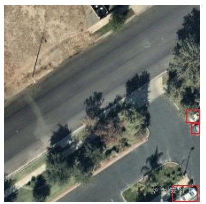
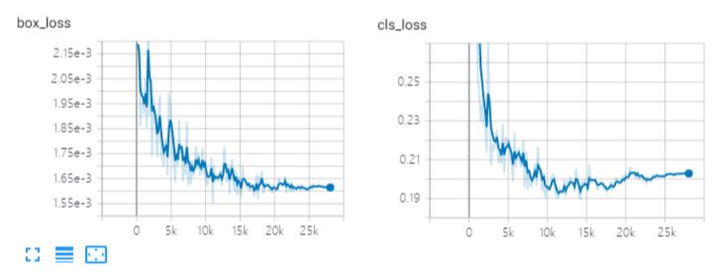
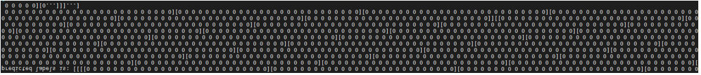
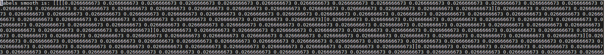
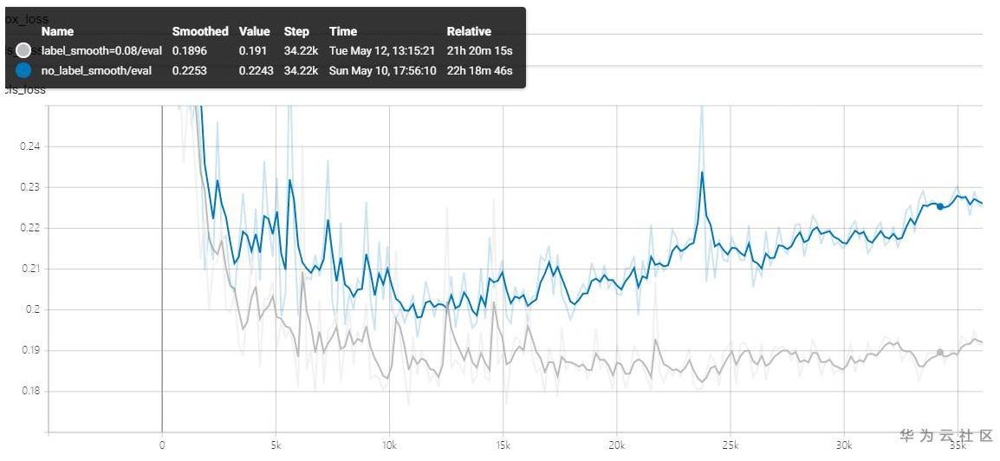

# 物体检测模型的目标框边缘化敏感度分析以及相关的解决方法<a name="modelarts_eval_0008"></a>

## 问题描述<a name="zh-cn_topic_0275437224_section12343721750"></a>

在目标检测任务中，一张图片中的目标框在整张图片上面的位置可能会不一样，有的目标框可能分布在图片的中间，有的目标框可能分布在图片的边缘位置，边缘化程度，即目标框中心距离图片中心距离占图片总距离的比值，越大表示物体越靠近边缘。下图表示的是图片中标记框距离中心比较远的场景，即标记框的边缘化分布比较严重。

**图 1**  图片标记框边缘化分布示例<a name="zh-cn_topic_0275437224_fig188541305813"></a>  


目标框边缘化敏感度就是描述这种现象的指标，检测模型对于具有不同边缘化程度的数据集检测效果是不一样的。建议参考如下相关算法和技术说明，了解如何降低模型对于目标框边缘化的敏感程度。

## 解决方法<a name="zh-cn_topic_0275437224_section1890202016513"></a>

-   **box loss weight**

    在目标检测中，分类loss和BBOX坐标loss的值存在不均衡，如果只是简单相加，对于BBOX loss很小的值（例如小物体）在计算反向梯度时，很容易被忽略，影响收敛。给BBOX loss加权重，是缓解这种不均衡的现象的技术，即根据数据集的不同来自行调整box loss weight。下图表示在同一个检测模型训练的时候，class loss和box loss的大小值分布不均匀，两者之间相差100倍左右。

    **图 2**  一个检测模型训练的时候，class loss和box loss数值大小分布不均<a name="zh-cn_topic_0275437224_fig815531171419"></a>  
    

    如下代码是box loss weight的Tensorflow伪代码。

    ```
    def model_fn(inputs, mode):    ...    
        # params为检测算法超参数配置，修改box_loss_weight的值即可    
        total_loss = cls_loss + params['box_loss_weight'] * box_loss
    ```

-   **label smooth**

    label smooth标签平滑在检测的分类任务常有用到，最早是Inceptionv2中提出。如果标签中有的是错的，或者不准，会导致网络过分信任标签而一起错下去。为了提高网络泛化能力，避免这种错误，在one-hot的label进行计算loss时，真实类别位置乘以一个系数（1-e），e很小如0.05，以0.95的概率送进去；非标注的类别原来为0，现在改为e=0.05送进去计算loss。

    下图是在检测模型中原始输出one\_hot label。

    **图 3**  原始label的one hot编码<a name="zh-cn_topic_0275437224_fig12376191610152"></a>  
    

    加了label smooth标签平滑之后的label。

    **图 4**  label smooth处理之后的label编码<a name="zh-cn_topic_0275437224_fig257515416404"></a>  
    

    如下代码是label smooth的tensorflow版的伪代码。

    ```
    positive_label_mask = tf.equal(targets, 1.0)    
       if label_smoothing > 0:      
          from tensorflow.python.ops import math_ops      
          smooth_positives = 1.0 - label_smoothing      
          smooth_negatives = label_smoothing / num_classes      
          labels = labels * smooth_positives + smooth_negatives    
          cross_entropy = (        
               tf.nn.sigmoid_cross_entropy_with_logits(labels=labels, logits=logits))
    ```


## 实验验证<a name="zh-cn_topic_0275437224_section1825618341859"></a>

使用交通信号灯的数据集，该数据集只有一个标签，检测交叉路口是否安装了交通信号，下图表示的是使用label smooth之前和之后，class loss的拟合曲线，可以看到，在使用label smooth之前（蓝色曲线），class loss随着迭代步数的增加，会出现过拟合的现象，而使用label smooth之后（灰色曲线），这种过拟合的现象可以有效的减小。

**图 5**  class loss的拟合曲线<a name="zh-cn_topic_0275437224_fig1855011317188"></a>  


对训练之后的检测模型进行模型评估，统计出在不同的边缘化特征值分布的情况下，所对应的不同的推理情况下的recall值。使用label smooth和box loss weight之前的目标框边缘化敏感度如[表1](#zh-cn_topic_0275437224_table11698153615318)所示。

**表 1**  使用label smooth和box loss weight之前的目标框边缘化敏感度分析

<a name="zh-cn_topic_0275437224_table11698153615318"></a>
<table><thead align="left"><tr id="zh-cn_topic_0275437224_row6698036036"><th class="cellrowborder" valign="top" width="50%" id="mcps1.2.3.1.1"><p id="zh-cn_topic_0275437224_p1869813614310"><a name="zh-cn_topic_0275437224_p1869813614310"></a><a name="zh-cn_topic_0275437224_p1869813614310"></a>特征值分布</p>
</th>
<th class="cellrowborder" valign="top" width="50%" id="mcps1.2.3.1.2"><p id="zh-cn_topic_0275437224_p36980367317"><a name="zh-cn_topic_0275437224_p36980367317"></a><a name="zh-cn_topic_0275437224_p36980367317"></a>light</p>
</th>
</tr>
</thead>
<tbody><tr id="zh-cn_topic_0275437224_row166982361932"><td class="cellrowborder" valign="top" width="50%" headers="mcps1.2.3.1.1 "><p id="zh-cn_topic_0275437224_p156981236337"><a name="zh-cn_topic_0275437224_p156981236337"></a><a name="zh-cn_topic_0275437224_p156981236337"></a>0% - 20%</p>
</td>
<td class="cellrowborder" valign="top" width="50%" headers="mcps1.2.3.1.2 "><p id="zh-cn_topic_0275437224_p13130434141918"><a name="zh-cn_topic_0275437224_p13130434141918"></a><a name="zh-cn_topic_0275437224_p13130434141918"></a>0.9412</p>
</td>
</tr>
<tr id="zh-cn_topic_0275437224_row10698193614318"><td class="cellrowborder" valign="top" width="50%" headers="mcps1.2.3.1.1 "><p id="zh-cn_topic_0275437224_p19698183617312"><a name="zh-cn_topic_0275437224_p19698183617312"></a><a name="zh-cn_topic_0275437224_p19698183617312"></a>20% - 40%</p>
</td>
<td class="cellrowborder" valign="top" width="50%" headers="mcps1.2.3.1.2 "><p id="zh-cn_topic_0275437224_p812973401910"><a name="zh-cn_topic_0275437224_p812973401910"></a><a name="zh-cn_topic_0275437224_p812973401910"></a>0.8235</p>
</td>
</tr>
<tr id="zh-cn_topic_0275437224_row126981936635"><td class="cellrowborder" valign="top" width="50%" headers="mcps1.2.3.1.1 "><p id="zh-cn_topic_0275437224_p769913361630"><a name="zh-cn_topic_0275437224_p769913361630"></a><a name="zh-cn_topic_0275437224_p769913361630"></a>40% - 60%</p>
</td>
<td class="cellrowborder" valign="top" width="50%" headers="mcps1.2.3.1.2 "><p id="zh-cn_topic_0275437224_p612819343193"><a name="zh-cn_topic_0275437224_p612819343193"></a><a name="zh-cn_topic_0275437224_p612819343193"></a>0.7778</p>
</td>
</tr>
<tr id="zh-cn_topic_0275437224_row769983610318"><td class="cellrowborder" valign="top" width="50%" headers="mcps1.2.3.1.1 "><p id="zh-cn_topic_0275437224_p7699163619314"><a name="zh-cn_topic_0275437224_p7699163619314"></a><a name="zh-cn_topic_0275437224_p7699163619314"></a>60% - 80%</p>
</td>
<td class="cellrowborder" valign="top" width="50%" headers="mcps1.2.3.1.2 "><p id="zh-cn_topic_0275437224_p2128334131919"><a name="zh-cn_topic_0275437224_p2128334131919"></a><a name="zh-cn_topic_0275437224_p2128334131919"></a>1</p>
</td>
</tr>
<tr id="zh-cn_topic_0275437224_row1369916361632"><td class="cellrowborder" valign="top" width="50%" headers="mcps1.2.3.1.1 "><p id="zh-cn_topic_0275437224_p196996361737"><a name="zh-cn_topic_0275437224_p196996361737"></a><a name="zh-cn_topic_0275437224_p196996361737"></a>80% - 100%</p>
</td>
<td class="cellrowborder" valign="top" width="50%" headers="mcps1.2.3.1.2 "><p id="zh-cn_topic_0275437224_p14127634131916"><a name="zh-cn_topic_0275437224_p14127634131916"></a><a name="zh-cn_topic_0275437224_p14127634131916"></a>0.8333</p>
</td>
</tr>
<tr id="zh-cn_topic_0275437224_row15699336739"><td class="cellrowborder" valign="top" width="50%" headers="mcps1.2.3.1.1 "><p id="zh-cn_topic_0275437224_p1569973615311"><a name="zh-cn_topic_0275437224_p1569973615311"></a><a name="zh-cn_topic_0275437224_p1569973615311"></a>标准差</p>
</td>
<td class="cellrowborder" valign="top" width="50%" headers="mcps1.2.3.1.2 "><p id="zh-cn_topic_0275437224_p310683481912"><a name="zh-cn_topic_0275437224_p310683481912"></a><a name="zh-cn_topic_0275437224_p310683481912"></a>0.0823</p>
</td>
</tr>
</tbody>
</table>

使用label smooth和box loss weight之后的目标框边缘化敏感度如[表2](#zh-cn_topic_0275437224_table23030131200)所示。

可以看出在使用label smooth和box loss weight之后，目标框的边缘化程度敏感度冲0.0823降到了0.0448，降低了检测模型对目标框的边缘化敏感度。

**表 2**  使用label smooth和box loss weight之后的目标框边缘化敏感度分析

<a name="zh-cn_topic_0275437224_table23030131200"></a>
<table><thead align="left"><tr id="zh-cn_topic_0275437224_row173033139204"><th class="cellrowborder" valign="top" width="50%" id="mcps1.2.3.1.1"><p id="zh-cn_topic_0275437224_p730319132202"><a name="zh-cn_topic_0275437224_p730319132202"></a><a name="zh-cn_topic_0275437224_p730319132202"></a>特征值分布</p>
</th>
<th class="cellrowborder" valign="top" width="50%" id="mcps1.2.3.1.2"><p id="zh-cn_topic_0275437224_p330381313203"><a name="zh-cn_topic_0275437224_p330381313203"></a><a name="zh-cn_topic_0275437224_p330381313203"></a>light</p>
</th>
</tr>
</thead>
<tbody><tr id="zh-cn_topic_0275437224_row173031113142012"><td class="cellrowborder" valign="top" width="50%" headers="mcps1.2.3.1.1 "><p id="zh-cn_topic_0275437224_p83033135207"><a name="zh-cn_topic_0275437224_p83033135207"></a><a name="zh-cn_topic_0275437224_p83033135207"></a>0% - 20%</p>
</td>
<td class="cellrowborder" valign="top" width="50%" headers="mcps1.2.3.1.2 "><p id="zh-cn_topic_0275437224_p233715176204"><a name="zh-cn_topic_0275437224_p233715176204"></a><a name="zh-cn_topic_0275437224_p233715176204"></a>1</p>
</td>
</tr>
<tr id="zh-cn_topic_0275437224_row4303913192012"><td class="cellrowborder" valign="top" width="50%" headers="mcps1.2.3.1.1 "><p id="zh-cn_topic_0275437224_p16303613152014"><a name="zh-cn_topic_0275437224_p16303613152014"></a><a name="zh-cn_topic_0275437224_p16303613152014"></a>20% - 40%</p>
</td>
<td class="cellrowborder" valign="top" width="50%" headers="mcps1.2.3.1.2 "><p id="zh-cn_topic_0275437224_p183372174206"><a name="zh-cn_topic_0275437224_p183372174206"></a><a name="zh-cn_topic_0275437224_p183372174206"></a>0.9412</p>
</td>
</tr>
<tr id="zh-cn_topic_0275437224_row1930391382018"><td class="cellrowborder" valign="top" width="50%" headers="mcps1.2.3.1.1 "><p id="zh-cn_topic_0275437224_p19303191362011"><a name="zh-cn_topic_0275437224_p19303191362011"></a><a name="zh-cn_topic_0275437224_p19303191362011"></a>40% - 60%</p>
</td>
<td class="cellrowborder" valign="top" width="50%" headers="mcps1.2.3.1.2 "><p id="zh-cn_topic_0275437224_p19336017132010"><a name="zh-cn_topic_0275437224_p19336017132010"></a><a name="zh-cn_topic_0275437224_p19336017132010"></a>0.8889</p>
</td>
</tr>
<tr id="zh-cn_topic_0275437224_row7303171311200"><td class="cellrowborder" valign="top" width="50%" headers="mcps1.2.3.1.1 "><p id="zh-cn_topic_0275437224_p14303213152019"><a name="zh-cn_topic_0275437224_p14303213152019"></a><a name="zh-cn_topic_0275437224_p14303213152019"></a>60% - 80%</p>
</td>
<td class="cellrowborder" valign="top" width="50%" headers="mcps1.2.3.1.2 "><p id="zh-cn_topic_0275437224_p19335151702014"><a name="zh-cn_topic_0275437224_p19335151702014"></a><a name="zh-cn_topic_0275437224_p19335151702014"></a>1</p>
</td>
</tr>
<tr id="zh-cn_topic_0275437224_row203031313162011"><td class="cellrowborder" valign="top" width="50%" headers="mcps1.2.3.1.1 "><p id="zh-cn_topic_0275437224_p130319135201"><a name="zh-cn_topic_0275437224_p130319135201"></a><a name="zh-cn_topic_0275437224_p130319135201"></a>80% - 100%</p>
</td>
<td class="cellrowborder" valign="top" width="50%" headers="mcps1.2.3.1.2 "><p id="zh-cn_topic_0275437224_p933451782016"><a name="zh-cn_topic_0275437224_p933451782016"></a><a name="zh-cn_topic_0275437224_p933451782016"></a>1</p>
</td>
</tr>
<tr id="zh-cn_topic_0275437224_row5303113132018"><td class="cellrowborder" valign="top" width="50%" headers="mcps1.2.3.1.1 "><p id="zh-cn_topic_0275437224_p830331317201"><a name="zh-cn_topic_0275437224_p830331317201"></a><a name="zh-cn_topic_0275437224_p830331317201"></a>标准差</p>
</td>
<td class="cellrowborder" valign="top" width="50%" headers="mcps1.2.3.1.2 "><p id="zh-cn_topic_0275437224_p133336172204"><a name="zh-cn_topic_0275437224_p133336172204"></a><a name="zh-cn_topic_0275437224_p133336172204"></a>0.0448</p>
</td>
</tr>
</tbody>
</table>

## 用户建议<a name="zh-cn_topic_0275437224_section130219471958"></a>

在模型推理结果中，如果检测出来的类别对于目标框边缘化的敏感程度比较大，推荐在训练的时候，使用label smooth和box loss weight进行模型优化和加强。

