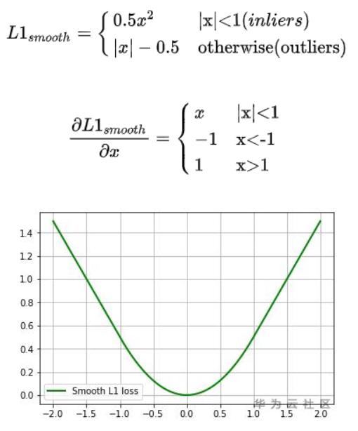
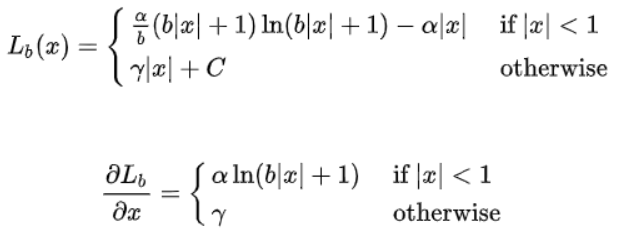
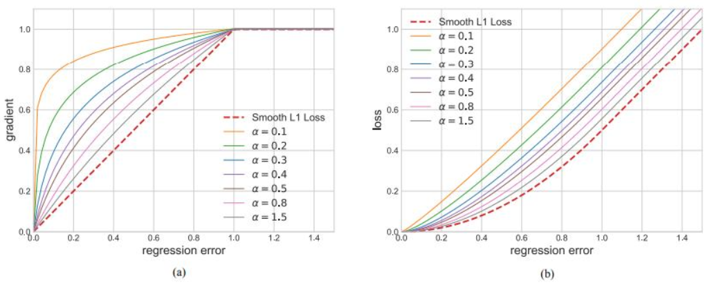

# 物体检测模型的目标框面积敏感度分析以及相关的解决方法

## 问题描述

在目标检测任务中，一张图片的的不同目标框的大小是不一样的，有的数据集小物体比较多，而有些数据集大物体比较多。目标框面积敏感度就是描述这种现象的指标，目标框的面积占比，即目标框面积占这个图片面积大小的比例，值越大表示物体在图片中的占比越大。下图显示的就是图片中的标记框小物体占比比较大的情况。

**图 1**  物体占比比较多的场景  

检测模型对于具有不同面积占比数据集的检测效果是不一样的。建议参考如下相关算法和技术说明，了解如何降低模型对于目标框面积的敏感程度。

## 解决方法

目标检测在实际的训练过程中还是一种多任务的task，在准确的识别类的同时，还需要对类别实例的位置进行精确的定位。模型训练的loss包括class loss以及bbox loss，而对于bbox loss来说，最常见的是Smooth L1 loss，具体计算如下所示。

**图 2**  Smooth L1 loss对应曲线  

balanced loss最早是在Libra R-CNN中提出的，相比于传统的Smooth L1loss，balanced loss具有更加平滑的曲线和收敛特征，具体的计算公式以及求导公式如下所示：

从下面的图可以看出，在inliers的边界位置，相比于Smooth L1 loss，balanced loss具有稍微大一些的梯度，Alpaha越小，增加的幅度约明显，这样可以增加模型反向梯度的更新的时候识别正样本的概率。

其中，（a）表示倒数关系，（b）表示loss关系（引用自Libra R-CNN）。

**图 3** _Balanced L1 loss和Smooth L1 loss对比曲线_  

## 实验验证

在开源数据集Canine Coccidiosis Parasite上面进行实验，该数据集只有一个类别，使用balanced loss之前，对模型训练完之后，在模型评估阶段，模型对目标框面积敏感度如[表1](#zh-cn_topic_0275437223_table7674043183215)所示。

**表 1**  使用Balanced L1 loss之前，模型的目标框面积敏感度评估

<table><thead align="left"><tr id="zh-cn_topic_0275437223_row1067584311323"><th class="cellrowborder" valign="top" width="50%" id="mcps1.2.3.1.1">
特征值分布

</th>
<th class="cellrowborder" valign="top" width="50%" id="mcps1.2.3.1.2">
coccidia

</th>
</tr>
</thead>
<tbody><tr id="zh-cn_topic_0275437223_row13675443103210"><td class="cellrowborder" valign="top" width="50%" headers="mcps1.2.3.1.1 ">
0% - 20%

</td>
<td class="cellrowborder" valign="top" width="50%" headers="mcps1.2.3.1.2 ">
0.5806

</td>
</tr>
<tr id="zh-cn_topic_0275437223_row0675194333218"><td class="cellrowborder" valign="top" width="50%" headers="mcps1.2.3.1.1 ">
20% - 40%

</td>
<td class="cellrowborder" valign="top" width="50%" headers="mcps1.2.3.1.2 ">
0.871

</td>
</tr>
<tr id="zh-cn_topic_0275437223_row10675104316325"><td class="cellrowborder" valign="top" width="50%" headers="mcps1.2.3.1.1 ">
40% - 60%

</td>
<td class="cellrowborder" valign="top" width="50%" headers="mcps1.2.3.1.2 ">
0.9677

</td>
</tr>
<tr id="zh-cn_topic_0275437223_row26750431327"><td class="cellrowborder" valign="top" width="50%" headers="mcps1.2.3.1.1 ">
60% - 80%

</td>
<td class="cellrowborder" valign="top" width="50%" headers="mcps1.2.3.1.2 ">
0.9677

</td>
</tr>
<tr id="zh-cn_topic_0275437223_row13675134363213"><td class="cellrowborder" valign="top" width="50%" headers="mcps1.2.3.1.1 ">
80% - 100%

</td>
<td class="cellrowborder" valign="top" width="50%" headers="mcps1.2.3.1.2 ">
1

</td>
</tr>
<tr id="zh-cn_topic_0275437223_row56751643113220"><td class="cellrowborder" valign="top" width="50%" headers="mcps1.2.3.1.1 ">
标准差

</td>
<td class="cellrowborder" valign="top" width="50%" headers="mcps1.2.3.1.2 ">
0.1546

</td>
</tr>
</tbody>
</table>

使用balanced loss之后，重新对检测模型进行训练，在模型评估阶段，模型对于目标框面积敏感度分析如[表2](#zh-cn_topic_0275437223_table11698153615318)所示。

可以看到，使用balanced loss之后，类别对目标框的面积敏感度从原来的0.1546降低到0.0912，即降低了对于数据目标框面积的敏感度。

**表 2**  使用Balanced L1 loss之后，模型的目标框面积敏感度评估

<table><thead align="left"><tr id="zh-cn_topic_0275437223_row6698036036"><th class="cellrowborder" valign="top" width="50%" id="mcps1.2.3.1.1">
特征值分布

</th>
<th class="cellrowborder" valign="top" width="50%" id="mcps1.2.3.1.2">
coccidia

</th>
</tr>
</thead>
<tbody><tr id="zh-cn_topic_0275437223_row166982361932"><td class="cellrowborder" valign="top" width="50%" headers="mcps1.2.3.1.1 ">
0% - 20%

</td>
<td class="cellrowborder" valign="top" width="50%" headers="mcps1.2.3.1.2 ">
0.7419

</td>
</tr>
<tr id="zh-cn_topic_0275437223_row10698193614318"><td class="cellrowborder" valign="top" width="50%" headers="mcps1.2.3.1.1 ">
20% - 40%

</td>
<td class="cellrowborder" valign="top" width="50%" headers="mcps1.2.3.1.2 ">
0.871

</td>
</tr>
<tr id="zh-cn_topic_0275437223_row126981936635"><td class="cellrowborder" valign="top" width="50%" headers="mcps1.2.3.1.1 ">
40% - 60%

</td>
<td class="cellrowborder" valign="top" width="50%" headers="mcps1.2.3.1.2 ">
0.9355

</td>
</tr>
<tr id="zh-cn_topic_0275437223_row769983610318"><td class="cellrowborder" valign="top" width="50%" headers="mcps1.2.3.1.1 ">
60% - 80%

</td>
<td class="cellrowborder" valign="top" width="50%" headers="mcps1.2.3.1.2 ">
1

</td>
</tr>
<tr id="zh-cn_topic_0275437223_row1369916361632"><td class="cellrowborder" valign="top" width="50%" headers="mcps1.2.3.1.1 ">
80% - 100%

</td>
<td class="cellrowborder" valign="top" width="50%" headers="mcps1.2.3.1.2 ">
0.9677

</td>
</tr>
<tr id="zh-cn_topic_0275437223_row15699336739"><td class="cellrowborder" valign="top" width="50%" headers="mcps1.2.3.1.1 ">
标准差

</td>
<td class="cellrowborder" valign="top" width="50%" headers="mcps1.2.3.1.2 ">
0.0912

</td>
</tr>
</tbody>
</table>

## 用户建议

在模型推理结果中，如果检测出来的类别对于目标框面积的敏感程度比较大，推荐在训练的时候，使用balanced loss进行模型优化和加强。

