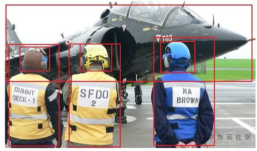
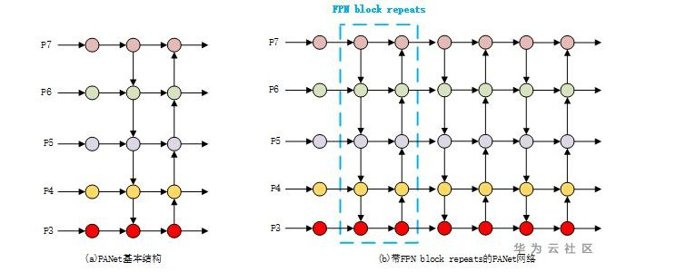

# 物体检测模型的目标框高宽比感度分析以及相关的解决方法

## 问题描述

在物体检测任务中，一张图片的的不同目标框的形状是多种多样的，目标框的高宽比就是描述这种现象的指标。如果数据集目标框的高宽比分布范围越广，那么表示该数据集目标框形状越不均衡，检测模型对于具有不同宽高比数据集的检测效果是不一样的，那么如果降低模型对于目标框宽高比的敏感程度呢，下面将对相关的技术进行介绍。

下图是一张图片中的目标框高宽比举例，可以看到，该图片中目标框的高宽比总共有三个数值。

**图 1**  标框高宽比举例  

## 解决方法

在目标检测任务中，FPN在one stage检测模型中应用比较广泛，FPN通过特征融合，将不同尺度的feature map进行concat，然后进行后面的类别以及目标框的回归，已经成为检测模型中的一种标配手段。在EfficientDet论文中，提出了一种FPN block repeats的手段，即将之前的FPN作为一个基本单元，进行重复叠加，来进行特征提取层的融合，下图是EfficientDet的BiFPN基本单元，主要是对FPN进行适当的修改。

**图 2**  BiFPN结构示意图  

下图是对BiFPN进行了重复叠加，即FPN block repeats，可以看到特征提取层更深。

**图 3**  EfficientDet的FPN block repeats  

FPN block repeats不仅适用于BiFPN，也可应用于其他的FPN结构，例如PANet的FPN，下图是将FPN block repeats技术应用在了PANet上面。

其中，a图表示PANet的基本单元结构，b图表示带有FPN block repeats的网络。

**图 4**  FPN block repeats的构造示意图  

## 实验验证

在开源数据集fruit上面进行实验，使用FPN block repeats之前，对目标框的高宽比敏感度分析如下所示，可以看到Apple和Banana的宽高比敏感度分别是0.0757和0.4481。

**表 1**  使用FPN block repeats之前，检测模型对目标框高宽比敏感度分析

<table><thead align="left"><tr id="zh-cn_topic_0275437220_row177107293442"><th class="cellrowborder" valign="top" width="33.33333333333333%" id="mcps1.2.4.1.1">
特征值分布

</th>
<th class="cellrowborder" valign="top" width="33.33333333333333%" id="mcps1.2.4.1.2">
Apple

</th>
<th class="cellrowborder" valign="top" width="33.33333333333333%" id="mcps1.2.4.1.3">
Banana

</th>
</tr>
</thead>
<tbody><tr id="zh-cn_topic_0275437220_row147101829124419"><td class="cellrowborder" valign="top" width="33.33333333333333%" headers="mcps1.2.4.1.1 ">
0% - 20%

</td>
<td class="cellrowborder" valign="top" width="33.33333333333333%" headers="mcps1.2.4.1.2 ">
1

</td>
<td class="cellrowborder" valign="top" width="33.33333333333333%" headers="mcps1.2.4.1.3 ">
0.5714

</td>
</tr>
<tr id="zh-cn_topic_0275437220_row3710429104414"><td class="cellrowborder" valign="top" width="33.33333333333333%" headers="mcps1.2.4.1.1 ">
20% - 40%

</td>
<td class="cellrowborder" valign="top" width="33.33333333333333%" headers="mcps1.2.4.1.2 ">
1

</td>
<td class="cellrowborder" valign="top" width="33.33333333333333%" headers="mcps1.2.4.1.3 ">
1

</td>
</tr>
<tr id="zh-cn_topic_0275437220_row87101829144414"><td class="cellrowborder" valign="top" width="33.33333333333333%" headers="mcps1.2.4.1.1 ">
40% - 60%

</td>
<td class="cellrowborder" valign="top" width="33.33333333333333%" headers="mcps1.2.4.1.2 ">
0.875

</td>
<td class="cellrowborder" valign="top" width="33.33333333333333%" headers="mcps1.2.4.1.3 ">
0

</td>
</tr>
<tr id="zh-cn_topic_0275437220_row147108293442"><td class="cellrowborder" valign="top" width="33.33333333333333%" headers="mcps1.2.4.1.1 ">
60% - 80%

</td>
<td class="cellrowborder" valign="top" width="33.33333333333333%" headers="mcps1.2.4.1.2 ">
0.8182

</td>
<td class="cellrowborder" valign="top" width="33.33333333333333%" headers="mcps1.2.4.1.3 ">
1

</td>
</tr>
<tr id="zh-cn_topic_0275437220_row7710142914415"><td class="cellrowborder" valign="top" width="33.33333333333333%" headers="mcps1.2.4.1.1 ">
80% - 100%

</td>
<td class="cellrowborder" valign="top" width="33.33333333333333%" headers="mcps1.2.4.1.2 ">
0.8571

</td>
<td class="cellrowborder" valign="top" width="33.33333333333333%" headers="mcps1.2.4.1.3 ">
0

</td>
</tr>
<tr id="zh-cn_topic_0275437220_row6710102915443"><td class="cellrowborder" valign="top" width="33.33333333333333%" headers="mcps1.2.4.1.1 ">
标准差

</td>
<td class="cellrowborder" valign="top" width="33.33333333333333%" headers="mcps1.2.4.1.2 ">
0.0757

</td>
<td class="cellrowborder" valign="top" width="33.33333333333333%" headers="mcps1.2.4.1.3 ">
0.4481

</td>
</tr>
</tbody>
</table>

使用FPN block repeats之后，对目标框的高宽比敏感度进行分析，如下所示，可以看到，Apple的目标框高宽比敏感度从原来的0.0757降低到0.0667，Banana的目标框高宽比敏感度从原来的0.4481降低到0.4091。

可以看到，使用FPN block repeats之后，目标框的高宽比敏感度得到了比较大的改善.

**表 2**  使用FPN block repeats之后，检测模型对目标框高宽比敏感度分析

<table><thead align="left"><tr id="zh-cn_topic_0275437220_row985554224619"><th class="cellrowborder" valign="top" width="33.33333333333333%" id="mcps1.2.4.1.1">
特征值分布

</th>
<th class="cellrowborder" valign="top" width="33.33333333333333%" id="mcps1.2.4.1.2">
Apple

</th>
<th class="cellrowborder" valign="top" width="33.33333333333333%" id="mcps1.2.4.1.3">
Banana

</th>
</tr>
</thead>
<tbody><tr id="zh-cn_topic_0275437220_row1785604244617"><td class="cellrowborder" valign="top" width="33.33333333333333%" headers="mcps1.2.4.1.1 ">
0% - 20%

</td>
<td class="cellrowborder" valign="top" width="33.33333333333333%" headers="mcps1.2.4.1.2 ">
1

</td>
<td class="cellrowborder" valign="top" width="33.33333333333333%" headers="mcps1.2.4.1.3 ">
0.7857

</td>
</tr>
<tr id="zh-cn_topic_0275437220_row18856114217468"><td class="cellrowborder" valign="top" width="33.33333333333333%" headers="mcps1.2.4.1.1 ">
20% - 40%

</td>
<td class="cellrowborder" valign="top" width="33.33333333333333%" headers="mcps1.2.4.1.2 ">
0.8333

</td>
<td class="cellrowborder" valign="top" width="33.33333333333333%" headers="mcps1.2.4.1.3 ">
0

</td>
</tr>
<tr id="zh-cn_topic_0275437220_row285615427463"><td class="cellrowborder" valign="top" width="33.33333333333333%" headers="mcps1.2.4.1.1 ">
40% - 60%

</td>
<td class="cellrowborder" valign="top" width="33.33333333333333%" headers="mcps1.2.4.1.2 ">
1

</td>
<td class="cellrowborder" valign="top" width="33.33333333333333%" headers="mcps1.2.4.1.3 ">
1

</td>
</tr>
<tr id="zh-cn_topic_0275437220_row88569424468"><td class="cellrowborder" valign="top" width="33.33333333333333%" headers="mcps1.2.4.1.1 ">
60% - 80%

</td>
<td class="cellrowborder" valign="top" width="33.33333333333333%" headers="mcps1.2.4.1.2 ">
1

</td>
<td class="cellrowborder" valign="top" width="33.33333333333333%" headers="mcps1.2.4.1.3 ">
1

</td>
</tr>
<tr id="zh-cn_topic_0275437220_row17856174217465"><td class="cellrowborder" valign="top" width="33.33333333333333%" headers="mcps1.2.4.1.1 ">
80% - 100%

</td>
<td class="cellrowborder" valign="top" width="33.33333333333333%" headers="mcps1.2.4.1.2 ">
1

</td>
<td class="cellrowborder" valign="top" width="33.33333333333333%" headers="mcps1.2.4.1.3 ">
0.25

</td>
</tr>
<tr id="zh-cn_topic_0275437220_row1785624214610"><td class="cellrowborder" valign="top" width="33.33333333333333%" headers="mcps1.2.4.1.1 ">
标准差

</td>
<td class="cellrowborder" valign="top" width="33.33333333333333%" headers="mcps1.2.4.1.2 ">
0.0667

</td>
<td class="cellrowborder" valign="top" width="33.33333333333333%" headers="mcps1.2.4.1.3 ">
0.4091

</td>
</tr>
</tbody>
</table>

## 用户建议

在模型推理结果中，如果检测出来的类别对于目标框高宽比的敏感程度比较大，推荐在训练的时候，使用带有FPN block repeats的检测模型进行优化训练。

