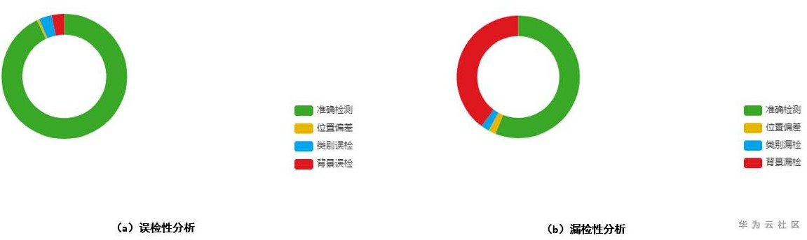
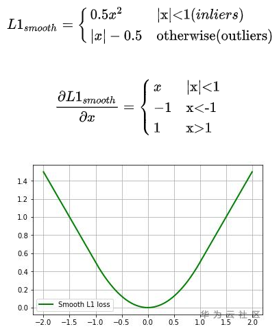
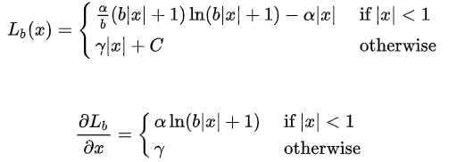
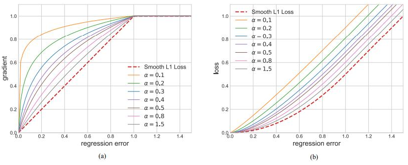
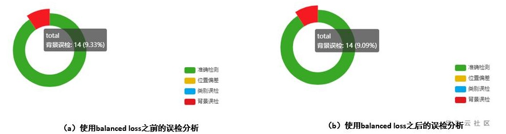
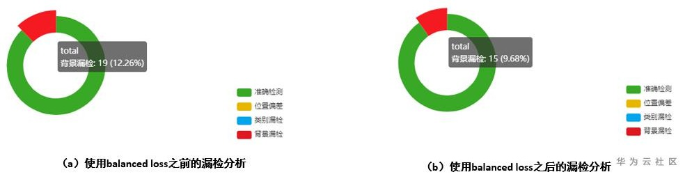

# 物体检测模型的背景误差分析以及相关的解决方法

## 问题描述

在物体检测的模型评估阶段，目标检测的假阳性（误检分析）以及假阴性（漏检分析）是比较重要的一环。在假阳性分析方面，背景误差主要表现在背景误检概率，在假阴性分析方面，背景误差主要表现在背景漏检概率。

ModelArts中对应的模型评估结果展示为：

**图 1**  模型评估结果  

上图展示的是对检测的推理结果进行的分析举例，其中图a表示的是假阳性（误检方面）的位置偏差，类别误检以及背景误检的分析，图b表示的是假阴性（漏检方面）的位置偏差，类别漏检以及背景漏检的分析。

从上图示例中可以看出，在误检以及漏检分析方面，背景误差占比比较大。建议参考如下相关算法和技术说明，了解如何降低背景误差的概率，提升模型推理的准确度。

## 解决方法

目标检测在实际的训练过程中还是一种多任务的task，在准确的识别类的同时，还需要对类别实例的位置进行精确定位。模型训练的loss包括class loss以及bbox loss，而对于bbox loss来说，最常见的是Smooth L1 loss，具体计算如下所示：

balanced loss最早是在[Libra R-CNN](https://arxiv.org/pdf/1904.02701.pdf)中提出的，相比于传统的Smooth L1loss，balanced loss具有更加平滑的曲线和收敛特征，具体的计算公式以及求导公式如下所示：

从下面的图可以看出，在inliers的边界位置，相比于Smooth L1 loss，balanced loss具有稍微大一些的梯度，Alpha越小，增加的幅度越明显，这样可以增加模型反向梯度的更新的时候识别正样本的概率。

## 实验验证

下面是在开源数据集Canine Coccidiosis Parasite上面使用balanced loss，使用之前和之后在误检分析（假阳性）的对比情况，可以看出，使用balanced loss之后，背景误检得到比较大的改善。

**图 2**  使用balanced loss之前和之后的误检分析对比  

下面是在Canine Coccidiosis Parasite上面使用balanced loss，使用之前和之后在漏检分析（假阴性）的对比情况，可以看出，使用balanced loss之后，背景漏检得到比较大的改善。

**图 3**  使用balanced loss之前和之后的漏检分析对比  

## 用户建议

在模型推理结果中，如果背景误差占比比较大，推荐在训练的时候，使用balanced loss进行模型优化和加强。

